#  018： 通过实验学习

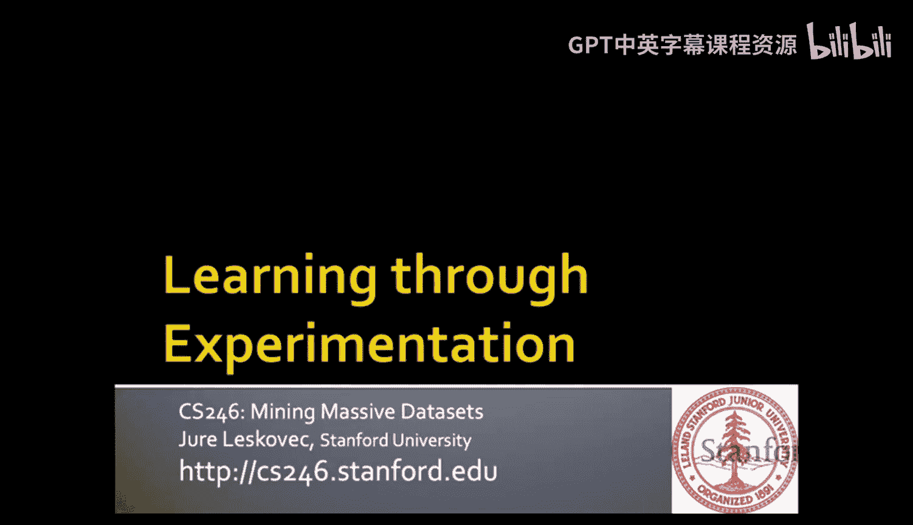

欢迎来到CS246课程的倒数第二周。首先是一些通知：作业四的截止日期是今晚午夜。恭喜所有坚持完成这些有挑战性但也很令人兴奋的长期作业的同学。下周四我们将进行整个课程的复习课，这对期末考试会非常有帮助。我们还将发布一些往年的期末考试题作为练习材料，请关注课程网站。我们会提供所有必要的工具来帮助大家应对期末考试。

今天我们将讨论“通过实验学习”，这基本上是周二关于网络广告课程的延续。我们之所以关心实验学习，是因为这类技术不仅适用于广告，也普遍适用于需要测试网站多种设置或配置的场景。在本节课结束时，我将为大家提供处理这类问题的一些工具、技巧和方法。

首先，让我们继续讨论网络广告。周二我们主要讨论了如何实时匹配广告商和查询，即如何为用户找到最相关的广告。但我们没有讨论如何估计点击率，即如何确定特定用户点击某个广告的频率。

同样，回想几周前我们讨论推荐引擎时，也强调了“冷启动”这个重大问题。冷启动问题是指，当系统中有新物品或新用户加入时，关于该物品的信息非常稀缺，如何将其推荐给最合适的用户？例如，Netflix上有新电影或新剧集时，如何推荐它？

我们将在这两个看似不同的问题之间建立联系。原因在于，网络广告领域每天都有大量新广告上线，如何将这些新广告匹配给平台上最合适的用户？

我们的目标是：如何尽可能快地通过实验收集关于广告或物品的信息，以便我们能够做出最佳的推荐决策。

其核心思想是：每当展示一个广告或推荐一个产品时，我们都可以收集关于该物品的更多数据。这不仅包括用户点击（表示兴趣）时，也包括当物品或广告被忽略时，我们同样能获得信息。例如，在谷歌上，如果你持续忽略右侧的广告，谷歌会得到一个信号，表明这些广告可能不相关或不有趣。反之，如果你点击了，谷歌会得到一个积极的信号，从而提升这些广告的排名。

因此，直观上看，这些平台并非静态系统，而是始终在运行实验。每次用户互动都可以被利用为一次正在进行的实验，收集有用信息，并基于此做出决策。

让我们回到周二讨论的网络广告例子，并尝试使其更深入一些。假设你的公司（比如谷歌）是硅谷众多依赖广告收入的公司之一。你的目标是最大化收入，即希望展示尽可能多的广告，并确保人们点击、转化、成为用户并支付订阅费等。

传统的广告方式是**按展示付费**（CPM模式）。这意味着每次在平台上展示广告，你都会向购买广告位的人收费。这种模式不仅来自网络，也来自更古老的媒体，如报纸和广告牌。广告牌越大，你支付的费用就越多，因为展示效果更持久、更容易被看到。

在这种情况下，广告提供者的最佳策略就是选择出价最高者。如果你有多个实体愿意为你的广告空间付费，你只需接受出价最高的那个，这样就能最大化收入。

然而，这种模式被网络革命化的原因是，很难评估这些广告的效果。你只知道广告被展示在报纸或高速公路上，但不知道有多少人会关注它们。

网络广告的新方式是**按点击付费**（CPC）。在这种模式下，最大化收入的最佳策略是能够计算**预期收入**。预期收入不仅是广告的函数，也是用户在平台上执行查询的函数。我们需要估计这些广告被点击的频率。

因此，我们的**估计收入**公式为：
`估计收入 = P(点击广告 | 特定查询) * 广告商为该广告支付的金额`

这个简单公式的问题在于，等号右边的金额是已知的（广告商出价），但左边的点击概率是未知的。我们不知道用户点击特定广告的概率，必须通过时间来测试。

这正是我们今天要讨论的核心。为了让大家了解这个行业的规模，我查了一下相关文章，这个行业规模大约在**1.2万亿美元**左右。这是一个巨大的市场，任何能优化收入的技术都意味着在分一块非常大的蛋糕，因此很多人每天都在研究这个问题。

除了广告，这些技术还有更广泛的应用。第一个例子是**临床试验**。在临床试验中，你需要研究不同治疗的效果，同时希望最小化对患者的不良影响。你在测试新药物或新手术技术时，需要设立治疗组和对照组，但又不希望接受治疗的人遭受不良影响。

另一个完全不同的例子是**网络路由**。例如，覆盖全球的互联网，其架构是“尽力而为”的，没有固定的路由方案，数据包路由不是确定性的。每次在线发送数据包时，都会进行自适应路由。网络连接中断时，数据包必须被重新路由。因此，目标是通过探索不同路由来最小化网络延迟。你不想有一个从A点到B点的固定路由，而总是希望尝试其他可能的路由，以防万一，或者当某条路由变快时能及时发现。

最后一个例子是**资产定价**，这对每个初创公司来说都是一个大问题。每个新公司出现在市场上时，如何确定产品价格？一旦你知道生产某个产品的成本，如何正确定价？你需要测试不同的价格点，最终目标是最大化收入。与其在某个价格点上运行三个月再决定是否提价或降价，不如同时测试不同的价格点，找出哪个卖得最好，哪个卖得最差。

我们如何解决这类问题呢？今天我们将讨论**老虎机问题**，不是漫画书里的强盗，而是**多臂老虎机**。我们从强盗（bandit）联想到了章鱼（octopus）。想象一只擅长赌博的章鱼在拉斯维加斯同时玩多台老虎机。这类技术之所以被称为“老虎机”，是因为赌博通常从人们那里抢钱。我们今天要做的就是最小化这种“赌博”会从我们这里抢走多少钱。

那么，K臂老虎机的设置是怎样的？我们有一台老虎机，但它的特点是，不是只有一个摇臂，而是有多个摇臂。假设你有5台老虎机，你想同时使用它们。我们如何描述每个摇臂？每个摇臂a可能赢（给你1个硬币，奖励为1），这有一个固定但未知的概率，我们称之为 μ_a。它也可能输（给你0个硬币，奖励为0），这个概率是 1 - μ_a。另一个重要假设是，所有抽取都是独立的。基本上，我们可以为每个摇臂分配不同的获胜概率。

这里的问题是：**我们如何拉动摇臂以最大化总奖励？** 现在，开始思考广告工作方式与我们定义这个问题之间的映射关系。基本上，每个查询就是一台老虎机，每台老虎机可以展示不同的广告。拉动一个摇臂并获得奖励意味着用户点击了那个广告。这就是将网络广告世界映射到多臂老虎机问题的方式。

因此，我们想做的是估计每个摇臂的获胜概率 μ_a，在广告背景下，这可以看作是点击率。

这里的直觉是：每次我们拉动一个摇臂，就是在进行一次实验。我们不仅记录用户是否点击了广告，还利用所有这些信息让系统更了解哪些广告被人们喜欢，哪些被忽略。然后基于此，我们慢慢优化策略，决定展示哪些广告，最终淘汰哪些广告。

让我们形式化这个设置。这被称为**随机K臂老虎机**。设置如下：K 在整个讲座中代表摇臂的数量，我们有 K 个选择。每个选择 a 与一个未知的概率分布相关联，该分布取值在 0 到 1 之间。我们将进行 T 轮游戏，T 是我们的时间变量。

在每一轮 T，我们执行以下操作：决定选择一个摇臂 a_t，然后从该摇臂的概率分布中获得一个随机样本 x_t。再次提醒，奖励与之前的抽取是独立的。在我们的设定中，每次用户点击或不点击广告，我们都认为这与之前向用户展示的内容无关。

我们的目标是最大化实验运行期间可能获得的总奖励之和。

这里缺少什么？我们仍然不知道每个摇臂的 μ_a，即我们选择的特定摇臂的获胜率。但现在，每次我们拉动摇臂 a，我们都能对 μ_a 了解更多。这正对应我们之前讨论的冷启动问题：当你面对这些新老虎机时，你对每个摇臂一无所知。但一旦我们开始拉动摇臂，我们就开始收集信息。我们拉动摇臂的次数越多，就越能估计该摇臂的概率分布，最终它会收敛到我们感兴趣的真实值 μ_a。

让我们看一个例子。随着时间的推移，如图所示，这是我们的摇臂选择。我们总共有 K 个摇臂，这些是所有结果。你从机器2开始，然后跳到K，然后看到机器2给了你奖励，你再试一次，得到0，跳到机器1，得到几个奖励，继续前进。

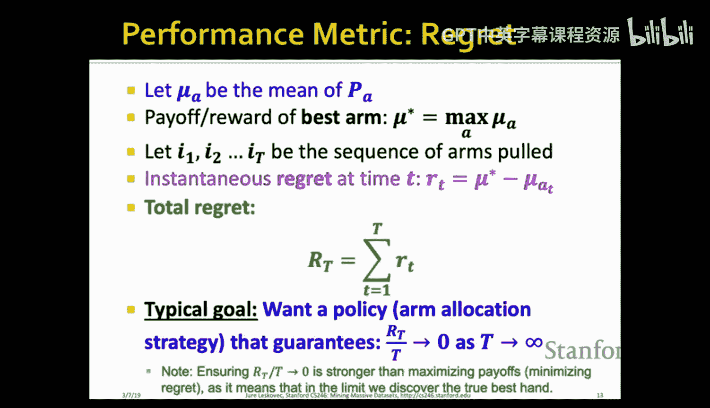

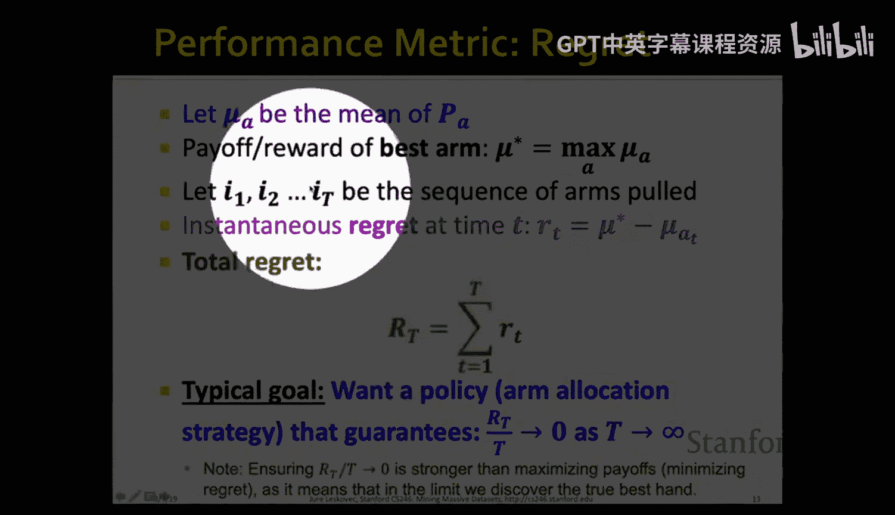

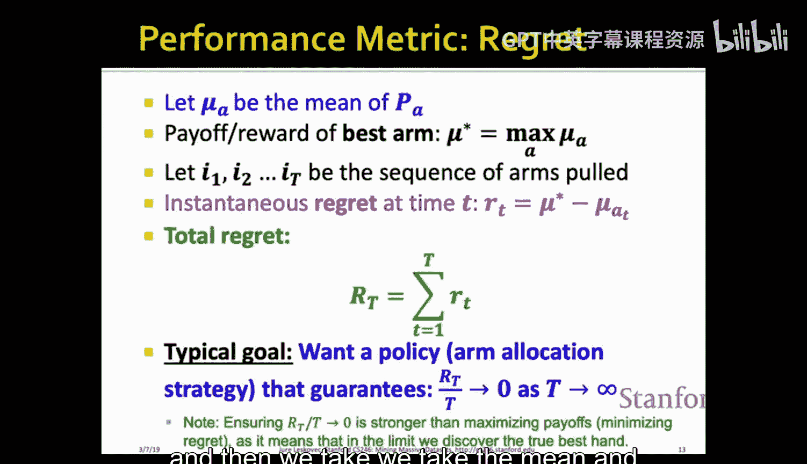

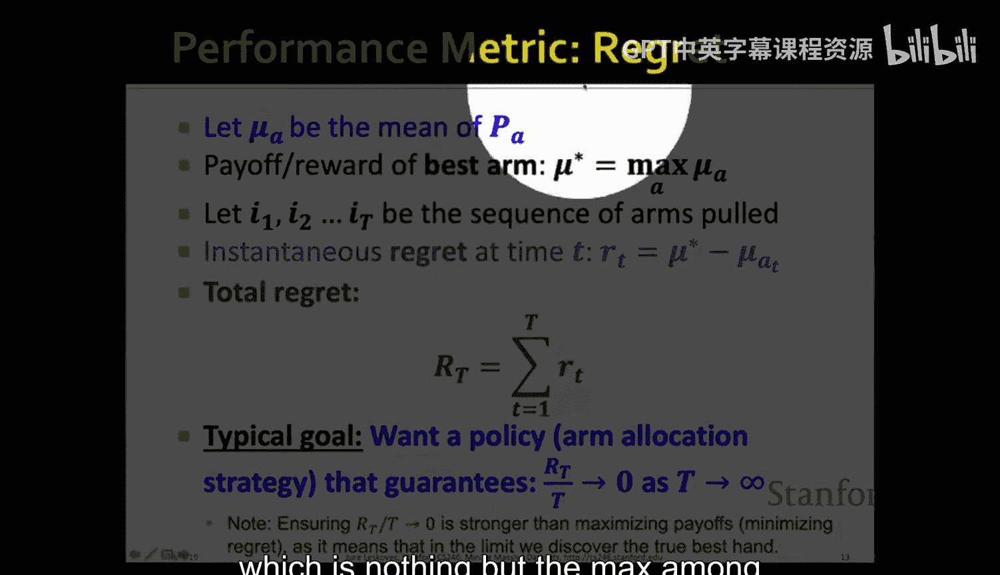

本质上，我们正在运行一种优化算法，但它是在线的，因为我们没有在给定时间 T 获得所有输入，我们必须分析每一步。就像我们过去几周看到的其他在线算法一样，我们必须在每个时间点做出选择。每次我们对系统有更多信息时，我们就能做出更明智的选择。

这里的缺点是，我们只获得关于所选动作的信息。每当我选择摇臂 a2 时，我并没有收集到关于摇臂 a1 的额外信息。因此，我对摇臂 a1 的概率分布的估计保持不变。

这就引出了**利用与探索的权衡**。如果你信任摇臂 a2 并因为它给你更多奖励而持续拉动它，你就不会探索其他摇臂的潜力。

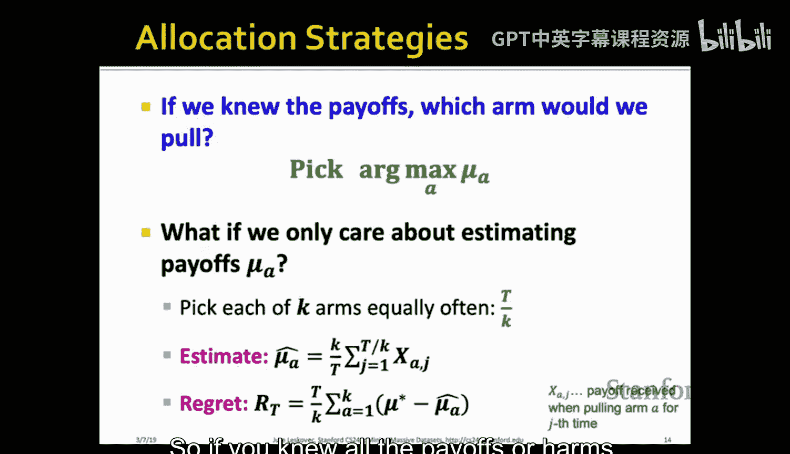

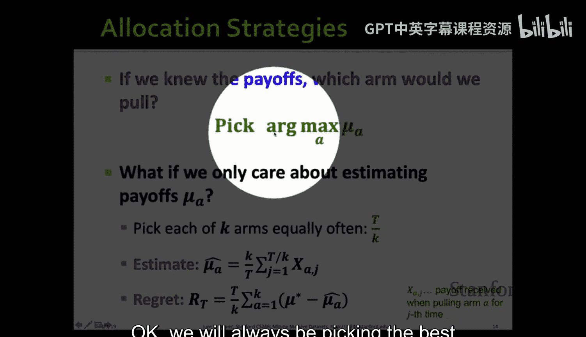

问：查询是否包含一个摇臂？
答：查询是你的设置。查询给了你这个表格（即所有可能的摇臂/广告）。然后，这些是针对该查询可以展示的不同广告。每个查询都有一个不同的表格。这就是为什么它是多臂老虎机。如果你把它做成老虎机，那么你就在系统上进行整个实验。每个查询都是一个独立的实体。有额外的文献表明，当两个查询在语义上接近时，你可以从一个表格中收集信息并转移到另一个，但我们今天不深入讨论。

问：X 在哪里？
答：X 是结果。在时间1，摇臂 a2 给了你奖励 0（没给硬币）。在时间3，它给了你一个硬币。这是一个二进制矩阵，因为我们只考虑点击率，选项只有点击或不点击。

那么，我们如何解决老虎机问题？基本上，我们寻找的是一种策略（或策略生成函数），它能告诉我拉哪个摇臂。我们的策略（希望）将取决于奖励的历史记录。对于那些正在学习或将要学习强化学习的同学来说，这基本上是一个强化学习问题。我们有一个智能体，并试图为该智能体学习一个策略。我试图在这两个领域之间画一个平行线。

我们如何量化算法的性能？基本上，我们将计算一个称为**遗憾**的量。直观地说，如果你知道有一个老虎机摇臂能持续给你更多钱，你应该总是使用那个摇臂。但这基于我们知道所有概率分布的假设，而我们并不知道。因此，我们将尝试尽可能快地估计它们，以最小化我们的遗憾，即最小化我们在这个实验中损失的钱。

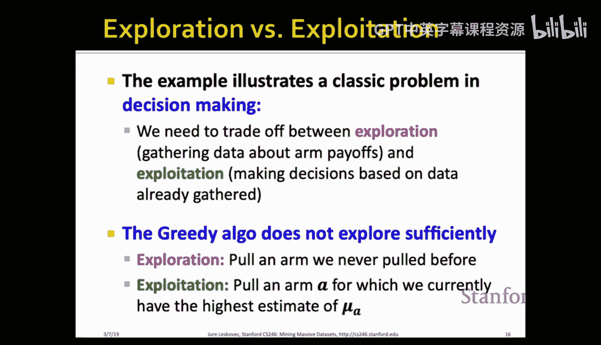

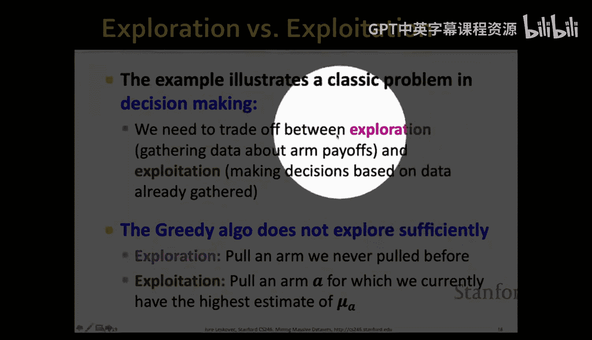

让我们更正式地计算遗憾。我们的 μ_a 是概率分布的均值。我们取所有可能的结果，然后取均值。最佳摇臂的奖励是我们的 μ*，即所有可能 μ 参数中的最大值。然后，我们直到时间 T 拉动不同的摇臂，在每个时间步，我们可以计算瞬时遗憾。时间 T 的瞬时遗憾就是最佳可能结果 μ* 与我们时间 T 选择的摇臂 a_t 的 μ 值之间的差值。

总遗憾的计算方法是对我们考虑的实验中的所有时间步求和。

我们今天要解决的目标是：找到一个策略（决定拉哪个摇臂），保证随着时间趋于无穷，平均遗憾趋于 0。我们希望确保总遗憾除以实验长度的比值趋于 0。有趣的是，我们试图做的这种最小化比之前讨论的更严格。我们不仅仅是试图最大化收入或最小化遗憾，实际上是在寻找最佳策略，因为我们让这个量趋于 0。基本上，随着时间的推移，遗憾最终会变得非常小，并且只在开始时产生，然后在整个实验期间被稀释，这个比值就趋于 0。因此，我们实际上解决了一个比仅仅最小化遗憾更严格的问题。

如果我们知道所有摇臂的收益，策略将是微不足道的：我们总是选择最大值 μ*，即选择所有可能摇臂中最好的 μ。

如果我们只关心估计收益呢？实际上，当我们刚启动系统时，这是我们唯一能负担得起的事情。我们不知道所有的 μ，所以想估计它们。我们做的是：同等地频繁选择每个 K 摇臂。基本上，我们在实验期间进行循环轮询，给每个摇臂 T/K 次拉动。我们如何计算估计值？它不过是所有返回奖励的平均值。这个变量编码了我们的硬币返回：赢为1，输为0。我们取它们的平均值。反过来，遗憾将再次计算为对所有可能摇臂的求和，再次使用最佳策略 μ* 与我们摇臂估计值之间的差值。

这些是我们要处理的两个主要量。

现在让我们尝试解决这个问题。我们说的第一个技术是：既然遗憾是根据平均奖励定义的，如果我们能估计平均奖励，那么我们也能最小化遗憾，这两个量是相关的。第一个能想到的算法是**贪心算法**：总是选择具有最高平均奖励的动作。

让我们看一个例子。假设 K=2，有两个不同的动作。我们知道动作1以概率 0.3 获得奖励1，动作2以概率 0.7 获得奖励1。所以摇臂2明显比摇臂1好。

现在，看看会发生什么。你玩 a1 并获得奖励1。你玩 a2 却获得奖励0。你认为这里会发生什么？是的，你会更新你的概率估计。你给 a1 更多权重，给 a2 更少权重。在你玩了 a1 和 a2 之后，你会更新你的估计。结果，你对 a1 的估计将等于1，对 a2 的估计将等于0。我们到达了一个状态，a1 的平均奖励永远不会降到0，因此，你将永远不会再玩动作 a2。这是一个病态的例子，虽然很小，但它突出了贪心算法的一个缺点：它可能收敛到一个非最优解。

这在决策中并不少见，是一个非常经典的问题。正如我之前提到的，每当你做决定时，你都想在探索（收集关于收益的数据）和利用（基于已收集的数据做决策）之间找到平衡。

问：在之前的例子中，我们是如何选择初始摇臂的？
答：我们基本上每个都拉了一次。我们今天将看到不同的技术，有些是确定性的，有些不是。

好的，现在我们知道了这种权衡。贪心算法的问题在于，我们非常快地从探索阶段（我们拉了摇臂1和摇臂2）过渡到了利用阶段，然后我们就被困在使用 a1 上，尽管我们知道最终回报会更低，因为其概率更低。因此，贪心算法的问题在于它没有充分探索空间。

更现实地说，探索是指拉动一个你从未拉过的摇臂，而利用是指持续拉动当前具有最高 μ 估计值的摇臂 a。一旦你的系统中有一个摇臂具有最高的可能收益，你就持续拉动那个摇臂。

既然我们已经明确了贪心算法的问题，让我们尝试转向一些能克服过早陷入局部次优解的方法。

这里的想法是研究贪心算法的一个变体，称为 **ε-贪心算法**。其工作方式如下：我们仍然运行实验 T 步，但我们添加了一个参数 ε，它依赖于 T。我们的 ε(T) 的量级是 1/T。这个参数有趣的地方在于它随时间衰减：实验持续时间越长，它变得越小。

在这个变体中，我们以概率 ε(T) 进行探索，随机均匀地选择一个摇臂。反之，以概率 1 - ε(T) 进行利用，选择具有最高可能奖励的摇臂。

现在，有一篇论文中的定理证明，如果你以合适的方式选择 ε(T)，那么以下良好性质成立：在合适的 ε(T) 选择下，我们的总遗憾量级为 K log T。如果我们尝试计算，记得我们曾试图让总遗憾除以实验长度的比值趋于 0。如果我们代入这个量，它的量级是 K log T / T，我们知道当 T 趋于无穷时，这个极限趋于 0，因为 log T / T 趋于 0。这样我们就解决了最小化问题。

但别急。现在我要告诉你为什么在现实中这种方法并不总是被使用。

ε-贪心算法有哪些问题？首先，它不够优雅。它基本上交错进行探索和利用这两个阶段。有些阶段只是探索不同的选项，随机均匀地选择不同的摇臂；另一个阶段只是利用，总是押注于能提供最佳奖励的摇臂。但除此之外，还有一个更重要的根本问题：即使是探索阶段也可能做出糟糕的选择。既然它随机均匀地选择任何摇臂，你认为这为什么是个问题？

想一想。为什么在探索阶段随机选择摇臂是次优的？答案：如果你已经对一个摇臂有信息，如果你已经从某个摇臂拉了100次，每次都是0，你可能不想继续尝试探索那个摇臂。完美的答案。基本上，答案是：如果你已经知道一个摇臂的估计值非常低，为什么还要在探索阶段继续使用它？ε-贪心算法的问题在于，你的探索阶段是没有信息的。所有在时间 T 之前收集的不同摇臂的抽取信息基本上都被忽略了。我们可以做得更好。ε-贪心算法没有标准贪心算法那样陷入困境的问题，但我们知道，通过忽略这些信息，我们可以利用其他东西来获得更好的性能。

因此，探索和利用需要比较不同摇臂的估计结果。我们如何比较摇臂？让我们看一个非常简单的例子，这次不是两个，而是三个摇臂。对于其中一些，我们有很多数值。对于摇臂1，我们知道10次中有5次得到正面（奖励）。对于摇臂2，我们只有一个实例，但知道它是正面的。对于摇臂3，我们知道10次中有8次得到正面。

你接下来会选择哪个摇臂？你如何做出选择？这里需要考虑的关键方面是这些量的分母。对于某些摇臂，我们有很多数据点，但对于摇臂2，我们只有一个数据点。如果我们计算收益估计，摇臂2将是获胜选项，因为它是 1/1。理想情况下，我们会持续利用摇臂2。但实际上，对这个值的信心非常低，因为我们只进行了一次抽取。我们对摇臂1和摇臂3的估计有更高的信心。这就是我们想要利用的关键见解。我们不仅要看均值（期望收益），还要考虑我们期望收益的**置信度**。

现在让我们尝试引入置信度，看看它如何使我们的框架更强大。

我们如何使用**置信区间**？置信区间基本上可以定义为一个数值范围，我们确信均值以一定的概率落在这个范围内。例如，如果我们知道 μ_a 在 0.2 和 0.5 之间，且这个概率是 0.95，那么我们对结果就比置信值只有 0.5 时更有信心。这就是我们现在关心的主要见解。

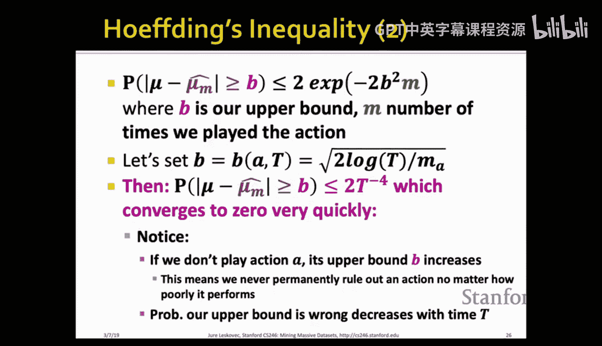

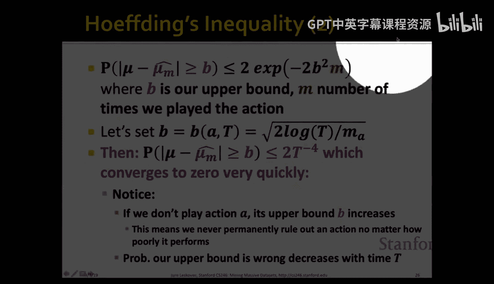

如果我们尝试拉动那个摇臂的次数较少，那么我们的估计就不那么准确，因此置信区间会大得多。这里的直觉是：如果你不经常拉动一个摇臂，即使估计值很低，那个摇臂仍然有潜力。你不知道它最终是否会给你更高的回报。相反，你关于一个摇臂的信息越多，区间就越缩小。经过多轮之后，你开始对该摇臂分配的概率分布有信心。

我们如何利用这些信息来获得更好的结果？假设我们知道我们的置信区间。你可以尝试以下方法：不是尝试具有最高均值的动作（这是我们之前做的，我们估计每个摇臂的 μ 值，然后在利用阶段选择具有最高 μ 值的摇臂），我们这里做的是：尝试具有**置信区间上界最高**的动作。

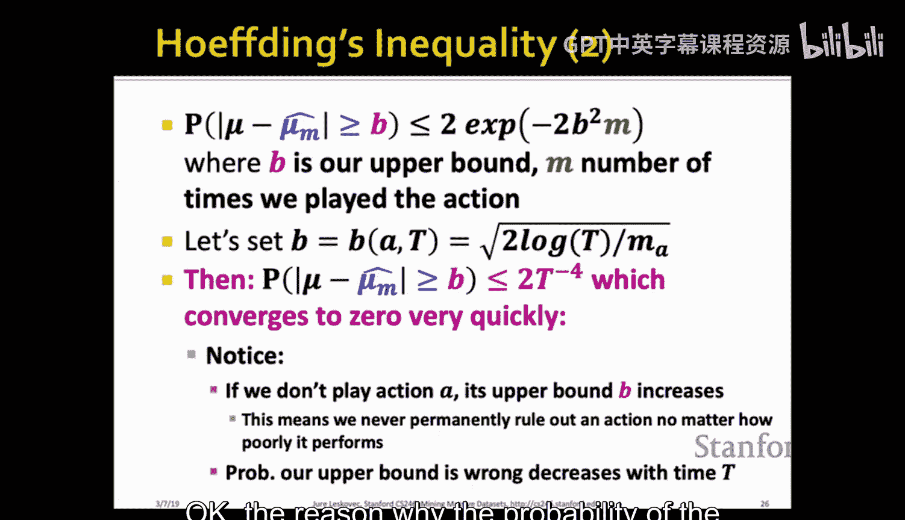

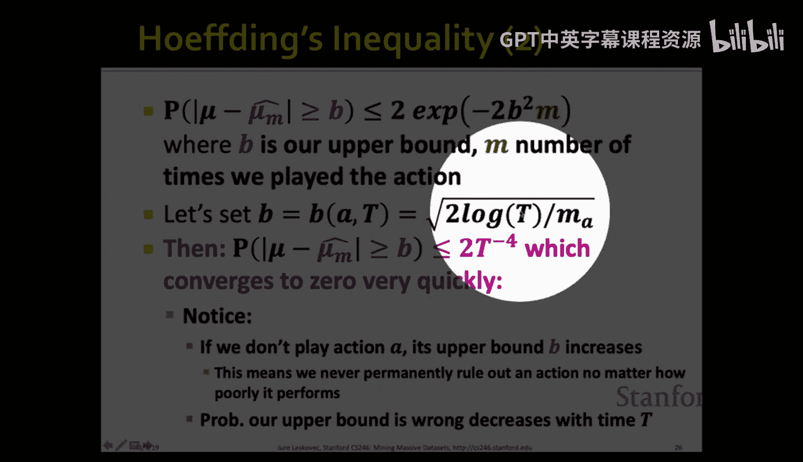

假设我们的 μ 更容易理解。我们不只关心均值，还关心上界。原因基本上是，我们试图保持乐观。我们说，如果我们从那个摇臂做更多抽取，并且实际上均值慢慢向上界漂移，那么那个摇臂就有更多潜力，应该被更多地探索。这就是使用置信区间而不仅仅是估计值背后的直觉。

这被称为**乐观策略**。它也常用于贪心算法的上下文中。基本上，它基于这样的信念：在现有证据下，每个动作都尽可能好。

让我们用数字和更好的图示来看看。现在我们有一些图。我们从这里开始。这是摇臂 a 的不同分布。一个分布如下：这是中值，这些是我们置信区间的边界。我们知道在 99.99% 置信区间下，蓝色条的上界要高得多。因此，我们不会总是选择红色的（因为它具有最高的平均奖励），而是会选择蓝色的。在我们进行更多探索之后，蓝色条的置信区间缩小了。我们收集了关于这个摇臂的更多信息，结果发现我们过于乐观了。平均值移动了，但没那么大。现在我们可以回到红色摇臂，因为我们知道它的上界是最高的。

这样，正如你所看到的，我们持续收集信息，持续进行探索，直到置信区间缩小，最终我们有足够的数据来为每个摇臂做出明智的决定，确定哪个是最好的。

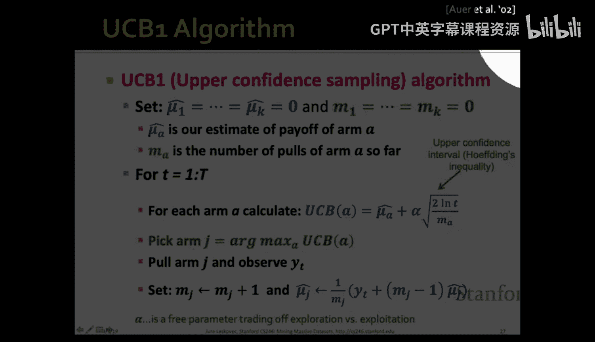

将其转化为广告：如果你的系统上有一个新广告，你只展示了一天，它没有得到很多点击，你不会立即放弃。你继续展示它，继续获取数据，然后在你对广告的点击率有了很好的估计之后，再决定是否应该最频繁地展示它。否则，如果你不这样做，广告往往会立即消失，因为有些广告总是被使用，已经被人们点击过了。

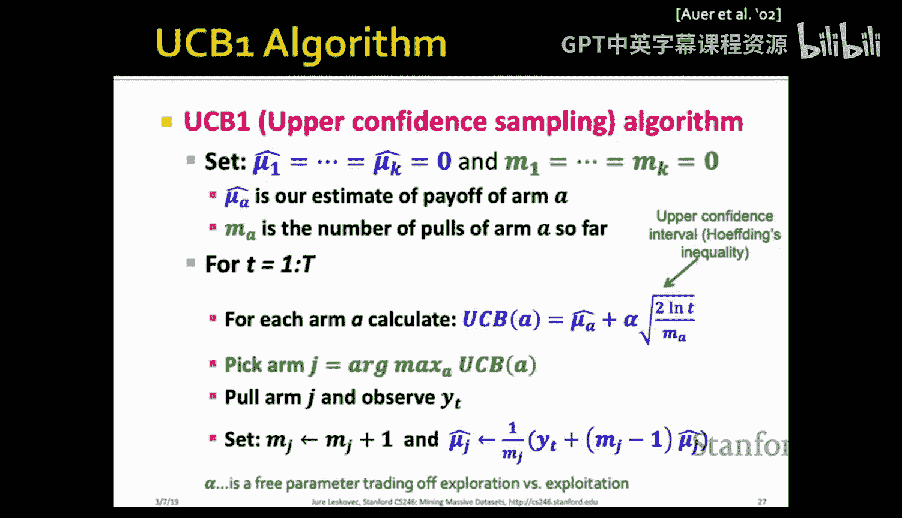

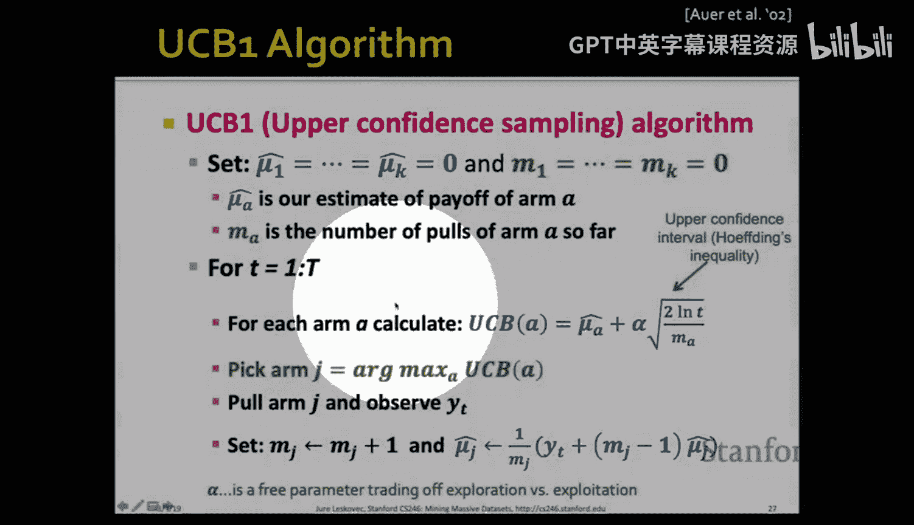

问：是否可以采取一种贝叶斯方法，你有一个先验，然后更新你的信念？
答：很好的问题。我们将在讲座末尾讨论**汤普森采样**，我不会用贝叶斯方法来解释，但你会很容易看到相似之处。基本上，有不同的方法可以对数据进行采样，其中一种正是为不同的概率分配先验，然后你进行的抽取越多，更新的就越多，然后你的采样就会更有信息量。很好的问题，谢谢。

现在，我们如何计算我们的置信边界？情况是这样的：我们的变量 Y_a1 到 Y_aM 是摇臂 a 在前 M 次试验中的收益。试验的总持续时间为 M 步，我们的 Y 变量是随机变量，可以取值在 0 和 1 之间。摇臂 a 的平均收益是我们的 μ_a，我们计算估计值的方法再次是 M 次试验中可能回报的总和除以 M。

我们想做的是：找到边界 B，使得以高概率，真实 μ_a 与估计值之间的差异小于边界 B，并且我们希望边界 B 尽可能小，因为我们希望我们的估计尽可能可靠。

目标是基本上找到这个差异小于我们的量 B（我们的边界）的概率。

我们如何做到这一点？概率论中有一个非常优雅的结果，称为**霍夫丁不等式**。这个不等式为我们提供了平均值偏离期望值超过一定量的概率上界，这正是我们需要的。我们之前看到，我们有 μ 的期望值，以及我们在 M 次试验后计算的平均值。我们想知道这两个量彼此偏离多少。

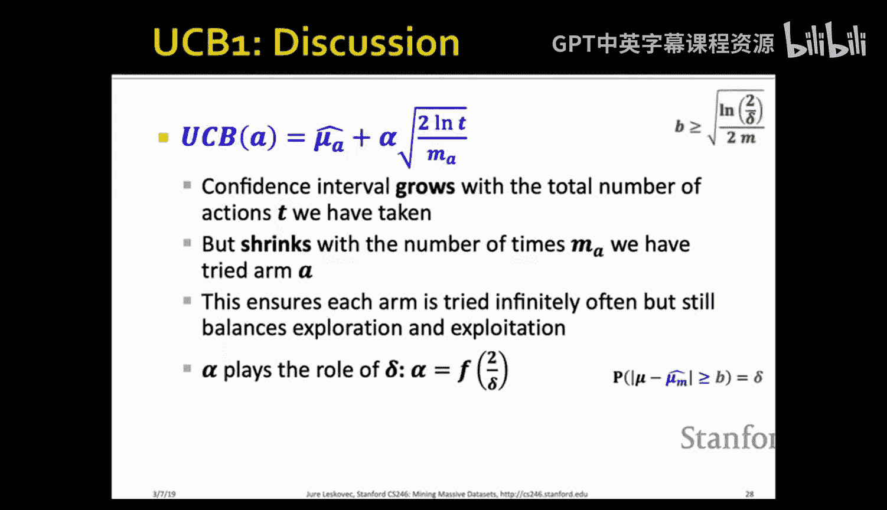

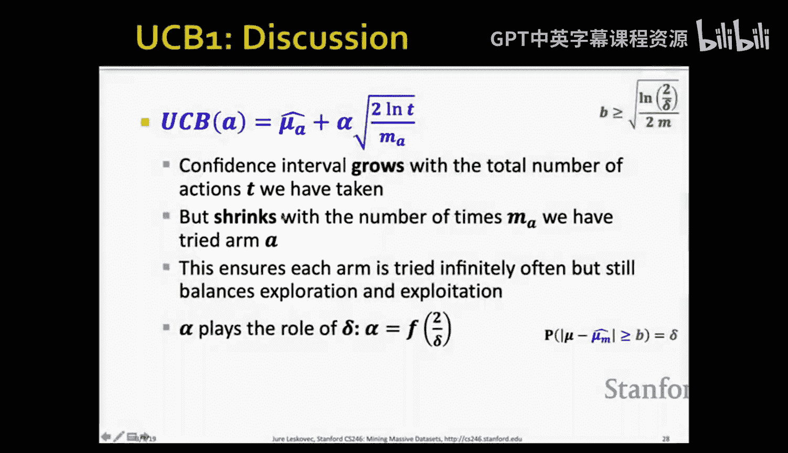

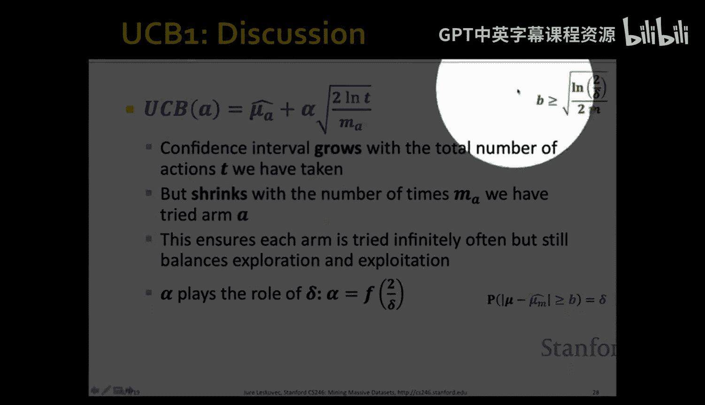

再次强调，在理想世界中，我们会知道 μ_a 帽的值，因为这意味着我们已经知道了估计值，但我们不知道。我们必须通过运行多次试验来估计它。我们想找出实际值与我们的估计值之间的差异。

这里的技巧如下：我们采用这个不等式，它以以下方式表达：我们之前讨论的概率，即真实值与期望值之间的差异大于我们的边界 B 的概率，我们知道这个概率将小于 2 乘以 e 的 -2B²M 次方。我们可以称这个为 δ，这将是我们的置信值。

我们如何从这个霍夫丁不等式推导出一些可操作的东西，用于我们的计算？我们发现，置信区间 B 基本上与我们的置信水平相关联。假设我们的 δ 是 95% 或 99%，这将转化为一个特定的 B 值。我们做的是：我们取这个量，然后我们希望这个量小于或等于 δ。然后我们只使用标准的对数性质。我们把 2 留在那里，然后把指数移到另一边。现在我们想提取 B 的值。我们将把 2 移到另一边，应用平方根，得到 B，不等式的方向改变。然后我们得到这个最终结果：B 必须大于等于 以 2 为底的对数 (2/δ) 除以 2M 的平方根。

关于这个量的有趣见解如下：正如你所看到的，试验次数 M 越多（实验运行时间越长），这个量就越大，我们的边界 B 就越小。这就是我们之前所说的：我们从特定摇臂进行的抽取越多，我们对该概率估计的信心就越高。同样，我们的置信水平 δ 越大，我们的 B 就越小。我们越希望置信水平高，我们的边界就越严格，这样我们的 μ 和期望 μ 就越接近。

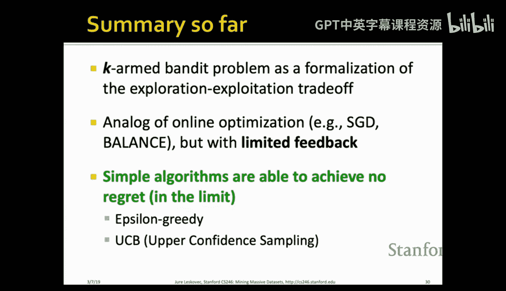

问题到此为止。很好，让我们继续。

现在我们已经弄清楚了如何应用它。再次强调，B 是我们的上界，M 是我们玩那个动作的次数。我们之前做了数学推导来提取 B。我们可以做的是：将 B 设置为等于这个量。它将等于 以 2 为底的对数 T 除以 M 的平方根的两倍。再次强调，M 是我们在该特定摇臂上进行的试验次数。如果我们这样做，那么我们将得到以下量：我们的两个 μ 在这个特定边界内的概率将小于或等于 2 乘以 T 的 -4 次方。

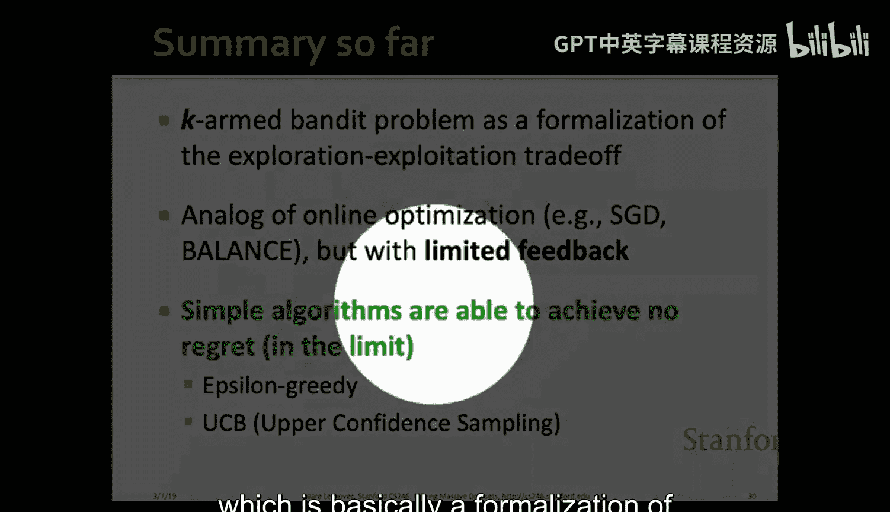

有趣的是，正如你所想象的，随着时间推移，它很快收敛到 0。时间流逝，很快这个边界将非常接近 0。

这里的陷阱是什么？如果我们不玩动作 A，如果我们基本上忘记了那个老虎机摇臂，或者我们长时间停止展示某个特定广告，那么我们的上界 B 将会增加。这意味着，在这种策略下，我们永远不会永久排除某个特定选项。某个老虎机摇臂不会完全从我们的实验中消失，我们会时不时地拉动它，看看是否能进一步更新估计值。相反，上界错误的概率随着时间 T 而减小。实验运行得越久，我们拉动摇臂的次数越多，我们的边界就越小。因此，我们对该特定摇臂的概率分布就越有信心。

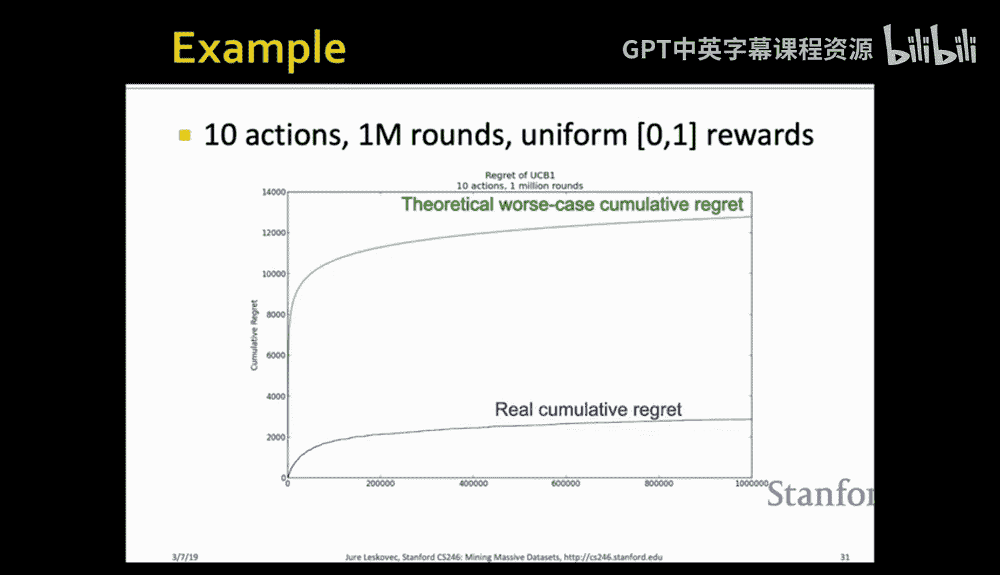

如果你想让自己相信这两个结果：为什么上界的概率随时间 T 减小？我们已经看到了。我们在这里看到了。它是 2 乘以 以 2 为底的对数 T，这除以试验次数。如果试验次数随时间减少，基本上，这个量只会增加。时间流逝，我们不持续测试那个特定摇臂，那么试验次数保持不变，我们的边界就会增加。相反，如果你进行更多试验，这个量会增加，我们的边界会减小。这就是背后的直觉。

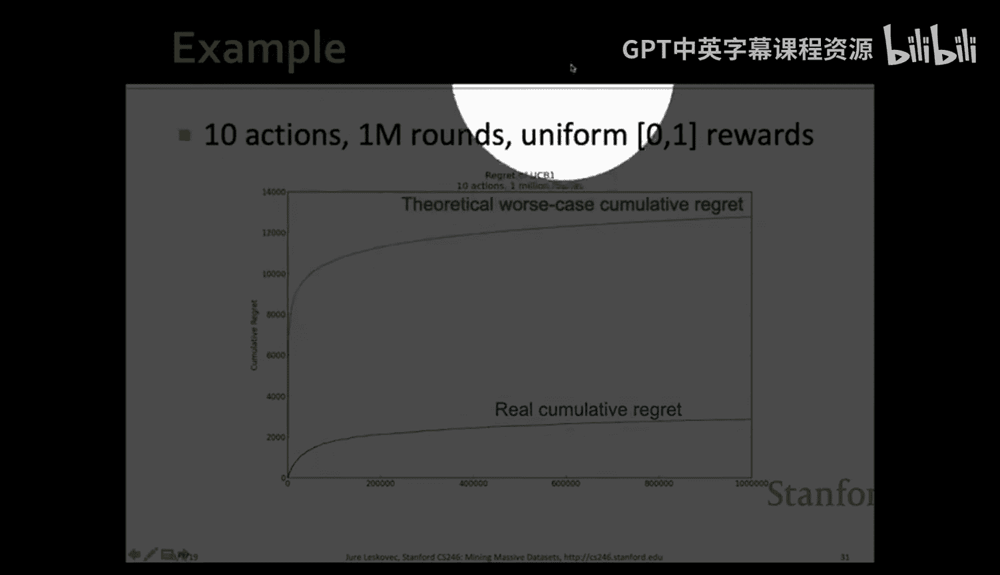

现在，为什么除了这为问题提供了一个非常优雅的解决方案之外，它还捕捉了另一个重要方面？用户的行为不是静止的。将用户建模为静止的概率分布是非常不现实的，因为我们的品味会随时间变化，我们关心的广告可能在两个月后发生变化，或者我们看的电影会根据季节、心情或测试等而变化。这基本上捕捉了这样一个事实：系统中的每个实体都引入了一些随机性。曾经忽略特定广告的用户，甚至某个曾经忽略特定广告的人口统计群体，他们的品味可能会随时间变化。这就是为什么我们持续运行这些测试。如果广告没有被展示，边界会持续增加。最终，广告会再次出现在谷歌上，然后谷歌会再给它一次运行机会，基本上测试人们是否感兴趣。因此，它也捕捉了用户行为的这个有趣特征。

现在我们如何使用这个置信边界的概念，如何将其插入到我们的多臂老虎机问题中以使其更高效？这个算法被称为 **UCB1**，代表“上置信边界”。它之所以被称为“1”，是因为在原始论文中有这个算法的多个变体。今天我们将介绍基本版本，但如果你去看论文，你会看到一堆不同的变体。

我们如何使用它？我们首先将所有系统变量设置为零。我们将我们的新估计值和试验次数设置为 0。

再次强调，μ_a 是我们对特定摇臂 a 的收益估计，M_a 是我们在该摇臂上进行的拉动次数。我们运行实验 T 步。对于每个摇臂 a，我们计算其上界。上界的计算方式如下：我们知道估计值 μ_a（经过几次试验后，我们大致知道摇臂的预期成功率），加上 α 乘以我们之前计算的上置信区间。

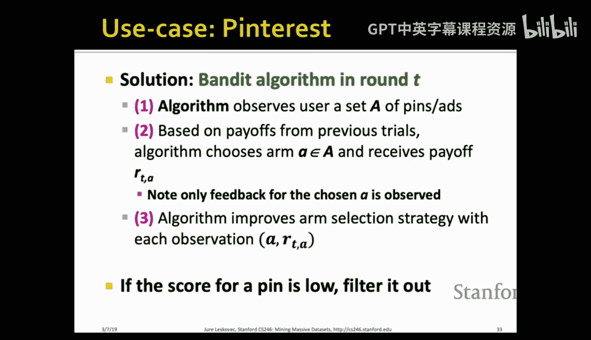

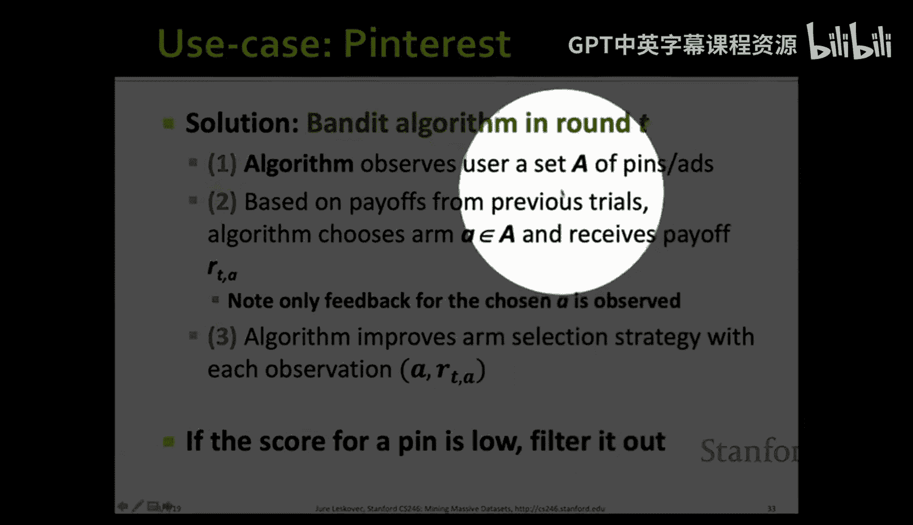

我们之前所做的所有数学基本上都归结为这一项。

然后我们的 UCB 策略如下：我们基本上选择摇臂 j，它是所有可能摇臂中具有最大值的那个。然后我们拉动摇臂 j（与最大可能回报相关联的那个）。然后我们观察我们的奖励 Y_t（实际回报）。UCB 的最后一步是更新这个方程。我们在这里做什么？我们更新我们的 M_j（加1步），然后我们将更新我们的 μ_j 估计值。我们这样做的方式如下：让我们拆分这个方程以便你能跟上。在右边，你会看到 M_j - 1 乘以 μ 估计值。这基本上给出了所有先前 M 步的平均值，你乘以所有步数。然后你做的是，加上最后一步的结果。我们的 Y_t 是我们在时间 t 观察到的结果。然后我们再次计算平均值。基本上，我们做的是：每次我们有一个观察结果，我们就更新该摇臂的 μ_j 估计值。

关于这个算法，最后一个有趣的事情是讨论这个 α 参数。α 参数基本上编码了探索与利用之间的权衡。如果你将 α 设置为 0，你认为会发生什么？没有探索，对吧？你将 α 设置为 0，那么你的选择总是基于该特定摇臂的平均估计值。当我们把 α 设为 0 时，我们实际上把它变成了最开始看到的贪心策略。我们计算我们的估计值，然后选择最好的一个，更新，然后回到那一步。这就是我们如何抵消这一项的贡献。相反，如果我们将 α 推到一个非常大的值，我们做的主要是探索。在实际运行的生产系统中，α 的值不是固定一个月左右的。有数据科学家和团队决定 α 随时间变化的值。因此，时间越长，一旦你对初始探索阶段满意，你就尝试更多地转向利用部分。这就是为什么 α 是这种方法中一个非常有用的可调参数。

到目前为止有什么问题吗？好的。

让我们再讨论一下 UCB 的结果。我们的置信区间随着我们采取的行动总数增长而增长，这我们之前已经看到，因为 M 增长，所以边界变小。

同时，这基本上确保了每个摇臂将被无限频繁地尝试。但它仍然在探索和利用之间取得平衡。这就是我之前解释的见解：当我们知道估计值低于某个值时，我们不会永远忽略一个广告或某个老虎机摇臂。我们会时不时地回到它。

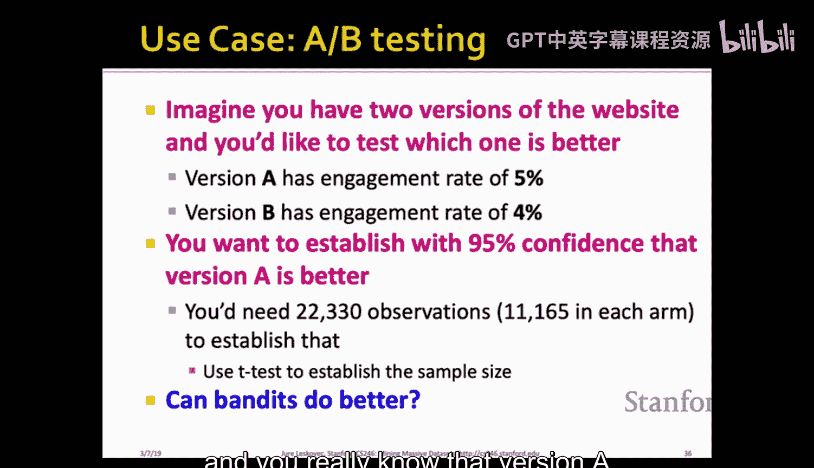

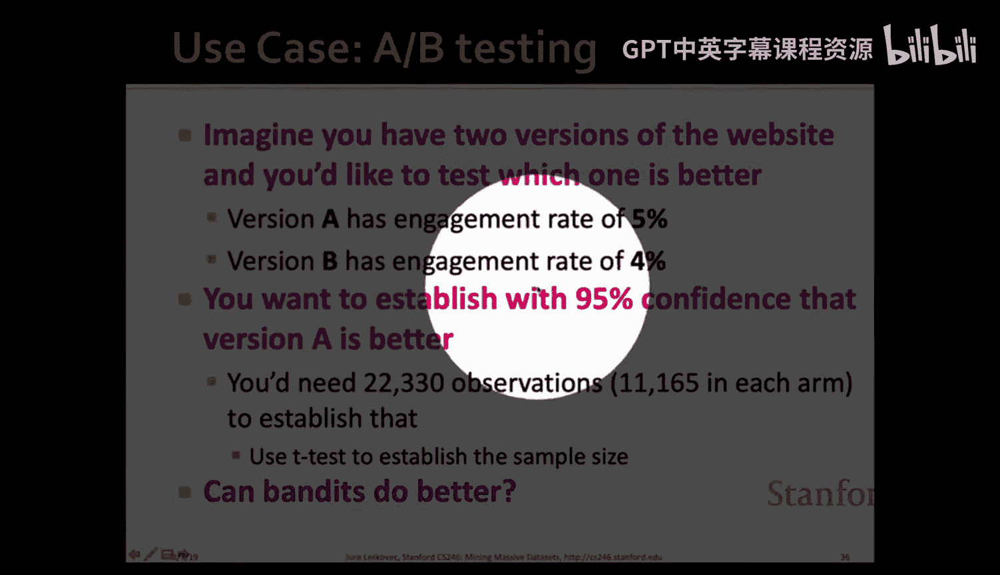

我们的 α 在这里基本上扮演了置信区间的角色。如果我们将 α 设为 0，我们是在说我们确信我们的估计是正确的。相反，如果我们让 α 非常大，那么我们是在说我们不信任我们的估计，然后我们持续进行探索，直到我们对每个摇臂有更多信息。

好的。我们在这里所做的，基本上是我们编码了一类策略，或者几乎是一个哲学论点：我们试图在面对不确定性时引入乐观主义。你可以有不同的策略，你可以更保守，不尝试探索太多。但我们这里做的是，我们相信通过触及状态空间中未探索的部分，我们总能获得额外的奖励。

问：只是想确认一下，这是在线学习吗？
答：正确，它始终依赖我们。是的，它是在线的，因为我们没有不同摇臂的 μ 估计值。我们必须随时间收集它。然后我们基本上随时间学习这些值。正如我之前与强化学习做的类比，你有一个在开始时知识为零的智能体，你玩的轮次越多，智能体获得的知识就越多，它就能做出更好的选择。很好。

好的。我留给你们去查阅，肯定有其他版本的这些论点不是基于完全乐观的，但它们往往更保守。但我们喜欢乐观，所以我告诉你们我们能找到的最乐观的算法。

我们不会为了节省时间而深入探讨其数学细节。如果你回头去看 UCB 论文，他们还证明了这个有趣的不等式。基本上，它表明，如果你试图计算我们之前讨论的总遗憾的期望，这将小于或等于以下量。这个量将是 K 乘以 T 的对数的量级。所以，总遗憾除以我们运行实验的时间量的比值将小于等于 K 乘以 log T / T。再次强调，正如我们之前所说，当时间趋于无穷时，这个量趋于 0。因此，即使是 UCB1 技术也满足我们最初想要的标准：我们希望遗憾随时间趋于 0。所以它与 ε-贪心等的条件完全匹配。

好的，让我们总结一下。然后我将向你们展示一些来自现实世界的例子。

我们已经看到了多臂老虎机问题，它基本上是探索与利用权衡的形式化。它与我们在课程中讨论的其他在线优化非常相似，比如周二看到的随机梯度下降等。但它带有非常有限的反馈。例如，在 SGD 中，我们有梯度的不同分量，你可以计算导数等等。而在这里，我们只有来自不同摇臂抽取的信息。因此，我们必须用这有限的数据尽力而为。有趣的是，我们介绍了几种算法，即使简单，也能在时间趋于无穷时实现无遗憾。

有什么问题吗？还是我们跳到例子？

问：在极限情况下，我们实现了零遗憾，但在某些情况下，比如医疗案例，拉动老虎机摇臂就像开处方药，单个错误的代价很高，怎么办？
答：非常好的问题。如果我们不在广告的背景下，错过一次点击并不严重，但如果我们进行临床试验，犯一个大错误会付出更大的代价。我一开始提到临床试验，更多是为了告诉你们这套技术可以应用于那些场景，但当遗憾比广告高得多时，你不会直接使用这种技术。还有其他更保守的方法。正如我之前所说，今天我展示的是最乐观的版本，因为它非常适用于广告或推荐系统，比如 Netflix。但在医疗试验的情况下，你会做一些更保守的事情。谢谢，很好的问题。还有其他问题吗？还是我们跳到例子？

好的，让我们看例子。我想展示的第一件事是：就像计算机科学中的许多其他算法一样，如果你计划将来做研究或已经在做，我总是建议这样做：总是尝试绘制理论最坏情况。在我们的案例中，我们关心累积遗憾（我们想要最小化的量）与实际累积遗憾（你实际得到的）。

让我们以这个例子为例，其中 K=10。我们有10个不同的摇臂。我们运行模拟一百万轮，然后我们有一个给出 0/1 奖励的均匀分布。有趣的是，我们之前理论结果的上界大约在 14000 左右，但实际上真实的累积遗憾很快趋于平稳，大约在 200 左右。这个模拟只是为了展示多臂老虎机效果非常好，可以给你非常小的遗憾。在我们有了这个初始探索阶段之后，它收敛得非常快。基本上，你从图的这部分看到的非常低的凸起是，我们时不时地尝试其他摇臂，正如我们之前所说。我们为探索所付出的代价非常小。

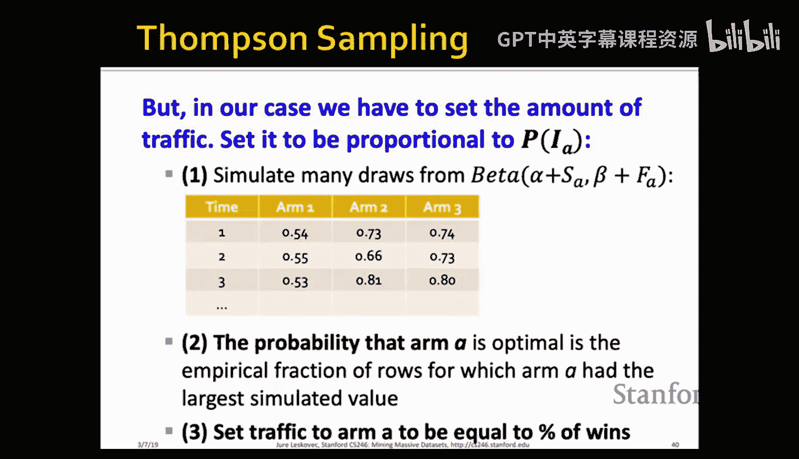

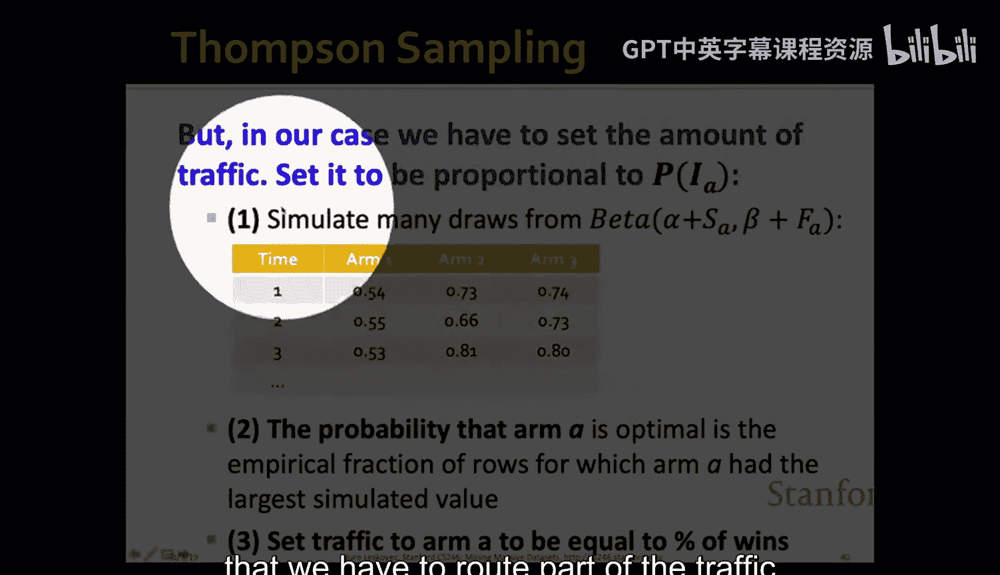

这就是为什么累积遗憾随时间很快趋于 0。

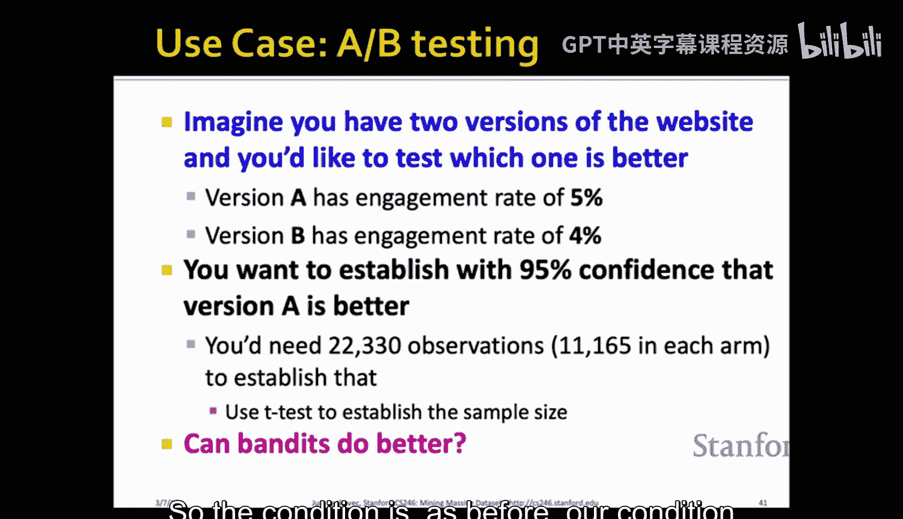

让我们看一个用例。这更与推荐系统相关。想想 **Pinterest**。Pinterest 是一个平台，用户在上面创建图板，钉选与不同主题、爱好或他们拥有的物品相关的图片。Pinterest 的问题是，新的图钉或平台上展示的新广告，在开始时没有足够的信号表明它们有多好。一个新用户加入并创建一个新图板，你怎么知道那个图板会对其他人有趣？你如何让人们与那个图板或那个广告互动？

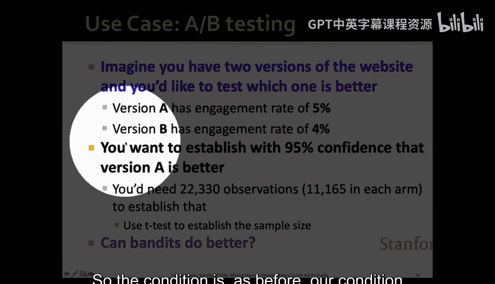

这很好地映射到我们之前看到的多臂老虎机问题。我们想做的是：尝试最大化来自几个未知老虎机的奖励。我们的老虎机基本上是上面不同的图钉。我们想决定我们想玩哪些，以及我们想以什么顺序玩它们。每个图钉被视为一个摇臂，用户参与度被视为奖励。思考这件事非常有趣，归根结底，Pinterest 是一家依靠广告维持的公司。但在这个领域，关键是你有大量的用户参与度，因为你希望你的平台增长。你想吸引更多用户，你想让用户对你产生的内容充满热情和兴趣。因此，我们今天看到的不仅适用于广告，它也可以用来研究你的内容在多大程度上创造了用户留存、用户参与度和流量。再次强调，这里我们想找到探索和利用之间的权衡，因为在这个平台上的风险可能是总是展示人们经常点击的广告。假设你正在查看关于服装的图板。有些品牌是每个人一生中至少买过一次或想要的，你可能只是用同样的品牌不断“轰炸”用户。当然，这是一种会给你带来一些点击率的技术，但它可能会将系统困在某个局部最优解中。这就是为什么你想确保，即使是你向用户展示的内容，你也总是在探索和利用之间取得平衡。

Pinterest 应用的解决方案如下：他们应用标准的老虎机算法，他们做的是：观察平台上的一组图钉和广告。然后根据人们的收益（人们点击或喜欢某些图片的次数），算法将选择一个特定的摇臂来接收我们的估计收益。

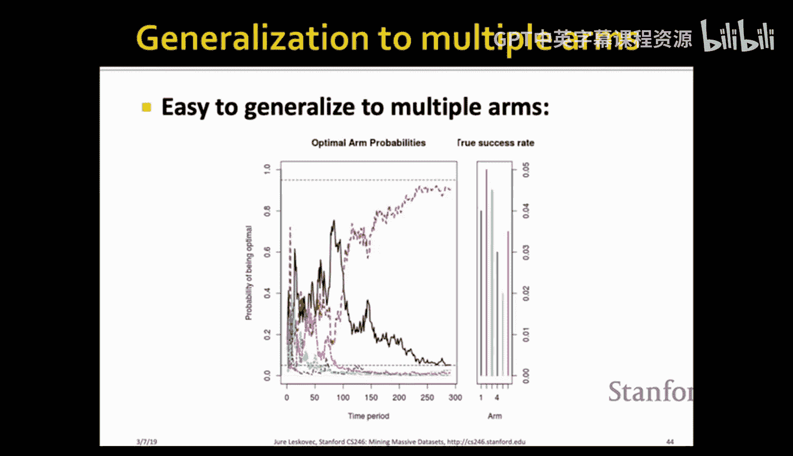

再次强调，我会不断重复这一点：记住，只有所选摇臂的反馈被观察到，这非常重要。每次 Pinterest 决定对某个图钉或某个图板进行排名时，他们不会获得关于用户有多喜欢或认为该内容相关的