#  019：优化子模函数 🎯

在本节课中，我们将学习一个激动人心的主题：优化子模函数。其核心应用在于以数学化的方式量化多样性，例如在推荐系统中确保推荐内容的多样性。我们将从问题动机出发，介绍子模函数的数学定义与性质，并学习如何利用贪心算法高效地解决这类优化问题。

---

## 期末考试安排 📝

在进入正题之前，我们先来了解一下本课程的期末考试安排。

期末考试将于下周二下午3:30至6:30举行。考试地点根据学生证ID的首字母划分：
*   ID以A-L开头的学生，请前往420号楼040室。
*   ID以M-Z开头的学生，请前往Bishop Auditorium。

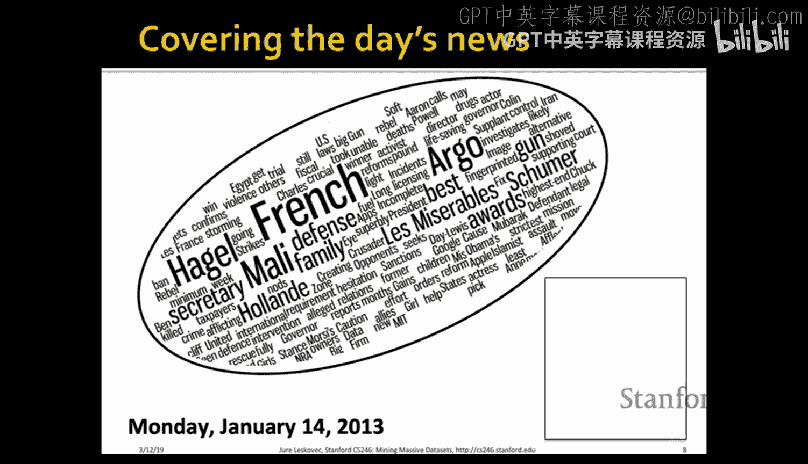

考试为开卷形式，允许携带笔记和教材，但**禁止使用互联网**。你可以使用电脑阅读和搜索课程笔记，也可以使用计算器应用进行算术运算，但**禁止编写或运行任何代码**（例如Python）。请确保你的电脑处于离线状态。

建议携带一个电源排插，以防笔记本电脑电量耗尽。

对于远程学习的SCPD学生，有两种选择：在斯坦福校园参加考试，或通过指定的监考人在24小时窗口期内远程完成考试。具体细节将通过SCPD邮件通知。

---

## 问题动机：推荐系统的多样性 🗞️

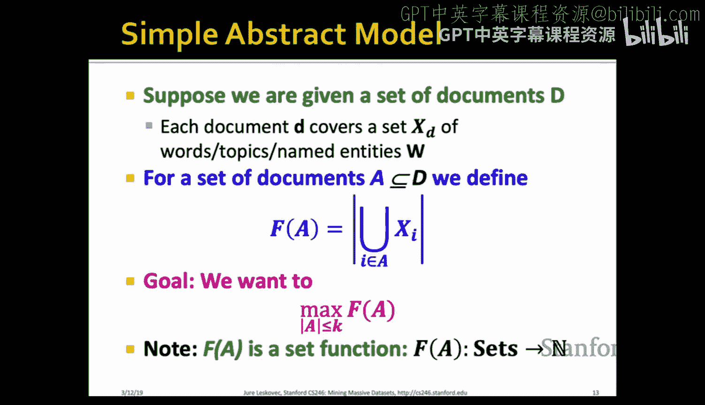

上一节我们介绍了期末考试的具体安排。本节中，我们来看看今天课程的核心问题：如何在推荐系统中实现多样性。

当我们进行推荐（如新闻、商品）时，展示空间是有限的。如果我们只推荐用户最可能喜欢的单一类型内容，推荐结果会高度冗余。例如，新闻推荐可能只包含关于同一主题的多篇文章。

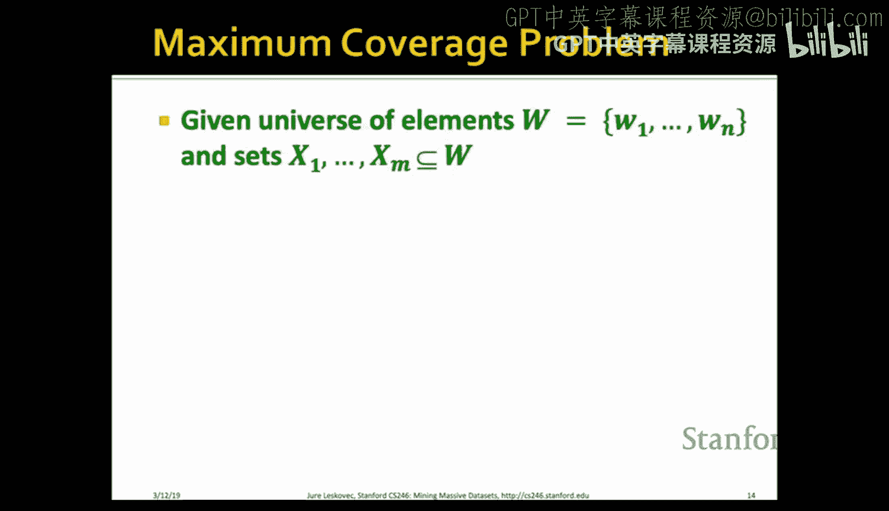

我们的目标是战略性地利用有限的推荐位，覆盖用户可能感兴趣的所有方面，实现**多样性**。例如，在一天的新闻中，可能涉及法国干预马里、美国国防部长提名、奥斯卡获奖预测等多个主题。一个好的推荐系统应该覆盖这些不同的主题，而不是重复推荐同一主题的文章。

---

## 数学形式化：最大覆盖问题 📐

那么，如何将“多样性”数学化呢？我们的思路是将其建模为一个**覆盖问题**。

我们可以将当天的新闻关键词视为一个“词云”，每篇文章覆盖词云的一部分。我们的目标是选择固定数量（k篇）的文章，尽可能覆盖词云中更多的区域（即更多的关键词）。

以下是具体的数学定义：
1.  **覆盖对象**：概念集合（例如，命名实体、关键词），记作 `W`。
2.  **覆盖者**：文档集合 `D`。每个文档 `d` 覆盖一个关键词子集 `X_d ⊆ W`。

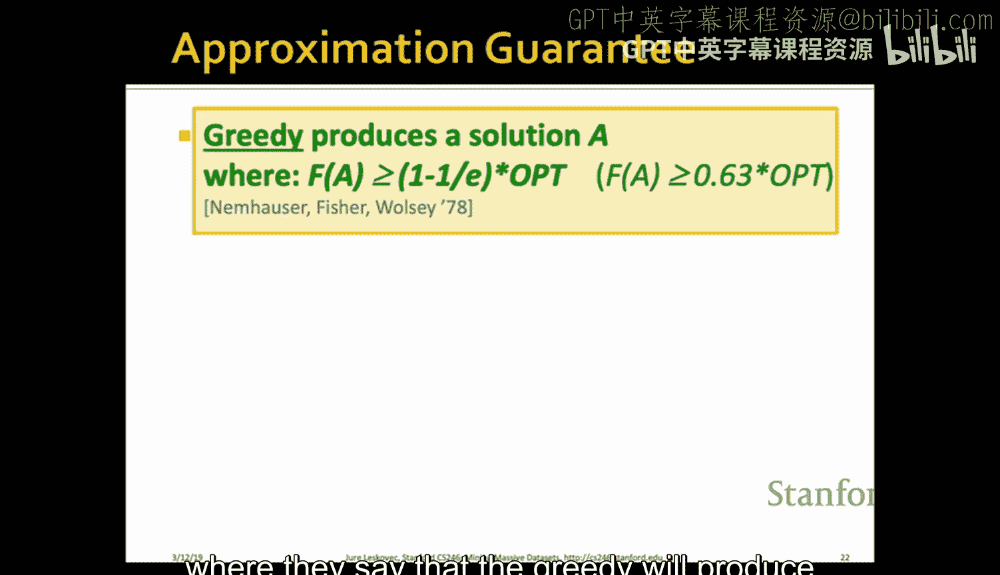

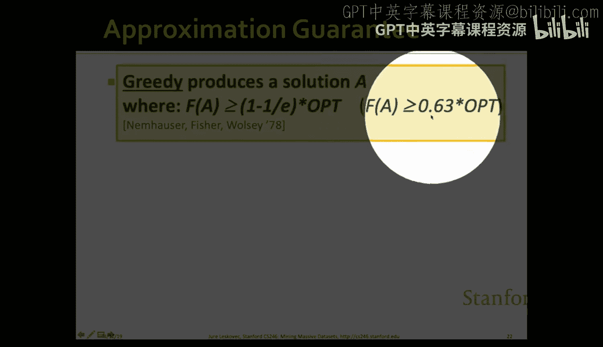

我们的**目标函数** `F` 定义如下：对于选定的文档子集 `A ⊆ D`，`F(A)` 等于这些文档所覆盖关键词的**并集**的大小。
`F(A) = | ∪_{d∈A} X_d |`

**优化目标**是：找到一个大小恰好为 `k` 的文档子集 `A`，使得 `F(A)` 最大化。这被称为**最大覆盖问题**。

---

## 贪心算法及其近似保证 ⚙️

上一节我们将多样性问题形式化为最大覆盖问题。本节中我们来看看如何求解它。

最大覆盖问题是NP难问题，无法高效求得精确最优解。一个简单有效的启发式算法是**贪心算法**（或称爬山算法）。

算法步骤如下：
1.  初始化推荐集合 `A` 为空集。
2.  进行 `k` 次循环，每次循环中：
    *   遍历所有尚未入选的文档 `d`。
    *   计算将 `d` 加入当前集合 `A` 所带来的**边际收益**：`F(A ∪ {d}) - F(A)`。
    *   选择能带来**最大边际收益**的文档 `d*`，将其加入集合 `A`：`A = A ∪ {d*}`。

**算法质量保证**：Nemhauser, Wolsey, Fisher 在1978年证明，对于具有**单调性**和**子模性**的函数 `F`，上述贪心算法得到的解 `A` 满足：
`F(A) ≥ (1 - 1/e) * F(OPT) ≈ 0.63 * F(OPT)`
其中 `F(OPT)` 是最优解的值。这意味着贪心算法至少能获得63%的最优解效果，这是一个非常强的近似保证。

---

## 子模函数：定义与性质 🔑

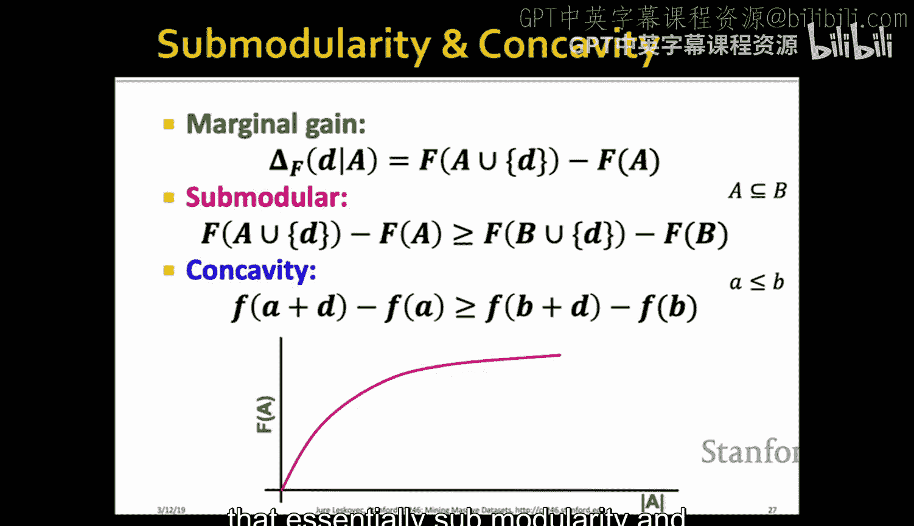

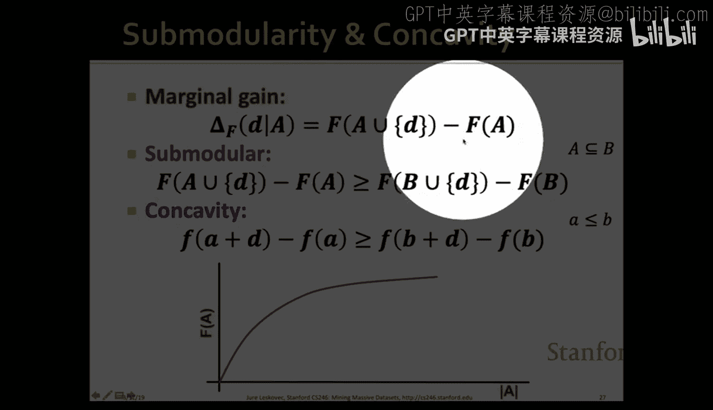

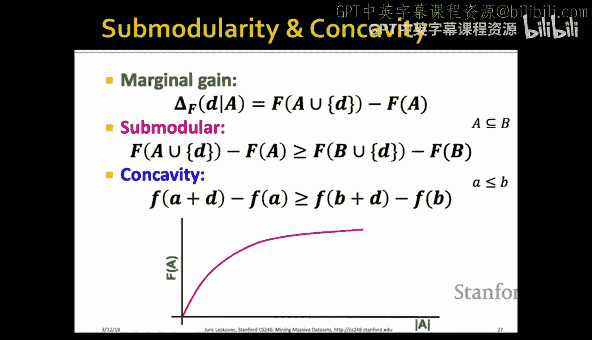

上一节我们提到，贪心算法的优异性能依赖于目标函数 `F` 的**单调性**和**子模性**。本节我们来详细探讨这两个性质。

首先，我们的覆盖函数 `F(A) = | ∪_{d∈A} X_d |` 显然是**单调**的：如果 `A ⊆ B`，那么 `F(A) ≤ F(B)`。因为增加推荐文档只会覆盖更多关键词，不会减少。

关键在于**子模性**。它直观上反映了“边际收益递减”规律：向一个较小的集合添加元素带来的收益，大于向一个较大的集合添加同一元素带来的收益。

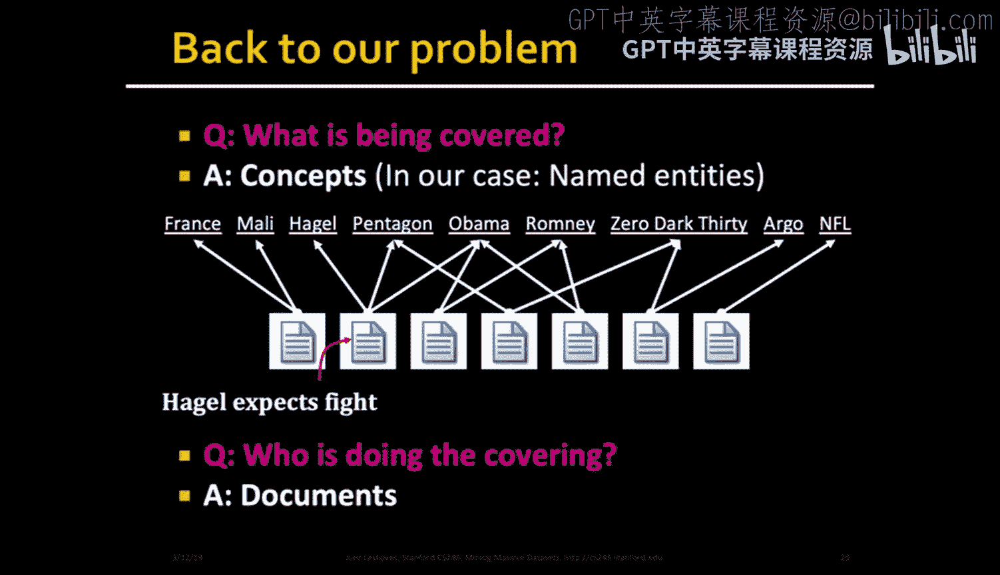

**形式化定义**（边际收益递减形式）：
函数 `F` 是子模的，如果对于任意集合 `A ⊆ B` 和任意元素 `d ∉ B`，满足：
`F(A ∪ {d}) - F(A) ≥ F(B ∪ {d}) - F(B)`

在我们的覆盖问题中，这很好理解：当推荐集 `A` 较小时，新文档 `d` 可能覆盖许多全新的关键词，边际收益高。当推荐集 `B` 已经很大时，`d` 覆盖的关键词可能大多已被 `B` 中的文档覆盖，因此边际收益较低。

**重要性质**：子模函数在非负线性组合下是封闭的。即，如果 `F1, F2, ..., Fm` 都是子模函数，`λi ≥ 0`，那么 `F(A) = Σ λi * Fi(A)` 也是子模函数。这个性质在组合多个优化目标时非常有用。

---

## 扩展：概率化覆盖与个性化权重 ⚖️

基本的覆盖模型存在一个缺点：它对概念的覆盖是“全有或全无”的。一个文档要么覆盖某个关键词，要么不覆盖，而没有考虑覆盖的强度（例如，关键词出现的频率）以及不同关键词对用户的重要性。

为此，我们引入**概率化覆盖**模型：
1.  **概念权重**：每个概念（关键词）`c` 对特定用户有一个重要性权重 `w_c`。这实现了**个性化**。
2.  **覆盖强度**：文档 `d` 覆盖概念 `c` 的强度定义为 `cover_d(c)`，可以理解为文档中提到概念 `c` 的概率或频率。
3.  **集合覆盖概率**：对于推荐集合 `A`，它覆盖概念 `c` 的概率是“至少有一篇文档覆盖c”的概率：
    `cover_A(c) = 1 - Π_{d∈A} (1 - cover_d(c))`
4.  **新目标函数**：我们希望最大化所有概念上的加权覆盖和：
    `F(A) = Σ_{c} w_c * cover_A(c)`

可以证明，这个新的 `F(A)` 仍然是**单调子模函数**。因此，我们依然可以使用贪心算法来近似优化它，并且享有相同的 (1-1/e) 近似比保证。

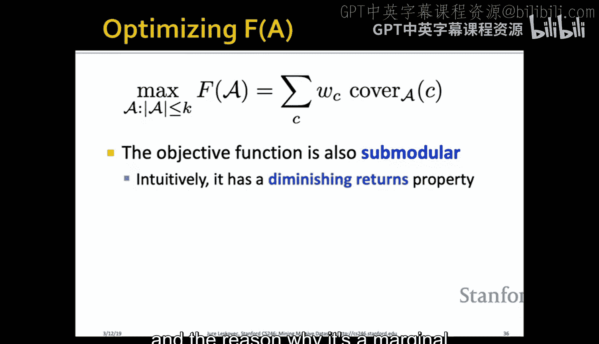

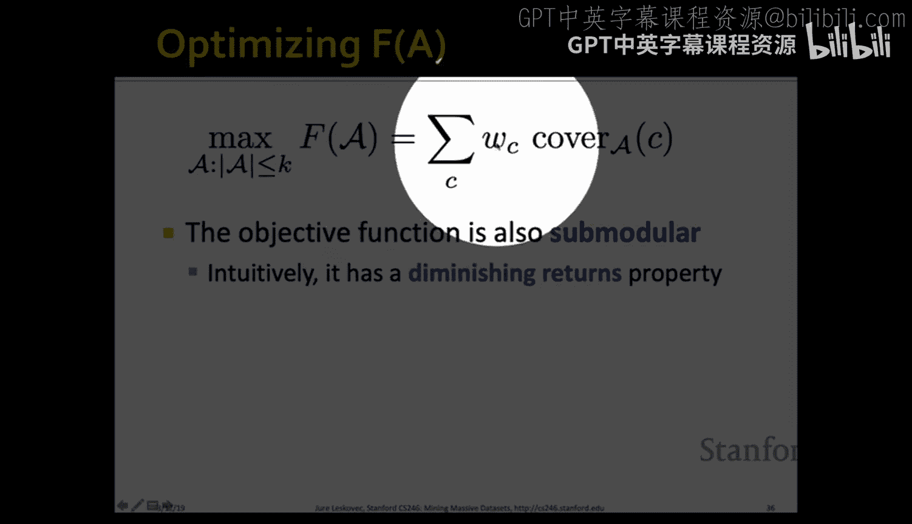

---

## 加速技巧：惰性贪心算法 🐢

贪心算法在每轮迭代中都需要重新计算所有剩余文档的边际收益，时间复杂度为 O(k * |D|)。当文档库 `D` 很大时，这可能成为瓶颈。

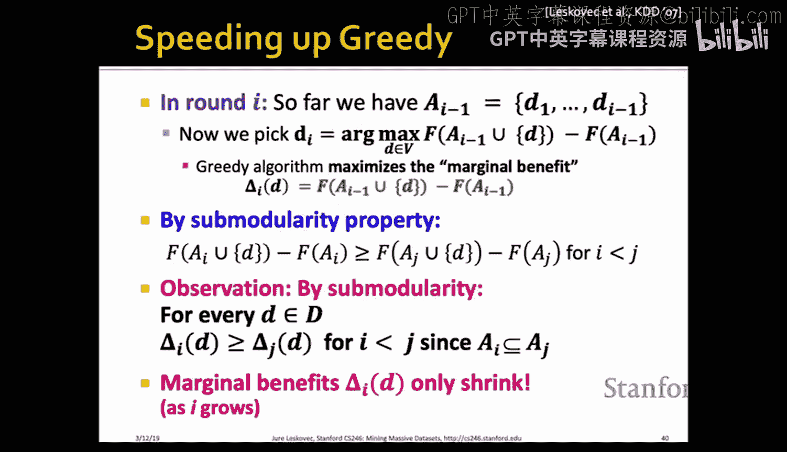

利用子模函数的**边际收益递减**性质，我们可以采用**惰性评估**来大幅加速，即“惰性贪心算法”。

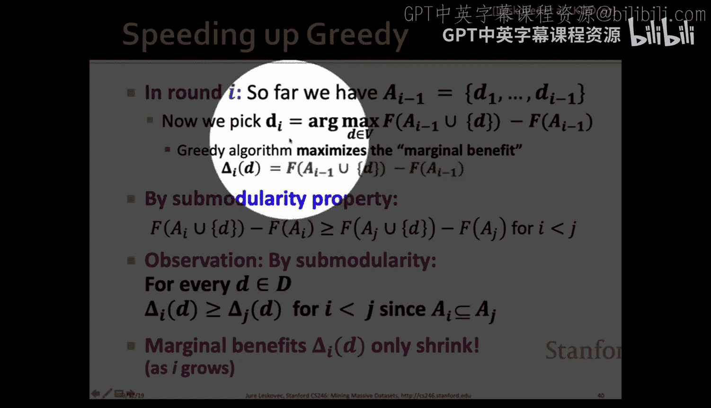

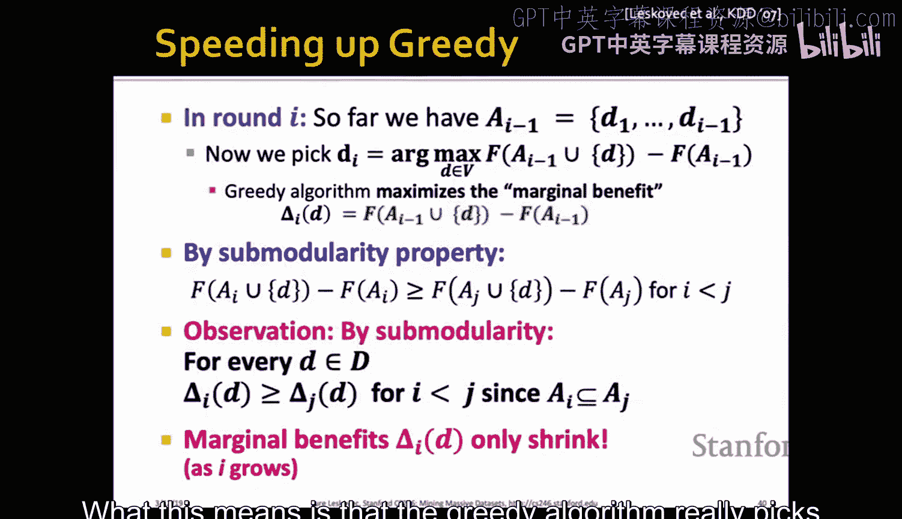

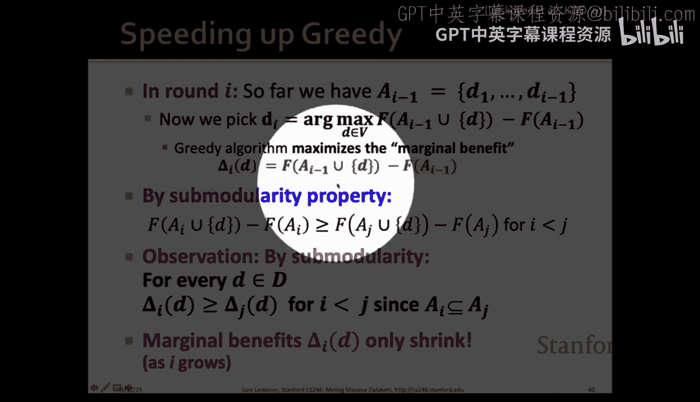

**核心观察**：对于同一文档 `d`，其在第 `i` 轮迭代中的边际收益 `Δ_i(d)`，一定**大于等于**其在后续第 `j (j>i)` 轮中的边际收益 `Δ_j(d)`。因为随着集合 `A` 变大，`d` 能带来的新收益只会减少。

**惰性贪心流程**：
1.  第一轮，计算所有文档的边际收益，选出最优者 `d1`。
2.  后续轮次，我们维护一个按“上一轮计算的边际收益值”降序排列的文档列表（该值是当前边际收益的一个**上界**）。
3.  我们只评估列表顶部的文档（即上界最高的文档）的真实边际收益。
4.  如果评估后，该文档的真实收益仍然高于列表中下一个文档的“上界”，那么由于收益递减性质，我们可以确定它就是本轮最优选择，无需评估其他文档。
5.  更新选中文档的收益，并调整列表顺序，继续下一轮。

在实践中，惰性贪心能避免大量不必要的边际收益计算，通常比标准贪心快几个数量级。

---

## 个性化权重的学习：乘性权重更新 🔄

到目前为止，我们假设概念权重 `w_c` 是已知的。那么如何从用户交互中**学习**这些个性化的权重呢？

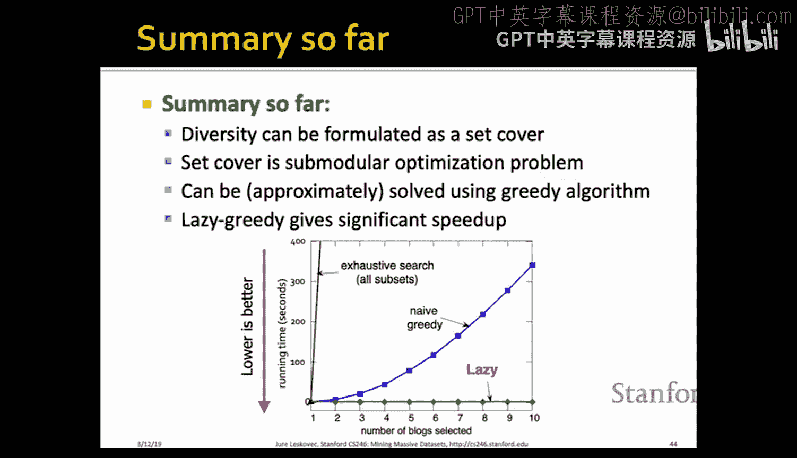

我们采用**乘性权重更新**算法：
1.  初始化所有权重，例如设为1。
2.  当向用户推荐一个文档集 `A` 后，收集用户反馈。为简化，假设反馈为“喜欢”(+1)或“不喜欢”(-1)。
3.  对于被推荐文档覆盖的所有概念 `c`，根据用户反馈更新其权重：
    *   如果反馈为“喜欢”(+1)：`w_c = w_c * β`，其中 `β > 1`（如1.1）。
    *   如果反馈为“不喜欢”(-1)：`w_c = w_c / β`。
4.  对于未被覆盖的概念，权重保持不变。

**直观解释**：如果用户喜欢一篇包含某些概念的文档，我们就提高这些概念的权重；反之则降低。参数 `β` 控制了更新的幅度。通过持续的反馈循环，权重会逐渐收敛到反映用户真实兴趣的分布。

对于更细致的反馈（如评分1-5星），可以通过调整 `β` 的取值来对应不同的更新强度。

---

## 总结 🎓

本节课我们一起学习了如何优化子模函数来实现推荐系统的多样性。

1.  **问题形式化**：将多样性需求建模为最大覆盖问题，目标是选择k个项目以覆盖最多的重要概念。
2.  **核心数学工具**：引入了**子模函数**，其“边际收益递减”的性质是贪心算法有效的关键。
3.  **优化算法**：使用**贪心算法**可以高效地获得至少63%最优效果的近似解。
4.  **加速技巧**：利用子模性质设计的**惰性贪心算法**能极大提升计算效率。
5.  **模型扩展**：通过**概率化覆盖**和**个性化概念权重**，使模型更贴合实际。
6.  **在线学习**：通过**乘性权重更新**算法，可以从用户反馈中动态学习并调整个性化权重，形成完整的推荐闭环。

这套基于子模函数优化的框架，为处理多样性、覆盖性和个性化相结合的复杂选择问题提供了强大而优雅的解决方案。