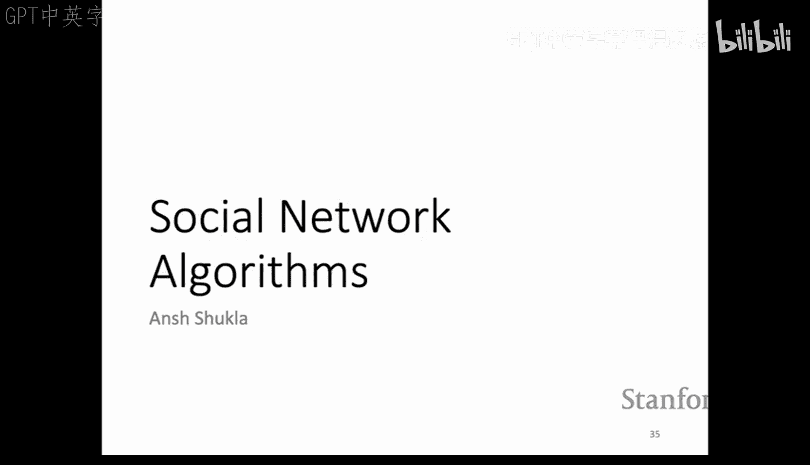
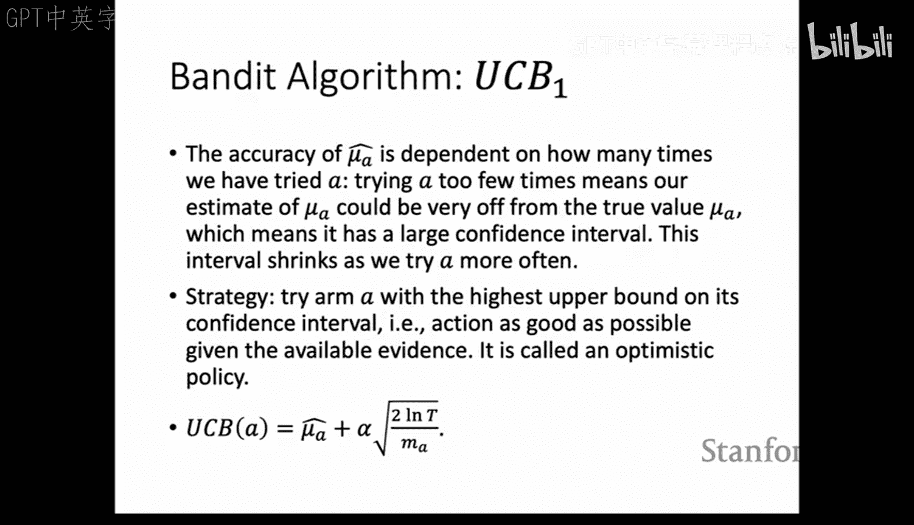

#  020： 课程回顾与总结

在本节课中，我们将对斯坦福大学CS246《海量数据集挖掘》课程的核心内容进行一次全面的回顾。我们将梳理本学期所学的关键算法、模型和系统，涵盖从数据处理基础到高级机器学习应用的广泛主题。本次回顾旨在帮助大家为期末考试做好准备，巩固对海量数据挖掘核心概念的理解。

---

## 第20章：课程最终回顾

大家好，欢迎来到本学期的最后一节课。在课程开始前，我想说几句话。首先，我要感谢大家在这个季度中的出色表现，感谢你们在作业、讨论和课堂提问中的辛勤付出。你们应该为自己感到自豪，因为你们在本课程中学到了大量非常实用的方法，这些知识工具在未来的研究或工业界工作中处理数据时将会非常有用。祝大家在期末考试中一切顺利，享受即将到来的春假。

现在，教学团队将带领大家回顾本学期涵盖的所有重要主题和概念。

---

### MapReduce与频繁项集挖掘

上一节我们介绍了课程的整体情况，本节中我们来看看数据处理的基础框架MapReduce以及频繁项集挖掘。

**MapReduce** 是一种为大规模数据集设计的编程模型，易于并行化且具有容错性。其执行分为三个步骤：
1.  **Map阶段**：处理每个输入，为每个键分配值。
2.  **分组与洗牌阶段**：收集键值对，进行排序和分发，将数据分配给不同的Reducer。
3.  **Reduce阶段**：处理具有相同键的所有数据，合并并输出结果。

MapReduce通过存储中间输出来处理任务失败，可以重启失败的任务而无需重新开始整个作业。Spark等数据流系统则对MapReduce模型进行了泛化，允许更灵活的任务编排。

**频繁项集挖掘** 在市场篮子分析等场景中非常有用，可用于计算置信度、兴趣度并得出关联规则。

以下是两种在内存中计算频繁项集的主要算法：
*   **Apriori算法**：采用两轮扫描。第一轮统计单个项的出现次数；第二轮，利用单调性原理，只对由频繁单项组成的候选对进行计数，从而节省内存。
*   **PCY算法**：同样是两轮扫描，但在第一轮中，它利用剩余内存维护一个用于统计候选对的哈希表。第二轮中，将哈希表转换为位图，用于快速过滤候选对。

对于无法装入内存的超大规模数据，我们可以使用上述算法作为构建模块：
*   **简单随机抽样**：但不能保证找到所有频繁项集。
*   **SON算法**：将数据分成小块处理，可以保证找到所有频繁项集。
*   **Toivonen算法改进版**：从随机样本开始，不仅计算频繁项集，还计算其负边界。如果在第二轮验证中负边界内没有项集是频繁的，则可以保证已找到所有频繁项集。

---

### 局部敏感哈希与聚类分析

上一节我们讨论了如何从海量数据中找出频繁模式，本节中我们来看看如何高效地发现相似项或文档，以及如何对数据进行分组。

**局部敏感哈希** 是一种用于高效查找相似项的重要算法，其时间复杂度为 `O(N)` 而非 `O(N²)`。LSH包含三个步骤：
1.  **Shingling**：将文档转换为由K个连续词元（K-grams）构成的集合表示。
2.  **最小哈希**：构造一个哈希函数，使得两个文档的哈希值相同的概率等于它们的Jaccard相似度。
3.  **LSH处理**：通过“与”和“或”操作组合多个哈希函数，以放大相似文档被分到同一桶的概率，同时降低不相似文档被分到同一桶的概率。

具体来说，如果采用 `b` 个波段、每个波段 `r` 行的策略，两个文档成为候选对的概率公式为：
`P = 1 - (1 - s^r)^b`
其中 `s` 是文档间的Jaccard相似度。

**聚类分析** 旨在将相似的数据点分组。主要有两类方法：
*   **点分配聚类**：如K-means算法，初始化中心点，根据距离分配点，然后迭代优化。BFR算法是K-means的改进版，适用于海量数据。
*   **层次聚类**：每个点自成一类，然后基于距离度量（如最大距离、平均距离）迭代合并最相似的类。这种方法有时能发现K-means无法发现的特殊形状簇（如环形簇）。

---

### 降维与推荐系统

上一节我们探讨了如何发现数据中的相似性与分组，本节中我们来看看如何简化数据表示以及如何构建推荐系统。

进行**降维**的动机包括节省存储、加速处理、发现隐藏结构等。课程中主要介绍了两种方法：
*   **奇异值分解**：将矩阵 `M` 分解为 `U Σ V^T`。通过保留最大的 `k` 个奇异值并置零其余值，可以实现降维。SVD可通过计算 `M^T M` 或 `M M^T` 的特征分解来求解。
*   **CUR分解**：通过非均匀采样矩阵 `M` 的行和列来构建分解 `M ≈ C U R`。CUR分解更具可解释性且能保持稀疏性，但可能产生冗余特征。

**推荐系统** 的目标是根据用户-物品评分矩阵预测缺失的评分。
*   **基于内容的推荐**：根据用户过去高评分的物品特征，推荐具有相似特征的物品。
*   **协同过滤**：
    *   **用户-用户协同过滤**：基于相似用户对物品的评分进行预测。
    *   **物品-物品协同过滤**：基于用户对相似物品的评分进行预测。
    *   可使用Jaccard距离、余弦相似度、皮尔逊相关系数等作为相似性度量。
*   **潜在因子模型**：将评分矩阵 `R` 分解为两个低秩矩阵的乘积（`R ≈ P Q^T`），这些因子代表了用户和物品空间中的抽象概念。通常使用随机梯度下降来最小化包含正则化项的损失函数，以防止过拟合。

---

### PageRank与图算法

上一节我们学习了如何为用户推荐物品，本节中我们来看看如何衡量网页的重要性以及如何在图中发现社区。

**PageRank** 是一种用于确定网页重要性的方法。一个页面的排名取决于链接到它的页面的数量和重要性。其基本思想可以通过一个迭代公式表示，其中引入了“跳转”概率 `β` 来避免某些问题。对于页面 `j`，其PageRank值 `r_j` 可以通过以下公式迭代计算：
`r_j = β * Σ_{(i→j)} (r_i / d_i) + (1 - β) / N`
其中 `d_i` 是页面 `i` 的出链数，`N` 是总页面数。这可以转化为矩阵形式并用幂迭代法求解。

**主题敏感PageRank** 是PageRank的变体，跳转时只跳转到一组特定的相关页面，而不是所有页面。

在图算法中，一个核心问题是发现图中的**社区**。一个重要工具是**个性化PageRank扫描法**：
1.  使用个性化PageRank计算图中所有节点的得分。
2.  按得分对节点排序。
3.  按顺序将节点加入集合，并计算该集合的**传导率**。
4.  选择传导率的局部最小值作为社区的边界。

我们还可以进行**基于模体的谱聚类**，通过将原始图转换为加权图来寻找特定子图结构（模体）定义的密集区域。此外，寻找完全二分子图的问题可以巧妙地转化为频繁项集挖掘问题。

**图嵌入** 旨在将图中的节点映射到连续的向量空间，同时保留节点在图中的重要属性。Node2Vec算法使用有偏随机游走来生成节点的邻居序列，通过优化目标函数，使得在嵌入空间中节点的相似性（如点积）能够反映它们在随机游走中的共现概率。

---

### 监督学习：决策树与支持向量机

上一节我们讨论了图数据的表示与学习，本节中我们回到经典的监督学习领域，看看两种强大的分类与回归模型。

**监督学习** 的目标是根据带有特征 `X` 和标签 `Y` 的数据集，学习一个预测函数。任务主要分为分类（离散标签）和回归（连续标签）。

**决策树** 通过一系列规则对数据进行划分。
*   **如何分裂**：对于回归任务，使用**纯度值**（方差的加权平均减少量）；对于分类任务，使用**信息增益**（基于熵）。
*   **何时停止**：当节点中的数据足够“纯”（方差小）或数据量太少时停止分裂，以防止过拟合。
*   **如何预测**：在叶节点，回归任务取平均值，分类任务取众数。

对于海量数据，可以使用MapReduce框架（如PLANET算法）并行构建决策树。**装袋法** 通过训练多个不同数据子集上的树并聚合结果（如投票或平均）来提升性能。**随机森林** 在此基础上，在每次分裂时随机选择特征子集进行考虑，以增加多样性，通常能取得极佳的分类效果。

**支持向量机** 主要用于二分类问题，目标是找到一个最大化分类间隔的超平面。对于非线性可分数据，引入**铰链损失**和正则化项。最终的优化问题为最小化以下损失函数：
`L = 1/2 ||w||² + C Σ_i max(0, 1 - y_i (w·x_i + b))`
通常使用梯度下降法求解参数 `w` 和 `b`。

---

### 流算法

上一节我们学习了传统的批量学习算法，本节中我们来看看当数据以高速流的形式到达时，如何用有限的内存实时计算其重要性质。

**流算法** 用于处理无法存储全部数据的数据流，并实时估计其属性。

**布隆过滤器** 是一种用于快速判断元素是否可能在集合中的数据结构。它使用一个位数组和多个哈希函数。当查询一个元素时，如果所有哈希位置均为1，则元素**可能**在集合中（存在误判可能）；如果有任一位置为0，则元素**肯定不在**集合中。误判率随着数组大小增大而降低，但随哈希函数数量先减后增。

**Flajolet-Martin算法** 用于估计数据流中不同元素的个数。其核心是维护一个哈希值尾部连续零的最大数量 `R`，最终估计值约为 `2^R`。

**AMS方法** 用于估计数据流的矩。特别是二阶矩（平方和），可用于估计数据库的自连接大小。算法随机选取流中的一个位置，记录该位置元素值 `a` 的出现次数 `x`，则估计值为 `m * (2x - 1)`，其中 `m` 是流长度。通过多次取样平均可以提高精度。

---

### 网络广告与在线匹配

上一节我们研究了数据流的实时处理，本节中我们来看一个重要的应用：网络广告投放，它本质上是一个在线匹配问题。

**在线二分图匹配** 问题中，我们一边的节点（广告位）依次到达，需要即时决定将其匹配给另一边的哪个节点（广告主），以最大化总匹配数。简单的贪心算法竞争比为 `1/2`。

在网络广告的简单设定下（所有广告主预算相同、点击率和价值相同），**Balance算法**（选择剩余预算最多的广告主）的竞争比可提升至 `1 - 1/e`。通过分析两个广告主的情况，可以证明其竞争比为 `3/4`。

在更一般的设定下（出价、预算、点击率均不同），简单的Balance算法竞争比可能降至0。需要使用**广义Balance算法**，其选择函数同时考虑出价和剩余预算比例，才能重新获得良好的竞争比。

---

### 实验学习与多臂老虎机

上一节我们探讨了在线环境下的决策问题，本节中我们来看看如何通过“尝试-获取反馈-学习”的循环来进行优化，即多臂老虎机问题。

**多臂老虎机** 问题 formalize 了这种探索与利用的权衡。我们有 `K` 个老虎机臂，每个臂 `a` 以固定概率 `μ_a` 获得奖励。目标是在有限步数内最大化总奖励，但初始时不知道 `μ_a`。

策略需要在**探索**（尝试新臂以获取信息）和**利用**（选择当前估计收益最高的臂）之间取得平衡：
*   **ε-贪心策略**：以概率 `ε` 随机探索，以概率 `1-ε` 进行贪心利用。
*   **上置信界算法**：为每个臂 `a` 计算一个置信区间，选择具有最高**上置信界**的臂，即：
    `UCB(a) = avg_reward(a) + c * sqrt( log(T) / n_a )`
    其中 `n_a` 是臂 `a` 被尝试的次数，`T` 是总尝试次数。该算法平衡了探索（尝试次数少的臂置信区间宽）和利用（选择估值高的臂）。

---

### 总结

在本节课中，我们一起回顾了斯坦福大学CS246《海量数据集挖掘》课程的核心内容。我们从MapReduce数据处理框架和频繁模式挖掘出发，探讨了相似性搜索、聚类分析、降维技术以及推荐系统的构建。接着，我们深入研究了衡量网页重要性的PageRank算法、在图数据中发现社区的方法以及图嵌入技术。然后，我们回顾了监督学习中的两大支柱——决策树与支持向量机。最后，我们涵盖了处理数据流的特殊算法、网络广告中的在线匹配问题以及通过多臂老虎机模型进行实验学习的基本原理。希望这次系统的回顾能帮助大家巩固所学，为期末考试做好充分准备。祝大家好运！