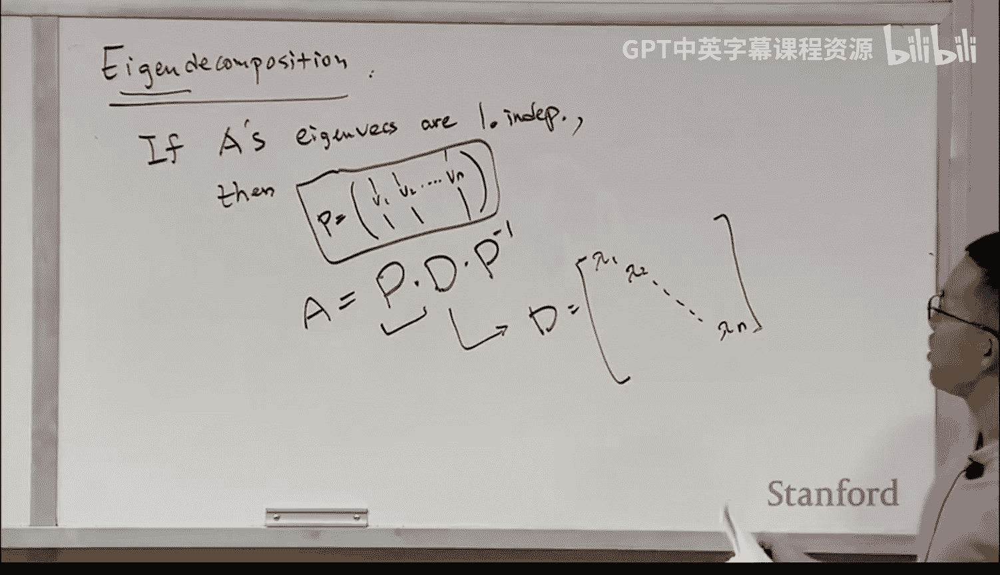

#  021：线性代数复习


在本节课中，我们将一起回顾线性代数的基础知识，这些知识对于理解后续课程内容至关重要。我们将从向量和矩阵的基本操作开始，逐步深入到特征值与特征分解等核心概念。

## 向量与向量运算

首先，我们介绍一些关于列向量和行向量的基本定义。

列向量 `v` 包含若干元素，这些元素构成一列。其形状为 `n × 1`，表示它有 `n` 行和 `1` 列。

行向量 `v` 可以写作 `[v1, v2, ..., vn]`。其形状为 `1 × n`，表示它有 `1` 行和 `n` 列。

接下来，我们讨论点积运算。

假设有两个列向量 `u` 和 `v`，它们的点积 `u · v` 是一个标量（数字），计算公式如下：

`u · v = u1*v1 + u2*v2 + ... + un*vn`

用求和符号表示为：

`u · v = Σ (i=1 to n) ui * vi`

点积的结果是一个数，而不是一个向量。

现在，我们来看向量的范数。

向量 `v` 的范数（通常指 L2 范数）定义为：

`||v|| = sqrt(v1² + v2² + ... + vn²)`

更一般地，LP 范数的通用公式为：

`||v||_p = ( Σ (i=1 to n) |vi|^p )^(1/p)`

当 `p=2` 时，即为 L2 范数。

最后，我们回顾三角不等式。

对于任意两个向量 `u` 和 `v`，三角不等式成立：

`||u + v|| ≤ ||u|| + ||v||`

以及：

`||u - v|| ≥ | ||u|| - ||v|| |`

## 矩阵运算

上一节我们介绍了向量运算，本节中我们来看看矩阵的基本运算。

首先是矩阵加法。进行矩阵加法时，两个矩阵必须具有相同的形状。结果矩阵的每个元素是对应位置元素的和。

例如：
```
[1 2]   +   [5 6]   =   [6 8]
[3 4]       [7 8]       [10 12]
```

接下来是矩阵乘法。进行矩阵乘法时，第一个矩阵的列数必须等于第二个矩阵的行数。如果矩阵 `A` 的形状是 `m × n`，矩阵 `B` 的形状是 `n × p`，那么结果矩阵 `C = A * B` 的形状是 `m × p`。

结果矩阵 `C` 中第 `i` 行第 `j` 列的元素 `C_ij` 的计算公式为：

`C_ij = Σ (k=1 to n) A_ik * B_kj`

例如，计算 `[1 2; 3 4] * [5 6; 7 8]`：
- `C_11 = 1*5 + 2*7 = 19`
- `C_12 = 1*6 + 2*8 = 22`
- `C_21 = 3*5 + 4*7 = 43`
- `C_22 = 3*6 + 4*8 = 50`

矩阵乘法满足结合律和分配律：
- 结合律：`(A * B) * C = A * (B * C)`
- 分配律：`A * (B + C) = A*B + A*C`

但需要注意的是，矩阵乘法**不满足交换律**，即 `A * B` 通常不等于 `B * A`。

现在，我们讨论矩阵的转置。

矩阵 `A` 的转置记作 `A^T`。其定义是：`(A^T)_ij = A_ji`。转置操作相当于将矩阵沿主对角线翻转。

例如：
```
A = [1 2]
    [3 4]
    [5 6]
A^T = [1 3 5]
      [2 4 6]
```

转置运算具有以下性质：
1. `(A^T)^T = A`
2. `(A * B)^T = B^T * A^T`
3. `(A + B)^T = A^T + B^T`

## 特殊矩阵与线性无关性

在了解了基本运算后，我们来看几种特殊的矩阵以及线性无关性的概念。

以下是几种重要的矩阵类型：
1.  **对角矩阵**：只有主对角线上的元素可能非零，其他位置均为零。其幂运算非常简便，`D^k` 的结果是将每个对角线元素分别求 `k` 次幂。
2.  **三角矩阵**：
    *   下三角矩阵：主对角线以上的元素全为零。
    *   上三角矩阵：主对角线以下的元素全为零。
3.  **对称矩阵**：首先必须是方阵（行数等于列数），并且满足 `A^T = A`。
4.  **正交矩阵**：满足 `U^T * U = U * U^T = I`，即其逆矩阵等于其转置矩阵 `U^{-1} = U^T`。正交矩阵的列向量是一组标准正交基。

接下来，我们讨论线性组合、线性无关、张成空间和基的概念。

一组向量 `{v1, v2, ..., vn}` 的**线性组合**是指形如 `α1*v1 + α2*v2 + ... + αn*vn` 的向量，其中 `αi` 是系数。

如果方程 `α1*v1 + α2*v2 + ... + αn*vn = 0` 的唯一解是所有系数 `αi` 都为零，则称这组向量**线性无关**。

一组向量的**张成空间**是指所有能表示为该组向量线性组合的向量构成的集合。

一个向量空间 `S` 的**基**是一组线性无关的向量，并且这组向量的张成空间就是 `S`。空间的**维数**等于其基中向量的个数。基不唯一，但维数是确定的。

## 特征值与特征向量

本节我们将进入线性代数中一个核心且重要的部分：特征值与特征向量。

对于方阵 `A`，如果存在一个标量 `λ` 和一个非零向量 `x`，满足以下方程：

`A * x = λ * x`

那么，`λ` 称为矩阵 `A` 的一个**特征值**，`x` 称为对应于特征值 `λ` 的**特征向量**。注意，零向量不被视为特征向量。

为了求解特征值和特征向量，我们将方程改写为：

`(A - λI) * x = 0`

其中 `I` 是单位矩阵。为了得到非零解 `x`，矩阵 `(A - λI)` 必须不可逆（即不满秩），这等价于其行列式为零：

`det(A - λI) = 0`

这个方程称为特征方程。解此方程可以得到所有可能的特征值 `λ`。对于每一个求得的特征值 `λ`，将其代回方程 `(A - λI) * x = 0`，求解得到的非零向量 `x` 就是对应的特征向量。

特征值和特征向量具有以下重要性质：
1.  特征向量可以被任意非零标量缩放，通常我们将其规范化为单位长度。
2.  对于实对称矩阵，其特征值都是实数。
3.  三角矩阵的特征值就是其主对角线上的元素。
4.  矩阵的迹（主对角线元素之和）等于其特征值之和。
5.  矩阵的行列式等于其特征值的乘积。

## 特征分解

最后，我们介绍基于特征值和特征向量的矩阵分解——特征分解。

如果一个 `n × n` 方阵 `A` 有 `n` 个线性无关的特征向量 `v1, v2, ..., vn`，对应的特征值为 `λ1, λ2, ..., λn`，那么矩阵 `A` 可以进行如下分解：

`A = P * D * P^{-1}`

其中：
*   `P` 是以特征向量为列构成的矩阵：`P = [v1, v2, ..., vn]`
*   `D` 是以特征值为对角线元素构成的对角矩阵：`D = diag(λ1, λ2, ..., λn)`

特征分解非常有用，特别是在计算矩阵的高次幂时：

`A^k = (P * D * P^{-1})^k = P * D^k * P^{-1}`



由于 `D` 是对角矩阵，`D^k` 的计算非常简单，只需将对角线元素分别求 `k` 次幂即可，这大大简化了计算。

## 总结

本节课中我们一起学习了线性代数的核心基础知识。我们从向量和矩阵的基本定义与运算开始，逐步深入到特殊矩阵、线性无关性、张成空间和基等概念。最后，我们重点讲解了特征值、特征向量的求解及其性质，并介绍了强大的工具——特征分解。掌握这些内容将为理解后续课程中更复杂的算法和数据处理技术打下坚实的基础。