#  023： Spark 快速入门教程

在本节课中，我们将要学习 Spark 的基础知识。Spark 是一个用于大规模数据处理的强大框架，相较于早期的 MapReduce，它提供了更灵活、更高效的编程模型。我们将从如何启动 Spark 开始，逐步介绍其核心概念——弹性分布式数据集（RDD），并学习其基本操作。课程内容力求简单直白，让初学者能够快速上手。

## P23-1：Spark 入门与部署模式

首先，如果你还没有安装 Spark，请下载 Spark 2.2.1 for Hadoop 版本。

Spark 有三种主要的部署模式：

*   **本地模式**：在单个 JVM 中运行的单节点实例，通常用于在个人电脑上进行开发和测试。
*   **独立集群模式**：在一组专用节点上设置 Spark 集群，所有计算都在这些 Spark 节点上进行。
*   **托管集群模式**：通过资源管理器（如 YARN）来管理集群资源。当你提交 Spark 任务时，资源管理器会为你动态分配资源并启动一个 Spark 集群，任务结束后再回收资源。这种模式可以实现资源的高效共享，尤其适合同时运行 Spark 和 MapReduce 等不同框架的环境。

部署模式的选择也影响了数据的存储位置。在本地模式下，数据通常存储在本地磁盘。在分布式集群模式下，你需要一个分布式存储解决方案（如 HDFS 或 S3）来存储数据，以便所有节点都能访问，否则无法进行有效的分布式计算。

## P23-2：理解 RDD（弹性分布式数据集）

上一节我们介绍了 Spark 的部署模式，本节中我们来看看 Spark 的核心抽象——RDD。RDD 是 Spark 的基本构建块，它是一个不可变的、可分区的数据集合。

RDD 有几个关键特性：

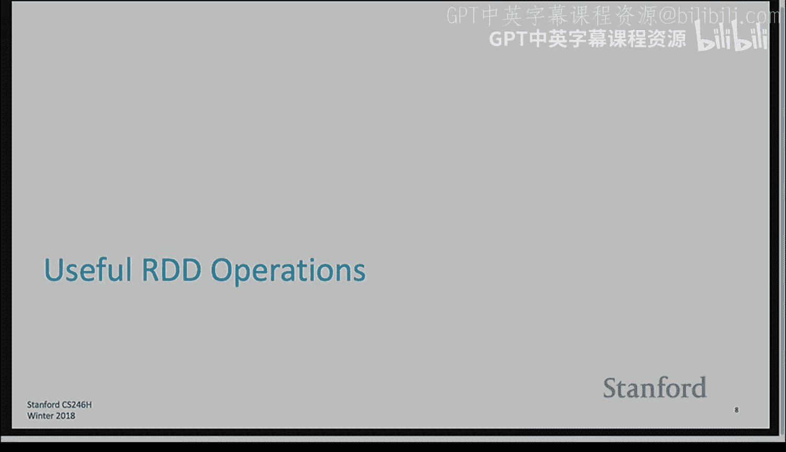

*   **不可变性**：一旦创建，RDD 的内容就不能被修改。任何转换操作都会生成一个新的 RDD，这个新 RDD 记录了从父 RDD 到当前状态的“差异”，从而形成一个 RDD 的血缘关系图。
*   **惰性计算**：RDD 的转换操作（如 `map`、`filter`）是惰性的。它们只是定义了计算逻辑，并不会立即执行。只有当遇到一个**行动**操作（如 `collect`、`count`）需要输出结果时，Spark 才会根据血缘关系图触发实际的计算。
*   **容错性**：得益于血缘关系图，如果某个 RDD 的分区数据丢失，Spark 可以追溯到源头数据并重新计算，从而实现容错。
*   **缓存**：Spark 会乐观地缓存中间计算结果。如果内存不足，它会使用 LRU（最近最少使用）策略将数据移出缓存。你也可以手动指定某些 RDD 持久化到内存或磁盘。

RDD 主要有三种类型：

*   **普通 RDD**：Spark 对其内容一无所知，操作相对有限。
*   **数值型 RDD**：当 RDD 只包含数字时，Spark 能识别并允许你进行如 `mean`、`sum` 等统计操作。
*   **键值对 RDD**：当 RDD 的元素都是二元组时，它被视为键值对 RDD。Spark 假设第一个元素是键，第二个元素是值，并允许你进行 `reduceByKey`、`groupByKey`、`join` 等基于键的操作。

## P23-3：RDD 的操作：行动与转换

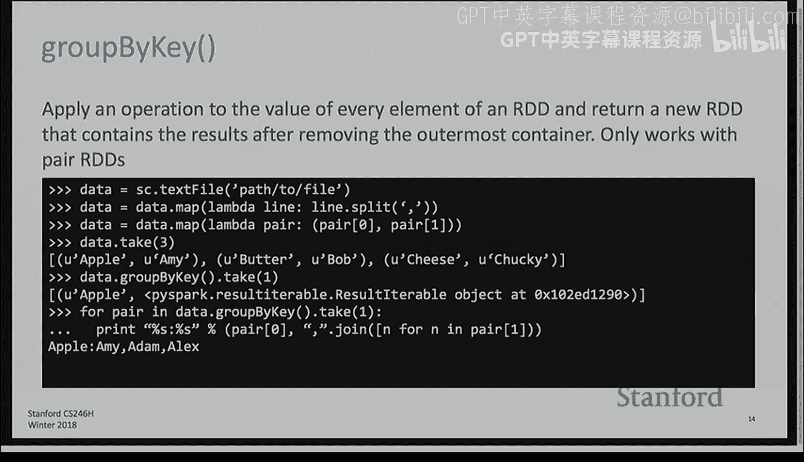

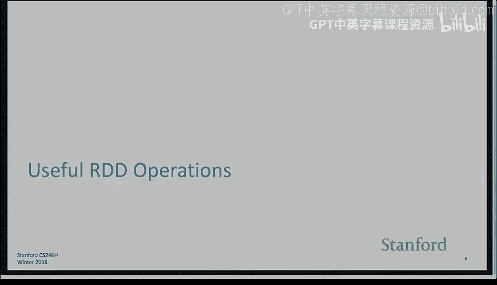

理解了 RDD 的基本概念后，本节我们来看看能对 RDD 执行的两类操作：**行动**和**转换**。

**行动**操作会触发实际计算，并返回一个非 RDD 的结果（如值、数组或直接将数据写入存储系统）。以下是几个常用的行动操作：

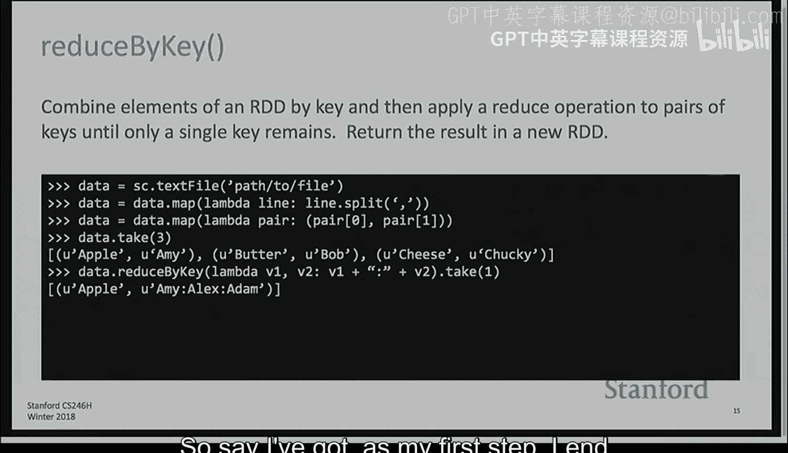

*   `take(n)`：返回 RDD 中的前 n 个元素组成的数组。这是一个很好的调试工具，用于检查中间结果。
*   `collect()`：返回 RDD 中的所有元素。**注意**：如果数据量巨大，此操作可能导致驱动程序内存溢出。
*   `count()`：返回 RDD 中元素的个数。
*   `saveAsTextFile(path)`：将 RDD 的内容保存为文本文件。路径可以指向本地文件系统、HDFS 或 S3。
*   `foreach(func)`：对 RDD 中的每个元素应用函数 `func`，通常用于产生副作用（如打印）。

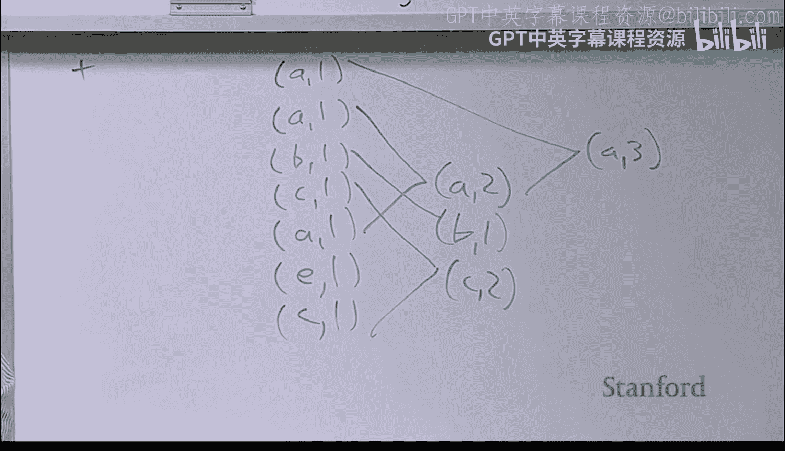

**转换**操作会从一个已有的 RDD 创建一个新的 RDD，但不会立即计算。以下是核心的转换操作：

*   `map(func)`：将 RDD 中的每个元素通过函数 `func` 进行转换。例如，将文本行分割成单词数组。
    ```python
    # 假设 data 是一个包含 “Apple,Amy” 等字符串的 RDD
    mapped_data = data.map(lambda line: line.split(','))
    # 结果：每个元素变成一个数组，如 [‘Apple‘, ‘Amy‘]
    ```
*   `flatMap(func)`：与 `map` 类似，但要求 `func` 返回一个序列（如列表），然后“压平”这个序列，将其中所有元素合并成一个新的 RDD。
    ```python
    flat_mapped_data = data.flatMap(lambda line: line.split(','))
    # 结果：一个包含所有单词的 RDD，如 ‘Apple‘, ‘Amy‘, ‘Bob‘, ‘Bob‘...
    ```
*   `filter(func)`：返回一个由通过函数 `func` 筛选的元素组成的新 RDD。
    ```python
    filtered_data = data.filter(lambda line: line.startswith(('A','E','I','O','U')))
    # 结果：只保留以元音字母开头的行
    ```
*   `mapValues(func)`：仅适用于键值对 RDD。它对每个键值对中的**值**应用函数 `func`，而不改变键。
*   `groupByKey()`：将键值对 RDD 中具有相同键的值分组。这是一个**宽依赖**操作，会引起数据洗牌。
    ```python
    # 假设 pair_rdd 为 [(‘Apple‘, ‘Amy‘), (‘Apple‘, ‘Alex‘), (‘Banana‘, ‘Bob‘)]
    grouped = pair_rdd.groupByKey()
    # 结果：[(‘Apple‘, <iterable of [‘Amy‘, ‘Alex‘]>), (‘Banana‘, <iterable of [‘Bob‘]>)]
    ```
*   `reduceByKey(func)`：使用函数 `func` 合并具有相同键的值。`func` 必须是**结合律**和**交换律**的（如加法）。它比 `groupByKey` 更高效，因为会在洗牌前先在本地进行合并。
    ```python
    # 假设 word_pairs 为 [(‘a‘, 1), (‘b‘, 1), (‘a‘, 1)]
    reduced = word_pairs.reduceByKey(lambda x, y: x + y)
    # 结果：[(‘a‘, 2), (‘b‘, 1)]
    ```
*   `sortBy(func)` / `sortByKey()`：根据给定的键或函数对 RDD 进行排序。
*   `subtract(otherRDD)`：返回一个包含在第一个 RDD 中但不在第二个 RDD 中的元素的新 RDD（集合差集）。
*   `join(otherRDD)`：对两个键值对 RDD 进行内连接，返回键在两个 RDD 中都存在的键值对。还有 `leftOuterJoin`、`rightOuterJoin` 和 `fullOuterJoin`。

## P23-4：编程语言选择与实战演示

上一节我们介绍了 RDD 的各种操作，本节我们来看看在实际编程中如何选择语言，并通过一个简单的例子来演示。

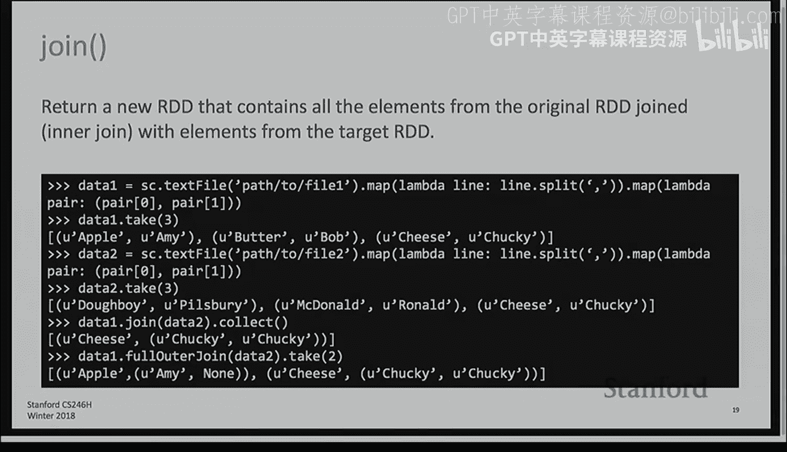

Spark 支持多种编程语言，主要包括 Python、Scala 和 Java。

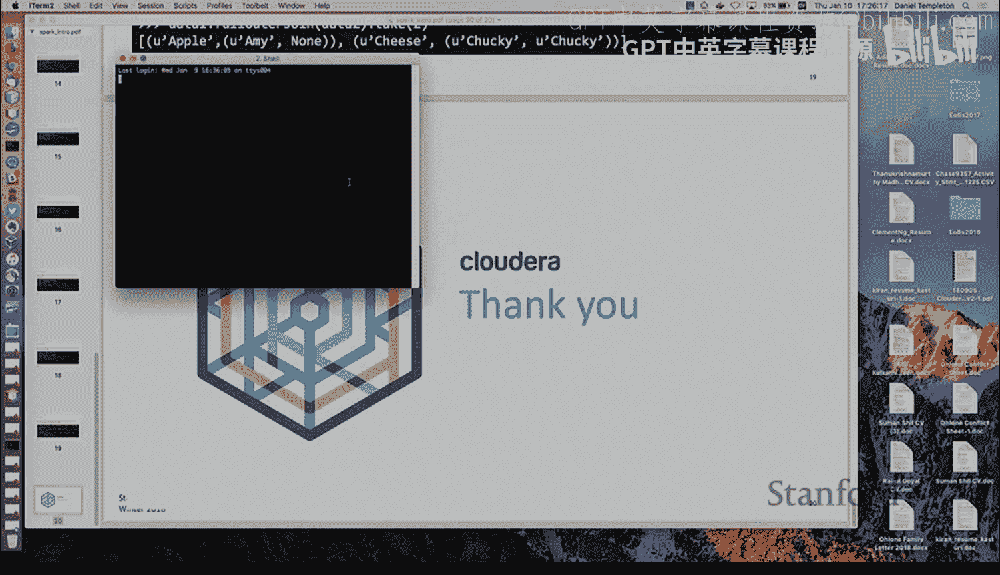

*   **Python**：通过 PySpark 使用。语法简洁，易于上手，交互式编程体验好，是大多数初学者的首选。缺点是它不是 Spark 的原生语言（Spark 用 Scala 编写），某些高级功能可能支持不全或有细微差异。
*   **Scala**：Spark 的原生语言，性能最佳，API 最完整。语法非常简洁（有时甚至令人困惑），但类型系统强大，能在编译期捕获更多错误。学习曲线较陡。
*   **Java**：API 可用，但由于 Java 缺乏元组等原生支持，代码会显得非常冗长，需要处理复杂的泛型类型声明，开发体验较差。

**实战演示：使用 Python 进行单词计数**

让我们在 PySpark 交互式环境中快速实现一个单词计数的核心部分：

```python
# 1. 启动 PySpark 后，首先加载一个文本文件（这里使用本地 /etc/hosts 示例）
hosts_rdd = sc.textFile(“/etc/hosts“)

# 2. 使用 flatMap 将每一行分割成单词，并压平
words_rdd = hosts_rdd.flatMap(lambda line: line.split())

# 3. 将每个单词映射成 (word, 1) 的键值对形式
word_pairs_rdd = words_rdd.map(lambda word: (word, 1))

# 4. 使用 reduceByKey 对相同单词的计数进行累加
word_counts_rdd = word_pairs_rdd.reduceByKey(lambda x, y: x + y)

# 5. 触发计算并查看部分结果
print(word_counts_rdd.take(10))
```

**Scala 的简洁性与陷阱**

在 Scala 中，同样的 `reduceByKey` 操作可以写得极其简洁：
```scala
val reduced = wordPairs.reduceByKey(_ + _)
```
这里的 `_ + _` 是 Scala 的语法糖，第一个 `_` 代表第一个参数，第二个 `_` 代表第二个参数。

但 Scala 也有其独特之处，例如访问元组的元素：
```scala
val firstElem = myTuple._1 // 获取元组的第一个元素（注意是 1-based 索引）
```

**关于项目构建**

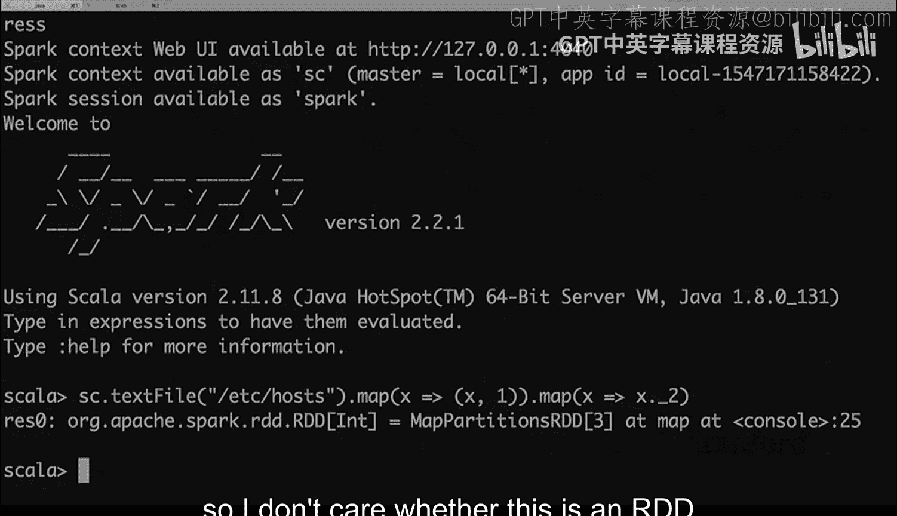

如果你使用 Scala 或 Java 编写独立的 Spark 应用（而非在 REPL 中），你需要使用 **Maven** 或 **SBT** 这样的构建工具来管理依赖和打包。Maven 的配置文件是 `pom.xml`，它定义了项目结构、依赖库等。虽然功能强大，但其配置和错误排查对新手可能有一定挑战。Python 项目则通常不需要复杂的构建步骤。

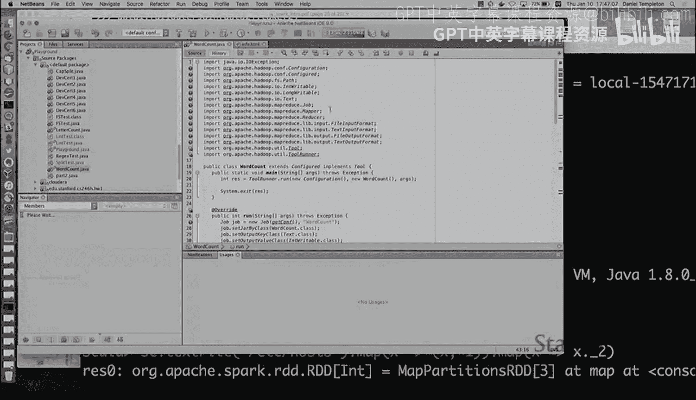

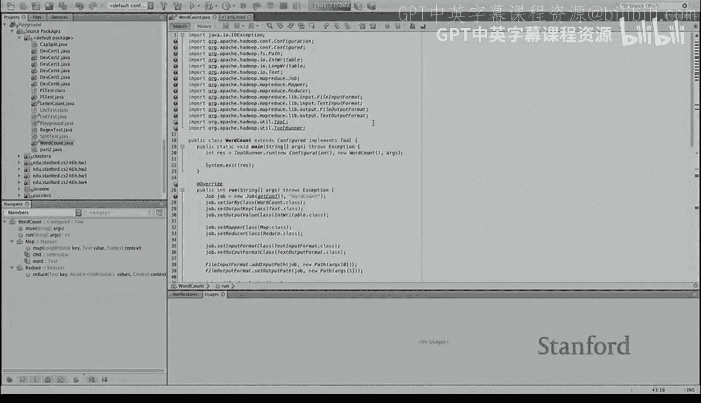

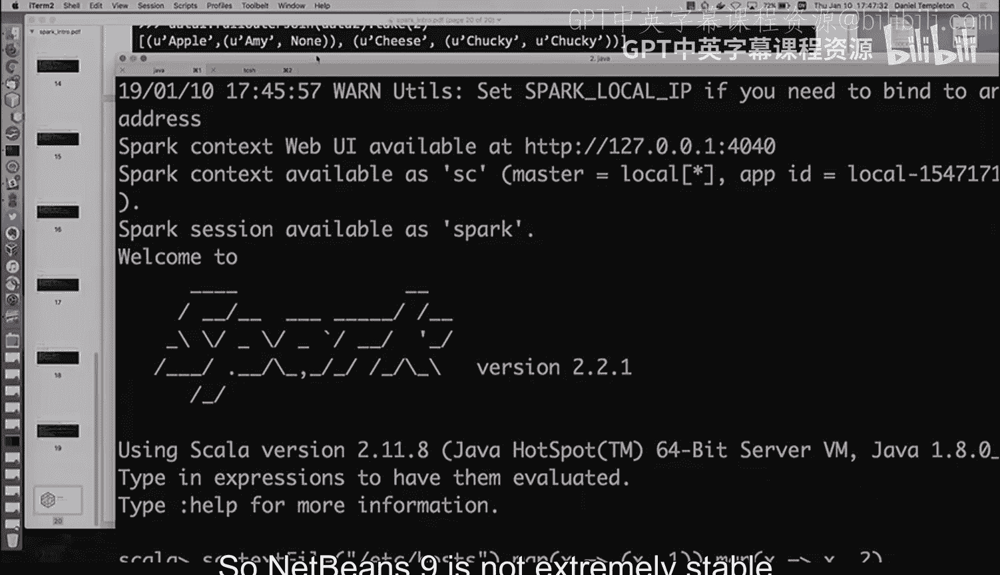

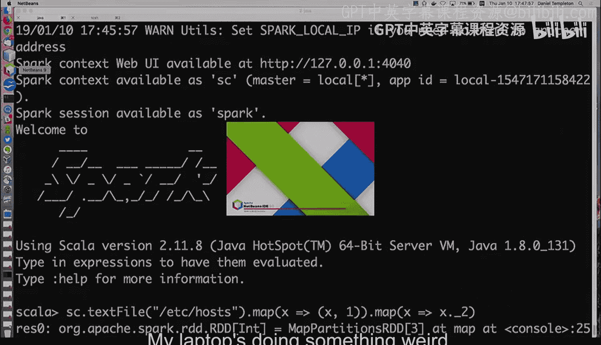

## P23-5：总结与建议

本节课中我们一起学习了 Spark 的快速入门知识。

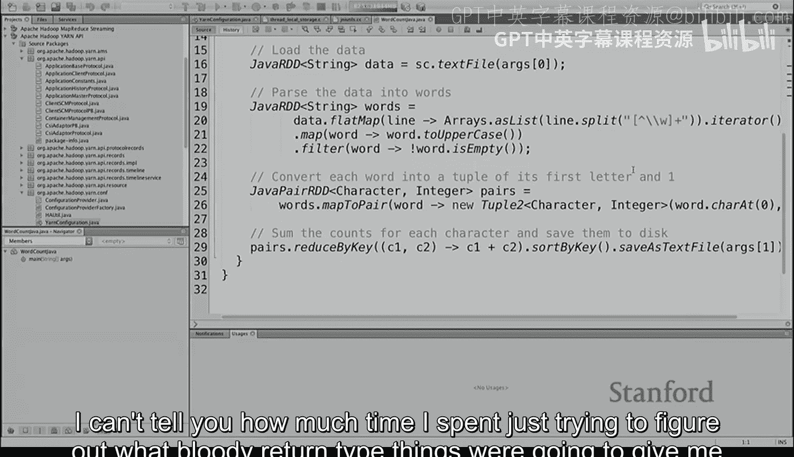

我们首先了解了 Spark 的三种部署模式：本地、独立集群和托管集群，以及它们对数据存储的影响。接着，我们深入探讨了 Spark 的核心——弹性分布式数据集（RDD），理解了其不可变性、惰性计算和容错性等关键特性。然后，我们系统学习了 RDD 的两类操作：触发计算的**行动**（如 `collect`, `count`）和生成新 RDD 的**转换**（如 `map`, `filter`, `reduceByKey`, `join`），并通过一个简单的单词计数例子进行了演示。最后，我们比较了 Python、Scala 和 Java 三种编程语言在 Spark 开发中的优缺点。

对于 CS246 课程的学习，我们给出以下简明建议：
1.  **首选 Python**：语法简单，易于调试，能让你更专注于算法和数据处理逻辑本身。
2.  **理解惰性计算**：牢记转换操作是“懒”的，直到行动操作才会执行。利用 `take(n)` 进行阶段性调试。
3.  **区分宽窄依赖**：了解像 `groupByKey`、`join` 这类会引起数据洗牌的宽依赖操作，它们代价较高。
4.  **谨慎使用 `collect()`**：确保数据量小到能放进驱动程序内存时再使用。

希望这篇教程能帮助你顺利开始使用 Spark 进行海量数据挖掘。