# 2：GPT模型的发展与Transformer的应用 🚀


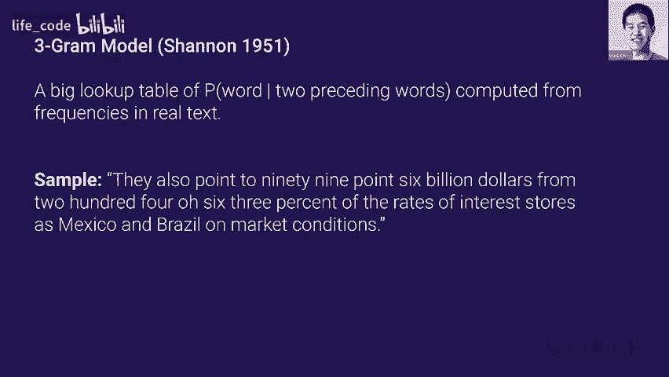

在本节课中，我们将学习Transformer架构在语言模型中的发展历程，特别是GPT系列模型。我们将从早期的语言模型开始，逐步了解GPT-1、GPT-2、GPT-3以及它们在无监督学习、多模态处理和代码生成方面的应用。课程将解释核心概念，并通过公式和代码示例帮助初学者理解。

---

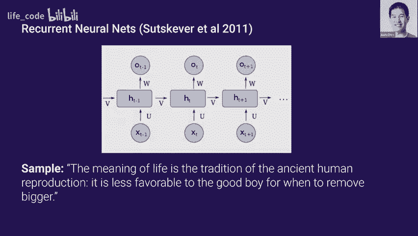

## 语言模型的早期发展 📜

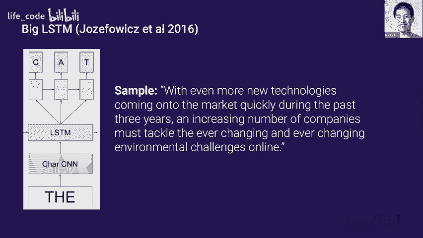

上一节我们介绍了课程概述，本节中我们来看看语言模型的早期发展。

早期的语言模型基于n-gram统计方法。这类模型通过查找表来预测下一个词，但生成的句子往往不连贯。

**公式示例**：一个简单的bigram模型计算下一个词 `w_t` 的概率为：
`P(w_t | w_{t-1}) = count(w_{t-1}, w_t) / count(w_{t-1})`

生成的样本类似这样：“从$2004063%的 99.6 亿”。这些词虽然来自同一领域，但句子缺乏连贯性。

---

## 深度学习与递归神经网络 🤖

随着深度学习的兴起，基于神经网络的语言模型开始出现，特别是递归神经网络（RNN）。RNN通过内部状态记忆信息，避免了巨大的查找表。

**代码示例**：一个简单的RNN单元更新其隐藏状态 `h_t` 的公式为：
`h_t = tanh(W_{hh} * h_{t-1} + W_{xh} * x_t)`

使用RNN生成的样本为：“生活的意义是古代人类繁殖的传统对好男孩的影响较小，因此移除图形的时机不佳”。虽然句子仍然缺乏明确意义，但开始具备真实句子的流畅感。

---

## LSTM模型的改进 🔄

LSTM（长短期记忆网络）是RNN的一种架构创新，具有更好的梯度流，能更有效地建模长期依赖关系。

通过LSTM模型生成的样本为：“在过去三年中，市场上迅速出现了更多新技术，以及越来越多的公司必须应对不断变化的在线环境或挑战”。句子开始变得有意义，尽管存在如“不断变化”这类短语重复的伪影。

---

## Transformer与自回归语言模型 ⚡

从2018年开始，基于自回归的Transformer语言模型出现，它们在建模长期依赖关系方面表现更佳。

以下是模型根据提示“这段文字在堪萨斯州摇摆”生成的完成示例。完成内容在多个句子中保持连贯，尽管存在如“无论费用如何”的拼写错误。

---

## GPT-2：大规模Transformer模型 💪

GPT-2是一个拥有15亿参数的Transformer模型。它能根据虚构的提示生成连贯、多段落的内容。

例如，对于提示“寻找独角兽和南美的科学家”，模型创造了虚构的“佩雷斯博士”角色，并使其在多个段落中保持一致。值得注意的是，这是从10个生成样本中挑选出的最佳结果，表明生成过程仍需要多次采样以获得高质量输出。

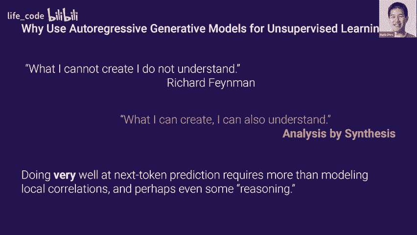

---

## GPT-3：性能的飞跃 🦾

GPT-3拥有1750亿参数，其生成文本的连贯性和质量显著提升。从GPT-2的多个样本中挑选的最佳结果，大致相当于GPT-3的首次生成结果。

以下是GPT-3生成的小说风格文本示例：“血液透过她的外套，深红色的花朵在她的胸口绽放”。其隐喻和比喻非常富有诗意，表明模型能理解并模仿特定文体风格。

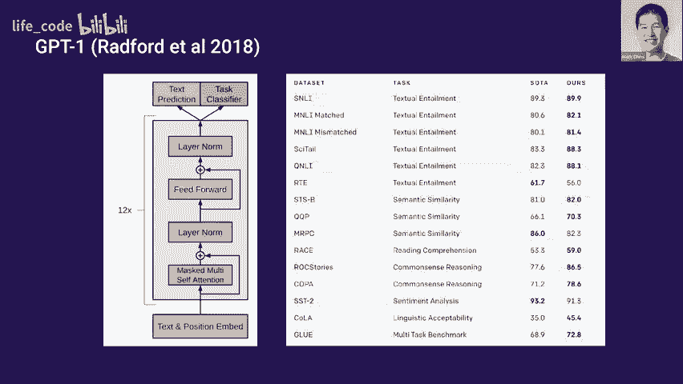

关于模型规模的研究表明，性能提升符合神经网络规模法则。最初的性能提升（如1%）与最后的提升效果不同，后期的提升能更有效地挤出准确性。

---

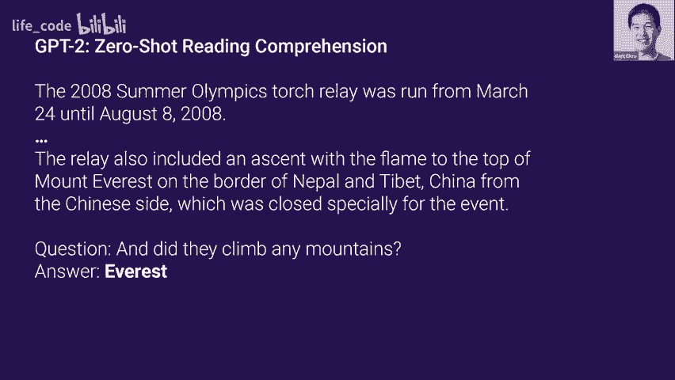

## 真实性与检测挑战 🕵️

随着生成文本越来越真实，一个自然的问题是：人类能否区分真实与生成的文本？

在一项针对新闻文章的测试中，随着GPT-3参数量的增加，人类区分其生成文章与真实文章的能力下降至随机水平。这表明模型生成的文本已高度逼真。

生成新闻文章的一种可能方法是：提供几篇新闻文章作为引导，设置分隔符，然后让模型从那里开始生成。

---

## 为何关注语言建模？🎯

我们为何关心语言建模？它似乎只是一个生成文本的狭窄能力。实际上，语言建模是解决**无监督学习**问题的关键工具。

监督学习（如图像分类）需要大量标注数据，而这在语言任务中往往稀缺且昂贵。无监督学习则试图从海量未标记数据（如互联网文本）中学习通用特征，以适配各种下游任务。

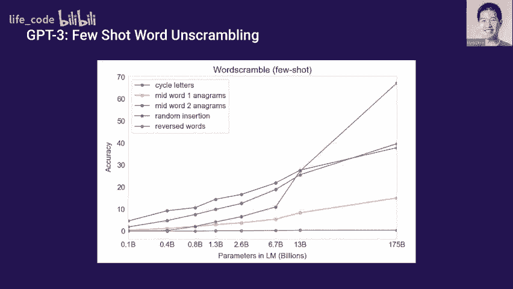

语言是尝试无监督学习的理想领域，因为存在大量未标记数据。

---

## 为何使用自回归生成模型？🧠

选择自回归生成模型基于一个直观论点：**“我无法创造的，我不理解。”**（理查德·费曼）。反之，能够生成多样且连贯的样本，意味着模型建立了有助于语言理解的表征。

自回归模型通过预测下一个词进行训练。虽然这是一个局部目标，但要出色完成（例如，预测推理小说的结局），模型需要对整个故事的上下文和逻辑有深刻理解。

---

## OpenAI的早期探索：从情感分析到GPT-1 🔍

OpenAI的首次探索是训练一个LSTM模型来预测亚马逊评论中的下一个字符。尽管没有使用任何情感标签，但模型隐藏层中的某些神经元激活与评论情感（正面/负面）高度相关。

在此基础上训练的线性分类器能有效预测情感。这表明，仅通过预测下一个字符，模型就能学习到有用的语义特征。

GPT-1将这种方法推广到互联网文本的预训练，并在多种下游任务（如文本蕴含、相似性分析）上通过**微调**取得了良好效果。微调过程非常轻量，通常只需为特定任务添加一个新的分类头。

---

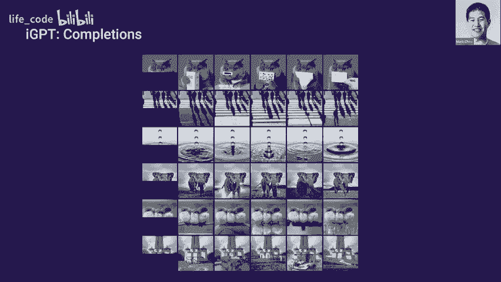

## GPT-2：零样本任务处理 🌐

GPT-2的核心洞察是：许多下游任务可以自然地表述为语言模型任务，从而实现**零样本**学习。

以下是任务表述示例：

*   **阅读理解**：将段落和问题拼接为：“问题：[问题文本] 回答：”，让模型完成。
*   **文本摘要**：在文章段落后添加“TLDR:”，让模型生成摘要。
*   **机器翻译**：设置提示为：“将法语翻译成英语：[法语句子] 英语：”

随着模型参数规模的增加，这种零样本能力逐渐显现并增强。规模是性能提升的关键因素。

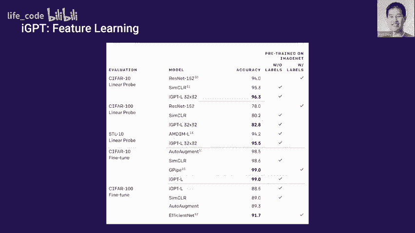

---

## GPT-3：元学习与上下文学习 🧩

GPT-3的主要洞察是将训练过程视为**元学习**。模型在训练中发展了根据提示快速识别并适应新任务的能力。

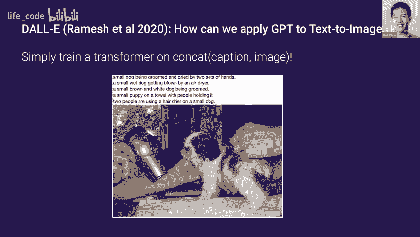

在推理时，通过提供少量示例（**少样本学习**），模型能内化任务模式。例如，在算术任务中，提供几个“题目-答案”对，然后让模型解决新题目。

**示例提示**：
```
3 + 4 = 7
5 + 1 = 6
31 + 41 =
```

研究表明，在数十个任务上，模型的零样本、单样本和少样本性能都随规模平滑提升，且少样本与零样本之间的性能差距也随规模扩大而改善。

---

## Transformer的普适性：超越语言 🌈

Transformer是序列模型，可处理任何字节序列。这引发了一个问题：它能否用于建模图像、音频等其他模态？

答案是肯定的，即使在图像这种已有强大归纳偏置（卷积）的领域。

---

## 图像GPT：像素预测 🖼️

将GPT应用于图像，只需将目标改为**预测下一个像素**。图像被展开为像素序列进行训练。

这个称为“图像GPT”的模型，在给定图像上半部分时，能生成多样且合理的下半部分。例如，给定一只鸟的上半身，模型可能将其置于不同的背景中。

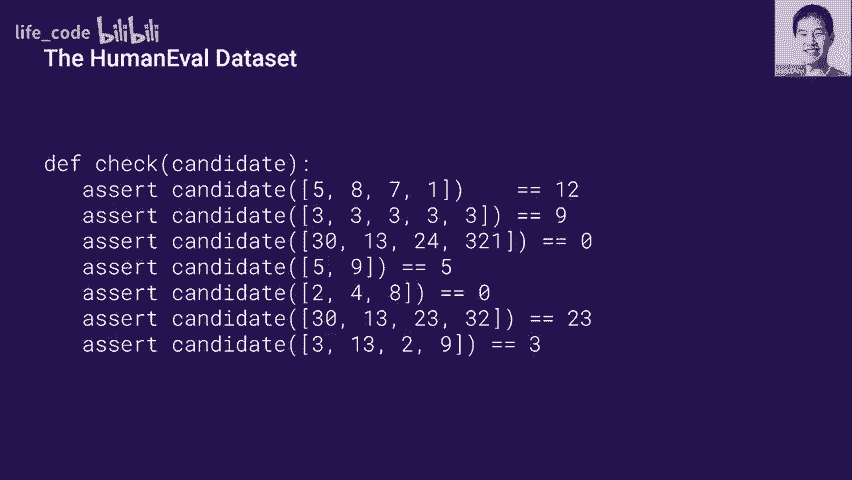

更重要的是，在低数据 regime（如SVHN数据集）中，使用该模型特征训练的线性分类器，其性能优于使用在ImageNet上有监督预训练的ResNet特征。这表明纯序列建模方法即使没有2D归纳偏置也能学习到有效表征。

---

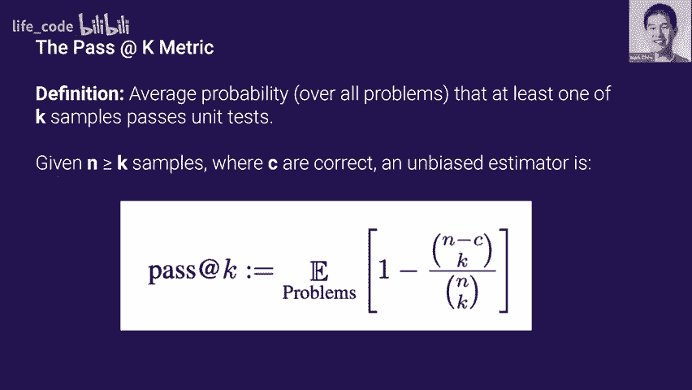

## DALL·E：多模态生成 🎨

DALL·E探索了将文本和图像两种模态同时输入Transformer模型。模型学习根据文本描述生成图像。

除了文本到图像的生成，DALL·E还能进行**零样本图像变换**，例如：
*   **风格转换**：输入一张猫的照片和“素描”描述，模型能将照片下半部分渲染为素描风格。
*   **语义编辑**：输入一张猫的照片和“给猫戴上太阳镜”的描述，模型能进行相应编辑。

这些能力并非通过专门训练获得，而是模型从海量图文配对数据中学习到的。

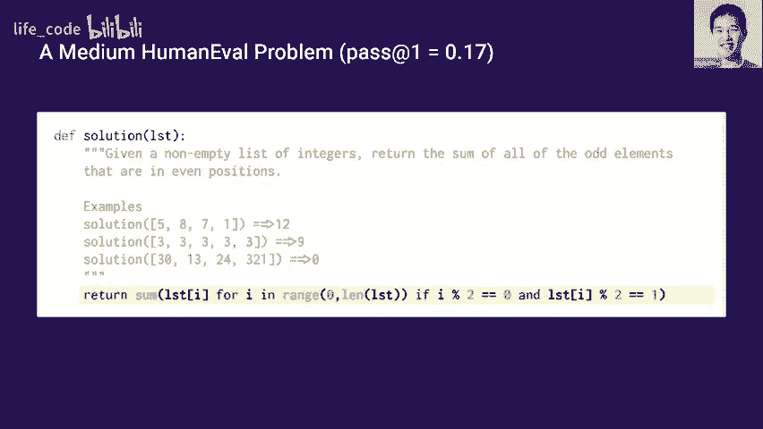

---

## Codex：代码生成模型 💻

为什么要专门训练代码生成模型？
1.  GPT-3已具备初步代码生成能力，专门训练有望获得更大提升。
2.  代码有明确的正确性标准（通过单元测试），评估更客观。
3.  存在大量公开的代码数据。

我们创建了包含164个编程问题的人类评估数据集，每个问题包含函数签名、文档字符串和单元测试。

评估指标是**pass@k**：生成k个样本，计算至少有一个样本通过所有单元测试的问题比例。

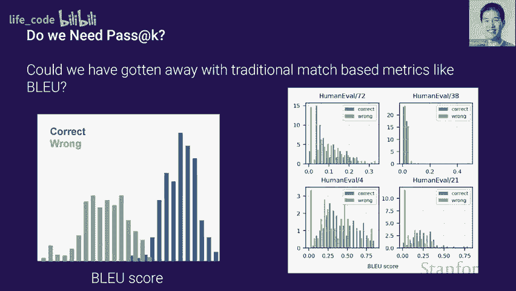

---

## Codex的训练与评估 ⚙️

Codex通过在约160GB的GitHub代码上微调GPT-3得到。为了提高训练效率，引入了额外的标记来压缩代码中常见的连续空格。

在评估中，简单的任务（如列表元素加一）通过率很高（90%），而复杂任务（如特定解码函数）通过率较低（<1%）。

研究证实，传统的语言评估指标（如BLEU分数）与代码的功能正确性相关性很弱，凸显了新评估方法的必要性。

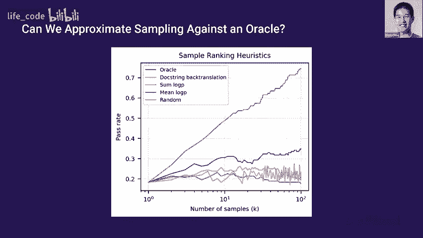

---

## 采样的力量与模型局限 🎲

一个关键发现是：**采样是一种异常有效的提升方式**。通过从模型中生成大量样本（如100个），并从中选择，可以将任务通过率从不足30%大幅提升至70%以上。这表明模型能生成多种功能不同的解决方案。

在没有单元测试的情况下，按生成概率对样本进行排序是一种有效的启发式方法。

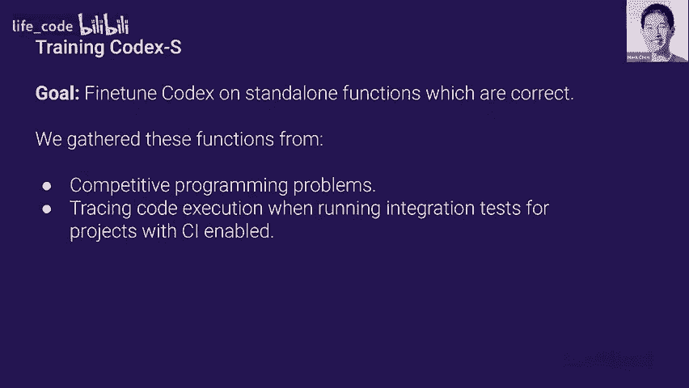

Codex也存在局限，例如在处理长距离变量依赖和复杂操作组合时仍有困难。

通过在有正确解的竞争编程和持续集成数据上进一步微调（得到Codex-S），模型性能可以得到进一步提升。

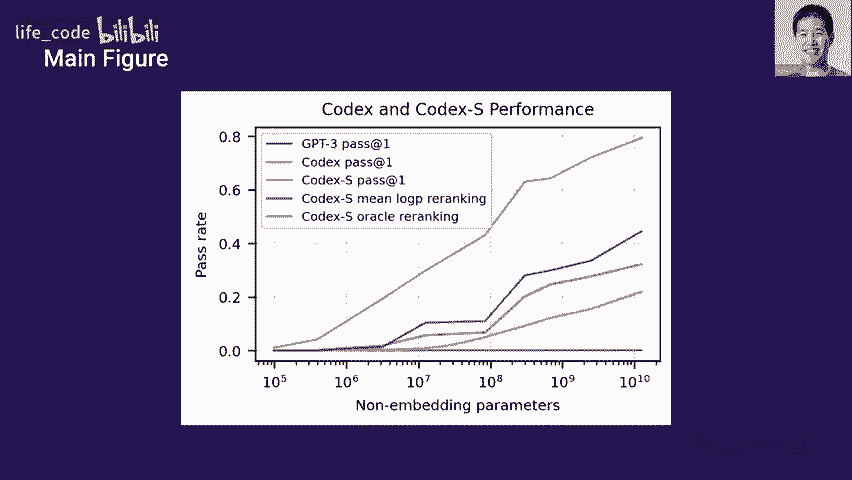

---

## 总结与要点 ✅

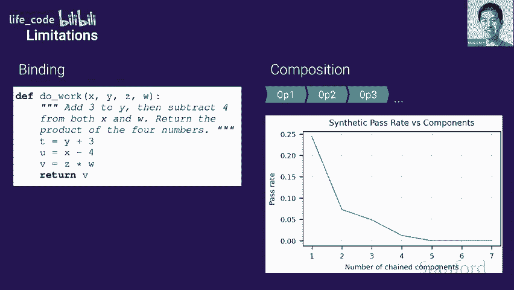

本节课我们一起学习了以下核心内容：

1.  **神经语言建模进展迅速**：从n-gram、RNN/LSTM发展到Transformer，生成文本的连贯性和质量实现了巨大飞跃。
2.  **推动无监督学习**：GPT系列的核心目标是通过语言建模推动无监督学习，利用海量未标记数据学习通用表征。
3.  **自回归建模具有普适性**：Transformer的自回归框架不仅能处理语言，在图像、多模态数据上也表现出强大能力。
4.  **强大的代码生成模型**：通过微调GPT得到的Codex模型，在代码生成任务上表现优异，并且**采样**是提升其性能的有效策略。

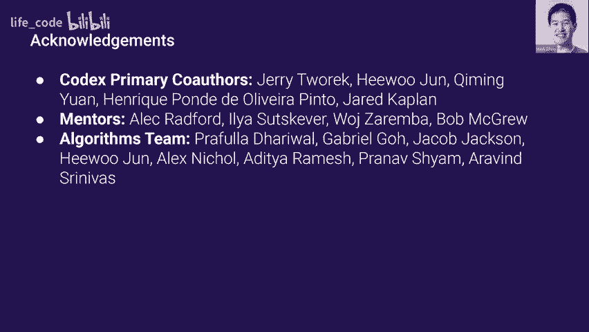


通过本节课，你应该对GPT模型的发展脉络、Transformer架构的灵活性以及它们在语言、图像和代码领域的应用有了基本的了解。