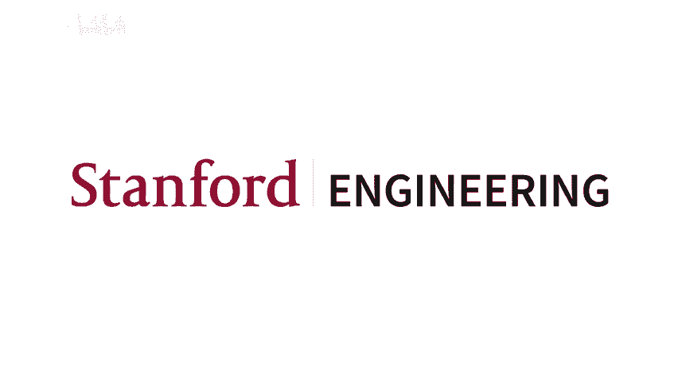
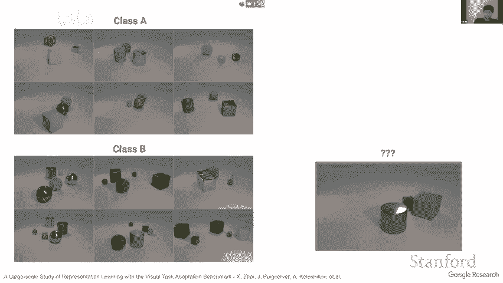

# 3：视觉中的变换器 🧠




在本节课中，我们将要学习视觉变换器。这是一种将原本用于处理文本的变换器模型，应用到计算机视觉任务中的方法。我们将探讨其背后的动机、核心原理、实现方式以及它如何通过规模化训练超越传统的卷积神经网络。

***



## 背景与动机 🎯

上一节我们介绍了视觉变换器的概念。本节中，我们来看看为什么我们需要通用的视觉表示。

我和我的合作者的目标是找到一种通用的视觉表示。这意味着我们希望模型能够像人类一样，通过少量示例快速理解新事物并进行泛化。例如，人类在看到几朵不同种类的花后，就能识别出一种从未见过的新花。这种能力对于构建能够理解世界的智能系统至关重要。

一个理想的场景是，未来能有机器人帮助完成日常任务，而良好的通用视觉理解能力是其中的关键组成部分。

***

## 衡量进展：视觉任务适应基准 📊

为了衡量向“通用视觉表示”这一目标的进展，我们与合作伙伴创建了“视觉任务适应基准”。

这是一种对我们之前提到的“小游戏”的形式化。该基准包含一系列多样化的视觉任务，例如：
*   **自然图像分类**：如识别猫、狗。
*   **专业图像理解**：如分析卫星图像。
*   **非分类任务**：如计数、估算距离（可通过分类接口表达）。

参与者可以使用任何数据和模型进行预训练。然后，模型需要在每个新任务上，仅凭每个类别的几个示例（少量样本）进行适应（如微调），并表现出色。最终，我们计算所有任务的平均得分，以此评估模型的通用视觉表示能力。

***

## 核心概念：预训练与迁移 🔄

在深入变换器之前，我们需要明确两个核心概念：
1.  **预训练**：也称为上游训练。指在一个大型数据集上初步训练模型，使其学习通用的特征表示。
2.  **迁移**：也称为下游任务。指将预训练好的模型应用到新的、特定的任务上，通常只需少量数据和微调。

我们的工作流程是：先进行大规模**预训练**，然后通过简单的**微调**将其**迁移**到各种下游任务中。

***

## 规模化监督预训练的突破 💥

我们尝试了多种预训练方法，包括自监督和半监督学习。但一个关键的突破来自于纯粹的**规模化监督预训练**。

我们发现，要获得强大的通用视觉表示，需要两个关键要素：
1.  **海量数据**：使用远超ImageNet（300万张图像）规模的数据集进行训练。
2.  **大型模型**：同时扩大模型的参数量。
3.  **耐心**：训练需要非常长的时间，性能提升可能在训练后期才显现。

公式可以简单表示为：`性能提升 ∝ 数据规模 × 模型规模 × 训练时间`

当同时扩展数据和模型规模时，模型在下游任务上的迁移学习性能、以及对分布外数据的鲁棒性都获得了显著提升。这为尝试新架构（如变换器）奠定了基础，因为变换器在数据充足时往往表现更优。

***

## 视觉变换器的核心设计 🧩

在语言领域，变换器已取代LSTM成为主流。我们思考：既然视觉领域现在也有了海量数据，能否将变换器直接应用于图像？

视觉变换器的设计非常直观：
1.  **图像分块**：将输入图像分割成固定大小的不重叠图像块（例如16x16像素）。
2.  **线性投影**：将每个图像块展平，并通过一个可学习的线性层投影到一个嵌入向量中。这类似于NLP中将单词转换为词向量。
    ```python
    # 伪代码示意：将图像块投影为嵌入向量
    patch_embedding = Linear(flatten(patch))
    ```
3.  **添加位置信息**：为每个嵌入向量添加一个可学习的位置嵌入，因为模型本身没有空间位置的概念。
4.  **添加分类令牌**：在序列开头添加一个可学习的`[CLS]`令牌，其最终状态用于分类。
5.  **变换器编码器**：将得到的序列（图像块嵌入 + 位置嵌入 + `[CLS]`令牌）输入标准的变换器编码器进行处理。
6.  **分类头**：用`[CLS]`令牌对应的输出向量进行最终分类。

简而言之，**视觉变换器就是将图像视为一系列“视觉单词”（图像块）的序列，然后直接套用语言变换器的架构**。

***

## 视觉变换器 vs. 卷积神经网络 ⚖️

视觉变换器的性能与数据规模密切相关：
*   **数据量较少时**：视觉变换器的表现不如经典的ResNet等卷积神经网络。
*   **数据量巨大时**：视觉变换器开始展现出优势，其性能可以超越ResNet，并且缩放定律（scaling laws）表现更好，即随着模型和数据增大，性能提升的曲线更优。

这表明，**视觉变换器是面向未来的架构**。随着可用数据量的持续增长，其潜力巨大。

***

## 关键细节与特性 🔍

以下是关于视觉变换器的一些重要细节：

**位置嵌入的学习**
尽管我们没有提供任何位置信息，模型通过可学习的位置嵌入，自动学会了捕捉图像块之间的空间邻近关系。可视化显示，学习到的位置嵌入与相邻位置具有更高的相似性。

**模型缩放策略**
我们研究了如何高效地缩放视觉变换器。发现同时增加模型深度（层数）和宽度（嵌入维度）是有效的。此外，**减小图像块尺寸**（从而增加序列长度）是提升计算资源利用率、获得性能增益的一个有效维度。

**计算复杂度**
自注意力机制的计算复杂度与序列长度的平方成正比。对于图像，序列长度是图像块的数量，因此整体复杂度与图像尺寸的四次方相关。虽然在当前常用分辨率下尚可接受，但在处理极高分辨率图像时，这将成为一个挑战，也是后续研究的重点。

**感受野分析**
对自注意力机制的分析发现，在网络的浅层，有些注意力头关注局部邻域，有些则关注全局。随着网络加深，注意力逐渐更多地聚焦于全局信息。这表明模型自动学习了从局部到全局的特征抽象。

***

## 超越视觉变换器：更少的归纳偏置 🚀

视觉变换器虽然减少了卷积神经网络固有的局部性等归纳偏置，但其输入层（线性投影分块）仍是一种手工设计。我们探索了**MLP-Mixer**等架构，它使用纯粹的多层感知机来处理图像块序列，进一步减少了架构中的手工设计成分。

实验表明，在超大规模数据上，这类更简单、更通用的架构有可能表现出与视觉变换器相当甚至更优的性能。这支持了我们的核心哲学：**在足够数据的前提下，减少人为的归纳偏置，让模型自己从数据中学习最优的解决方案**。

***

## 总结 📝

本节课中我们一起学习了视觉变换器。我们从对通用视觉表示的追求出发，介绍了通过规模化监督预训练获得强大模型的方法。核心内容是**视觉变换器**的设计：它将图像分割为块序列，并利用标准的变换器架构进行处理。其性能在数据充足时能超越CNN，且具有良好的缩放特性。最后，我们看到了向更少归纳偏置架构（如MLP-Mixer）探索的趋势，这预示着在巨量数据驱动下，视觉模型的设计可能变得更加通用和简洁。

视觉变换器开启了计算机视觉研究的新篇章，证明了变换器架构在视觉领域的强大潜力，并强调了数据与模型规模化的极端重要性。