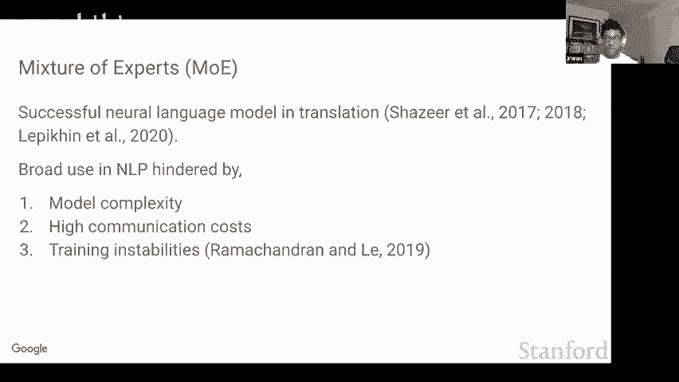
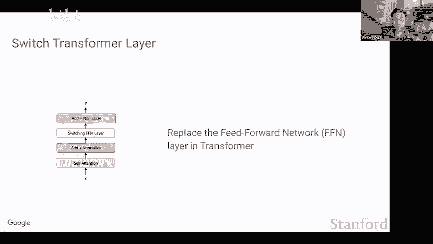
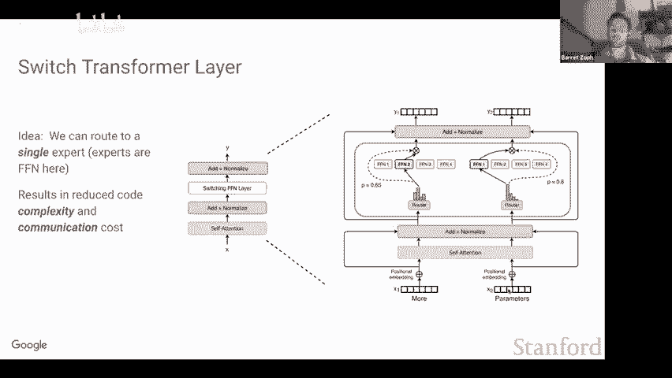
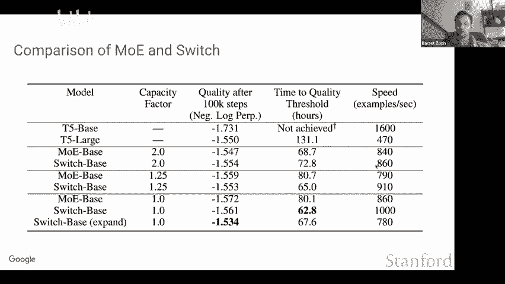
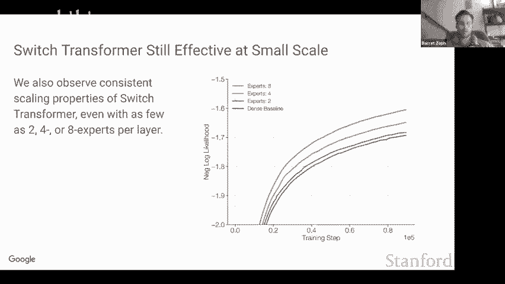
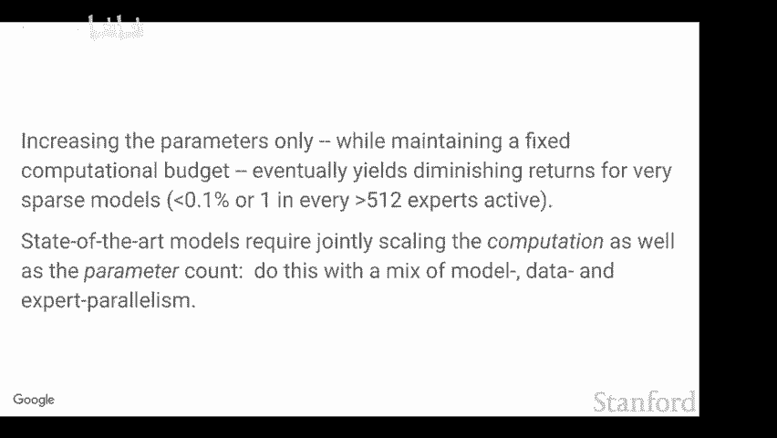
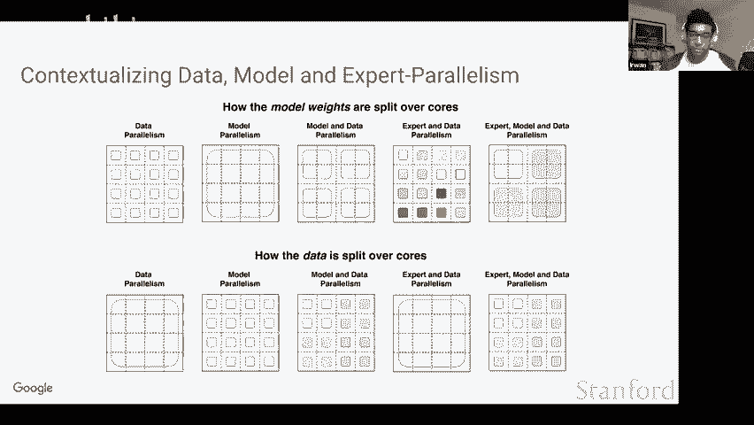
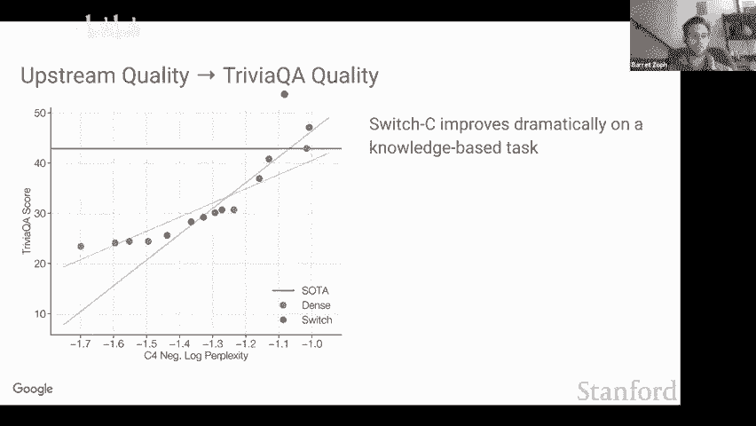
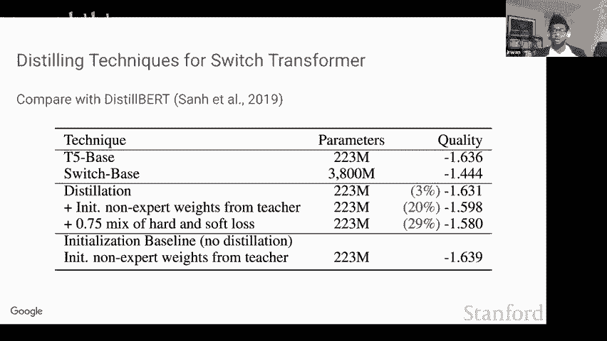

# 5：专家混合（MoE）范式和开关变压器 🧠

在本节课中，我们将学习如何通过稀疏性来扩展变压器模型。具体来说，我们将探讨一种名为“专家混合”的范式，以及其简化且高效的变体——“开关变压器”。我们将了解它们的工作原理、优势、训练技巧以及如何在实际硬件上高效运行。

---

## 概述：通过稀疏性扩展模型

社区普遍认识到，扩大模型规模是提升性能的重要途径之一。目前，不同实验室之间几乎在进行一场持续的“军备竞赛”，争相训练最大的模型。一篇名为“Scaling Laws for Neural Language Models”的论文发现，模型性能遵循可预测的缩放定律，随着模型大小呈幂级数增长。因此，如果我们训练非常大的模型，可以预期获得稳定的性能提升。

然而，传统的扩展方式主要是增加模型的维度（即参数数量），这带来了巨大的计算成本。稀疏性为我们提供了一个新的扩展维度。其核心思想是：**每个输入可以激活并使用不同的权重子集，从而应用不同的计算量**。这可以追溯到1991年的“自适应局部专家的混合”论文，最近被Noam Shazeer和谷歌大脑的团队重新审视并应用于LSTM和Transformer架构中。

---

## 专家混合（MoE）范式

上一节我们介绍了扩展模型的新思路——稀疏性。本节中，我们来看看实现稀疏性的经典方法：专家混合。

MoE的工作原理大致如下：
*   模型包含多个“专家”，每个专家通常是一个小型前馈网络。
*   模型还有一个额外的“路由器”网络，它接收输入并输出一个概率分布，指示应将输入发送给哪些专家。
*   根据路由器的输出，选择概率最高的一个或几个专家来处理该输入。
*   最终输出是所有被选专家输出的加权组合。

这种方法，尤其是在机器翻译任务中，取得了相当大的成功。然而，它也引入了一些复杂性，例如更高的通信成本和训练不稳定性。

---

## 开关变压器：简化的MoE

上一节我们看到了MoE的基本原理及其挑战。本节中，我们来看看一个旨在解决这些问题的简化变体——开关变压器。

开关变压器的工作方式如下：
1.  在一个标准的Transformer模型中（包含自注意力层和前馈层），我们每隔一层或两层，就用一个“开关层”替换原来的前馈层。
2.  在开关层中，输入令牌会被发送到一个路由器。
3.  路由器计算该令牌对于所有专家的概率分布。
4.  **与MoE不同，开关变压器只将令牌发送给概率最高的那个专家**（即Top-1路由）。
5.  被选中的专家（一个独立的前馈网络）处理该令牌并产生输出。

**核心简化公式**：
`输出 = 专家[argmax(路由器(输入))] (输入)`

这种仅发送给一个专家的策略，显著简化了算法并降低了通信成本。

---

## 改进的训练技术

为了让稀疏模型（特别是开关变压器）能够稳定且高效地训练，研究人员引入了多项改进技术。以下是关键的三个方面：

### 1. 选择性精度
在训练大型模型时，使用较低的精度格式（如bfloat16）非常重要，因为它能提升速度并减少内存占用。然而，稀疏模型在低精度下训练时容易不稳定。研究发现，**将路由器计算中的一部分（特别是涉及指数运算的部分）保持为float32精度**，可以极大地提升训练稳定性，而对整体速度影响微乎其微。

### 2. 改进的初始化与调度
标准的权重初始化方法可能导致稀疏模型训练不稳定。一个简单而有效的修复方法是**缩小初始化的规模**，这被证明能显著提高模型质量。此外，也采用了改进的学习率调度策略。

### 3. 专家内Dropout与负载均衡
由于稀疏模型参数更多，在数据量较小的下游任务上微调时更容易过拟合。解决方法是在专家层内部使用**更高的Dropout率**来进行正则化。

同时，为了在硬件上高效运行，我们希望每个专家接收到的令牌数量大致相等。因此，在损失函数中添加了一个**可微分的负载均衡损失**。其基本思想是鼓励路由器将令牌均匀地分配给所有专家。

---

## 路由策略与专家容量

在硬件上高效实现动态路由面临挑战。框架通常需要静态形状，但路由决策是动态的。为了解决这个问题，引入了**专家容量**的概念。

我们通过一个**容量因子**来参数化每个专家能处理的令牌数量上限。
*   **容量因子 = 1.0**：每个专家的容量刚好等于“批次大小 / 专家数量”。如果路由到某个专家的令牌超过其容量，多出的令牌将被**丢弃**（不进行计算）。
*   **容量因子 > 1.0**：每个专家拥有额外的缓冲容量，可以减少令牌丢弃，但会增加设备间的通信成本。

一个自然的想法是设计“无令牌丢弃”的多阶段路由算法（例如，将溢出的令牌发送给第二优先的专家）。但实验表明，这种方法并没有提升性能，有时甚至有害。模型似乎更倾向于将计算应用于它首选的专家。

---

## 性能对比：Switch vs. MoE

现在，让我们将开关变压器（Top-1）与传统的MoE（Top-2）进行性能对比。

以下是关键发现：
*   在**高容量因子**（如2.0）下，MoE（Top-2）模型质量优于Switch（Top-1），因为它利用了额外的缓冲。
*   在**低容量因子**（如1.0或1.25）下，Switch（Top-1）模型在质量和训练速度的帕累托前沿上表现更优。尽管单步质量可能略低，但其更低的通信和计算开销使得总体训练效率更高。
*   **结论**：使用较低容量因子的Top-1路由，比使用较高容量因子的Top-2路由更具帕累托效率。

---

## 模型扩展与并行策略

开关变压器如何随着专家数量增加而扩展？研究表明，在固定计算量（FLOPs）的情况下，增加专家数量（即增加稀疏参数量）能持续提升性能，但收益会递减。

与通过**模型并行**来扩大稠密模型相比，通过**专家并行**来扩大稀疏模型是更高效的方式。即使在专家数量很少的情况下（例如只有2个专家），稀疏模型也能展现出比同等大小的稠密模型更好的扩展属性，这对于计算资源有限的环境非常有前景。

为了训练超大规模模型（如1.6万亿参数），需要结合多种并行策略：
*   **数据并行**：在不同设备上复制模型，处理不同数据批次。
*   **模型并行**：将单个模型的权重划分到多个设备上。
*   **专家并行**：将不同的专家放置在不同的设备上。
大规模稀疏模型的训练通常需要混合使用这些策略。

---

## 下游任务表现与知识推理

一个有趣的发现是，稀疏模型和稠密模型在下游任务上的表现并非完全由预训练困惑度决定。

*   **知识密集型任务**（如问答）：在相同的预训练困惑度下，**稀疏模型的表现显著优于稠密模型**。这表明额外的参数对于存储和回忆知识非常有效。
*   **推理密集型任务**（如SuperGLUE）：在相同的预训练困惑度下，**稠密模型的表现往往优于稀疏模型**。这可能意味着固定的计算量（FLOPs）对于复杂推理更为关键。

例如，一个拥有**1.6万亿参数但FLOPs较少**的稀疏模型，在知识任务上表现异常出色，但在推理任务上则相对较弱。这揭示了仅凭预训练指标评估模型的风险。

---

## 蒸馏与多语言应用

稀疏模型的一个缺点是参数量大，不利于部署。**知识蒸馏**技术可以将大稀疏模型（教师）的能力迁移到小稠密模型（学生）中。

实验表明，通过蒸馏，稠密学生模型可以保留教师稀疏模型相对于基线稠密模型**约30%的性能增益**。这意味着我们可以用一个小得多的模型，获得大部分稀疏性带来的好处。

此外，稀疏性在多语言场景中表现自然且强大。专家可以在不同语言之间进行专业化。实验证明，在超过100种语言上，稀疏模型的表现都超越了对应的稠密基线模型。

---

## 总结与未来方向

本节课中，我们一起学习了如何通过稀疏性扩展Transformer模型。

**核心要点总结**：
1.  **开关变压器**是专家混合（MoE）的一种高效简化，采用Top-1路由，降低了通信和计算复杂度。
2.  通过**选择性精度、改进初始化和负载均衡**等技巧，可以稳定训练稀疏模型。
3.  在扩展性上，通过**专家并行**增加稀疏参数，比通过模型并行增加计算量更高效。
4.  稀疏模型在**知识密集型任务**上表现突出，但在推理任务上可能需要平衡计算量。
5.  通过**知识蒸馏**，可以将稀疏模型的能力压缩到稠密模型中，便于部署。
6.  稀疏范式在**多语言建模**中同样有效。

未来，稀疏性和自适应计算（让不同输入应用不同计算量）的结合是一个充满希望的方向。同时，模型设计、硬件特性和分布式算法的协同优化，将继续是提升大规模机器学习能力的关键。