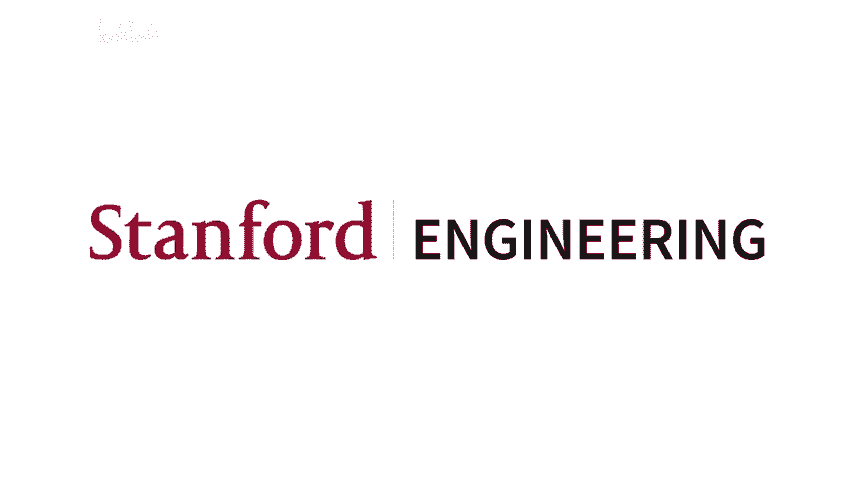
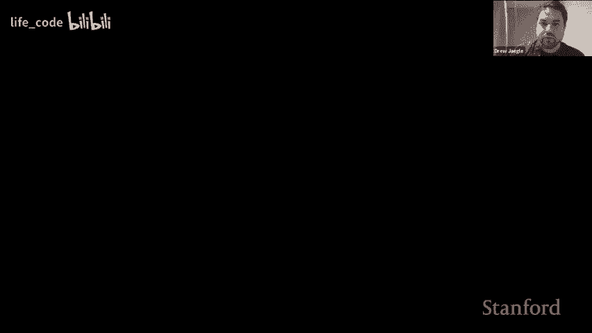
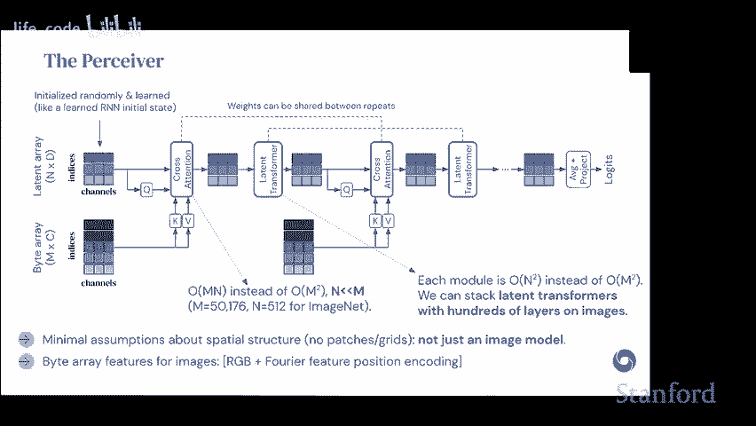
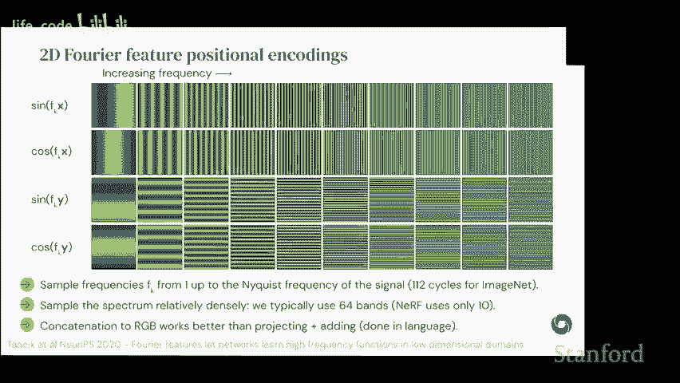
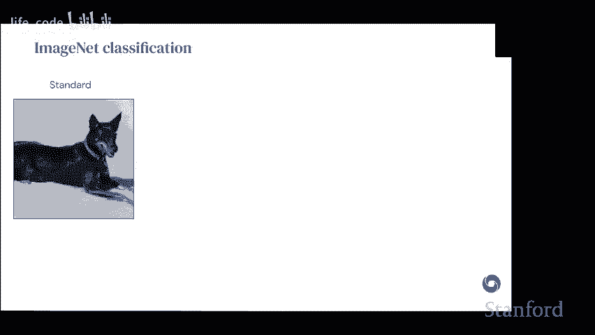
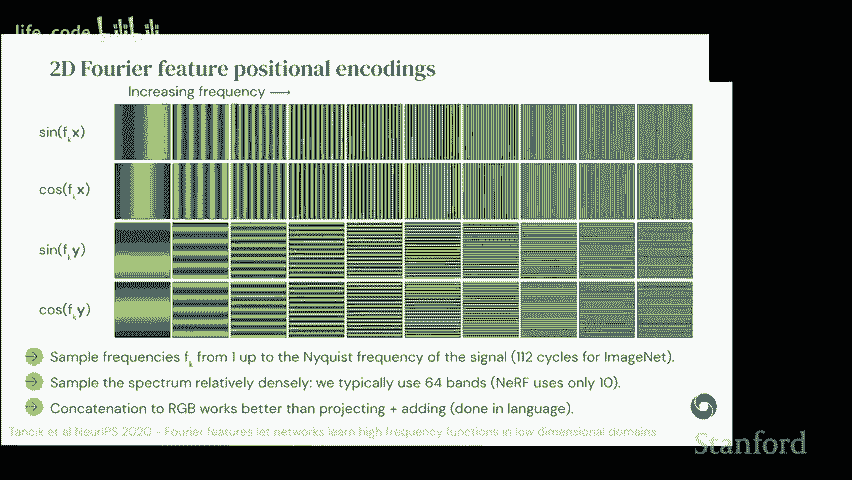
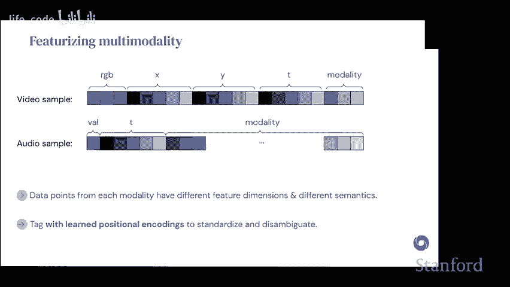
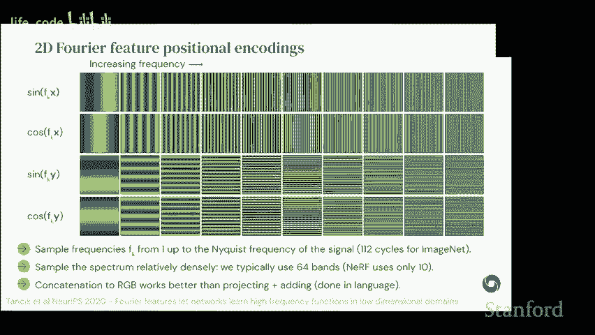
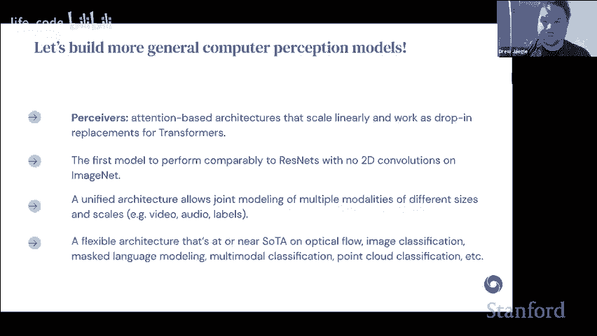
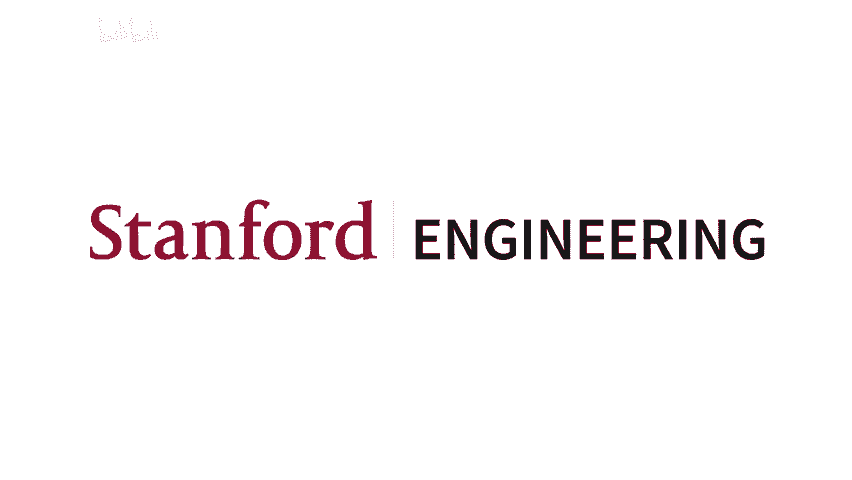

# 6：DeepMind 的 Perceiver 和 Perceiver IO 新数据家族架构 🧠

在本节课中，我们将要学习 DeepMind 提出的 Perceiver 和 Perceiver IO 系列架构。这些架构旨在构建一个能够处理多种数据模态（如图像、文本、音频等）的通用模型，而无需为每种模态手动设计特定的网络结构。我们将从通用架构的动机开始，逐步解析其核心设计思想、工作原理，并了解其在多个领域的应用效果。

## 概述：为什么需要通用架构？ 🎯

我们希望构建能够处理所有可能数据类型的架构，这主要基于两个务实的理由。

首先，现实世界中的数据模态极其多样，包括触觉、前庭感知、回声定位、文本、基于事件的摄像头，甚至嗅觉和深度感知等。为每一种模态手动设计网络结构（即“归纳偏置”）是不切实际的，这种方法无法扩展。

其次，处理复杂多模态数据的传统方法通常是为每个模态构建独立的子系统，再设计方法将它们组合。这会导致系统复杂、脆弱且难以维护。一个统一的“黑箱”架构可以简化系统构建，让我们能更专注于更高层次的问题。

## 从 Transformer 到瓶颈：核心挑战 ⚙️

上一节我们介绍了构建通用架构的动机，本节中我们来看看实现这一目标的基础——Transformer，以及它所面临的挑战。

Transformer 是目前最通用的架构之一，它采用了几种关键的归纳偏置：
*   **非局部性**：不对数据点间的关联做领域特定假设，允许全局交互。
*   **位置特征化**：将位置信息作为输入特征，而非硬性的架构约束。
*   **权重共享与硬件友好**：广泛共享权重并基于矩阵运算，适合 GPU/TPU 加速。

然而，标准 Transformer 有一个致命缺点：其核心的自注意力机制的计算和内存复杂度是输入序列长度的平方级，即 **O(M²L)**，其中 M 是输入大小，L 是深度。这使其难以处理大规模数据（如高分辨率图像）。

## Perceiver 的核心创新：交叉注意力瓶颈 🔄

上一节我们看到了标准 Transformer 的扩展性问题，本节中我们来看看 Perceiver 如何通过引入“交叉注意力”瓶颈来解决这个问题。

标准自注意力机制可以表示为：
`注意力输出 = softmax(Q * K^T / sqrt(d_k)) * V`
其中 Q（查询）、K（键）、V（值）均由输入线性变换得到，导致 QK^T 计算复杂度为 O(M²)。

Perceiver 的关键改进是将第一层的**自注意力替换为交叉注意力**。它引入一个**可学习的潜在数组**（Latent Array），其长度 N 远小于输入长度 M。这个潜在数组作为查询 Q，而键 K 和值 V 仍来自原始输入。

此时，注意力计算变为：
`潜在输出 = softmax(Q_latent * K_input^T / sqrt(d_k)) * V_input`
由于 Q_latent 的维度是 N，计算复杂度从 O(M²) 降为 **O(N * M)**，实现了线性缩放。

这个潜在数组就像一个“RNN的初始状态”或一组“聚类中心”，它通过注意力机制从庞大的输入中提炼信息。之后，网络可以在固定大小的潜在空间（而非庞大的输入空间）内，使用标准的 Transformer 块（自注意力）进行深层处理，此时的复杂度仅与潜在大小 N 的平方相关，而 N 是我们可以控制的超参数。

## 架构细节与对比 🔍

上一节我们介绍了 Perceiver 的核心模块，本节中我们来看看一些实现细节，并将其与其他方法进行对比。

**位置编码**：为了让模型感知输入结构（如图像的2D空间），我们为每个输入点添加位置编码。对于图像，使用2D傅里叶特征（正弦/余弦函数）效果很好。我们发现，采样频率覆盖到奈奎斯特极限（即像素分辨率允许的最高频率）能获得最佳性能，这确保了每个点都能被清晰区分。与语言模型通常将嵌入与位置编码相加不同，在 Perceiver 中**拼接**（concatenate）内容与位置特征通常表现更好。

**与 ViT 对比**：视觉 Transformer (ViT) 通过将图像分割为补丁（patch）来应用 Transformer。这本质上是为图像数据引入了2D卷积的归纳偏置，限制了其在非网格数据（如点云）上的通用性。Perceiver 则完全不做此类假设，仅通过位置编码提供结构信息，因此更为通用。

**与使用交叉注意力的其他工作对比**：交叉注意力在计算机视觉中早有应用，例如 DETR（目标检测）和 Slot Attention（无监督物体分割）。这些工作通常使用卷积主干提取特征，再用交叉注意力将其转换为目标表示（如边界框或物体槽）。Perceiver 的不同之处在于，它**完全摒弃了卷积主干**，从原始像素开始就用交叉注意力将输入映射到潜在空间。

## Perceiver 的演进：Perceiver IO 与多模态处理 🌐

上一节我们了解了基础 Perceiver 模型，本节中我们来看看其升级版 Perceiver IO 如何实现任意输出，并处理多模态数据。

基础 Perceiver 主要适用于分类等输出固定的任务。**Perceiver IO** 的核心思想是：**使用另一个交叉注意力层进行解码**。我们为每个期望的输出点准备一个查询（Query），这个查询包含了该输出点的语义和位置信息。然后，以 Perceiver 编码器输出的潜在表示作为键（Key）和值（Value），进行交叉注意力计算，从而生成最终输出。

这种设计带来了极大的灵活性：
*   **密集预测**：如图像自编码，可以为每个像素生成一个查询，重建整张图像。
*   **多任务学习**：通过在查询中附加任务标识，让同一模型处理不同任务。
*   **多模态输出**：可以同时为视频、音频、标签等不同模态生成输出，尽管它们的输出规模和形式各异。

**处理多模态输入**：对于来自不同模态（如视频帧和音频波形）的输入，Perceiver 的处理方式非常直接：
1.  为每种模态学习特定的**模态标识嵌入**，并将其拼接到对应输入的特征中。
2.  将所有模态的输入（连同它们的位置编码和模态标识）**拼接成一个大的输入数组**。
3.  将这个统一数组输入给 Perceiver 编码器。

模型本身并不“知道”哪些数据来自视频，哪些来自音频，它需要从数据中学习这些关联。

## 应用与实验结果 📊

上一节我们探讨了 Perceiver IO 的通用性，本节中我们通过具体实验来看看它的实际表现。

**图像分类 (ImageNet)**：早期的 Perceiver 在 ImageNet 上取得了与 ResNet-50 和当时 ViT 模型相当的结果。更有趣的是，当我们将图像像素随机打乱后，严重依赖2D结构的 ResNet-50 性能大幅下降，ViT 也有明显下降，而 Perceiver（尤其是使用学习式位置编码的版本）表现出了更强的鲁棒性。这表明 Perceiver 对输入结构的假设更少，更依赖于学习到的内容关联。

**大规模语言建模**：Perceiver IO 的一个显著优势是能够直接处理**字节序列**，从而避免传统 NLP 中分词器（Tokenizer）带来的问题（如对稀有词处理不佳、对空格敏感、跨语言迁移困难）。实验表明，在相同计算量（FLOPs）下，Perceiver IO 的性能与 BERT-base 相当。而当移除 BERT 的分词器时，由于其 Transformer 对序列长度平方扩展，性能会急剧下降；而 Perceiver IO 在无分词器设置下，仅需轻微调整即可保持性能，展示了其在长序列处理上的效率优势。

**光流估计**：光流估计是一个经典的、需要建立长距离像素对应的密集预测任务。此前的最先进方法 RAFT 包含了精心设计的关联体积、迭代更新等复杂模块。Perceiver IO 仅以简单的图像块作为输入，配合其通用架构，就在 Sintel 和 KITTI 等标准光流数据集上取得了具有竞争力的结果，甚至在某些基准上达到了新的最优水平。这验证了通用架构在复杂任务上的迁移能力。

## 总结与展望 🚀

本节课我们一起学习了 DeepMind 的 Perceiver 和 Perceiver IO 架构。我们从构建通用架构的动机出发，深入分析了标准 Transformer 的扩展性瓶颈，以及 Perceiver 如何通过引入**可学习的潜在数组**和**交叉注意力**机制，将计算复杂度从平方级降至线性级，同时保持了处理任意模态数据的能力。

Perceiver IO 进一步通过**对称的解码器交叉注意力**，实现了从任意输入到任意输出的灵活映射，并在图像分类、语言建模、光流估计等多个差异巨大的任务上展现了强大且通用的性能。

这些工作表明，追求更少归纳偏置、更统一的架构是可行且富有前景的方向。未来的研究可能会集中于如何在**小数据场景**下更有效地使用这类架构，以及如何让单个模型**同时协同处理多种模态和任务**，向真正通用的多模态智能系统迈进。