# 7：自注意力与非参数变换器 (NPTs) 🧠


在本节课中，我们将要学习Transformer架构的核心思想，并深入探讨一种名为“非参数变换器”的创新架构。我们将从Transformer的基本概念讲起，然后了解NPTs如何通过利用整个数据集的信息来进行预测，从而挑战传统的参数化深度学习范式。

***

## 第一部分：Transformer架构回顾 🔄

上一节我们介绍了课程概述，本节中我们来看看Transformer架构的核心组成部分。Transformer首次引入了两个主要概念：多头注意力和自注意力，并结合了快速自回归解码。

### 自注意力与多头注意力

在Transformer之前，模型主要使用LSTM及其注意力机制。注意力模块通常关联两个不同的序列：源序列和目标序列。源序列中的每个词会与目标序列中的一个元素建立软关联。

自注意力则不同，它使用同一个序列作为源和目标。这样，序列中的每个元素都可以与序列内的其他元素关联。其核心思想是学习句子中词语之间的关系。例如，在短语“蓝色的球”中，模型需要将形容词“蓝色”与名词“球”关联起来。

多头注意力进一步扩展了这个概念。每个词用一个嵌入向量表示。我们将这个表示在深度维度上分成若干组（例如四组），对每一组独立应用注意力机制。处理完成后，再将结果拼接起来，恢复成原始的模型维度表示。这样做的好处是，每个注意力头可以专注于学习一种特定的关系模式。例如，一个头学习形容词与名词的关系，另一个头学习其他不同的关系，从而能够学习一个层次化或多样化的关系列表。

### 快速自回归解码

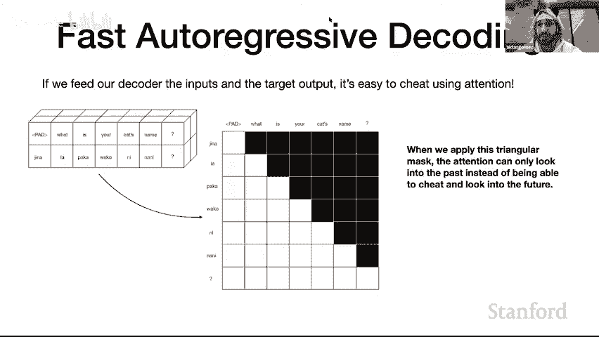

另一个关键部分是快速自回归解码。在标准的自回归解码中，模型生成第一个标记，然后基于第一个标记生成第二个，再基于前两个生成第三个，如此循环。这个过程非常缓慢。

Transformer采用了一种技巧来加速训练：它假设模型总是生成正确的内容。具体做法是，在训练时，我们不进行循环生成，而是直接将完整的、正确的目标序列输入模型。模型的任务是，在已知前k个正确标记的情况下，预测第k+1个标记，并计算该位置的损失。

虽然模型在训练初期可能生成无意义的内容，但损失计算时假设它已经看到了所有正确的历史标记。这种方法的精妙之处在于，它允许所有位置的预测并行计算，极大地提升了训练速度，这也是Transformer模型可扩展性强的关键。

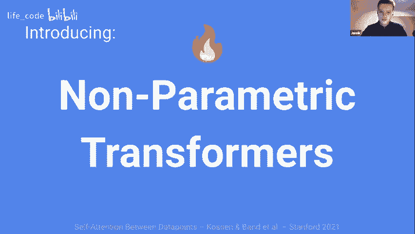

为了防止模型在训练时“作弊”（即直接看到它要预测的未来标记），我们需要在架构内部阻止注意力机制关注它不应该看到的标记。这是通过创建一个注意力掩码来实现的。

以下是注意力掩码的一个简单示例：
```python
# 假设序列长度为5，我们创建一个下三角掩码（不包括对角线）
mask = torch.tril(torch.ones(5, 5)) == 0
# 在计算注意力分数后，将未来位置的分数设置为一个极小的负数
attention_scores.masked_fill_(mask, -1e9)
```
这样，对于序列中的每个位置，模型都无法关注其后的位置，从而确保了自回归属性。

***


## 第二部分：非参数变换器 (NPTs) 的动机 🎯

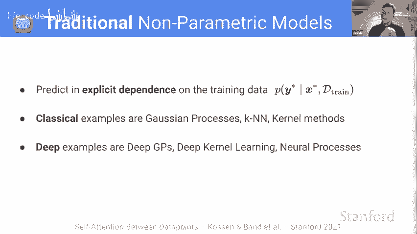

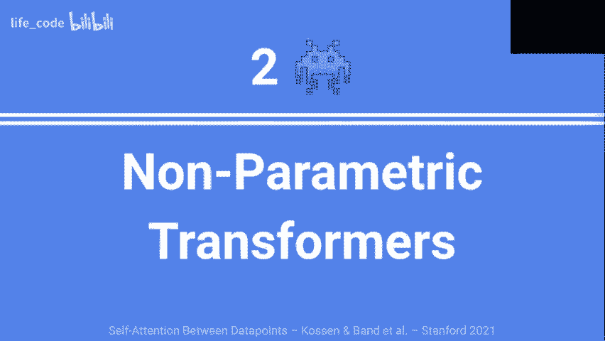

上一节我们回顾了Transformer的基础，本节中我们来看看NPTs如何引入新的预测范式。传统的监督深度学习依赖于参数化预测。我们使用训练数据学习一组参数θ，然后在测试时仅使用这些参数对新数据进行预测。这意味着测试时的预测完全独立于训练数据本身。

参数化预测很方便，因为所有从训练数据中学到的知识都浓缩在参数中，无需存储庞大的原始数据。然而，现代架构（如批处理）已经让数据在训练时产生了交互。

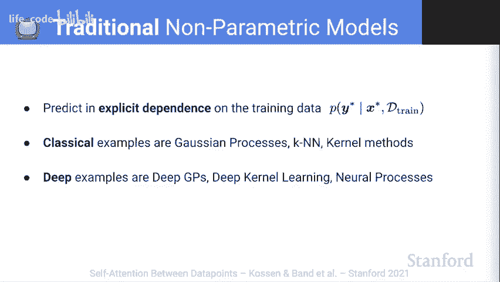

NPTs的核心思想是：既然我们在预测时已经可以并行处理一批数据，为什么不直接让模型在预测时也能利用训练数据呢？我们挑战参数化预测的主导地位，希望赋予模型在预测时使用训练数据的额外灵活性。

更具体地说，NPTs将整个数据集（或一个批次）作为输入，并学习从数据点之间的交互中进行预测。它使用多头自注意力作为通用推理层，并借鉴了自然语言处理中的随机掩码机制，以指定需要预测的位置并对学习任务进行正则化。

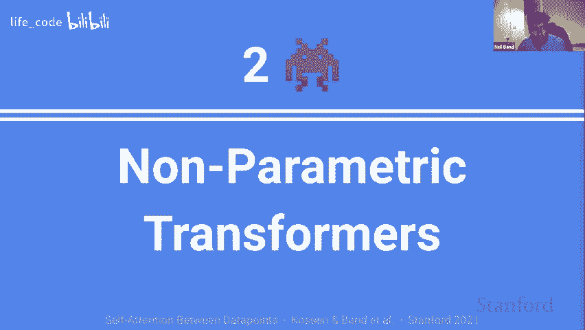

简单对比：
*   **经典参数模型**：预测时，仅查看单个测试数据点的特征，使用训练好的参数θ进行预测。
*   **NPTs**：预测时，将测试点与（部分）训练数据一起输入。模型可以查看所有样本的特征和目标值，通过数据点间的注意力交互来进行预测。

有人将这种方式称为“KNN 2.0”，因为它像K近邻一样利用其他数据点，但通过强大的Transformer架构学习更复杂的关系。

***

## 第三部分：NPTs 架构详解 ⚙️

上一节我们了解了NPTs的动机，本节中我们深入探讨其架构细节。NPTs有三个关键组成部分。

### 1. 数据集作为输入

NPT的输入包括两部分：
1.  **数据矩阵 X**：形状为 `[n, d]`，其中 `n` 是数据点数量，`d` 是属性（特征+目标）数量。每一行是一个数据点，每一列是一个共享语义的属性。
2.  **掩码矩阵 M**：形状与X相同，是一个二进制矩阵，用于指定哪些条目（可以是特征或目标）被掩盖，需要模型预测。

对于不同长度的输入（例如不同数据点特征数不同），可以采用填充（Padding）策略。对于表格数据，我们通常假设每个数据点的特征数量是固定的。

### 2. 嵌入与位置编码

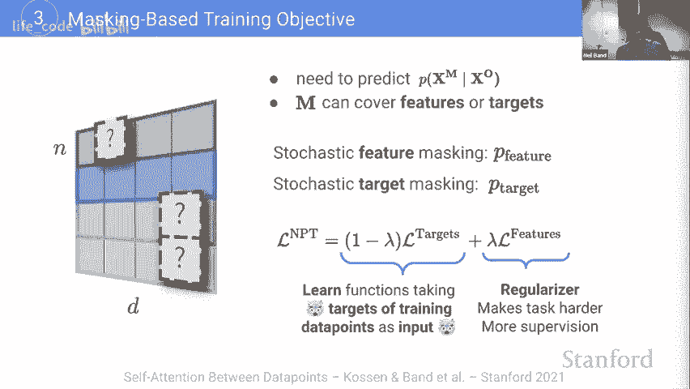

我们将数据矩阵X和掩码矩阵M堆叠，并进行线性嵌入。具体操作如下：
*   对每个数据点独立应用相同的线性变换。
*   为每个属性（列）学习一个独立的嵌入，因为不同列（如年龄、性别）的语义不同。
*   对属性的索引进行位置编码，因为列的顺序可能包含信息。
*   对列的类型（连续型、分类型）进行编码。

最终，我们得到一个形状为 `[n, d, e]` 的张量，其中 `e` 是嵌入维度。

### 3. 数据点间的自注意力

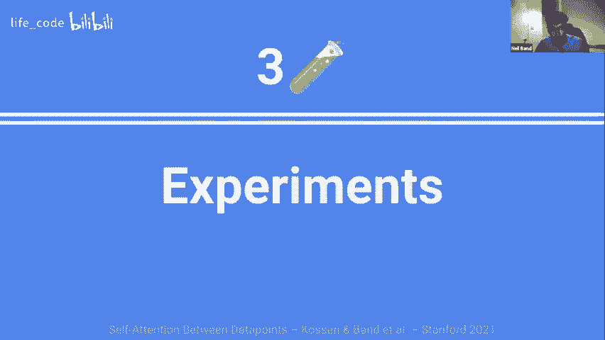

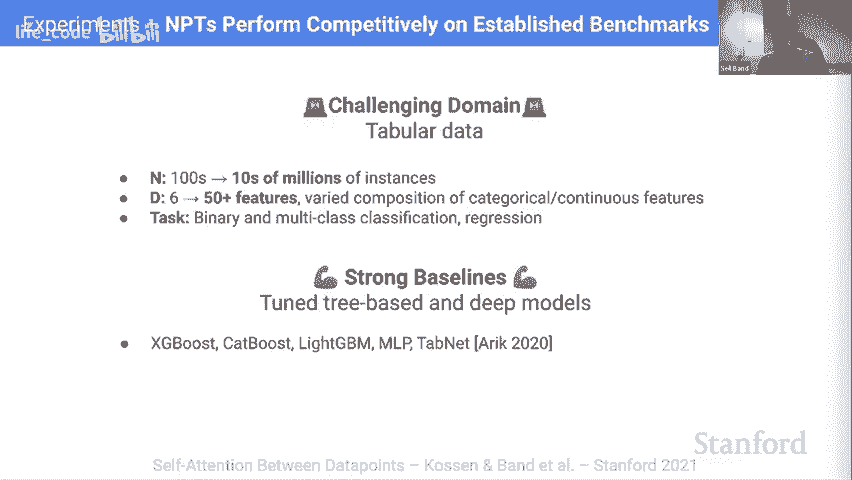

这是NPT的核心。为了实现数据点间的交互，我们首先将 `[n, d, e]` 的张量重塑为 `[n, d*e]`，即将每个数据点的所有属性嵌入拼接成一个长的“令牌”表示。然后，我们在这个 `n` 个“数据点令牌”上应用标准的、堆叠的多头自注意力层。这允许模型学习数据点之间的高阶、复杂依赖关系。


与一些只使用单层注意力进行简单查找的方法（如神经过程）不同，堆叠多层注意力极大地增强了模型的表达能力。NPT对数据点的排列是等变的，即预测结果不依赖于数据点输入的顺序。

### 4. 基于掩码的训练目标

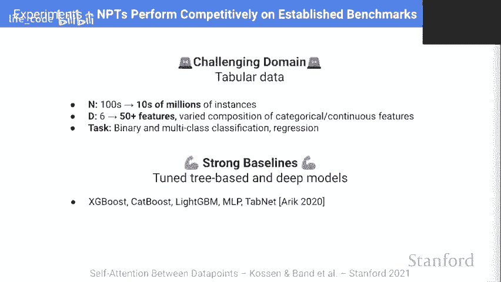

训练目标是基于随机掩码的。我们会以一定概率随机掩盖特征值和目标值，然后要求模型根据观察到的条目预测被掩盖的条目。损失函数是特征重建损失和目标预测损失的加权和。

**特征掩码**：这起到了正则化的作用，使任务更具挑战性，并引入了额外的自监督信号，有助于学习更好的特征表示。

**随机目标掩码**：这是NPT独特且关键的一点。在训练时，部分训练数据点的目标值不会被掩盖，而是作为输入提供给模型。这意味着模型在预测某个训练点的掩盖目标时，可以利用其他训练数据点的**特征和目标**。因此，模型无需在参数中死记硬背输入-输出的映射，而是可以学习一个利用其他数据点信息的插值或查找函数。这本质上使模型能够学习类似K近邻但更复杂的预测机制。

***

## 第四部分：实验与验证 📊


上一节我们剖析了NPTs的架构，本节中我们通过实验来看看它的实际表现。

### 在表格数据上的表现

我们主要在表格数据上评估NPTs，因为这是一个具有挑战性且实用的领域。我们选择了涵盖不同规模、特征类型和任务类型（二分类、多分类、回归）的多个数据集。

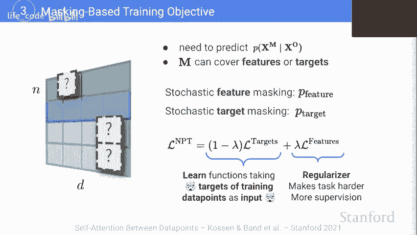


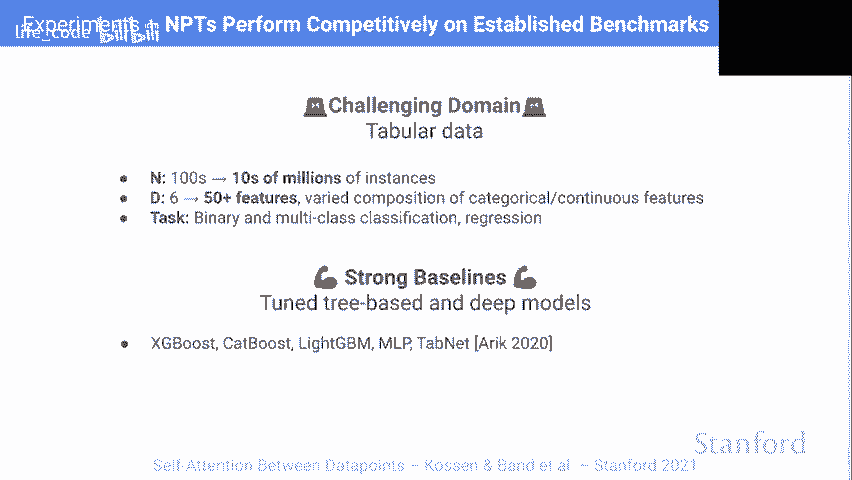

我们将NPTs与主流基线进行比较，包括：
*   **基于树的模型**：XGBoost, CatBoost。
*   **经典深度学习**：MLP。
*   **表格数据专用Transformer**：TabNet。

实验结果显示，NPTs在多个数据集上取得了有竞争力的性能，甚至在一些任务上表现最佳。这表明，学习数据点间交互的简单想法在实践中是有效的。


### 消融实验：NPTs是否真的利用了交互？

一个关键问题是：NPTs性能的提升真的是因为利用了数据点间的交互，而不是仅仅学习了更好的每点参数化表示吗？

为了验证这一点，我们设计了一个“干扰实验”。在预测某个特定数据点时，我们保持该点所有信息不变，但将**其他所有数据点的每个属性值分别进行随机排列**。这样，其他数据点与当前点的任何有意义的关系都被破坏了，但批次统计信息（如均值、方差）得以保留。

实验发现，在进行干扰后，NPTs的性能在大多数数据集上显著下降，有时甚至从最佳变为最差。这强有力地证明NPTs确实依赖并利用了数据点之间的交互信息来进行预测。在少数性能下降不明显的数据集上，我们推测模型可能认为学习关系预测的收益不大，从而更倾向于参数化预测。

### 合成实验：学习复杂关系

为了更深入地测试NPTs学习非参数预测机制的能力，我们设计了一些合成实验。

1.  **精确查找任务**：我们复制原始数据集的行，并揭示副本的目标值。NPTs需要学会根据特征匹配，从副本中查找并复制目标值到原始行。实验表明，NPTs成功学会了这一机制，注意力图清晰地显示模型在预测时关注到了正确的副本行，预测相关性接近完美。
2.  **干预与泛化**：我们进一步在测试时改变副本数据点的目标值。如果NPTs真正学会了“查找-复制”的因果机制，那么它的预测也应该随之改变。实验结果显示，预测值与干预值保持了极高的相关性，证明了NPTs学会了稳健的机制，并能泛化到训练分布之外的情况。
3.  **超越简单KNN**：我们将任务复杂化，例如给所有副本的目标值加一个常数。简单的KNN会失败，因为它会找到正确的特征匹配但预测错误的目标值（原值+1）。而NPTs可以轻松学会在查找后再减去这个常数，因为它建模的是特征与目标的联合分布，而不仅仅是条件分布。

这些实验表明，基于梯度的优化能够使NPTs发现并利用数据中复杂的、非参数化的预测机制。

***

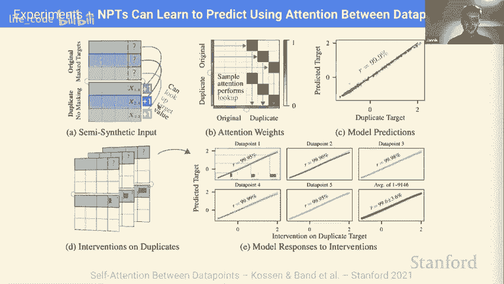

## 总结与展望 🚀


本节课中我们一起学习了Transformer的自注意力机制，并深入探讨了非参数变换器这一创新架构。

我们了解到，NPTs的核心在于将整个数据集作为输入，利用Transformer强大的自注意力机制来建模数据点之间复杂的高阶关系。它通过随机掩码训练目标，使模型能够学习利用其他数据点的信息进行预测，从而部分摆脱了对参数化记忆的依赖。

实验证明，NPTs在表格数据等任务上表现良好，并且确实依赖于数据点间的交互。合成实验进一步展示了其学习复杂、稳健预测机制的能力。

展望未来，NPTs有许多有趣的发展方向：
*   **扩展性**：研究如何超越小批量近似，利用稀疏注意力等技术处理超大规模数据集。
*   **应用领域**：将NPTs应用于元学习、少样本学习、领域适应、半监督学习等更广泛的场景。
*   **与其他领域联系**：NPTs与图神经网络有相似之处，特别是在学习实体间关系方面，这为交叉研究提供了机会。


NPTs为深度学习提供了一种新的、充分利用数据内部结构的预测范式，值得我们持续关注和探索。