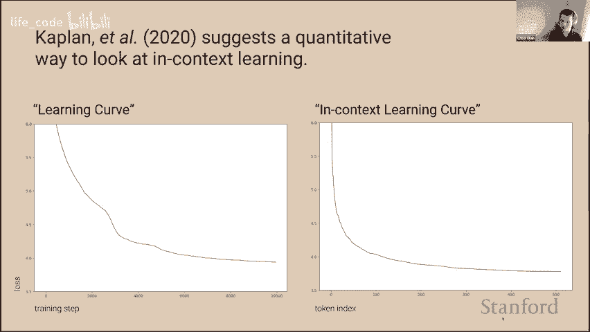
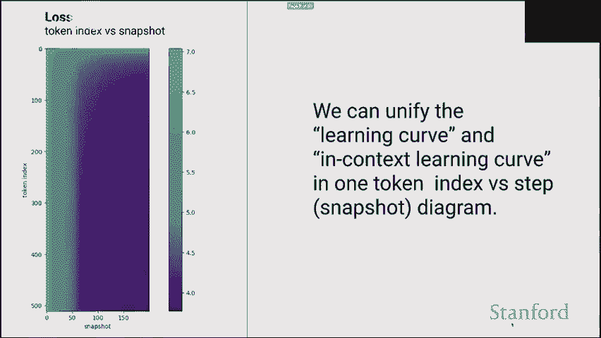
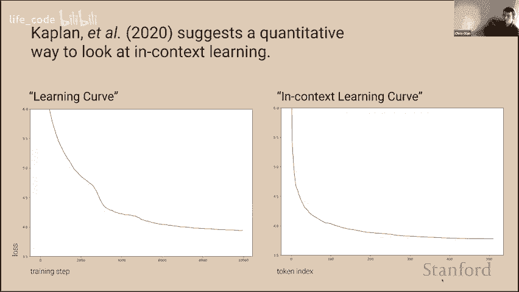
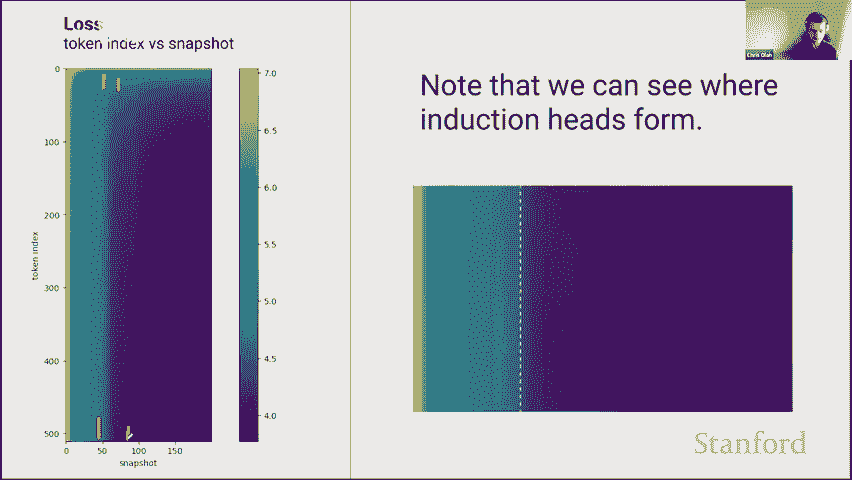
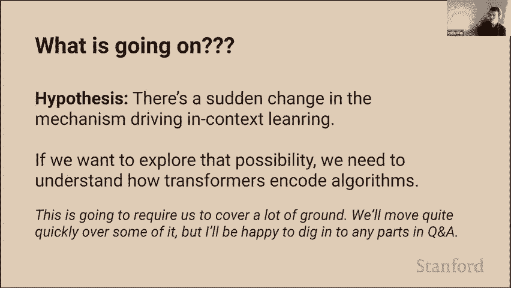
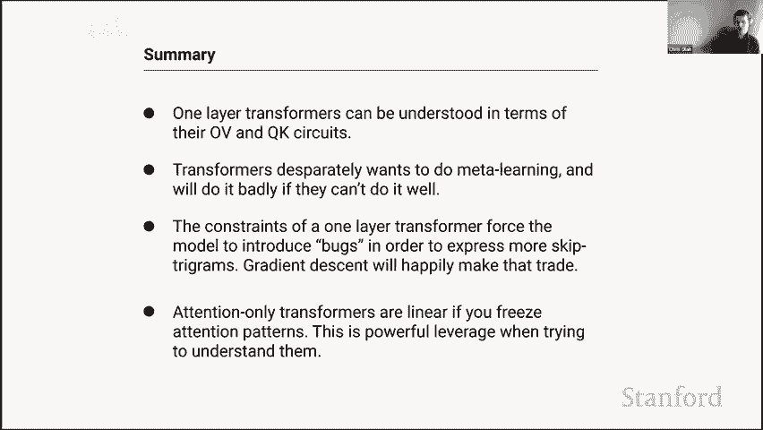
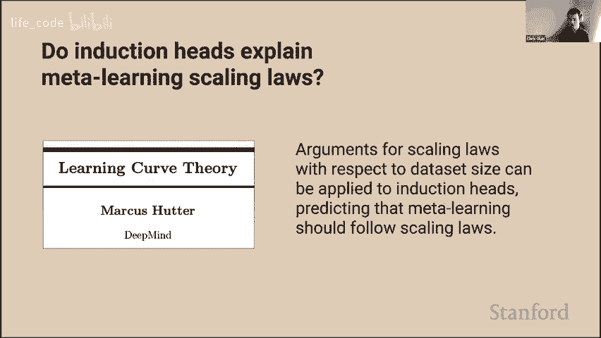

# 8：Transformer 电路、诱导头与上下文学习 🧠

在本节课中，我们将深入探讨 Transformer 模型内部的工作机制，特别是它们如何实现令人惊讶的上下文学习能力。我们将从一个观察到的“相变”现象出发，逐步解析单层和双层注意力 Transformer 的电路结构，并最终揭示“诱导头”这一核心概念如何驱动上下文学习。

---

## 概述：一个关于上下文学习的谜团

Transformer 模型最引人注目的特性之一是它们的上下文学习能力。模型能够在没有更新任何内部参数的情况下，仅根据上下文中的几个示例就学会执行新任务。然而，我们发现这种能力并非均匀发展，而是在训练过程中的某个特定时刻突然出现一个“相变”，模型预测序列中靠后位置 token 的能力急剧提升。本节课的目标就是理解这一现象背后的机制。

---

## 第一部分：机械可解释性简介

在深入 Transformer 之前，我们首先需要明确我们所探讨的“可解释性”类型。我称之为“机械可解释性”。

其核心思想是：神经网络的参数可以被视为一种编译后的计算机程序，而神经元则类似于变量或寄存器。我们的目标是将这些嵌入在权重中的复杂“程序”反向工程为人类可以理解的算法。这项工作不仅有助于我们理解 AI 如何完成人类无法直接编程的任务，也对确保未来 AI 系统的安全性至关重要。

---

## 第二部分：单层注意力 Transformer 的电路分析

上一节我们介绍了机械可解释性的目标，本节中我们来看看如何将其应用于最简单的模型：单层注意力 Transformer。

### Transformer 的线性视角

我们可以将单层注意力 Transformer 的输出逻辑写为以下形式：

`logits = E^T * (I + ∑_h A_h * W_OV_h) * E * x`

其中：
*   `E` 是嵌入矩阵。
*   `I` 是恒等映射，代表信息直接通过残差流。
*   `A_h` 是注意力头 `h` 的注意力模式矩阵。
*   `W_OV_h = W_V_h * W_O_h` 是值-输出电路矩阵。

这个视角的关键在于：**如果固定注意力模式，整个模型对 token 的映射是线性的**。`W_OV` 矩阵直接告诉我们，如果某个 token 被关注，它会对哪些后续 token 的预测概率产生多大影响。

### 单层 Transformer 在做什么？

通过分析 `W_OV` 矩阵，我们可以理解模型的行为。以下是其主要学习到的模式：

*   **复制（Copying）**：看到 token A，增加 token A 在未来出现的概率。例如，看到“完美”，会增加“完美”再次出现的可能性。
*   **跳元组（Skip-Trigrams）**：这是一种粗糙的上下文学习。模型学习到类似“A ... B”的模式，当它再次看到 A 时，会增加 B 出现的概率。例如，在代码中看到“lambda”，之后看到“\”，就会增加输出“lambda”的概率。
*   **词段补全**：由于分词（tokenization），一个单词可能被拆成多个 token。模型会学习到，看到词段（如“Pix”），就补全整个词（如“map”）。

**核心结论**：单层注意力 Transformer 几乎将所有能力都投入到了上述这种基于 token 相似性的、粗糙的上下文学习（复制和跳元组）中。然而，它的能力有限，无法实现我们观察到的那种“相变”和强大的上下文学习。

---

## 第三部分：特征值——理解电路的快捷方式

上一节我们通过直接查看巨大的权重矩阵来理解模型，但还有更高效的方法。

由于 `W_OV` 矩阵将 token 映射到 token（同一空间），我们可以分析它的特征值和特征向量。这为我们提供了一种快速总结注意力头行为的强大工具：

*   **正特征值**：意味着“复制”。特征向量对应一组 token，看到它们会增加它们自身出现的概率。
*   **负特征值**：意味着“反复制”。看到某些 token 会降低它们未来出现的概率。
*   **虚数特征值**：意味着看到某些 token 会增加其他不相关 token 的概率。

通过绘制单层 Transformer 各注意力头 `W_OV` 矩阵的特征值，我们发现绝大多数头都具有大的正特征值，这直观地证实了它们主要在进行“复制”操作。

---

## 第四部分：双层注意力 Transformer 与诱导头

单层模型无法解释“相变”，因此我们转向双层注意力 Transformer。通过类似的数学展开，我们可以将模型输出分解为不同路径的贡献。

分析发现，在双层模型中，最重要的贡献来自于各个独立的注意力头项。特别是，**第二层的某些注意力头表现出与第一层截然不同的行为**。

### 诱导头的发现

这些特殊的第二层注意力头就是“诱导头”。它们的工作机制如下：

1.  **模式识别**：在当前 token 的位置，它并不关注前一个 token，而是关注序列中**更早出现的、与当前 token 相同**的那个 token。
2.  **预测**：它读取那个更早 token **之后**的 token，并增加当前 token 之后出现**相同 token** 的概率。

**简单来说，诱导头执行的操作是：“上次我看到这个（token A）时，接下来是 B。所以这次我又看到 A 时，接下来很可能又是 B。”**

这本质上是一种在上下文内部进行的**最近邻查找和模式匹配**。

### 如何用特征值识别诱导头？

诱导头在电路特征上具有双重特征：
*   它的 `W_OV` 电路具有**大的正特征值**（进行复制）。
*   它的 `W_QK` 电路也具有**大的正特征值**（倾向于关注相同的 token，但位置偏移）。

因此，在特征值图谱上，诱导头会聚集在（正，正）的象限。

---

## 第五部分：解开谜团——诱导头驱动上下文学习

现在，我们可以回到最初的谜团：上下文学习能力的“相变”从何而来？

我们有以下强证据支持“诱导头假说”：

1.  **时间相关性**：在训练过程中，诱导头恰好在我们观察到“相变”（上下文学习能力陡增）的同一时刻形成并变得强大。
2.  **消融实验**：如果我们人工“关闭”（消融）模型中的诱导头，模型的上下文学习能力会显著下降，而消融其他头则影响不大。
3.  **功能解释**：诱导头提供的“上下文最近邻”算法，是一种比单层模型的简单复制更强大、更通用的学习机制。它可以解释许多上下文学习现象：
    *   **文本复制**：直接预测重复的短语。
    *   **翻译**：在双语对照句中，诱导头可以学会关注源语言句子中的词，并预测对应的目标语言词（这是一种“软”诱导，关注相似而非相同的 token）。
    *   **学习新函数**：即使是一个完全虚构的、由符号映射定义的函数（如“四月&狗 -> 真”），诱导头也能通过匹配上下文中的相同模式（“四月&狗 -> 真”）来学会并应用它。

**结论**：双层（及更多层）Transformer 通过形成**诱导头**，获得了强大的上下文学习能力。这种能力不是均匀增长的，而是在训练中某个时刻，当诱导头电路被有效配置后，突然涌现的。这解释了我们在训练曲线中观察到的“相变”。

---

## 总结与展望

本节课中我们一起学习了：
1.  **机械可解释性**的目标是将神经网络权重反向工程为可理解的算法。
2.  通过线性分解和特征值分析，我们理解了**单层注意力 Transformer** 主要进行粗糙的 token 级复制和跳元组预测。
3.  在**双层注意力 Transformer** 中，**诱导头**的出现是关键。它通过“上下文最近邻”算法，实现了强大的模式识别和上下文学习。
4.  有充分证据表明，训练中观察到的上下文学习能力的“相变”，正是由**诱导头的形成和激活**所驱动的。

这项工作为我们打开了一扇窗，让我们得以窥见 Transformer 内部进行上下文学习的核心机制。然而，这仅仅是开始。大型语言模型中还有太多未解之谜，例如前馈神经网络层的确切作用、如何进行复杂推理、如何建立心理模型等。对这些问题的探索，将是通向更安全、更可靠、更可理解的人工智能的关键一步。

---
*注：本教程内容基于与 Anthropic 团队（特别是 Catherine 和 Nelson）的未发表合作研究。*