# 9：音频研究中的Transformer应用 🎵

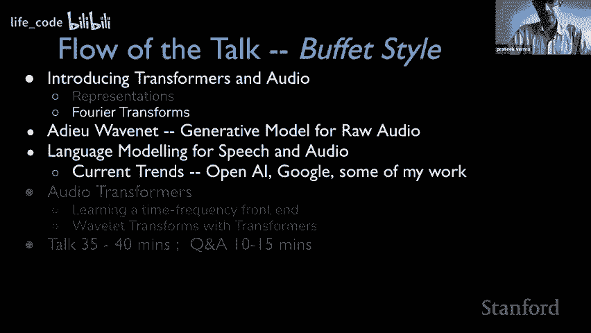

在本节课中，我们将学习Transformer模型如何应用于音频、语音和音乐领域。我们将从音频表示的基础知识开始，探讨如何利用Transformer进行原始音频的生成建模和语言建模，并了解如何结合信号处理技术来提升模型性能。

## 音频表示基础 📊

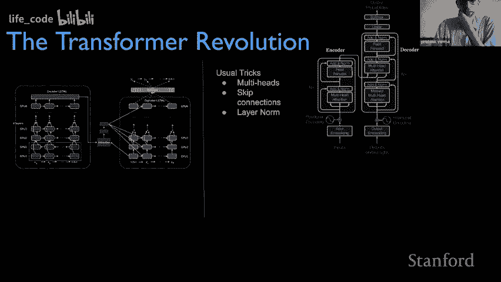

上一节我们介绍了课程的整体框架，本节中我们来看看音频是如何被表示和处理的。

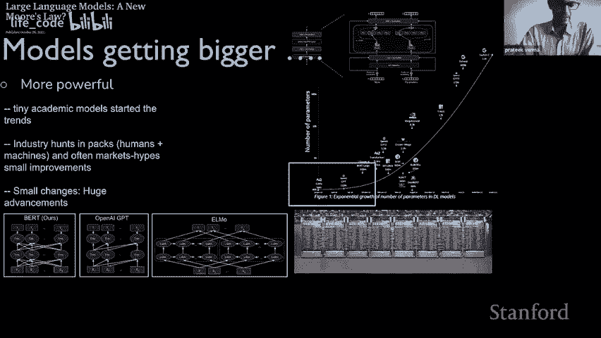

音频信号本质上是连续的时域信号。为了用计算机处理，我们需要将其转换为数字表示。一种常见的方法是使用**频谱图**。

你可以将任何时域信号分解为多种基函数。进行傅里叶变换，就像是将实际时域信号分解为正弦基组件。例如，一个由三个纯正弦波组成的波形，其傅里叶变换的幅度谱会显示各个成分的强度。

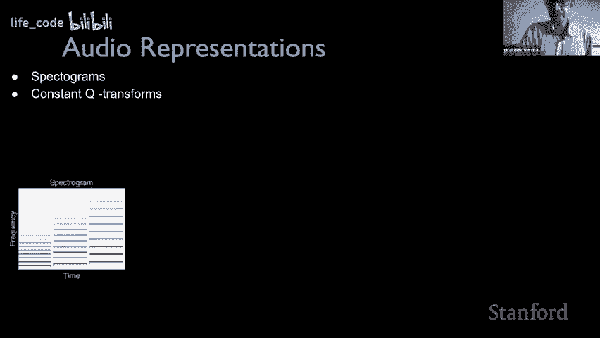

然而，许多信号是不连续的，其变化相当大。因此，我们需要一种方法来分析信号的局部特性。传统做法是对信号进行**加窗处理**，然后对每个窗口应用傅里叶变换。

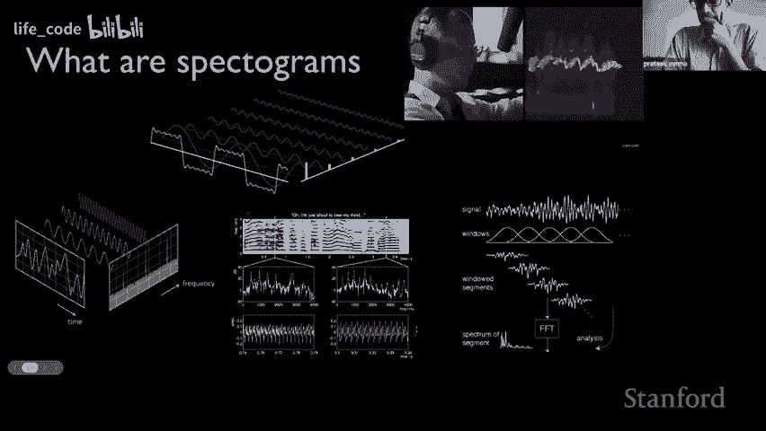

对于频谱图表示，你不断堆叠这些傅里叶变换切片的幅度，从而获得音频信号的二维表示。其中，x轴是时间，y轴是频率，强度（通常用颜色表示）代表能量。

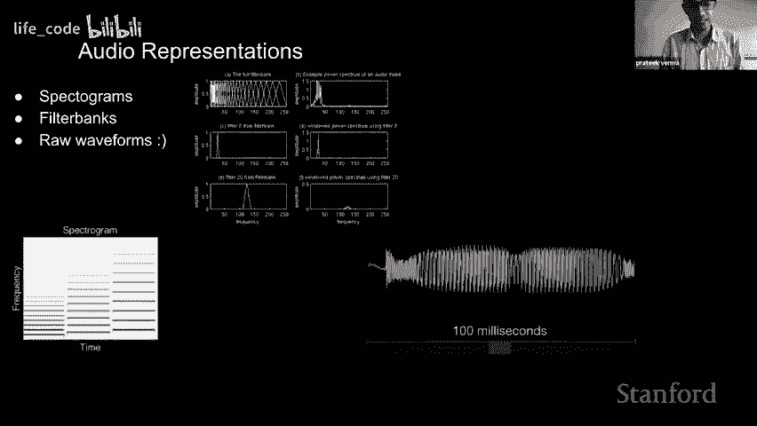

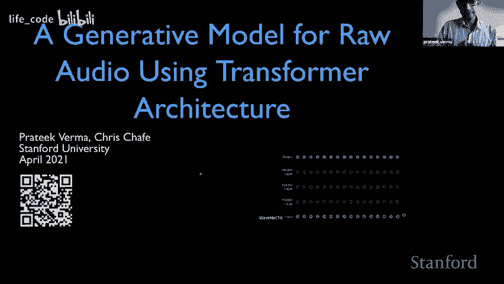

以下是不同类型的音频表示：
*   **原始波形**：直接对连续信号进行采样和量化。例如，电话语音通常以每秒16000次（16kHz）的速率采样，每个样本用8位或16位量化。
*   **线性频谱图**：对加窗信号进行傅里叶变换后得到的幅度谱。
*   **对数梅尔频谱图**：将频率轴转换为对数尺度（如梅尔尺度），以更接近人类的听觉感知。其优势在于不同频率之间的谐波间距保持一致，便于卷积滤波器学习。

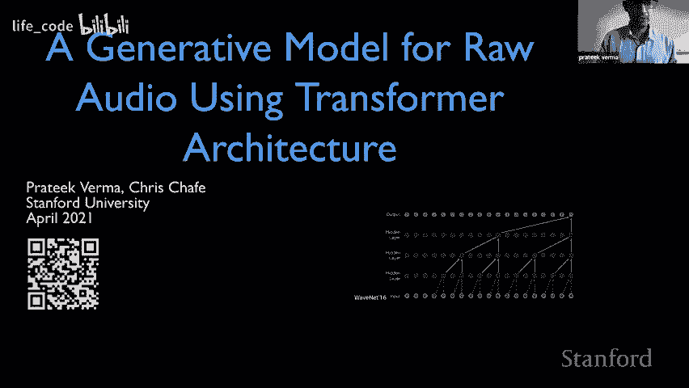

将连续音频问题转化为离散空间（如256个量化级别），就进入了**语言建模**的领域。

## 原始音频的生成建模 🎛️

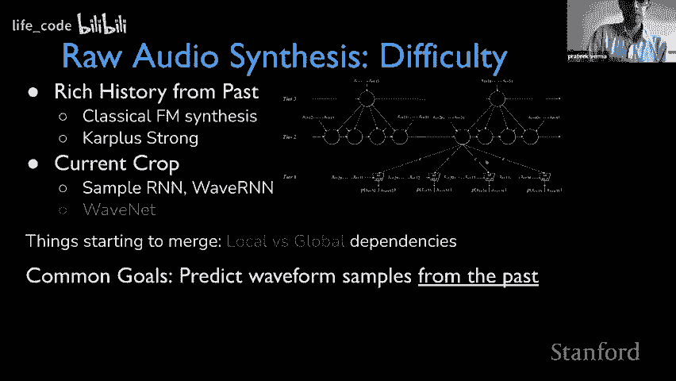

上一节我们了解了音频的表示方法，本节中我们来看看如何利用Transformer对原始音频进行生成建模。

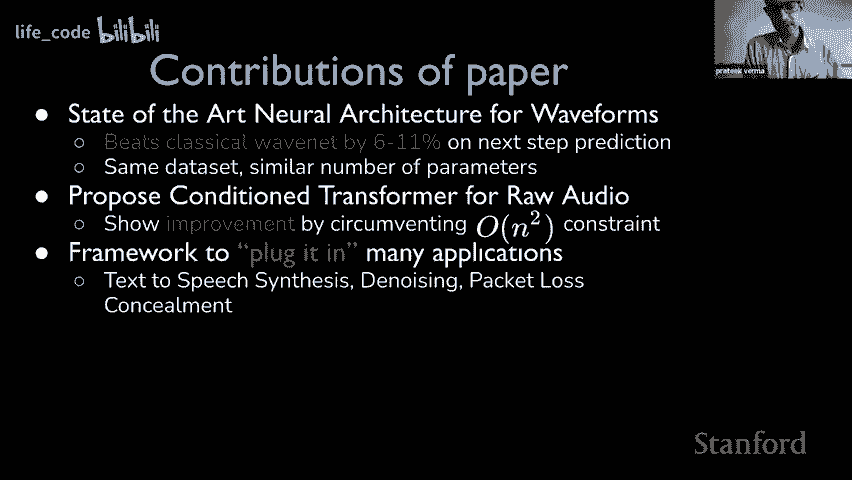

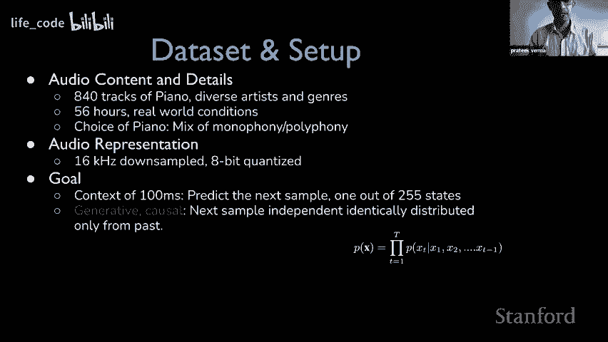

这类似于使用Transformer的WaveNet。其核心思想是将音频样本的预测视为一个语言建模问题。模型需要根据过去的上下文，预测下一个音频样本（在255个离散级别中）的概率分布。

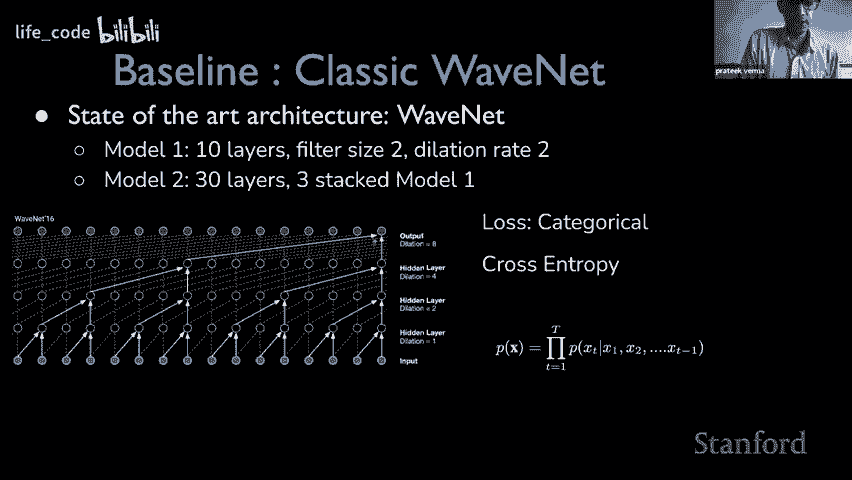

WaveNet是一种基于扩张卷积的模型，它通过跳过连接有效解决了长序列建模中的梯度消失问题。然而，Transformer通过自注意力机制，可以更灵活地学习序列中长距离的依赖关系，理论上应能超越WaveNet。

我们面临的挑战是计算复杂度。注意力机制需要存储O(n²)的矩阵，对于长音频序列（如10秒对应160,000个样本）内存消耗巨大。我们的解决方案是引入条件处理。我们使用CNN层对过去的上下文进行编码，生成一个潜在表示，然后用这个潜在表示来条件化Transformer，以预测下一个样本。

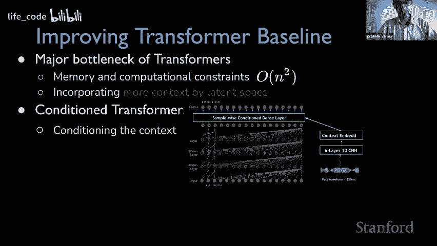

在评估中，我们比较了在相同参数规模和交叉熵损失下，条件化Transformer与堆叠WaveNet在下一个样本预测任务上的表现。

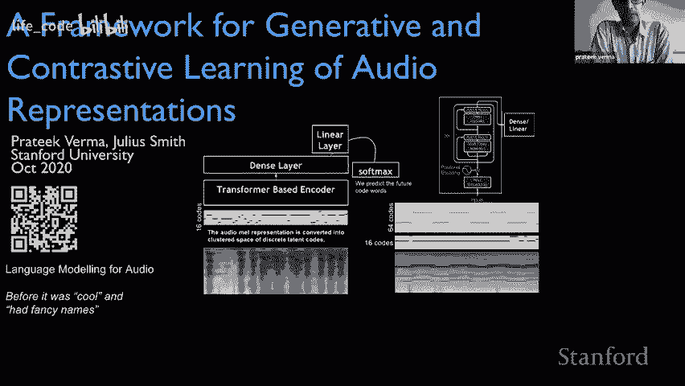

## 音频的离散化与语言建模 🔤

上一节我们探讨了在样本级别进行生成建模，本节中我们来看看如何在更高、更语义的层次上对音频进行语言建模。

这与声学场景理解有关。目标是理解一段音频的内容，其应用广泛，如自动驾驶中的声音检测、健康监测、音乐推荐等。

当前的一个流行范式是：**在离散标记空间中进行语言建模**。Transformer在处理离散序列方面表现出色。因此，解决方案是先将连续的音频信号转换为离散的代码序列。

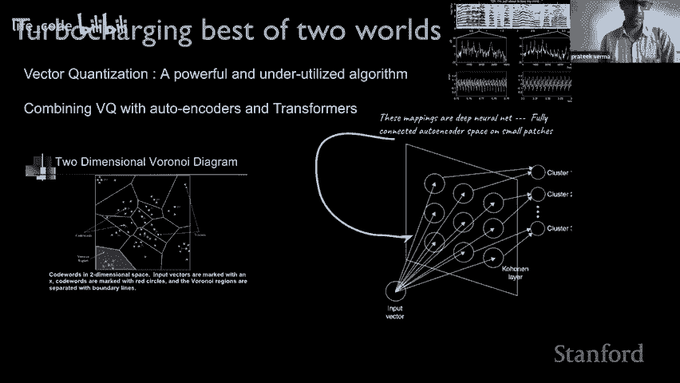

**向量量化（VQ）** 是实现这一点的关键算法。其基本功能是为连续的嵌入空间提供离散代码。例如，你可以训练一个自编码器来学习音频片段的嵌入，然后在嵌入空间的瓶颈层应用K-means聚类，将每个连续嵌入映射到最近的聚类中心（即一个离散代码）。

一旦获得离散代码序列，就可以像处理文本一样，使用自回归Transformer模型来预测下一个代码。生成了未来的代码序列后，可以使用如WaveNet之类的解码器将代码转换回连续的音频波形。这与OpenAI的Jukebox等工作思路相似。

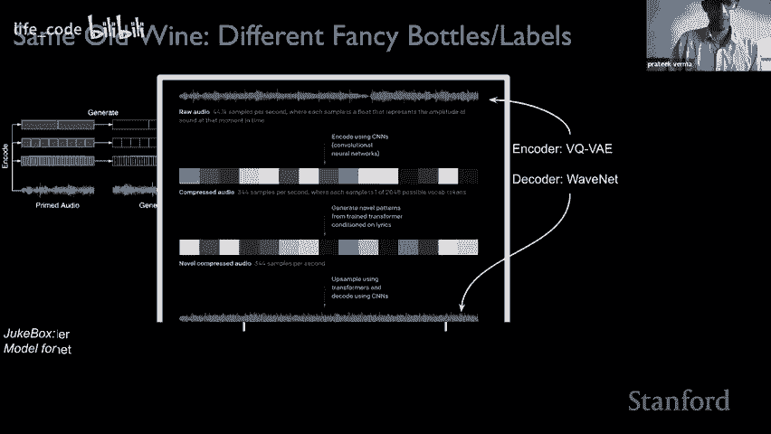

在我们的实验中，我们直接在频谱图片段上应用VQ，学习离散代码，并用Transformer进行预测。我们发现，**代码的数量至关重要**：代码太少会丢失信息，太多则会对噪声敏感。

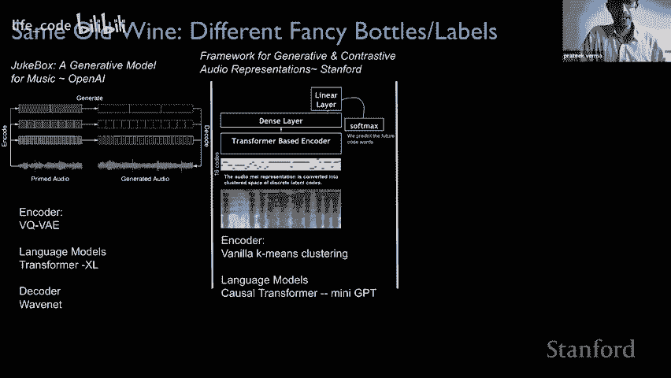

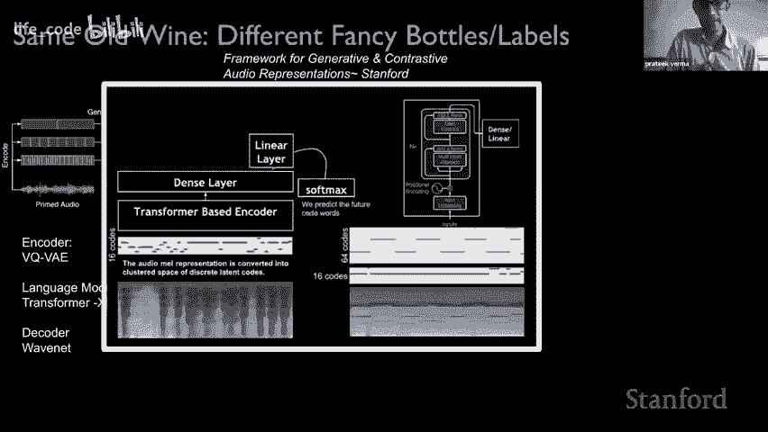

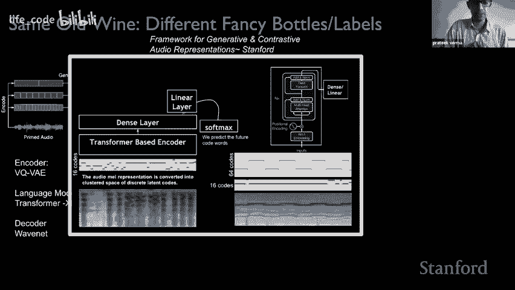

与纯监督学习方法相比，这种无监督的“音频语言模型”在大量数据上表现出潜力，尽管目前仍有性能差距，但随着数据和模型规模的扩大，其表现有望持续提升。

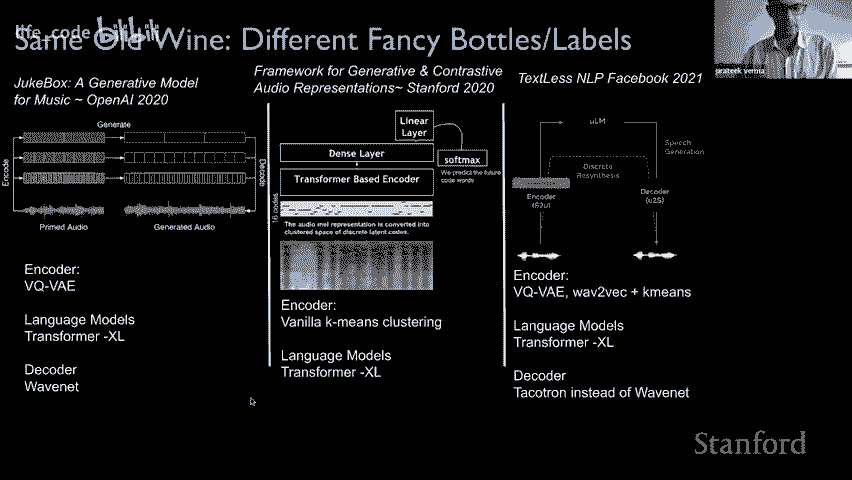

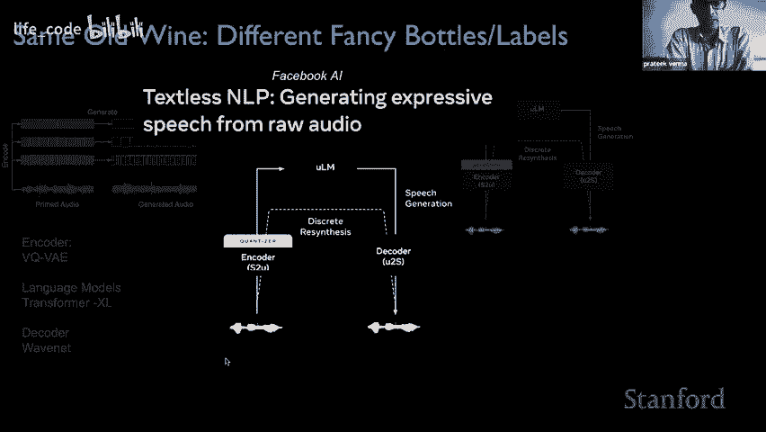

## 结合信号处理的音频Transformer 🛠️

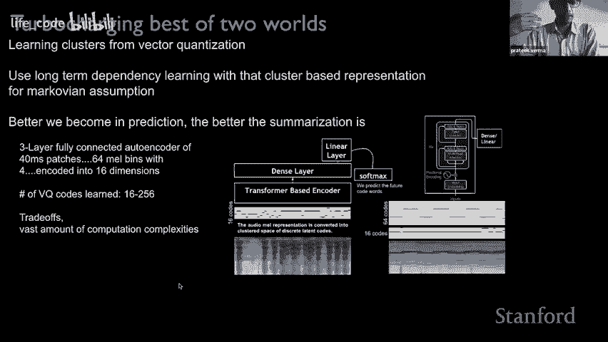

上一节我们讨论了在离散空间进行语言建模，本节中我们来看看如何将视觉Transformer的思路与信号处理结合，直接应用于音频分类。

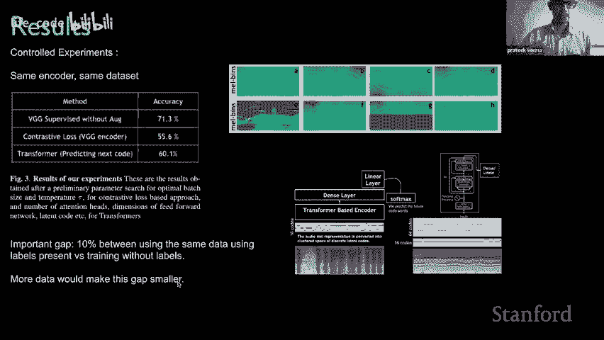

基本方法类似于视觉Transformer（ViT）。我们将输入信号（原始波形或频谱图）分割成小块，通过线性投影转换为嵌入向量，然后输入标准的Transformer编码器，最后通过一个分类头进行预测。

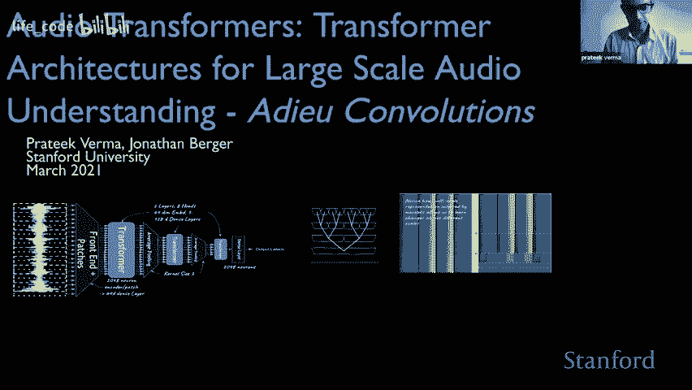

我们的工作在此基础上更进一步，尝试引入**层次结构**来提升性能。我们在Transformer的中间嵌入上应用了**小波分解**。

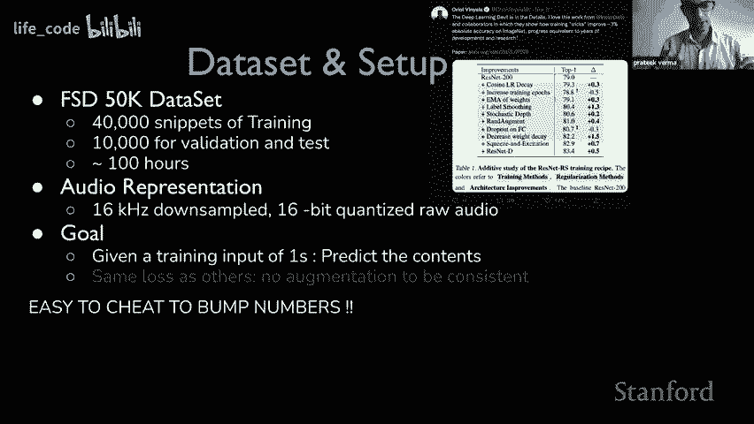

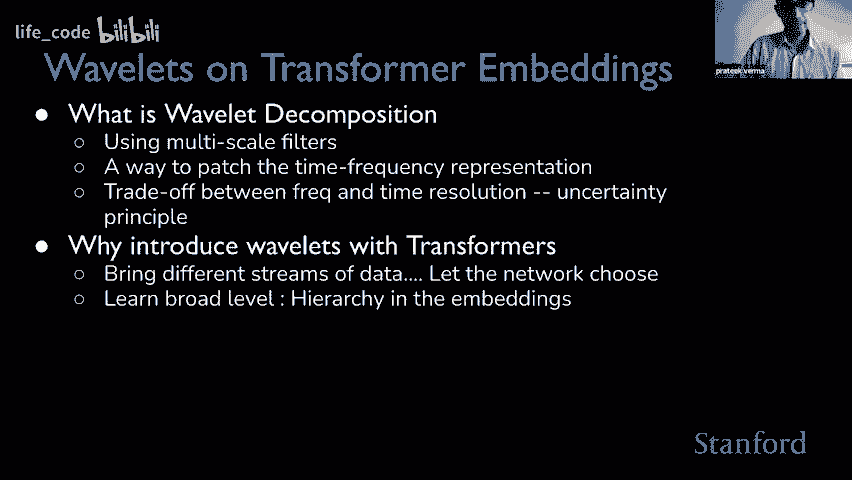

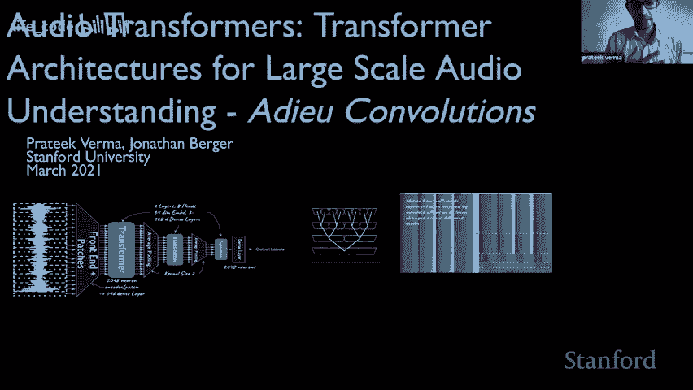

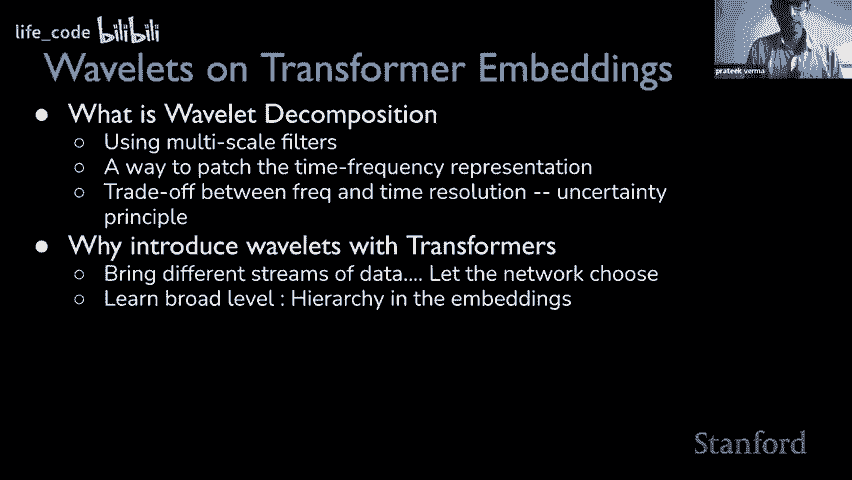

用小波的术语简单来说，这就像是将中间嵌入分解成不同“速度”的分量：一些代表缓慢变化的趋势（低频），一些代表快速变化的细节（高频），还有一些保持原始分辨率。这样，在Transformer的单层嵌入中，我们就学习到了一种树状的层次结构。

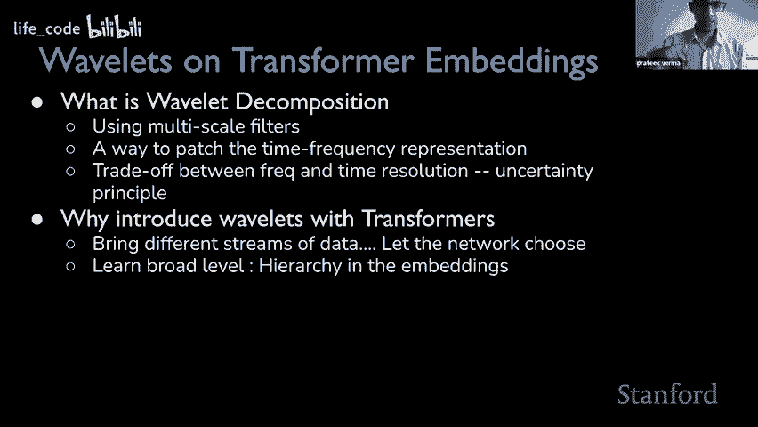

具体操作是，对Transformer某一层的所有输出嵌入，我们通过平均池化等方式，生成一组分辨率递减的嵌入序列（例如，全分辨率、半分辨率、四分之一分辨率），然后将它们重新组合。这个过程不引入额外参数，只是定义了处理嵌入的基函数。

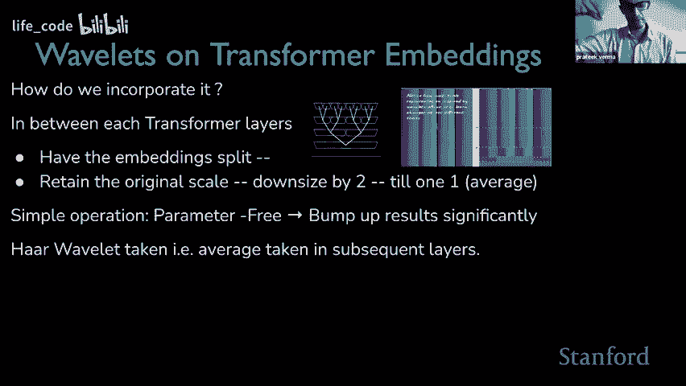

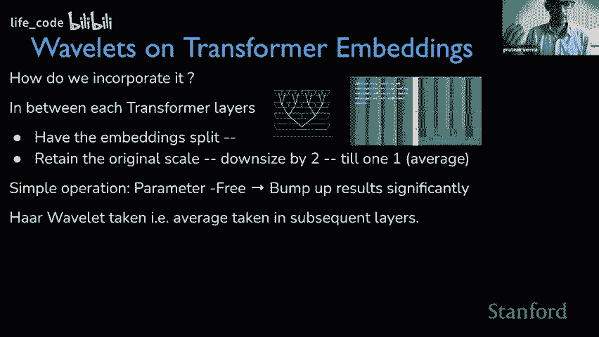

在音频分类任务上的实验表明，即使是很小的Transformer模型，其性能也超越了传统的CNN模型（如DenseNet）。加入多尺度（小波）处理或池化层后，性能得到了进一步提升。

此外，我们还分析了模型第一层学习到的表示。与固定的傅里叶基函数不同，Transformer学习到了一种**适应于特定任务**的时间-频率表示。例如，它自动学到了类似于起始检测器、汉明窗以及针对不同频率的正弦波等滤波器，这相当于让模型根据任务调整了自己的“耳朵”，是一个非常有趣的发现。

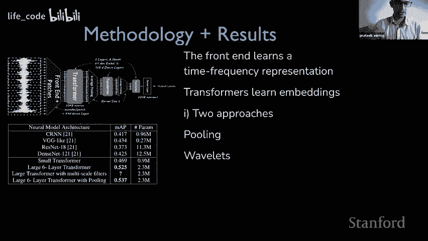

## 总结 📝

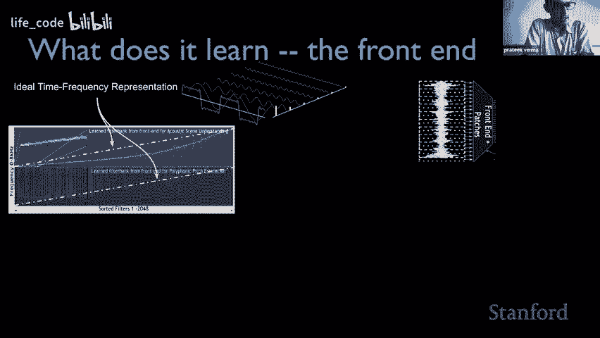

本节课中我们一起学习了Transformer在音频领域的多种应用方式。

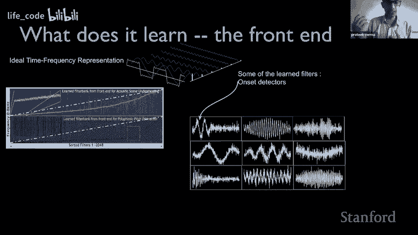

我们首先回顾了音频的频谱图等表示方法。接着，我们探讨了如何用Transformer进行原始音频样本的生成建模，将其视为一个离散序列预测问题。然后，我们介绍了通过向量量化将音频转换为离散代码，并在该空间中进行语言建模的流行范式，这有助于音频内容的理解和生成。最后，我们看到了如何将视觉Transformer的结构直接用于音频分类，并通过引入小波分解等多尺度处理来提升性能，同时发现模型能自动学习到适应任务的前端滤波器。

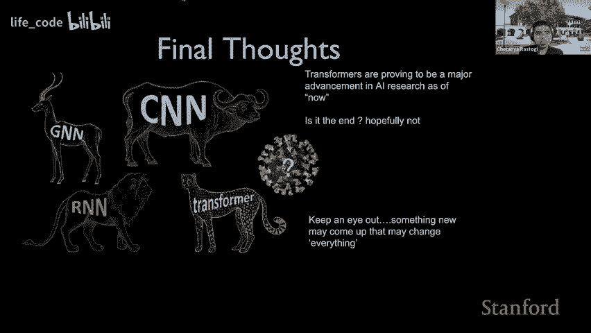

Transformer因其灵活性和强大的序列建模能力，正在音频、语音和音乐研究中证明其价值，不断推动着这些领域的发展。