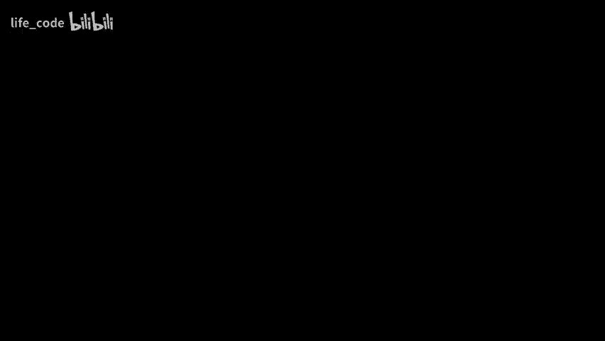

# 10：神经网络中的部分-整体层次结构表示 🧠

在本节课中，我们将探讨神经网络如何表示复杂的部分-整体层次结构，例如从“鼻孔”到“鼻子”再到“脸”的层级关系。我们将通过一个名为“Glom”的假想系统来解释这些概念，并理解其背后的核心思想，如坐标变换、一致性岛屿和对比学习。

---

## 概述：演讲背景与目标

在开始之前，需要说明本次演讲的内容与近期在斯坦福的演讲相同。演讲者建议听众如果已经参加过，可以离开，因为不会学到新内容。

本课程的目标是结合神经网络的最新思想，解释一个神经网络系统如何表示部分-整体层次结构，同时不违反神经元工作的基本原则。解释将通过一个假想的系统设计文档展开。

---

## 神经网络研究的两种动力

目前，大多数研究神经网络的人从事工程工作，他们并不关心这是否是大脑的工作方式，而是专注于创造新技术。因此，像残差网络中的100层或卷积神经网络中的权重共享都是可以接受的。

另一部分研究人员，特别是计算神经科学家，则研究神经网络以试图理解大脑可能的工作方式。演讲者认为，我们仍然可以从大脑中学到很多东西。在约半个世纪的时间里，推动神经网络研究的唯一动力就是相信这些系统能够学习复杂内容，因为大脑可以做到。

---

## 动态表示的问题与“胶囊”理论

在视觉处理中，每个图像都有一个不同的解析树，代表了图像中部分与整体的结构。然而，在真正的神经网络中，你不能动态分配神经元。你不能随意指定一组神经元来代表某个概念，因为神经元的功能由其连接决定，而这些连接变化缓慢。

在符号人工智能中，这不是问题，你可以简单地分配一块内存来表示解析树中的一个节点。大约五年前，演讲者尝试了一种名为“胶囊”的理论。其思想是，由于不能动态分配神经元，因此提前分配它们。你将一组神经元分配为潜在的“胶囊”，对于大多数图像，这些胶囊中的大多数将是静默的，少数会激活。对于那些活跃的胶囊，必须动态地将它们连接到一个树状结构中。

虽然与一些有能力的人合作最终使胶囊理论工作，但过程相当艰难。现在，演讲者有了一个新的理论，可以看作是一种“通用胶囊”模型。

---

## Glom 系统简介：列与嵌入

这个新理论中的虚拟系统称为 **Glom**。在 Glom 中，硬件被分配给“列”。每列包含对图像一个小补丁中发生的事情的多个层次的表示。

例如，在一列中：
*   较低层次可能表示“这是一个鼻孔”。
*   下一层次可能表示“这是一个鼻子”。
*   再往上一层可能表示“这是一张脸”。
*   顶层可能表示“这是一个派对场景”。

表示部分-整体层次结构的关键思想是利用这些不同层次“嵌入”之间的**一致性岛屿**。随着在层次结构中向上移动，你试图让表示越来越相似，以此来压缩冗余。嵌入向量像动态指针一样工作，它们是神经激活，可以为每个图像不同。

---

## 坐标系统的心理现实性演示

为了证明我们理解图像时使用坐标系统，并且解析树具有心理现实性，演讲者进行了一个演示。

想象一个放在桌面上的线框立方体。旋转它，使得一个特定的角（前下右角）保持在桌面，其对角的角（后上左角）垂直在上方。然后，尝试指出其他角的位置。

常见的错误是指出四个角在一个正方形中。这实际上描述了一个八面体，而不是立方体。这个演示表明，当被迫使用一个新的坐标框架（垂直对角线）时，熟悉的事物会变得完全陌生。卷积神经网络没有这种能力，即对同一事物有两个完全不同的内部表征。

另一个演示涉及观察一个被称为“皇冠”的线条图。如果你感知到它，并问自己哪里有平行边，你可能只意识到其中两条边是平行的，而不会意识到其他对边也是平行的。这是因为你使用的坐标系统与某些边对齐，而与其他边不对齐。

这种模糊性不同于内克尔立方体的深度翻转，它更像是句子“下个周末我们应该去拜访亲戚”的两种不同解析，虽然真值条件相同，但意义不同。

---

## 结构描述与心理图像

在1970年代的人工智能中，使用“结构描述”来表示形状。例如，对于“皇冠”，会有节点代表“皇冠”和各个“襟翼”，并用弧标注它们之间的关系（如 `R_WX`，代表皇冠与襟翼之间的坐标变换矩阵）。

重要的是，这种关系 `R_WX` 不随视角改变，因此是放入神经网络权重中的理想知识。而皇冠的参考框架与观察者眼球参考框架之间的关系 `R_WV` 则会随着视角改变。

心理图像更像是一个带有视点信息的结构描述。例如，当解决“向东走一英里，向北走一英里，再向东走一英里”的方位问题时，你总是在一个特定的比例、方向和位置进行想象，这证明了在解决涉及关系的任务时，你会形成一个心理图像。

---

## 对比学习简介

对比学习是一种无监督学习方法。其核心思想是：让来自同一图像的两个不同裁剪（经过颜色失真处理）通过相同的神经网络，并最大化它们输出嵌入向量之间的相似性（共识）。

为了防止系统将所有输出都坍缩成相同的向量，还需要使用来自不同图像的裁剪作为负例，确保它们的表示不同。这种方法可以训练出良好的表示，之后只需一个简单的线性分类器就能在标签数据上取得好效果。

然而，一个问题是，对比学习通常在“接缝”层面工作。我们希望的是，在“对象”层面，只有当两个裁剪都来自同一对象时，它们的表示才应该相同。这需要引入注意力或门控机制。

---

## Glom 架构详解

Glom 的设计旨在进行对比学习，并引入类似 Transformer 的注意力机制，以避免在不该相同的情况下强行达成一致。

以下是 Glom 架构的核心运作方式（以静态图像为例，视为每帧相同的视频）：

1.  **层级与时间步**：系统在多个层次（如部分、对象、场景）上运作，并通过多个时间步迭代来稳定表示。
2.  **嵌入的决定因素**：在特定时间步、特定层次（如第 `L` 层）的嵌入向量由四个因素决定：
    *   **时间持续性（绿色箭头）**：倾向于与上一时间步同位置的 `L` 层嵌入相似。
    *   **自下而上预测（蓝色箭头）**：一个神经网络，接收上一时间步、低一层（`L-1`）的嵌入，预测当前 `L` 层应是什么（例如，从“鼻孔”预测“鼻子”）。
    *   **自上而下预测（红色箭头）**：一个神经网络，接收上一时间步、高一层（`L+1`）的嵌入，预测当前 `L` 层应是什么（例如，从“脸”预测“鼻子”）。
    *   **空间注意力（黑色箭头）**：与附近位置在同一层次（`L` 层）的嵌入进行注意力交互，试图达成共识。这是通过计算点积、softmax 加权平均来实现的。

3.  **共识岛屿的形成**：通过“空间注意力”机制，系统会努力让属于同一整体（如“脸”）的不同部分（如“鼻子”、“嘴巴”）在相应层次上获得相同的嵌入向量，从而形成“一致性岛屿”。

4.  **处理模糊性**：当一个图像补丁（如一个圆）可能属于多个整体（左眼、右眼、车轮）时，Glom 不在部分层面解决模糊性，而是跳到更高层次。在更高层次，来自不同假设的预测如果指向同一整体，它们的嵌入就会趋于一致，从而解决模糊性。这要求神经网络能够用嵌入向量表示高度多模态的概率分布。

5.  **训练方式**：可以通过类似 BERT 的掩码重建方式进行训练（遮挡部分图像，让网络预测）。此外，可以加入对抗学习来鼓励高层次形成大的共识岛屿。训练涉及在时间上进行误差反向传播。

---

## 神经场与位置信息

一个关键问题是：如何让同一个“自上而下”的神经网络，在图像的不同位置，根据相同的整体向量（如“脸”），预测出不同的部分向量（如“鼻子”、“嘴巴”）？

答案是引入**神经场**的概念。除了整体的嵌入向量，神经网络还将**图像补丁的位置坐标**作为额外输入。结合整体的姿势信息（编码在整体向量中）和具体的位置，网络就能判断在该位置应该预测整体的哪个部分，从而输出正确的部分向量。

---

## 总结与论文参考

本节课我们一起探讨了 Glom 系统如何通过结合以下思想来表示部分-整体层次结构：
*   **对比学习**：鼓励相似事物具有相同表示。
*   **Transformer 注意力**：在空间上达成共识，形成“一致性岛屿”。
*   **神经场**：利用位置信息，使同一网络能在不同位置预测不同部分。

Glom 通过在不同列中复制表示来处理模糊性，并通过迭代和注意力动态形成簇，而不是在固定数据中发现簇。这种设计可能更接近生物系统中的处理方式。

关于本主题更详细的讨论，可以参考演讲者发布在 arXiv 上的长篇论文。