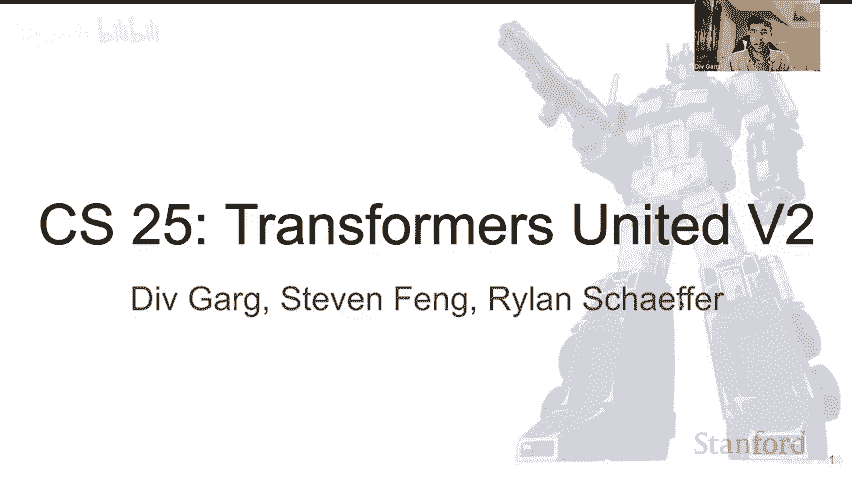
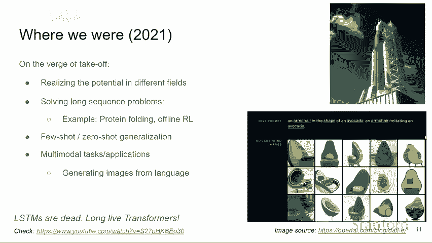
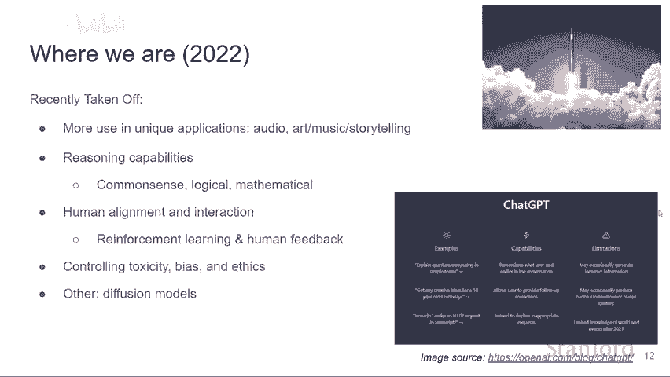
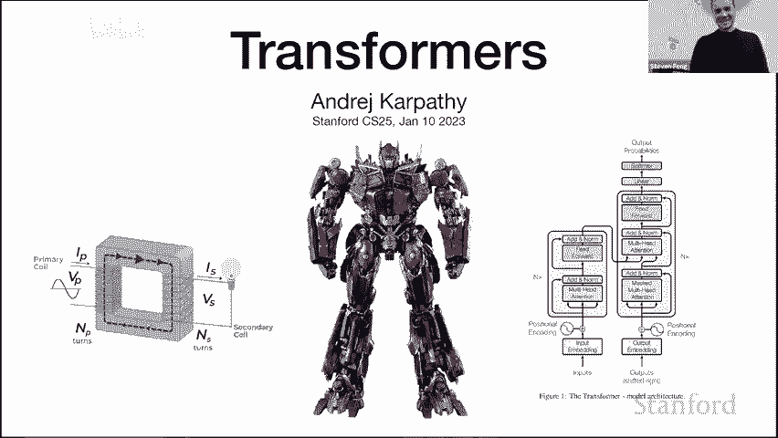

# 11：11. 变压器（Transformer）介绍 🧠




在本节课中，我们将要学习深度学习领域一个革命性的模型架构——变压器（Transformer）。我们将从历史背景出发，了解其诞生的原因，然后深入探讨其核心组件——注意力机制的工作原理，最后通过一个简化的代码实现来巩固理解。本节课旨在为初学者提供一个清晰、直观的变压器入门指南。

## 概述：为什么是变压器？





在深入细节之前，让我们先了解一下变压器为何如此重要。在2017年之前，处理序列数据（如文本、语音）的主流模型是循环神经网络（RNN）及其变体，如长短期记忆网络（LSTM）。然而，这些模型存在编码长序列信息能力不足的问题。

2017年，Vaswani等人发表了论文《Attention Is All You Need》，提出了变压器架构。它完全摒弃了循环结构，仅依赖注意力机制，并在机器翻译任务上取得了显著成功。自此，变压器迅速成为自然语言处理（NLP）乃至计算机视觉、语音识别、生物学等多个领域的核心模型架构。



变压器之所以成功，是因为它同时优化了三个关键特性：**强大的表达能力**、**易于通过梯度下降优化**，以及**在GPU上极高的计算效率**。它就像一个通用的、高效的、可优化的计算机。


## 历史背景：从特征工程到统一架构

上一节我们介绍了变压器的重要性，本节中我们来看看它的历史渊源。理解历史有助于我们明白变压器解决了哪些根本问题。

在2012年深度学习兴起之前，人工智能各个领域（如计算机视觉、自然语言处理）是割裂的。每个领域都有自己独特的特征工程方法和专业术语，模型之间几乎没有共通性。

2012年，AlexNet的成功证明了大规模神经网络和数据的重要性。此后，神经网络开始在各个领域普及，大家开始使用相似的工具（如PyTorch、TensorFlow），降低了跨领域研究的门槛。

然而，真正的架构统一发生在2017年变压器出现之后。人们发现，只需对变压器的输入数据进行适当调整（例如，将图像切块、将语音频谱切片），同一个架构就可以被“复制粘贴”到几乎所有领域，并且都表现优异。这种趋同性暗示我们可能正在接近一种通用、强大的学习算法。

## 核心机制：注意力就是一切

上一节我们回顾了历史，本节中我们来看看变压器的核心——注意力机制。理解注意力是理解整个架构的关键。

注意力机制的核心思想是：让序列中的每个元素（称为“令牌”或“节点”）都能根据内容相关性，直接与其他所有元素进行“沟通”。这种沟通不是顺序的，而是并行的。

我们可以将变压器的工作流程抽象为两个交替的阶段：
1.  **沟通阶段（多头注意力）**：节点之间交换信息。
2.  **计算阶段（前馈神经网络）**：每个节点独立处理接收到的信息。

在沟通阶段，每个节点会生成三个向量：
*   **查询（Query）**：代表“我正在寻找什么”。
*   **键（Key）**：代表“我拥有什么信息”。
*   **值（Value）**：代表“我将要传达什么信息”。

以下是计算注意力的核心公式：

```python
# 简化版注意力计算（非向量化，便于理解）
# 假设我们有一个节点，其查询向量为 q
# 有多个其他节点，它们的键向量为 k_i，值向量为 v_i

# 1. 计算亲和度分数：q 与每个 k_i 的点积
scores = [dot(q, k_i) for k_i in all_keys]
# 2. 使用 softmax 将分数归一化为概率分布（权重）
weights = softmax(scores)
# 3. 对值向量进行加权求和，得到该节点的更新信息
updated_info = sum(weights[i] * v_i for i in range(len(all_values)))
```

这个过程在所有节点上并行进行，就完成了一轮信息传递。**多头注意力**意味着同时进行多组这样的独立计算，让节点可以从不同角度寻找信息。

**自注意力（Self-Attention）** 是指查询、键、值都来自同一组节点（例如，处理一个句子时，所有单词互相关注）。**交叉注意力（Cross-Attention）** 则是指查询来自一组节点（如解码器），而键和值来自另一组节点（如编码器）。

## 架构详解：从理论到代码

上一节我们介绍了注意力机制的原理，本节中我们通过一个简化的仅解码器（Decoder-Only）变压器（例如GPT）的实现，来具体看看架构是如何组织的。

我们将使用一个在莎士比亚文本上训练的小型语言模型（nanoGPT）作为例子。它的目标是预测序列中的下一个字符。

以下是模型的主要步骤：

1.  **数据准备**：将文本字符转化为整数序列。
2.  **批次生成**：从长序列中截取固定长度的块作为训练样本。
3.  **前向传播**：
    *   **令牌嵌入**：将整数索引转换为向量。
    *   **位置编码**：为每个位置添加一个可学习的向量，让模型感知顺序。
    *   **变压器块**：数据经过多个相同的“块”进行处理。
    *   **语言模型头**：最后一个线性层，输出下一个字符的概率分布。
4.  **损失计算**：使用交叉熵损失比较预测和真实的下一个字符。

让我们深入看一下**变压器块**的内部结构。每个块包含：
*   一个**层归一化（LayerNorm）**。
*   一个**多头自注意力**层（沟通阶段）。
*   另一个**层归一化**。
*   一个**前馈神经网络（MLP）**层（计算阶段）。
*   每个主要操作周围都有**残差连接**，这有助于梯度流动和模型优化。

在自注意力层中，为了实现语言模型的**因果性**（即预测时不能看到未来的信息），我们需要使用一个**注意力掩码**。这个掩码会将未来位置的注意力权重设置为一个极大的负数（如 `-inf`），这样在 softmax 之后，这些位置的权重就为 0。

```python
# 因果注意力掩码的简化示例（下三角矩阵）
# 假设序列长度 T = 4
mask = [
    [1, 0, 0, 0],  # 第一个词只能看自己
    [1, 1, 0, 0],  # 第二个词能看前两个
    [1, 1, 1, 0],  # 第三个词能看前三个
    [1, 1, 1, 1],  # 第四个词能看全部（在训练时，其实也看不到自己，因为目标是下一个词）
]
# 在实际中，0的位置会被替换为 -inf，1的位置为0。
```

## 变压器的应用与未来方向

上一节我们剖析了变压器的代码实现，本节中我们来看看它如何被应用到各个领域，以及未来的挑战与发展方向。

变压器的灵活性令人惊讶。以下是一些应用示例：
*   **计算机视觉（ViT）**：将图像切割成小块，每个块视为一个令牌，输入变压器编码器。
*   **语音识别（Whisper）**：将音频的梅尔频谱图切片，作为令牌序列处理。
*   **强化学习（Decision Transformer）**：将状态、动作、奖励序列视为一种“语言”进行建模。
*   **生物学（AlphaFold）**：用于蛋白质结构预测的核心计算模块。

其核心优势在于，**任何数据都可以被切割成片段（令牌），并作为一个集合输入变压器**。模型通过自注意力自行学习这些片段之间的关系，无需人工设计复杂的特征交互方式。

尽管取得了巨大成功，变压器仍面临挑战，也是未来的研究方向：
1.  **扩展上下文长度**：标准注意力的计算复杂度随序列长度呈二次方增长，限制了模型处理超长文本（如整本书）的能力。
2.  **外部记忆与推理**：当前模型缺乏长期、可更新的记忆，在复杂推理和多步骤任务上存在局限。
3.  **提高可控性与可解释性**：如何更精确地控制模型输出，并理解其内部决策过程。
4.  **探索非自回归生成**：当前主流是逐个令牌生成，未来可能探索像扩散模型那样能并行生成或反复修改序列的方法。

## 总结

本节课中我们一起学习了变压器模型。我们从其革命性的历史地位讲起，理解了它如何统一了多个AI领域的建模方式。我们深入探讨了其核心——注意力机制，将其理解为节点间基于内容的信息传递。随后，我们通过一个简化的GPT式代码实现，拆解了仅解码器变压器的各个组件，包括令牌嵌入、位置编码、带掩码的多头注意力、前馈网络和残差连接。最后，我们展望了变压器在视觉、语音等领域的广泛应用以及未来的发展方向。


变压器不仅仅是一个用于机器翻译的模型，它更像是一个**通用的、高效的、可通过数据编程的计算机**。它的出现标志着我们向构建更通用的人工智能迈出了关键一步。希望本教程能帮助你建立起对变压器直观而扎实的理解。