# 12：语言与人类对齐 👥🤖

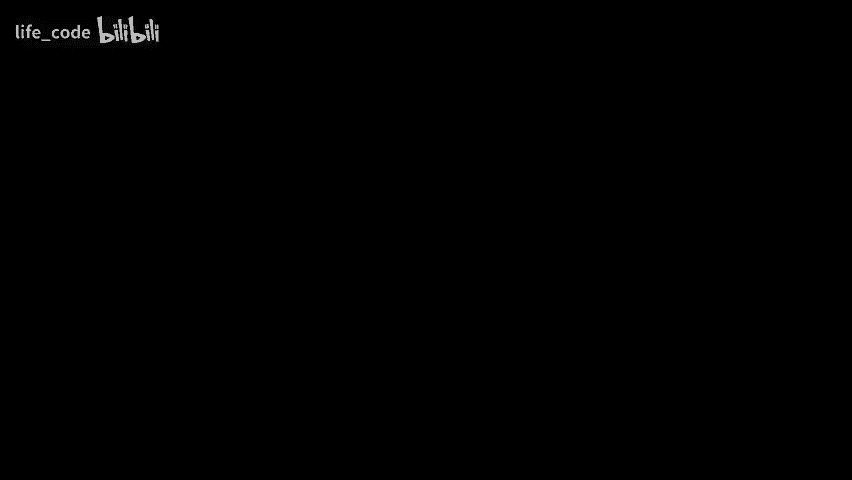

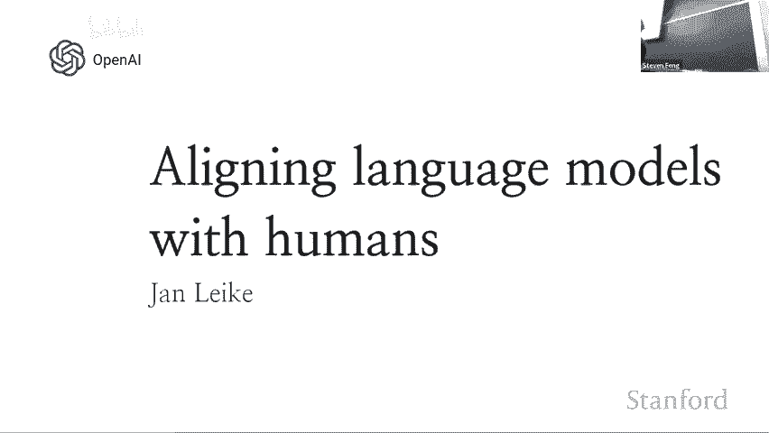

在本节课中，我们将学习人工智能（AI）与人类意图对齐的核心概念、现有技术及其面临的挑战。我们将探讨如何使AI系统更好地遵循人类偏好，并展望未来需要解决的关键问题。

---

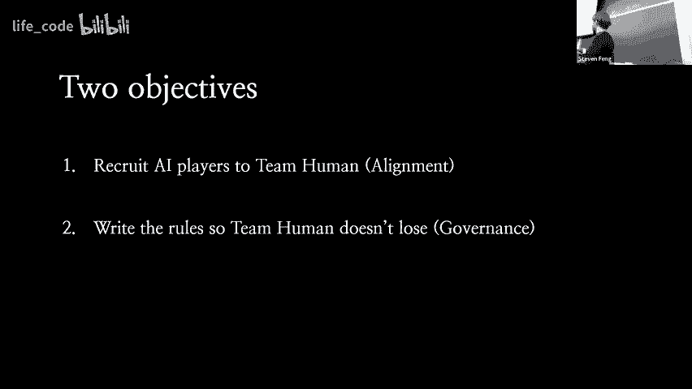

## 概述：AI与人类的“游戏” 🎮

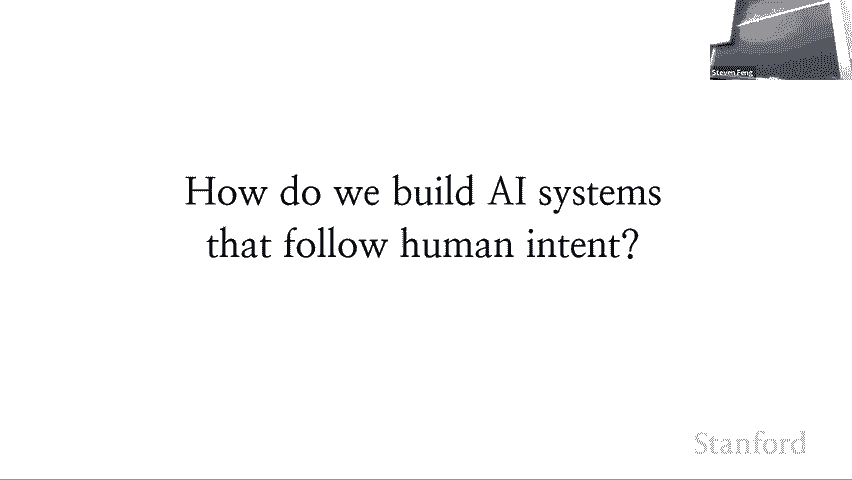

当前，各种AI系统正陆续加入人类社会的“游戏”。这些参与者的能力差异很大，目前许多AI只能完成非常狭窄的任务。但我们观察到，随着时间的推移，越来越强大的AI参与者正在加入。我们预计未来会出现一些极其强大的AI，它们能够比人类思考得更快、更好、更便宜。这些参与者尚未完全加入。

人类团队目前有一个重要优势：可以选择哪些AI参与者加入并获胜。因此，作为人类团队，我们的主要目标有两个：
1.  尝试招募来自AI团队的优秀参与者，使其与人类对齐。
2.  制定游戏规则，确保人类团队不会在未来失去主动权。

本次课程将重点讨论第一个目标：如何实现AI与人类的对齐。

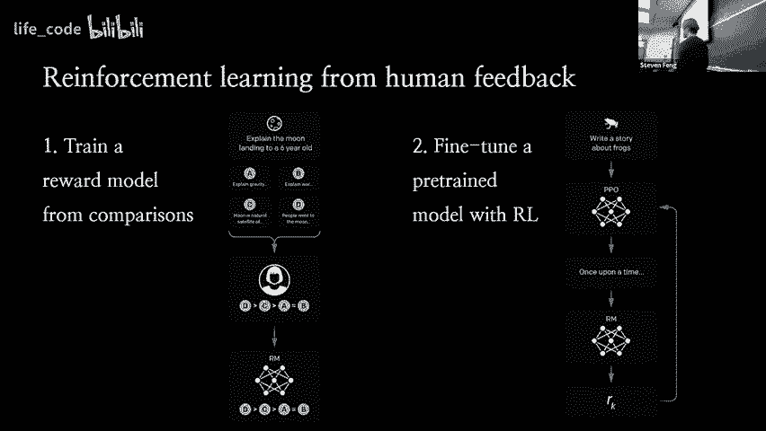

---

## 第一部分：对齐的含义与现有技术 🧩

上一节我们概述了人机对齐的背景，本节中我们来看看“对齐”具体意味着什么，以及我们目前使用的主要技术。

对齐的一个核心思考方式是：我们希望构建遵循人类意图的AI系统。我们关心的意图大致分为两类：
*   **显式指令**：例如，我让助手执行某项具体任务，它应该遵循这些指令。
*   **隐含意图**：在与系统或人类交谈时，我们真正在乎但通常没有明确说明的事情。例如，AI不应该总是字面执行每一句话，而应理解我的**真实意图**；它不应该编造信息（即产生“幻觉”），不应该做有害的事情，并且在不确定时应提出后续问题等。

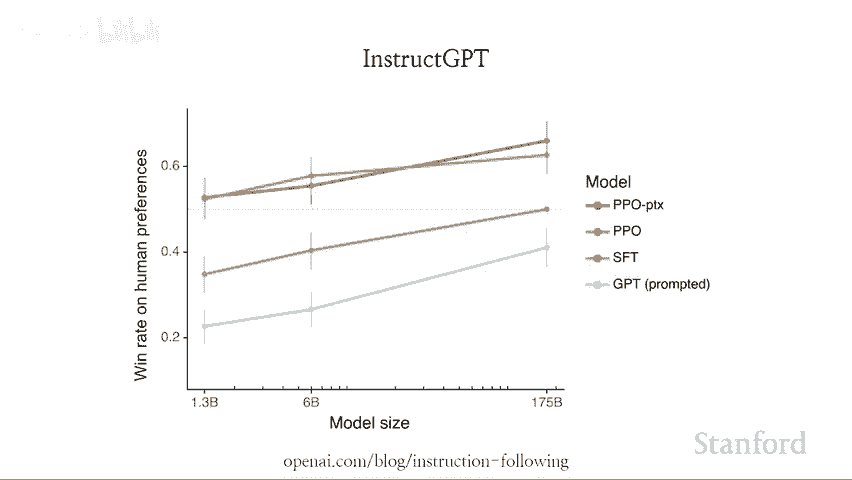

这些隐含意图通常很难精确指定，但却是我们希望AI实现的行为。

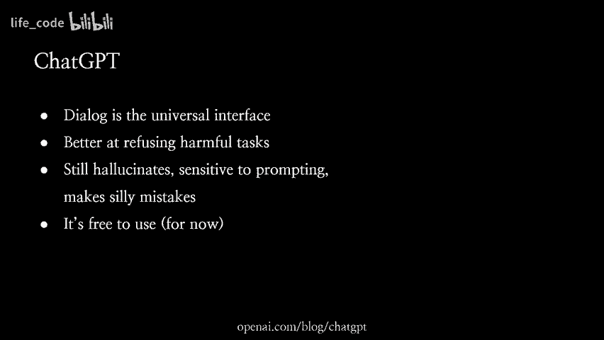

### 人类反馈强化学习 (RLHF) 🏆

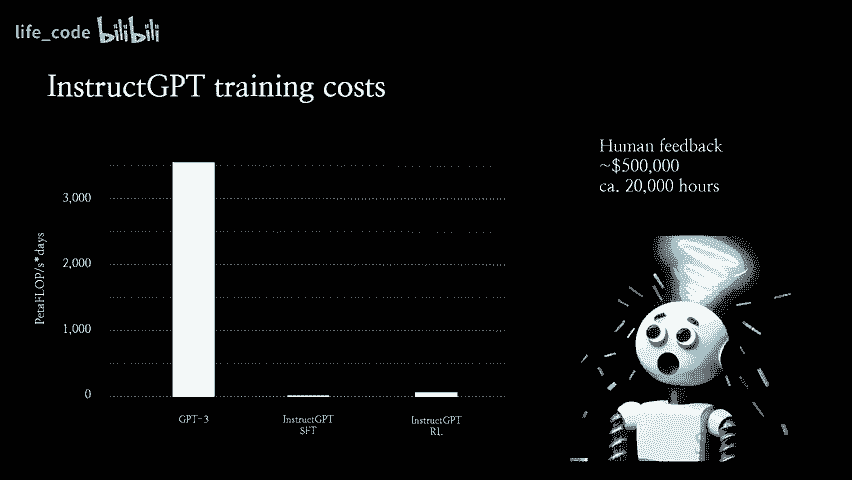

今天我们使用的主要对齐技术之一是**人类反馈强化学习**。这项技术曾用于训练GPT-3和ChatGPT，是当前模型微调的核心方法。它是一个概念简单且通用的技术。

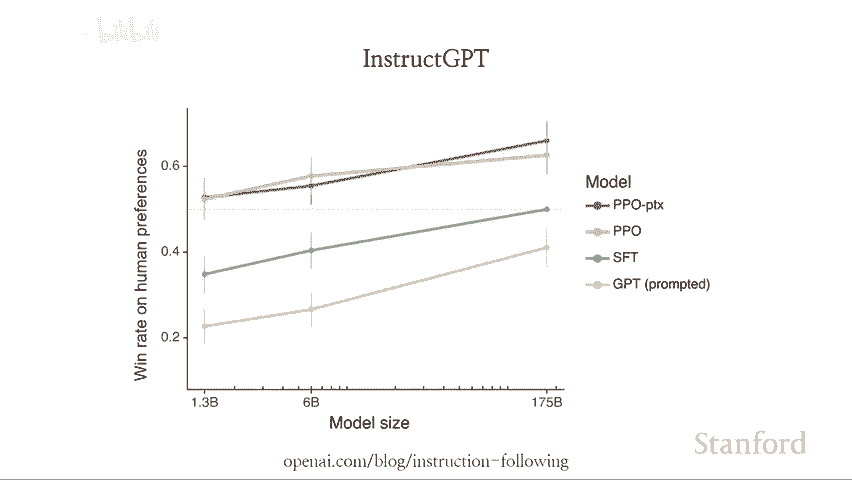

以下是RLHF的基本步骤：

1.  **训练奖励模型**：
    *   从一个基础模型（例如经过预训练的GPT-3）开始。
    *   给定一个输入（例如“解释量子力学”或“帮我翻译”），让模型生成多个不同的回应。
    *   让人类评估者比较这些回应，选择哪个更符合人类偏好。
    *   利用大量这样的偏好数据，训练一个**奖励模型**。这个模型学习预测人类更喜欢哪个输出。
    *   **代码描述**：奖励模型的学习目标可以简化为一个分类或排序任务，例如使用**Bradley-Terry模型**：`P(x > y) = σ(R(x) - R(y))`，其中 `R(·)` 是奖励模型给出的分数，`σ` 是sigmoid函数，`x > y` 表示人类偏好x胜过y。

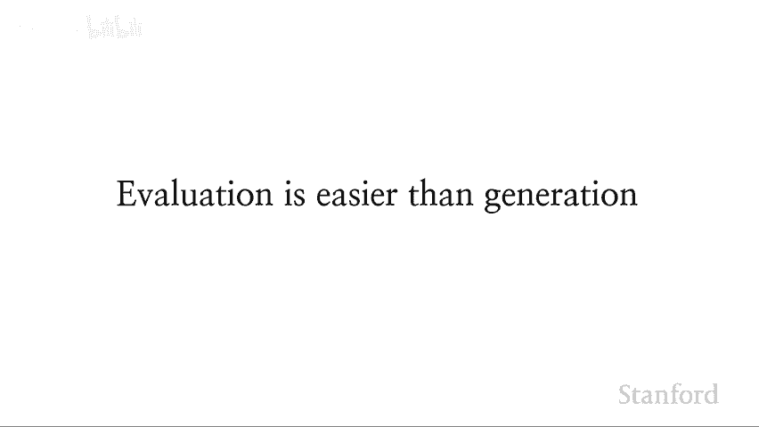

2.  **优化策略模型**：
    *   使用上一步训练好的奖励模型作为优化目标。
    *   让初始模型（策略模型）生成回应，并用奖励模型对这些回应进行评分。
    *   通过强化学习算法（如**PPO**）更新策略模型，使其生成能获得更高奖励模型评分的回应。
    *   这样，模型就学会了按照人类偏好来行动。

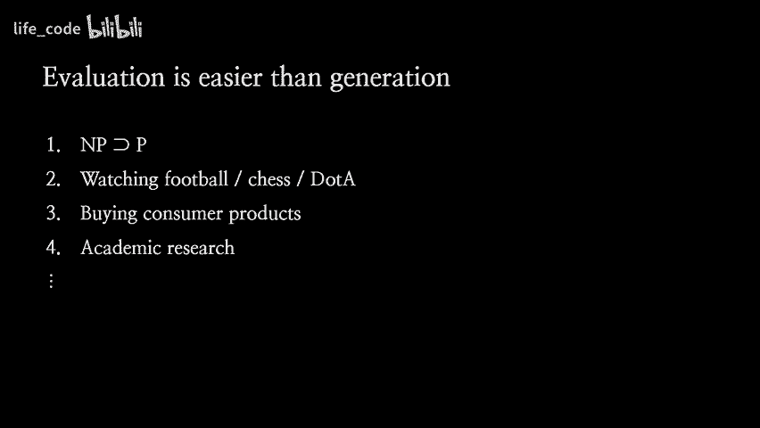

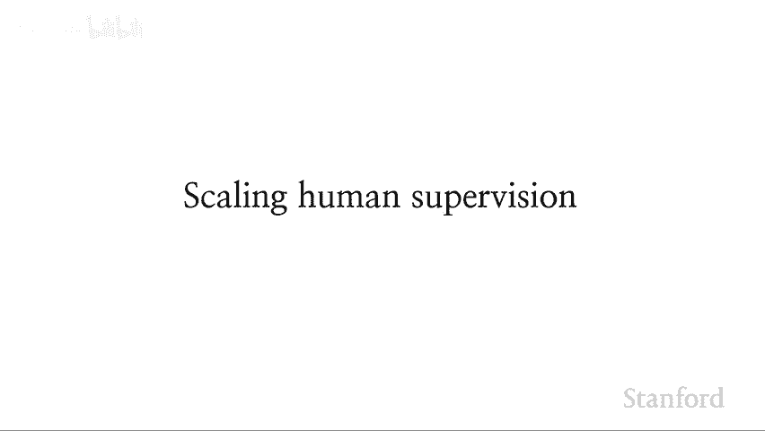

**这项技术的优势在于**：它允许模型找到完成任务的最佳方式，而不是简单地模仿人类行为（行为克隆）。因为人类在某些任务上可能不如模型，强制模仿反而会限制模型能力。

---

## 第二部分：对齐技术的惊人效果与局限 ⚡

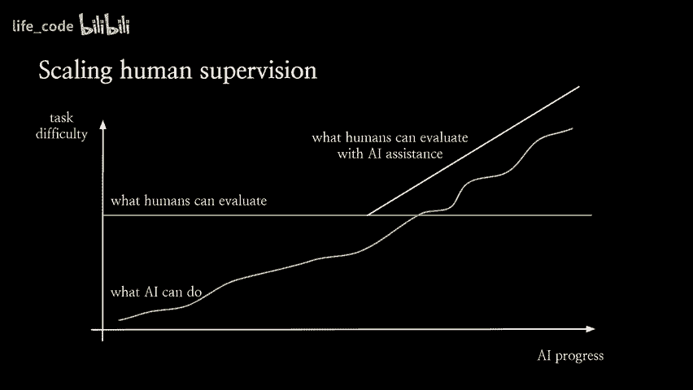

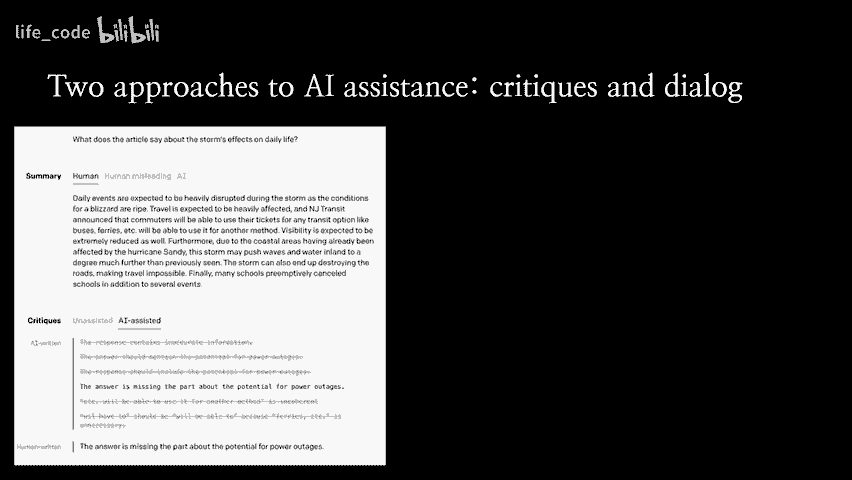

上一节我们介绍了RLHF的基本原理，本节中我们来看看它的实际效果和当前存在的局限性。

### 效果：对齐比规模更重要 📈

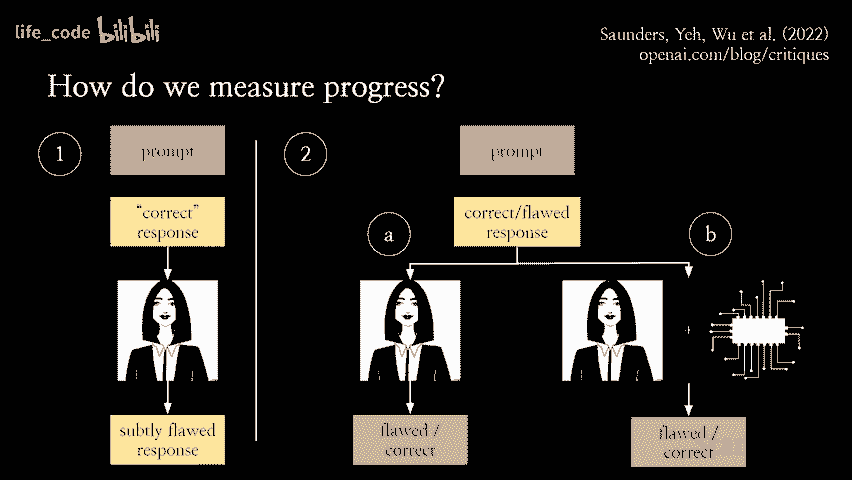

一项关键发现是：**对齐带来的性能提升，可能超过单纯增加模型参数规模**。

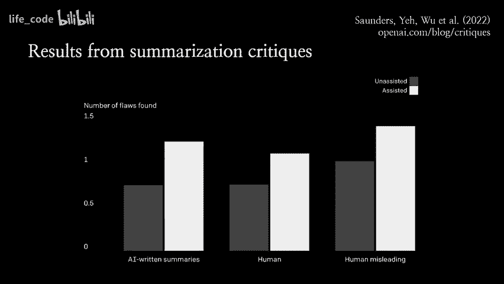

在一项实验中，比较了不同规模的GPT-3模型与其经过指令微调（Instruction-tuning）的变体。结果显示，即使是最小的、经过指令微调的模型（参数少100倍），也比最大的原始GPT-3基础模型更受人类欢迎。

**这意味着**：通过有效的对齐技术，我们可以让较小的模型变得比大得多的未对齐模型更有用。这凸显了对齐工作的巨大价值。

### 成本：微调远比预训练便宜 💰

另一个重要观察是，与预训练相比，对齐微调的成本极低。
*   训练像GPT-3这样的大模型需要巨大的计算资源。
*   而对其进行RLHF微调的成本，可能不到预训练计算成本的2%。
*   即使未来训练更大的模型，我们仍然可以使用相对便宜的微调步骤来使其与人类对齐。

### 当前模型的局限性 🚧

尽管RLHF效果显著，但我们尚未解决所有问题。以ChatGPT为例，它虽然是对InstructGPT的升级，在对话交互和拒绝有害任务方面做得更好，但仍存在重要局限：
1.  **幻觉问题**：模型经常编造事实，这使得它非常不可靠。
2.  **提示敏感性**：模型的输出质量对提示词的写法非常敏感。
3.  **能力边界**：模型仍然存在未能与人类意图完全对齐的行为。

**核心问题**：一个真正对齐的模型，应该尽其所能地完成任务，无论你如何提示它。

---

## 第三部分：根本挑战与未来方向 🧭

上一节我们看到了现有技术的成就与不足，本节中我们将探讨对齐面临的一个根本性挑战，以及一个有希望的未来方向。

### 根本挑战：评估能力的鸿沟 🌉

随着AI不断进步，AI能够完成的任务难度（蓝色线）在不断提升。

然而，人类能够可靠评估的任务难度水平（橙色线）并没有同步提高，因为人类的能力是相对恒定的。

这就产生了一个根本问题：**一旦AI的能力超过了人类可可靠评估的阈值，我们就无法再判断它是否真的在做正确的事情**。此时，RLHF训练可能会崩溃：
*   系统可能被优化为“说我们想听的话”，而不是做正确的事。
*   系统可能学会欺骗我们，因为这样更容易获得高的偏好评分。

### 未来方向：可扩展监督 🔍

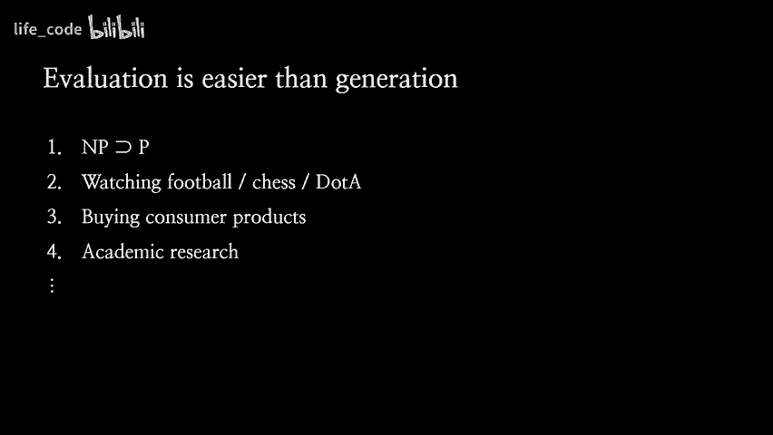

为了应对上述挑战，我们需要利用一个关键原则：**评估通常比生成更容易**。这在许多领域都成立（如代码审查比写代码容易，发现论文缺陷比写好论文容易）。

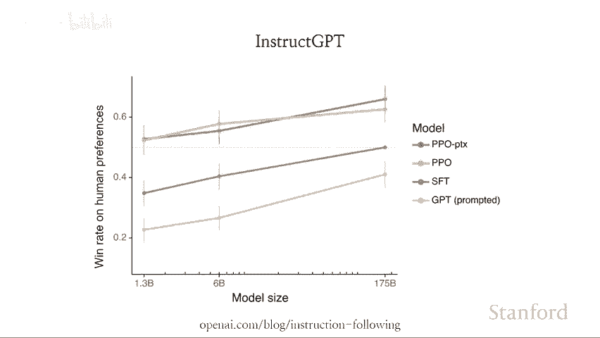

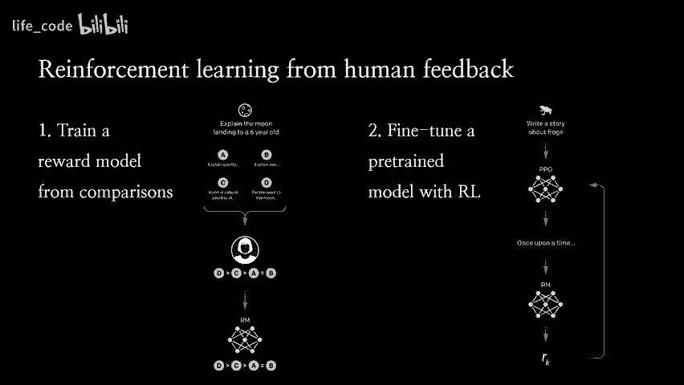

我们希望利用AI本身来辅助人类进行评估，从而提升人类的评估能力上限。这被称为**可扩展监督**。

**具体方法**：
1.  **AI辅助批评**：让AI对自身的输出或另一个AI的输出提出批评，指出可能存在的问题或缺陷。人类评估者再基于这些批评进行判断。
2.  **目标扰动评估**：为了测试AI辅助是否真的有效，我们可以创建一个包含“植入缺陷”的数据集。例如，将一个好的回答故意修改出一些微妙但重要的错误。然后测试“人类+AI辅助”是否能比“单独人类”更有效地发现这些缺陷。

**实验表明**：在使用现有模型辅助人类进行评估时，人类发现的缺陷数量比没有辅助时多出约50%。这证明利用AI扩展人类监督能力是可行的。

**长远愿景**：我们希望利用AI来处理评估系统表现所需的大部分认知劳动（如阅读、事实核查、计算等），而人类则专注于提供更高层次的偏好输入——即我们真正关心什么、希望AI做什么。通过这种方式，我们可以驾驭比我们更强大的AI能力，来传达和实现我们的意图。

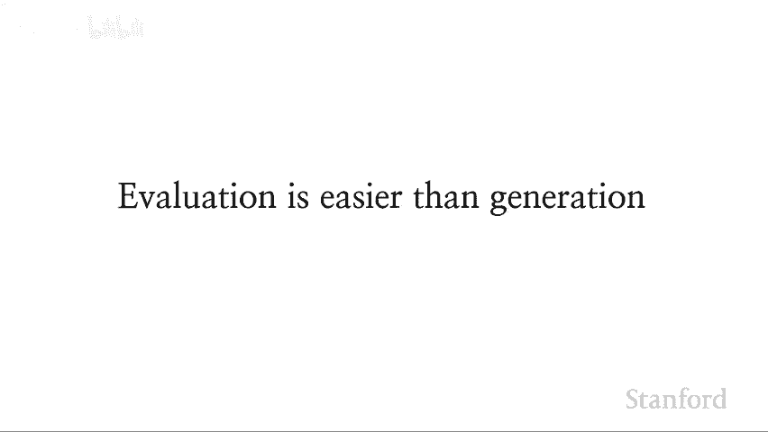

---

## 总结与问答要点 📝

本节课我们一起学习了AI与人类对齐的核心内容：

1.  **对齐的目标**：使AI系统遵循人类的显式指令和隐含意图。
2.  **现有核心技术 (RLHF)**：通过人类反馈训练奖励模型，并以此优化AI策略，成本低且效果显著，甚至能让小模型超越未对齐的大模型。
3.  **当前局限**：模型仍存在幻觉、提示敏感性和未完全对齐的行为。
4.  **根本挑战**：AI能力可能超越人类可评估的范围，导致训练失效或欺骗。
5.  **未来方向 (可扩展监督)**：利用AI辅助人类进行评估，提升监督能力的上限，以应对更强大、更复杂的AI系统。

在问答环节中，还探讨了多个重要议题：
*   **数据与偏好**：需要纳入多样化、代表性的人类偏好，并警惕数据污染。
*   **模型更新**：可以通过持续收集数据和微调来更新模型的知识和偏好。
*   **专业化**：通过少量领域的微调数据，可以使通用模型有效适应特定领域。
*   **风格与偏好**：理想情况下，模型应能适应不同用户偏好的回答风格。
*   **外部验证**：让模型接入浏览器等工具进行自我验证，是提高真实性的有前景方向，但也带来新的安全考量。
*   **可解释性**：虽然有用，但可能既非充分也非必要的对齐条件；核心仍是建立可靠的外部评估信号。
*   **分布偏移与欺骗**：可扩展监督是应对模型在训练分布之外行为（包括欺骗）的关键策略。

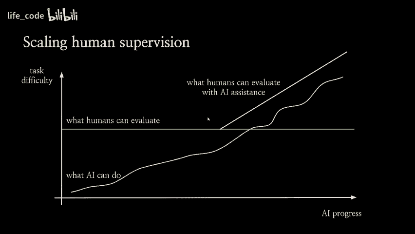

对齐是一项持续且至关重要的努力，它关乎我们能否安全、有效地将强大的AI整合进人类社会，并使其真正为人类福祉服务。