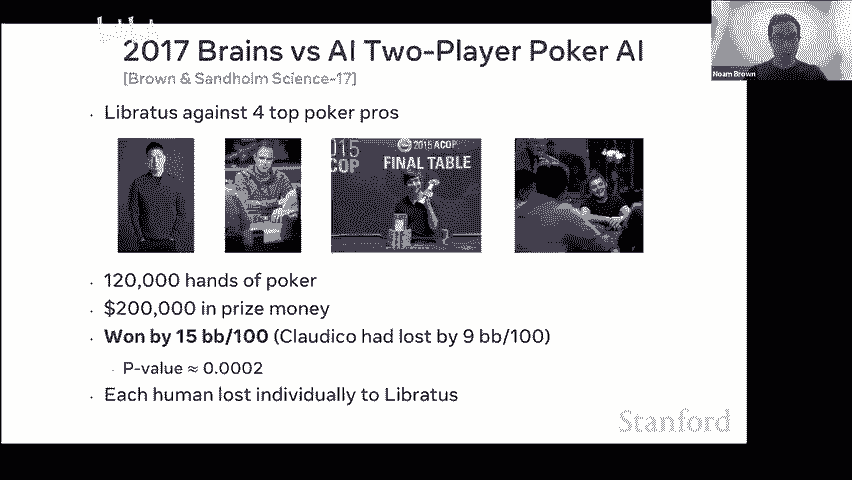
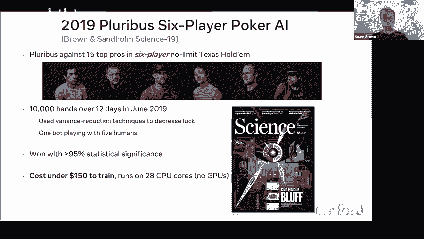
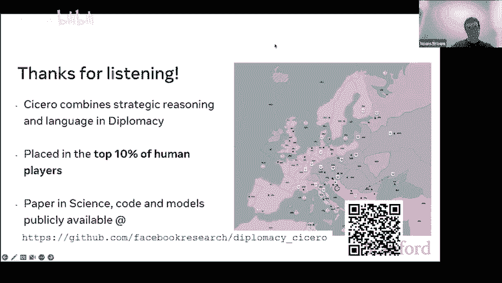

# 14：战略游戏与人工智能 🎮

在本节课中，我们将探讨人工智能在复杂战略游戏（如扑克和外交）中的发展历程。我们将看到，通过在推理阶段增加“思考”或“搜索”的计算量，AI的性能可以得到巨大提升，其效果甚至远超单纯扩大模型规模。最后，我们将深入了解一个名为“西塞罗”的AI，它成功地将战略推理与自然语言对话结合，在多人谈判游戏“外交”中达到了人类顶尖水平。

---

## 搜索的惊人威力 🔍

上一节我们介绍了战略游戏对AI的挑战。本节中，我们来看看一个关键发现：在测试时增加计算（即“搜索”）能带来多大的性能提升。

研究人员在训练扑克机器人时发现，有时需要两个月的时间、成千上万的CPU和数TB的内存。但在实际与人类对战时，机器人几乎是瞬间行动的，这本质上只是一个查找表。而人类在困境中会花时间思考，从而想出更好的策略。

因此，研究团队尝试在机器人中添加“花时间思考”的能力。以下是他们的发现：

*   **X轴**：模型参数的数量（可理解为模型规模）。
*   **Y轴**：距离纳什均衡的距离（数值越低，机器人越强）。

随着参数数量增加，性能有所提高。将参数数量增加约100倍，可利用性（即弱点）降低约一半。然而，**仅仅添加搜索功能**（图中橙色线），就使性能提升了约7倍。若想通过单纯扩大模型规模来达到同等效果，需要将模型规模扩大约**100,000倍**。

这个发现极具冲击力。它表明，在测试阶段扩展计算（搜索）的威力，远超此前多年在扩大模型规模上的努力。这成为了后来战胜顶尖人类扑克选手的关键。

那么，为什么之前的研究没有重点考虑搜索呢？原因包括：
1.  研究背景不同：扑克研究源于博弈论和强化学习，与国际象棋、围棋的搜索传统不同。
2.  成本与激励：扩展搜索会增加实验成本，且当时的年度计算机扑克比赛限制了测试时可用的资源。
3.  预期差异：人们可能认为搜索会带来10倍的改进，但没想到能有10,000倍的差距。

---

## 从扑克到围棋：搜索的普适性 ♟️

专注于扩展搜索的努力，使得AI在2017年的一场扑克比赛中，以显著优势击败了四位顶级人类选手。随后在2019年的六人扑克比赛中，AI再次获胜。值得注意的是，这个六人扑克机器人训练成本不足150美元，且运行时仅需28个CPU核心。

这显示了搜索的强大威力：如果知道如何在测试时扩展计算，不仅能大幅提升性能，还能显著降低训练成本。这种模式不仅限于扑克。

以围棋AI AlphaGo Zero为例：
*   最强的AlphaGo版本Elo评分约为5200。
*   如果**去掉测试时的蒙特卡洛树搜索**，仅凭策略网络进行游戏，其Elo评分会降至约3000，低于人类专家水平。
*   这意味着，没有搜索，就没有超级人类的围棋AI。

一个经验法则是：要将Elo评分提高约120点，要么将模型大小和训练量翻倍，要么将测试时的搜索量翻倍。为了让原始策略网络从3000 Elo提升到5200 Elo，需要将模型和训练扩大约**100,000倍**。

---

## 西塞罗：外交游戏中的AI 🤝

基于对搜索价值的认识，研究团队选择了一个更具雄心的目标：开发能玩“外交”游戏的AI。“外交”是一款基于自然语言谈判的战略游戏，被认为是AI面临的最困难游戏之一。

### 什么是外交游戏？
*   游戏背景设定在第一次世界大战前，七位玩家扮演欧洲强国。
*   核心玩法是**通过私下的自然语言对话进行谈判、结盟、欺骗**，然后同时秘密提交行动指令。
*   游戏胜负不仅取决于战术，更取决于**建立信任、说服他人和履行承诺**的能力。

### 西塞罗的挑战与目标
*   **多边非零和博弈**：不同于围棋、扑克等零和二人游戏，“外交”涉及合作与竞争。AI必须理解人类行为和社会规范，而不能仅仅将对手视为可优化的机器。
*   **有目的的对话**：AI需要超越简单的文本模仿，进行有战略意图的沟通。
*   目标：创造一个能在鼓励背叛的环境中**建立信任**、进行诚实沟通并评估他人诚实的AI。

### 西塞罗的架构与核心贡献
西塞罗的输入包括：棋盘状态、行动历史、与所有玩家的对话历史。其工作流程核心是**将战略规划与自然语言生成紧密结合**。

以下是其主要组件：

1.  **可控的对话模型**
    *   模型以**意图**为条件生成对话。意图是指AI自己及对话伙伴计划采取的行动。
    *   例如，如果意图是“支持法国进入比利时”，生成的消息可能是“如果你想让我支持你去比利时，请告诉我”。
    *   这种方法将战略规划与对话生成分离，让语言模型专注于生成高质量、符合意图的文本，从而提升了对话的相关性和质量。

2.  **考虑对话与人类行为的规划引擎（PICOLA）**
    *   纯自我对弈AI不遵循人类惯例，而纯模仿人类的AI又太容易被操纵。
    *   PICOLA算法找到了中间地带：在自我对弈进行强化学习的同时，对偏离人类模仿策略的行为进行惩罚。
    *   公式示意：`优化目标 = 预期收益 - λ * KL(当前策略 || 人类模仿策略)`
    *   通过调整λ，可以平衡“遵循人类惯例”与“追求强力策略”。

3.  **基于价值的消息过滤器**
    *   对话模型可能生成一些在战略上不明智的消息（例如，提前告知对手攻击意图）。
    *   解决方案：生成多条候选消息，预测发送每条消息后对手的反应及己方的收益，然后过滤掉预期收益低的消息。
    *   这确保了AI的沟通与其战略利益保持一致。

### 成果与局限
*   **成果**：西塞罗在在线外交平台参加了40场比赛，排名位于所有玩家的前10%，其表现未被人类玩家识别为AI。它展示了结合战略推理与自然语言对话的能力。
*   **局限**：
    *   意图表示较为简单（仅单步行动）。
    *   价值模型未考虑对话的长期影响，因此无法很好地权衡“撒谎的短期收益”与“信任破裂的长期成本”。
    *   规划方法（PICOLA）虽有一定通用性，但仍较特定于领域。

---

## 总结与未来方向 🚀

本节课我们一起学习了战略游戏AI的发展，特别是**测试时搜索（计算）** 的巨大价值。从扑克到围棋，事实表明，扩展推理阶段的计算能力，往往是提升AI性能更高效的路径。

西塞罗项目将这一理念与自然语言处理相结合，在复杂的多人谈判游戏“外交”中取得了成功。其核心在于：
1.  使用**规划算法**生成战略意图。
2.  利用**意图条件化**的对话模型进行自然、有目的的沟通。
3.  通过**过滤机制**确保沟通与战略目标一致。

展望未来，重要的方向是**通用性**：
*   能否开发出**通用的、可扩展的推理方法**，适用于更广泛的任务（如数学推理、写作、真实世界谈判），而不仅仅是特定游戏？
*   当前的大型语言模型在训练上投入巨大，但在推理上相对廉价。未来，**平衡训练与推理的计算投入**，可能会是提升AI能力的关键。
*   正如理查德·萨顿在《苦涩的教训》中指出，利用计算的通用方法最终是最有效的。我们已在“学习”上取得巨大进展，而在“搜索”或更广义的“推理”方面，仍有广阔的探索空间。

西塞罗的代码与模型已开源，为多智能体AI和对话生成的研究提供了一个宝贵的测试平台和起点。