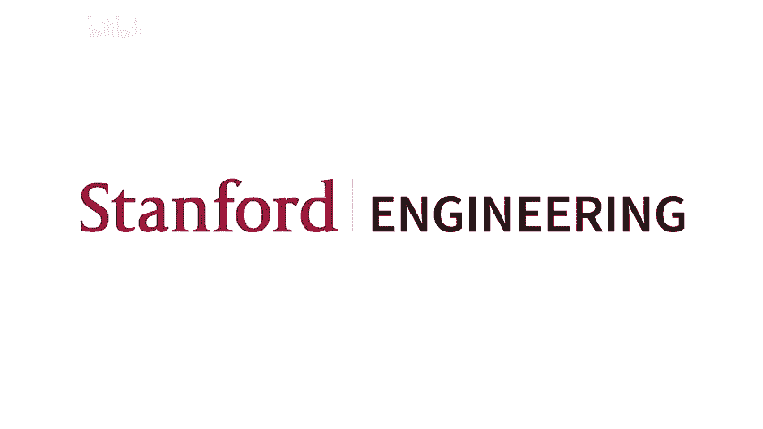
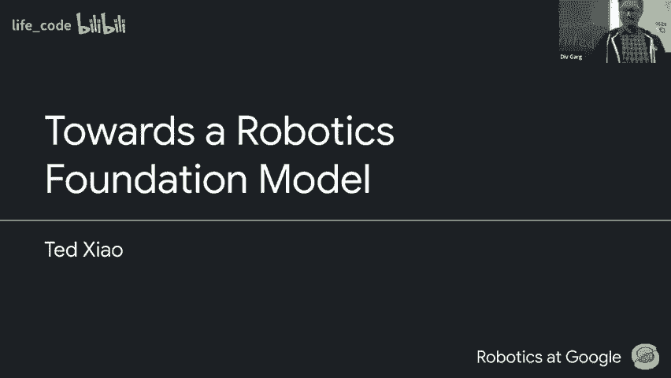
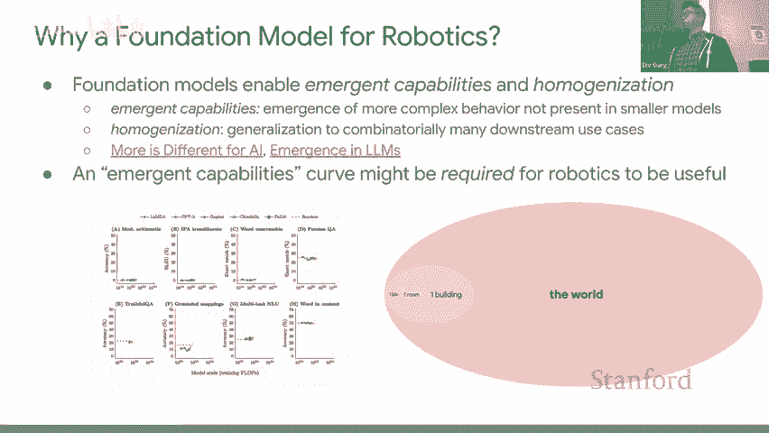
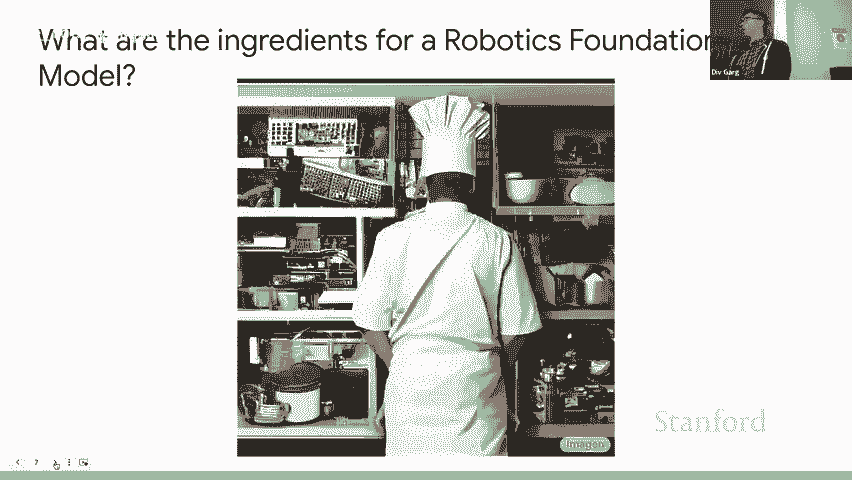
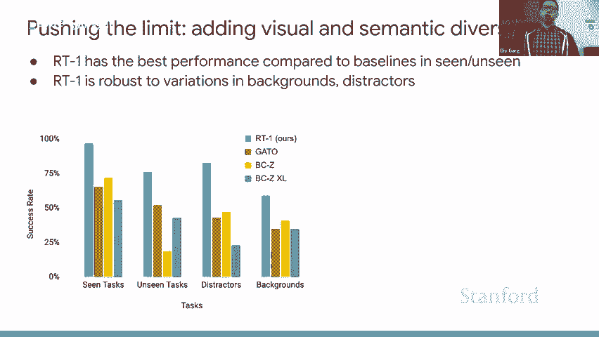
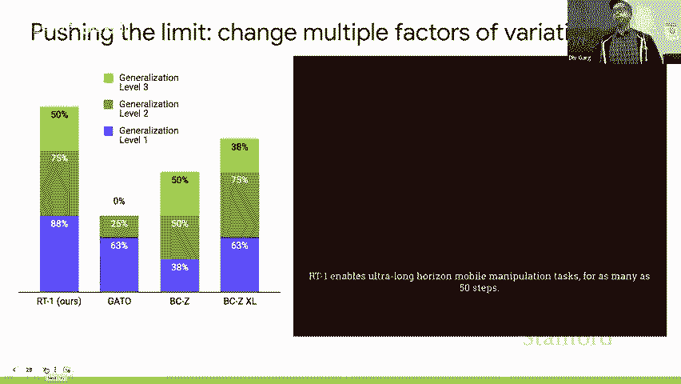
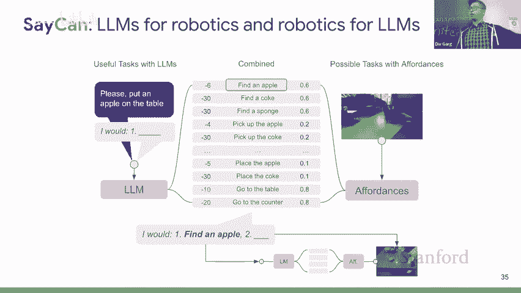
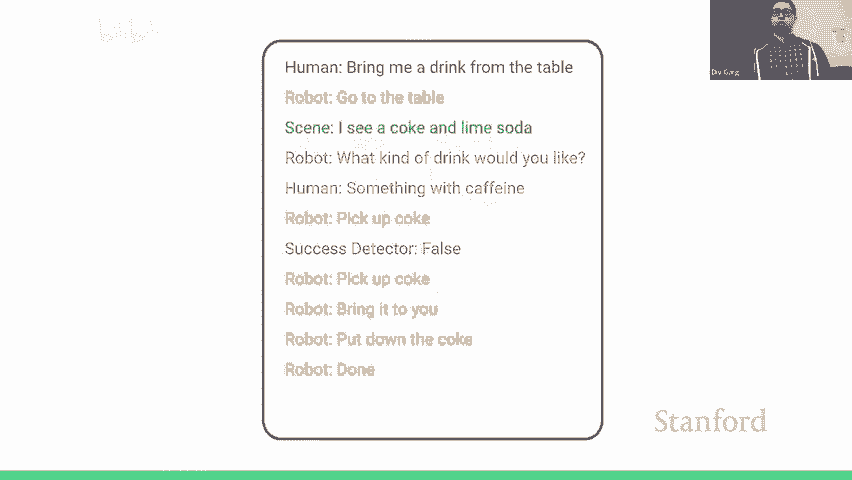
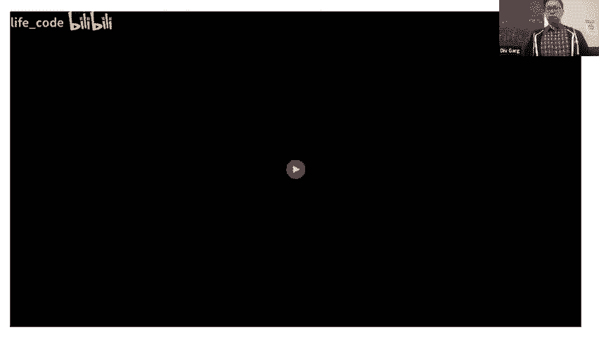
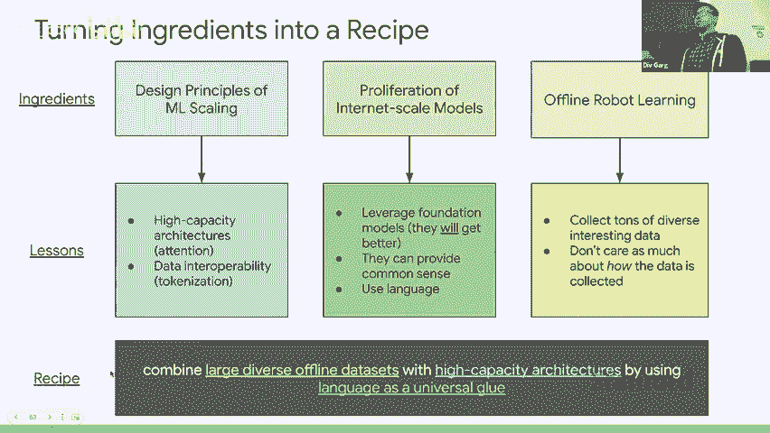

# 15：15.机器人与模仿学习 🦾

在本节课中，我们将要学习机器人学习领域的一个根本性范式转变，即如何利用大型基础模型和离线学习来扩展机器人能力。我们将从高层动机开始，探讨为何机器人需要基础模型，然后深入分析实现这一目标的具体成分和配方，最后通过几个具体的研究项目来展示这些理念的实际应用。

## 为什么机器人需要基础模型？🤔

上一节我们介绍了课程的主题，本节中我们来看看机器人领域为何需要引入基础模型。基础模型，或称互联网规模模型、大型语言模型，是指在大量数据上训练的大型单体模型。它们有两个重要特性：**涌现**和**扩展性**。

涌现是指，当模型规模（数据、计算、参数）扩大到某个临界点时，其性能会突然飙升，并展现出在小规模下不可能具备的能力。这种现象在许多领域普遍存在，如今在人工智能中也得到了证实。

机器人研究过去几十年大多局限于单一环境（如一个箱子、一个房间）。然而，真实世界极其复杂多样。要实现从实验室到真实世界的巨大飞跃，我们很可能需要依赖这种由规模带来的涌现能力。

此外，基础模型在音频、音乐、编码、语言等领域已取得巨大成功。机器人技术虽然涉及具身性、因果关系和物理基础，但这并不必然意味着在其他领域有效的扩展配方在此失效。研究其失效原因本身也极具价值。

## 构建机器人基础模型的配方 🧪

上一节我们探讨了动机，本节中我们来看看如何实际构建机器人基础模型。我们可以借鉴其他领域的成功经验，结合以下几个关键成分：

1.  **高容量架构与扩展法则**：利用如Transformer等已被证明具有强大扩展能力的架构。扩展不仅指模型参数，还包括计算能力和训练数据中唯一标记的数量。
2.  **利用现成的基础模型**：随着语言、视觉等基础模型的不断改进和普及，机器人领域应积极利用这些模型，将其能力作为构建模块。
3.  **转向离线机器人学习**：将数据生成（机器人收集经验）与数据消费（模型训练）过程分离。这与互联网规模数据集的构建方式一致，是训练大型基础模型的关键。

将这些成分结合在一起，一个可能的配方是：**将大型离线数据集与高容量架构相结合，并使用语言作为连接不同模块的通用媒介**。

## 深入案例研究：RT-1 机器人 Transformer 🤖

上一节我们介绍了高层配方，本节中我们深入第一个具体项目：RT-1（机器人Transformer-1）。该项目旨在探索如何扩展模仿学习。

当时面临的挑战包括：演示数据收集昂贵且缓慢；模型需要对训练分布外的数据具有鲁棒性；模型需要在真实机器人上快速运行（推理延迟约100毫秒）；并且需要理解自然语言指令。

RT-1的架构设计如下：
*   **输入**：机器人RGB相机图像（历史图像序列）和自然语言指令。
*   **处理**：图像通过预训练的EfficientNet主干网络和标记学习器（Token Learner）进行高效处理，与语言标记一起输入Transformer。
*   **输出**：模型输出离散化的动作标记，以3Hz频率发送给机器人执行。
*   **关键设计**：动作空间被离散化为256个动作；使用标记学习器动态选择相关图像补丁以控制上下文长度。

RT-1在包含13万个演示的数据集上训练，并在多个泛化测试中表现出色，例如在新的物体、桌面纹理和厨房环境中。更重要的是，它能成功融合来自不同机器人平台、不同动作空间（如模拟RL数据）的多样化数据分布，这是传统架构难以做到的。

消融实验表明：
*   任务多样性比每个任务的数据量更重要。
*   更大的模型容量（3500万参数）是性能提升的关键。
*   设计选择如离散化动作、移除自回归历史依赖等对鲁棒性至关重要。

## 利用基础模型进行规划：SayCan 与 Inner Monologue 📝

上一节我们看了技能学习，本节中我们来看看如何将基础模型用于高层规划。SayCan项目旨在利用大型语言模型（LLM）为机器人生成高层任务计划。

挑战在于：LLM不了解机器人的具体能力，也不清楚当前环境状态。SayCan的解决方案是让**LLM讲机器人能懂的语言**，同时让**机器人向LLM报告它能做什么**。
*   **LLM侧**：对一系列已知的机器人技能（如“拿起可乐”）进行评分，反映其与高层指令（如“给我一杯饮料”）的语义相关性。
*   **机器人侧**：通过价值函数等评估在当前状态下执行每个技能的成功概率。
*   **结合**：将两者分数结合，选择既符合指令语义又切实可行的技能序列作为计划。

这样，随着LLM本身的改进（例如从Flan切换到PaLM），整个系统的规划能力会自动提升，无需修改机器人代码。这体现了“利用能随基础模型改进而改进的方法”这一原则。

为了进一步让规划系统能根据环境反馈进行恢复和调整，后续的Inner Monologue项目引入了**视觉语言模型（VLM）** 来提供闭环反馈：
*   **被动场景描述**：用物体检测模型描述当前场景。
*   **主动场景查询**：LLM可以主动询问关于场景的问题（通过VQA）。
*   **成功检测**：微调一个模型来判断子任务是否成功。
这些反馈都以语言形式提供给LLM规划器，使其能够重新规划，处理意外情况（如物体被打翻）或人类的新指令。

## 利用视觉语言模型增强数据：语言标签重标记 🏷️

上一节我们探讨了规划，本节中我们看看如何利用基础模型解决数据瓶颈。收集大量高质量的机器人演示数据非常昂贵。RT-1的数据集基于700个模板化指令，限制了语义多样性。

语言标签重标记（Language Table Relabeling）工作的目标是：**利用少量人工标注和视觉语言模型，为大量现有演示数据自动生成丰富、自由的语义描述**。
1.  首先，在3%的人工详细标注数据上微调一个视觉语言模型（如CLIP）。
2.  然后，用这个微调后的模型为整个数据集的每一段演示生成一个自然语言描述（例如，“拿起桌子右侧的红色可乐罐”）。
3.  最后，使用这个重新标记后的、包含多样化语言指令的数据集，训练一个新的语言条件策略。

这种方法释放了数据中固有的语义多样性。评估显示，训练出的策略能够响应大量新颖的、自由形式的指令，甚至在训练中从未出现过的场景（如区分两个相同的苹果）上也表现出一定的泛化能力。这表明，**适度的标签噪声是可以接受的**，视觉语言模型提供的语义基础对于提升策略的泛化能力至关重要。

## 总结与展望 🚀

本节课中我们一起学习了机器人学习向基础模型和离线学习范式转变的核心思想。我们探讨了其动机，并分析了一个结合高容量架构、现成基础模型和离线数据集的可行配方。

通过RT-1项目，我们看到了如何设计一个可扩展的模仿学习架构来处理多样化数据。通过SayCan和Inner Monologue，我们学习了如何利用LLM和VLM进行高层规划与闭环调整。通过语言标签重标记工作，我们了解了如何利用VLM突破数据收集的瓶颈，释放数据中的语义潜力。

这些工作展示了将基础模型理念应用于机器人系统不同层面（技能学习、规划、数据增强）的巨大潜力。未来的方向包括：探索在线学习与离线学习的结合、处理更长期的任务、突破实时推理的硬件限制，以及进一步推动数据与模型的互操作性。机器人技术与基础模型的结合，正开启一个令人兴奋的新时代。