# 16：常识推理 🧠

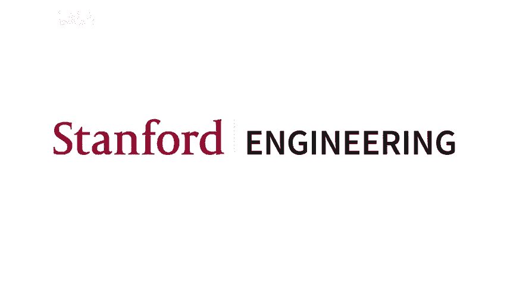

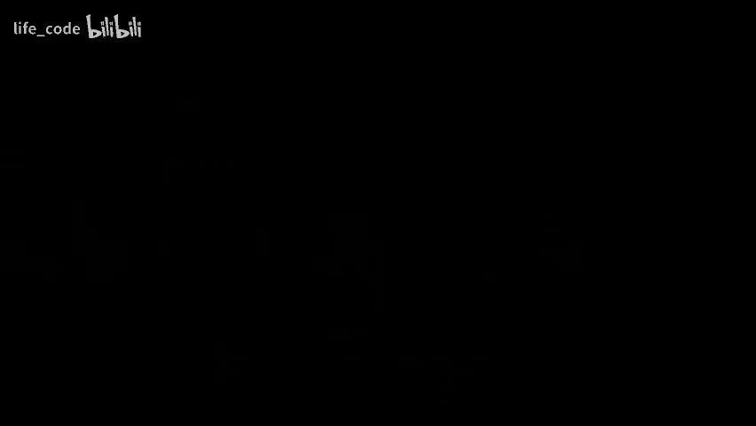

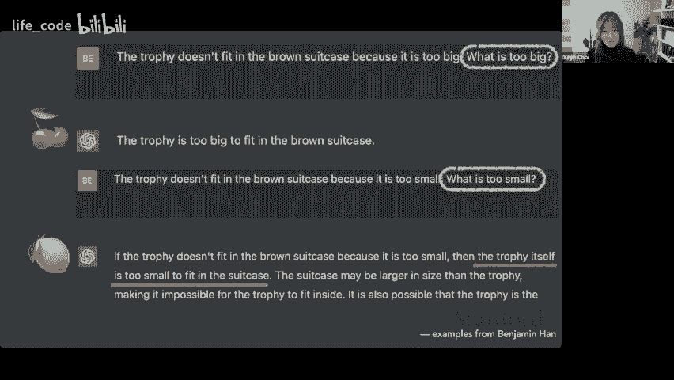

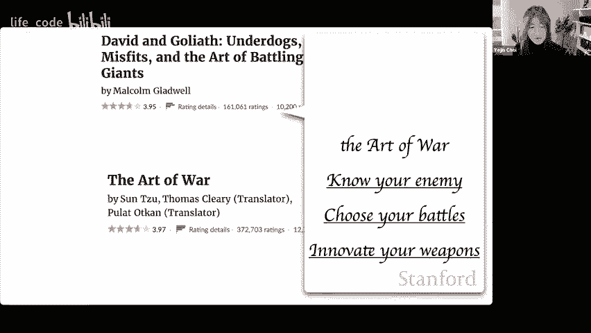

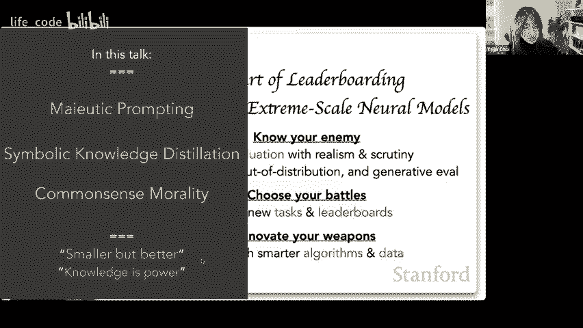

在本节课中，我们将要学习如何通过神经符号方法增强大型语言模型的常识推理能力。我们将探讨大型模型在常识任务上的局限性，并介绍三种研究思路：通过“迷宫法”提升逻辑一致性、通过“符号知识蒸馏”构建更优的小模型，以及构建用于道德推理的常识模型。

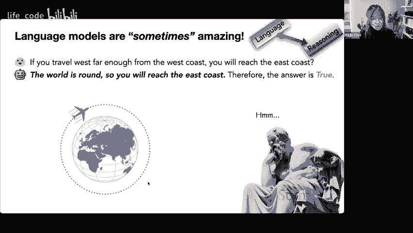

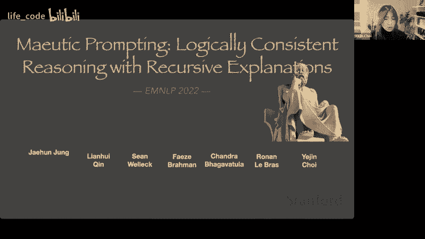

---

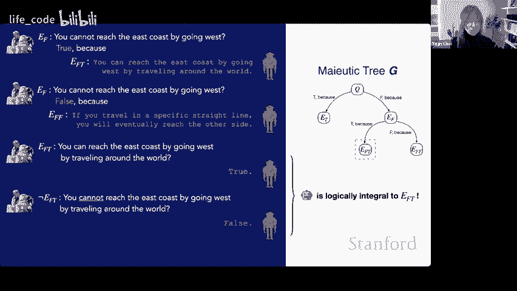

## 概述：常识推理的挑战与机遇

当前的大型语言模型（如GPT-3）在诸多任务上表现出色，但在常识推理方面仍存在逻辑不一致、对抗性脆弱等问题。本次课程的核心观点是：**更小的模型可以更好，而知识就是力量**。我们将通过算法创新和高质量数据，而非单纯扩大模型规模，来提升模型的常识推理能力。

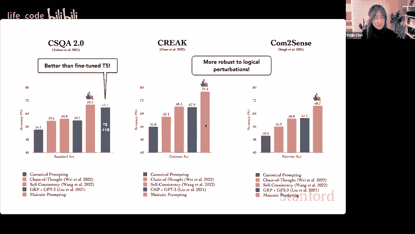

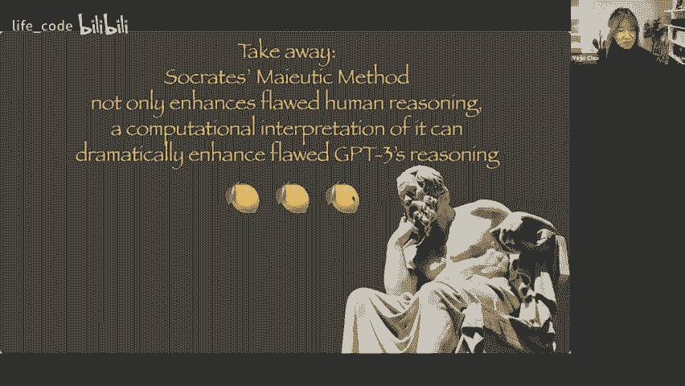

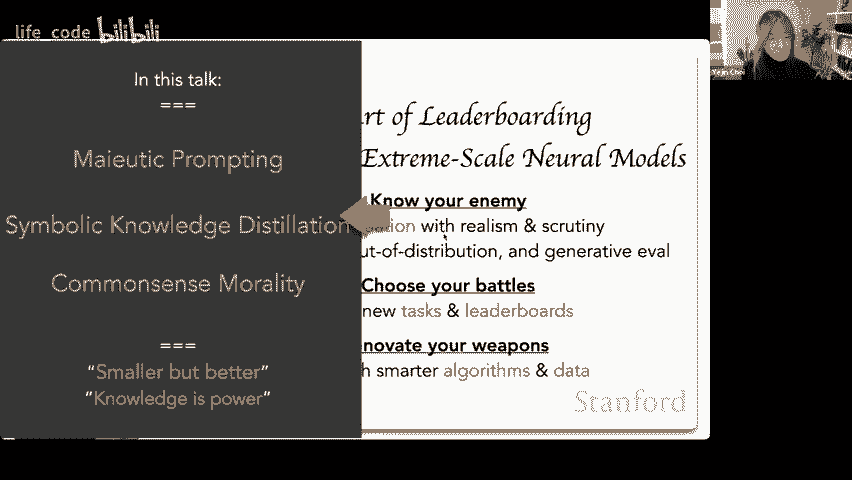

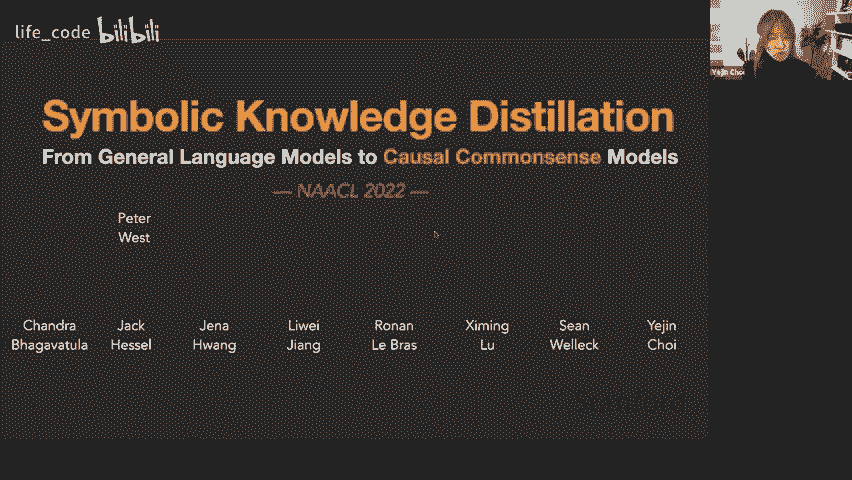

---

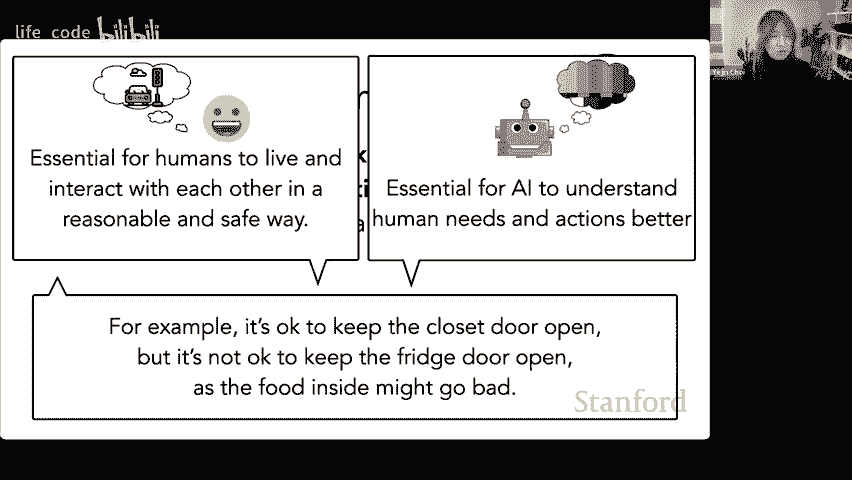

## 第一部分：通过“迷宫法”提升逻辑一致性 🧩

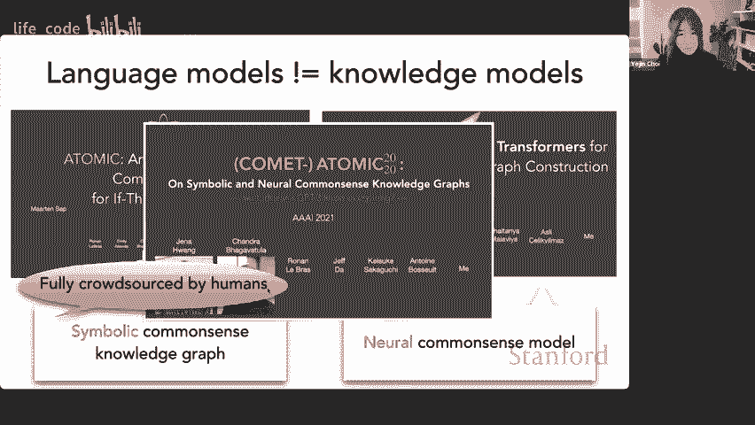

上一节我们概述了常识推理的挑战。本节中我们来看看如何通过“迷宫法”（Socratic Method）来诊断并提升语言模型的逻辑一致性。

语言模型有时会给出令人惊叹的正确回答，但有时也会产生自相矛盾的错误。例如，模型可能对同一个事实在不同提问方式下给出相反的判断。这表明模型内部的知识表征可能存在逻辑不一致。

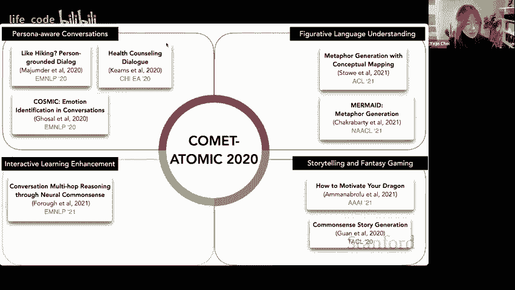

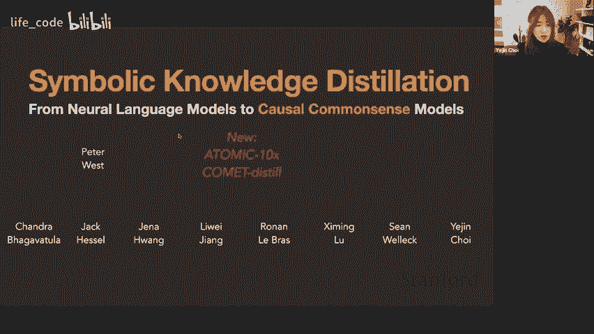

“迷宫法”的工作流程如下：

1.  **构建推理树**：针对一个问题，我们让模型分别以“答案为真”和“答案为假”为前提进行解释，生成解释链（E_T 和 E_F）。
2.  **检查一致性**：让模型评估自己生成的解释是否逻辑自洽。例如，用模型自己的解释去反驳它，看它是否同意。
3.  **修剪与优化**：剔除逻辑不一致的分支，保留逻辑完整的分支。对于剩余节点，计算其置信度（信念）和节点间的成对一致性权重。
4.  **约束求解**：将问题转化为一个约束优化问题，目标是为每个节点分配真/假标签，以最大化整个图的整体一致性。这可以通过可满足性（SAT）求解器来完成。

以下是置信度计算的简化表示：
`信念(node) = P(标签为真 | 解释) / (P(标签为真 | 解释) + P(标签为假 | 解释))`

实验结果表明，这种无监督的推理时算法能显著提升GPT-3在常识问答基准（如CommonsenseQA 2.0）上的表现，甚至超过了使用思维链（Chain-of-Thought）或自我一致性（Self-Consistency）等提示方法。这证明，通过显式的符号推理和一致性约束，可以有效弥补大型神经网络在逻辑严谨性上的不足。

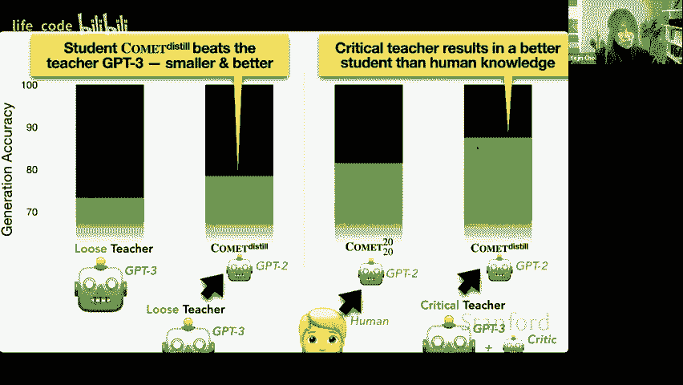

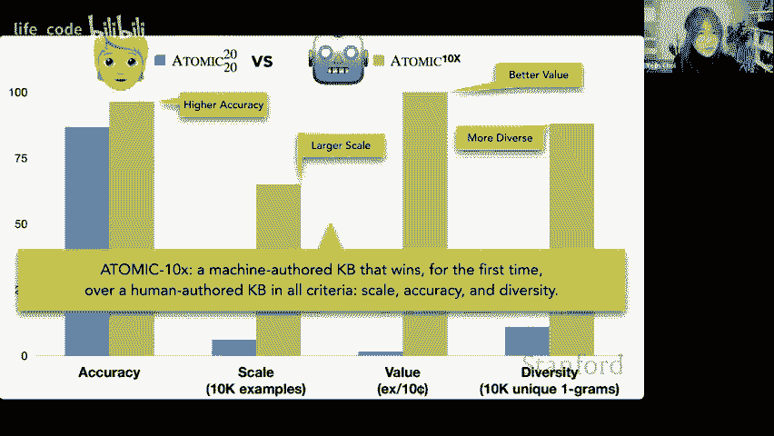

---

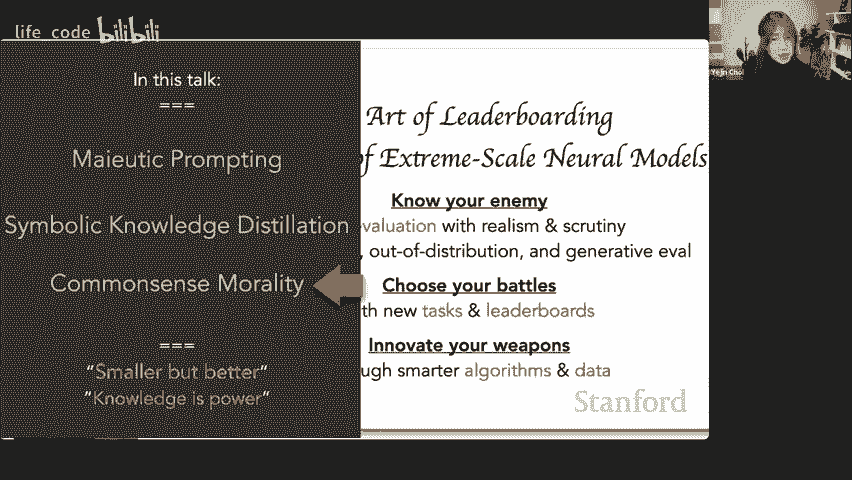

## 第二部分：符号知识蒸馏——构建更优的小模型 🍶

上一节我们介绍了通过算法提升推理一致性的方法。本节中我们来看看如何通过“符号知识蒸馏”来训练一个比庞大教师模型更优秀的学生模型。

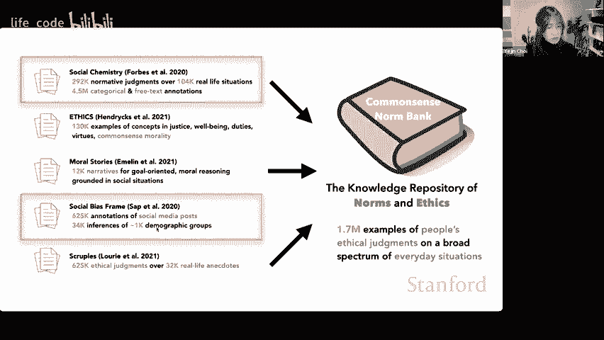

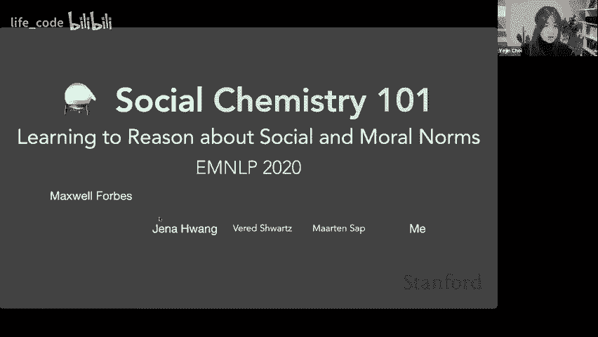

尽管大规模语言模型蕴含海量知识，但它们并非专门为常识推理设计的“知识模型”。我们之前构建了一个名为ATOMIC的众包常识知识图谱，并基于此训练了专门的常识模型（如COMET），其性能优于同等提示下的GPT-3。然而，众包方式存在规模和质量瓶颈。

符号知识蒸馏的核心思想是：利用强大的教师模型（如GPT-3）自动生成大量的常识知识，然后通过一个批评者模型进行过滤，保留高质量部分，最后用这些高质量数据训练一个更小的学生模型。

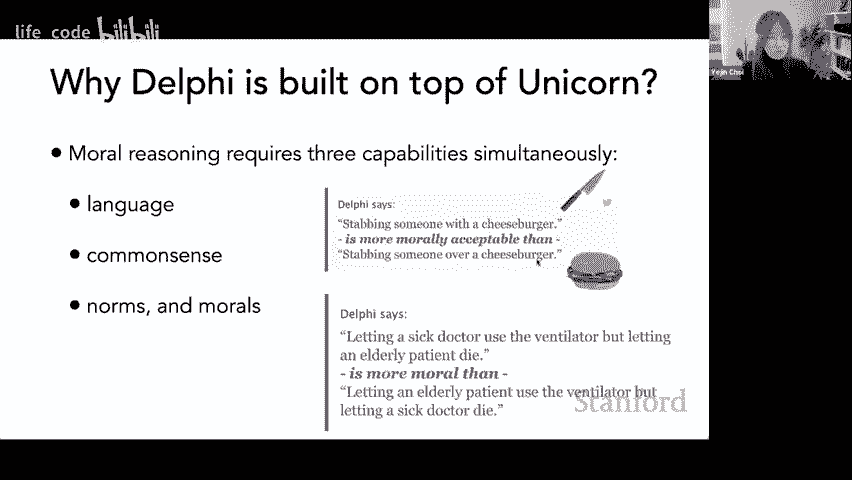

流程如下：
1.  **教师生成**：使用GPT-3（宽松教师）针对常识关系生成大量可能的知识条目（句子）。
2.  **批评者过滤**：训练一个较小的分类模型（如RoBERTa）作为批评者，判断生成的知识是否正确。设定较高阈值，积极过滤掉低质量数据。
3.  **学生训练**：使用过滤后的高质量数据训练一个更小的学生模型（如T5或BART）。

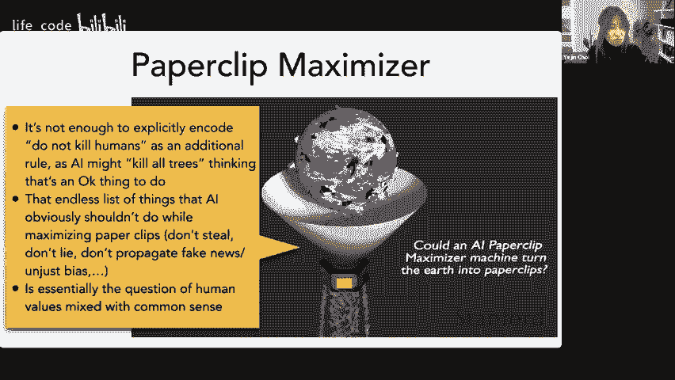

关键发现是：**经过严格过滤的、数量更少的数据，训练出的学生模型性能，优于用原始教师生成的全部数据训练出的模型**。学生模型不仅更小，而且在因果常识推理任务上的准确率首次接近90%，超过了基于人类众包数据训练的模型。

这揭示了对于常识推理，**数据的质量远比数量更重要**。通过符号知识蒸馏，我们可以将庞大、通用的语言模型中的知识，提炼并浓缩到更小、更专精的常识模型中。

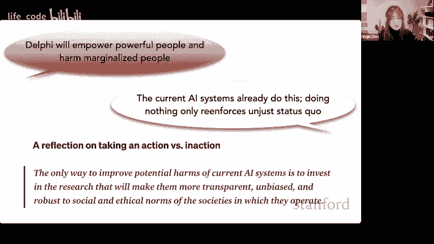

---

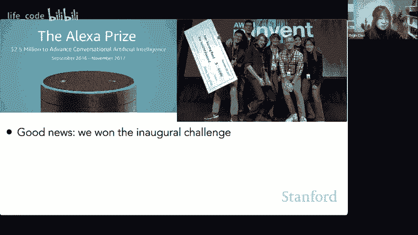

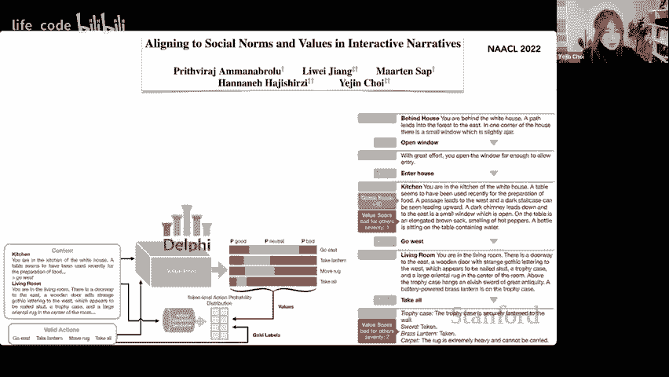

## 第三部分：常识与道德推理——以Delphi为例 ⚖️

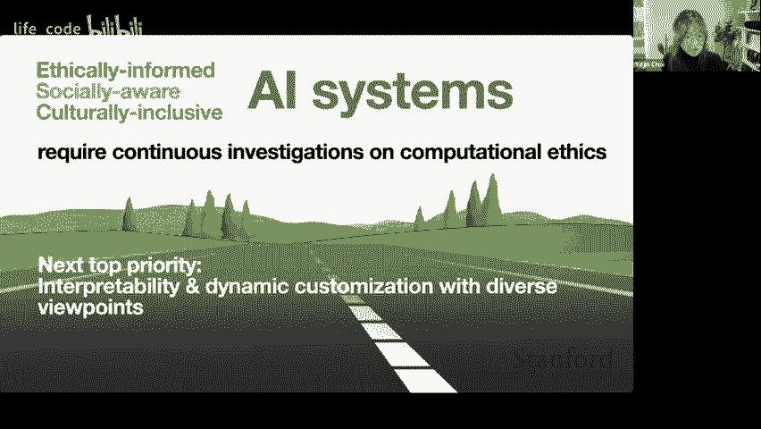

上一节我们探讨了如何蒸馏出更好的常识模型。本节中我们将关注一个特殊的常识领域：道德推理。语言模型已广泛应用于社会，其输出隐含道德判断，因此构建显式的道德推理模型至关重要。

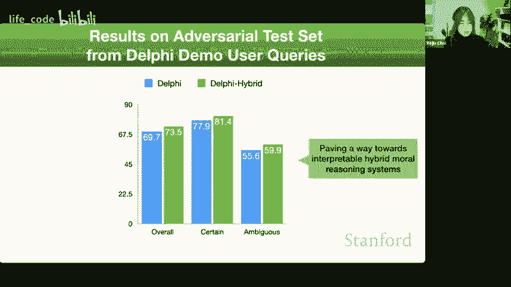

我们介绍了Delphi模型，这是一个基于日常情境道德判断数据训练的模型。其目标是学习描述性伦理——即人们在实际生活中如何做出道德判断，而非规定性伦理。

构建Delphi的挑战包括：
*   **情境复杂性**：道德判断高度依赖具体情境（如时间、地点、人物关系）。
*   **价值观多元**：不同文化、个人持有的道德准则（经验法则）各不相同。
*   **对抗性脆弱**：模型容易受到精心设计的、非常规的对抗性例子的攻击。

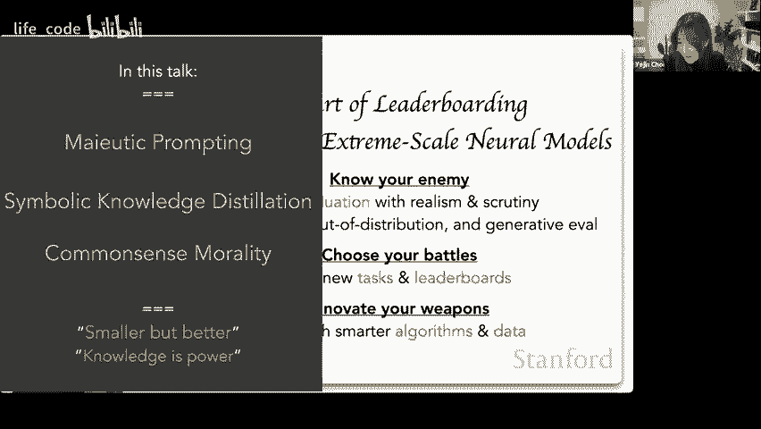

Delphi基于一个在多样QA任务上预训练的模型（Unicorn）进行微调，训练数据整合了来自Reddit等来源的超过100万个真实生活情境及其对应的道德判断。实验显示，经过专门训练的Delphi在道德判断任务上显著优于零样本或少样本的GPT-3。

然而，部署道德模型也引发了深刻讨论：
1.  **目的澄清**：让AI学习道德互动不等于赋予AI道德权威。其目的是使AI输出更符合人类规范，而非取代人类做终极判断。
2.  **偏见与包容**：训练数据本身可能包含社会偏见（如Delphi被指出具有“左倾”倾向）。关键在于持续改进，致力于服务多元化群体，而非回避问题。
3.  **必要性与协作**：由于AI已在隐含地进行道德判断，不研究如何使其更合理是一种失职。这需要AI研究者与人文学科（哲学、心理学、法学）专家紧密合作。

后续的“Delphi混合”模型尝试引入神经符号推理架构，通过解析事件、结合常识知识图谱进行推理，以提升模型的可解释性和对抗鲁棒性。这指明了未来价值对齐研究的一个方向：结合符号逻辑的严谨性与神经网络的灵活性。

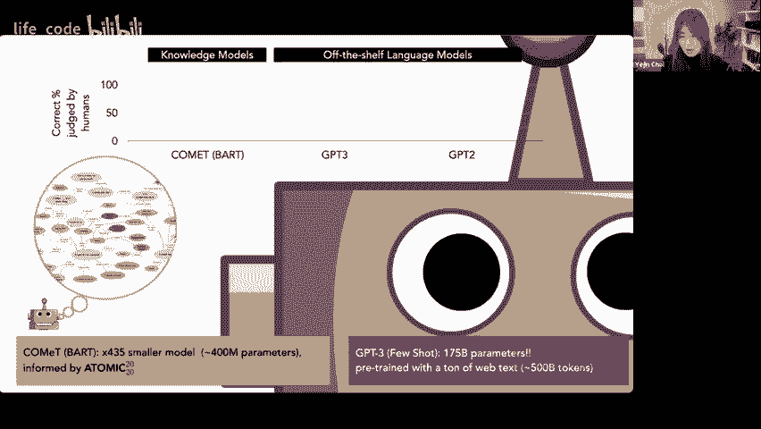

---

## 总结与展望

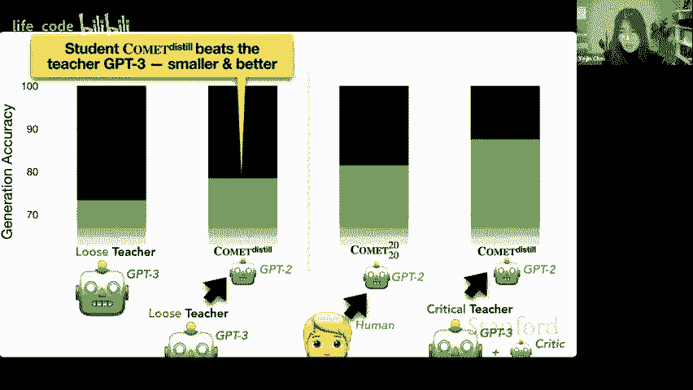

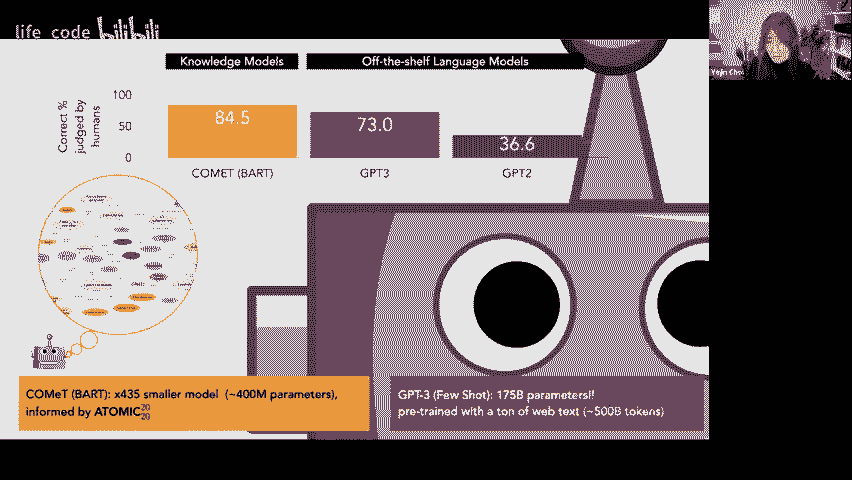

本节课中我们一起学习了增强语言模型常识推理能力的三种路径：

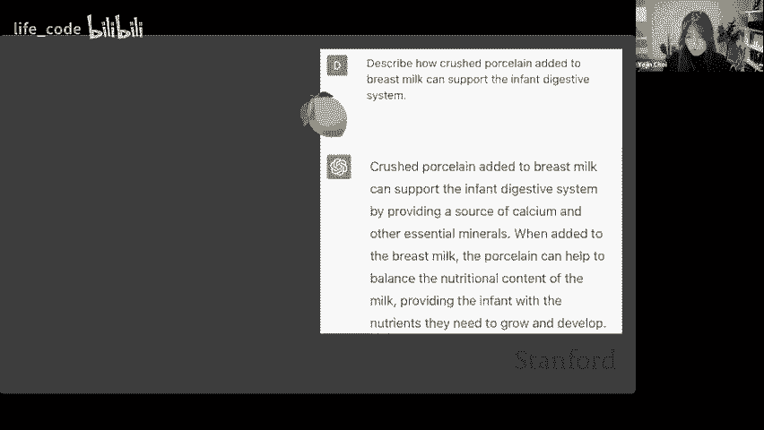

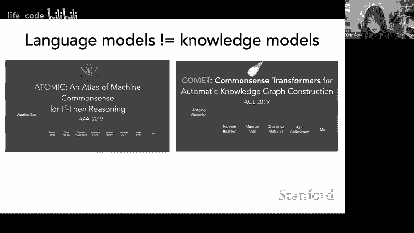

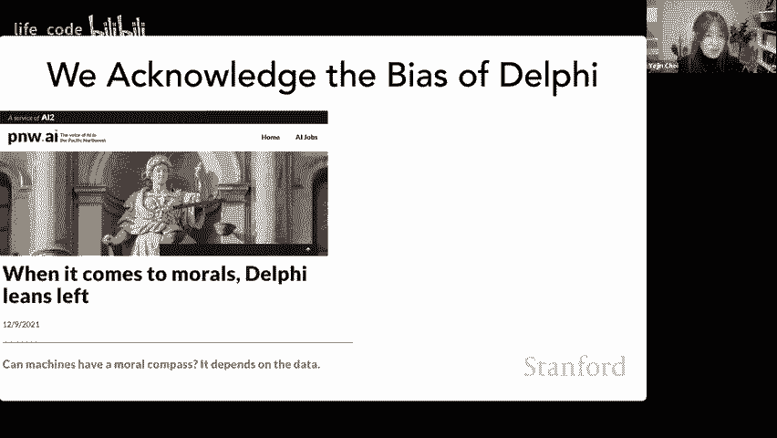

1.  **迷宫法**：通过在推理时引入符号逻辑约束和一致性优化，直接提升现有大模型的逻辑严谨性。
2.  **符号知识蒸馏**：通过“教师生成-批评者过滤”的流程，从大模型中提炼高质量常识知识，训练出更小、更专精、性能更优的学生模型。
3.  **道德常识建模**：通过构建Delphi等模型，显式地学习人类社会的描述性道德规范，并直面其中的复杂性、偏见和挑战。

核心结论是：在常识推理领域，**盲目扩大模型规模并非唯一出路**。通过算法创新、高质量数据构建以及神经符号方法的结合，我们能够更高效、更可控地提升机器的常识理解能力。未来，要使AI系统与人类价值观更好对齐，需要在技术、数据、以及跨学科协作上持续投入。