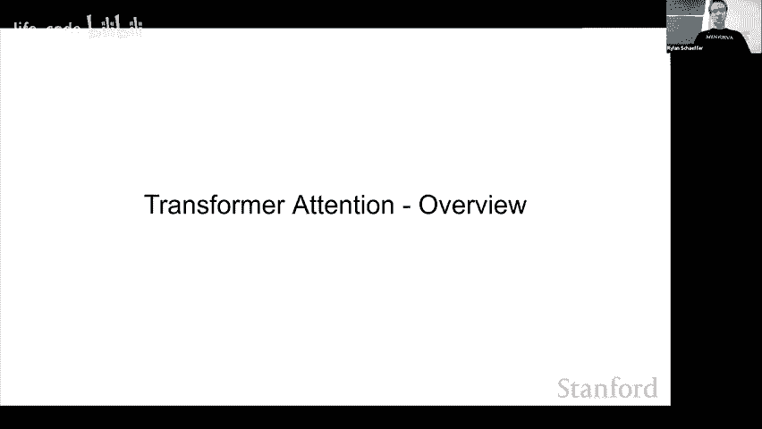
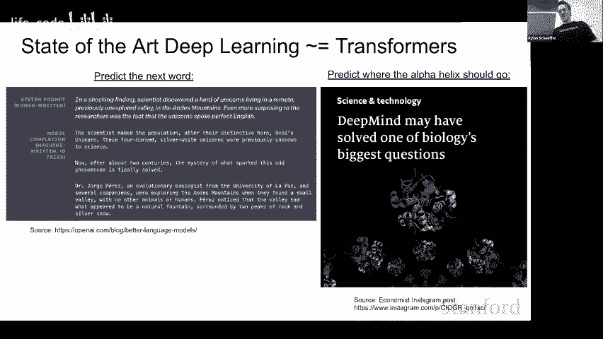
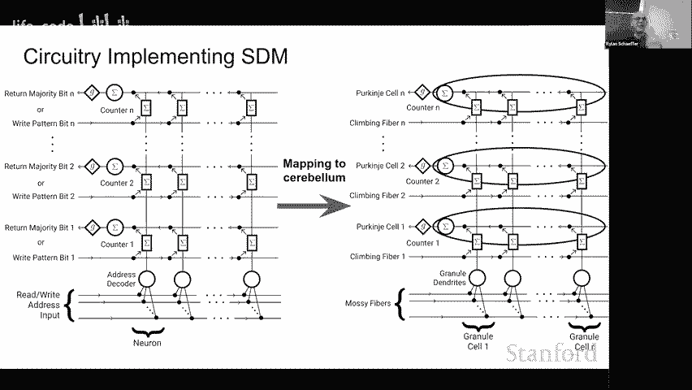
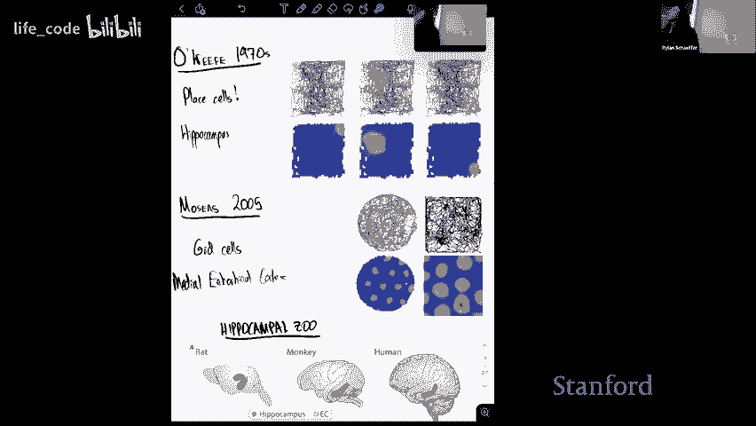
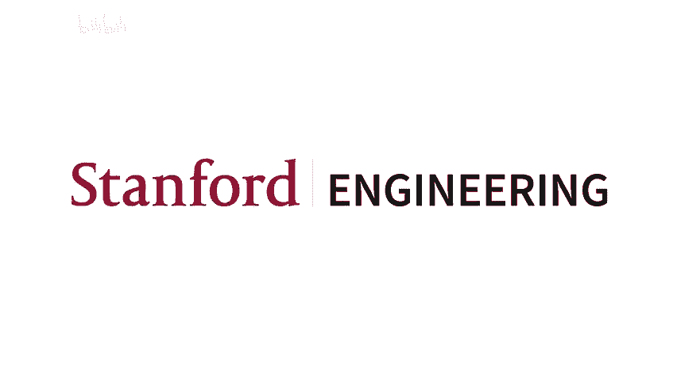

# 18：源于联合神经科学的人工智能 🧠

在本节课中，我们将学习稀疏分布式记忆（SDM）模型，并探讨其与Transformer注意力机制之间的深刻联系。我们将看到，一个源于神经科学、旨在解释大脑如何存储和检索记忆的模型，如何为现代人工智能中最强大的架构之一提供理论基础。

---

## 概述：从大脑到人工智能

稀疏分布式记忆（SDM）是一个有数十年历史的计算模型，旨在以生物合理的方式解释大脑的联想记忆功能。Transformer及其注意力机制则是近年来推动人工智能发展的核心架构。本节课将揭示，SDM的读写操作在数学上可以近似Transformer中的注意力机制，这为理解AI的成功以及探索更类脑的智能系统提供了新的视角。

---

## 第一部分：稀疏分布式记忆（SDM）简介 🧩

上一节我们概述了课程目标，本节中我们来看看SDM模型的基本动机和核心操作。

SDM的动机基于一个根本问题：大脑如何以高容量、对噪声鲁棒且生物可行的方式读写记忆，以便后续能正确检索。它与Hopfield网络等关联记忆模型的不同之处在于，它在**非常高维的二进制向量空间**中操作，且只有一小部分“神经元”被激活（稀疏性），所有读写操作都适用于被激活神经元附近的所有单元（分布式）。

### SDM的写操作

以下是SDM写入记忆的过程：

1.  我们有一个高维二进制向量空间，使用汉明距离作为度量。
2.  一个待存储的“模式”（例如一个绿色向量）会激活空间中一定汉明距离内的所有神经元（用圆圈表示）。
3.  这些被激活的神经元内部会存储这个绿色模式。神经元可以叠加存储多个模式。
4.  接着，我们写入第二个模式（橙色）和第三个模式（蓝色），它们会激活各自附近的神经元并存储自身。

### SDM的读操作

现在，我们想从系统中读取信息：

1.  我们提出一个查询（用粉色星星表示），它也是一个高维向量，会激活空间中附近的神经元。
2.  被激活的神经元会输出它们之前存储的所有模式。
3.  系统对输出的所有模式进行简单的**多数表决**，以决定最终的检索结果。例如，如果输出的模式中蓝色最多，则查询结果就更新为蓝色。

SDM的核心思想在于，**查询与存储模式之间的相似性，由它们所激活的神经元集合的交集大小来决定**。这个交集大小近似于指数衰减，这是连接SDM与注意力机制的关键。

---

## 第二部分：Transformer注意力机制回顾 ⚙️

上一节我们介绍了SDM如何读写记忆，本节中我们回顾一下Transformer中的注意力机制，这是进行比较的基础。

注意力机制是Transformer架构的核心。我们以一个简单的序列预测任务为例：预测句子“The cat sat on the ___”中的下一个词“mat”。

注意力操作有四个主要步骤：

1.  **生成键（Key）、值（Value）和查询（Query）**：输入序列中的每个词（如“The”、“cat”、“sat”）通过线性变换生成对应的键向量和值向量。待预测的下一个词（作为上下文）生成查询向量。
2.  **计算相似度**：将查询向量与每个键向量进行点积运算，计算相似度。
3.  **Softmax归一化**：对相似度分数应用softmax函数，将其转化为加和为1的注意力权重。Softmax会让较大的相似度值变得更大，实现“聚焦”重要信息、忽略次要信息的效果。
4.  **加权求和**：使用注意力权重对所有的值向量进行加权求和，得到最终的输出向量，用于后续的预测。

完整的注意力方程可以表示为：

\[
\text{Attention}(Q, K, V) = \text{softmax}\left(\frac{QK^T}{\sqrt{d_k}}\right) V
\]

其中，\( Q \) 是查询矩阵，\( K \) 是键矩阵，\( V \) 是值矩阵，\( d_k \) 是键向量的维度。

---

## 第三部分：SDM如何近似注意力机制 🔗

上一节我们回顾了注意力机制，本节中我们来看看SDM的数学描述如何与注意力机制惊人地相似。

连接SDM与注意力的关键在于：**在高维空间中，两个超球体（即SDM中模式与查询的激活区域）的交集大小，随着它们中心点之间距离的增加而近似指数衰减**。这与注意力机制中，使用点积相似度再经过softmax（本质是指数运算）得到的权重分布非常相似。

具体来说，在一定的假设和变换下，SDM的读取更新规则可以重写为以下形式：

\[
\text{SDM-Read} \approx \frac{\sum_{\mu} \exp(\beta \cdot \text{sim}(q, p_\mu)) \cdot v_\mu}{\sum_{\mu} \exp(\beta \cdot \text{sim}(q, p_\mu))}
\]

这里，\( q \) 是查询，\( p_\mu \) 是存储的模式，\( v_\mu \) 是对应的值，\( \beta \) 是一个缩放参数，\( \text{sim} \) 是相似性度量（如余弦相似度）。这个形式与注意力机制中的加权求和公式在本质上是一致的。

因此，我们可以得出一个核心观点：**Transformer的注意力操作，可以看作是在近似执行一种稀疏分布式记忆的读取过程**。注意力中的softmax对应着SDM中交集大小的指数衰减特性，而查询、键、值的概念也对应着SDM中决定激活（键）和存储内容（值）的分离。

---

## 第四部分：生物学联系与启发 🧬

上一节我们从数学上建立了SDM与注意力的联系，本节中我们探讨这种联系的生物学意义以及对AI的启发。

SDM模型最初就是为了解释小脑等脑区的功能而提出的。其电路模型可以很好地映射到小脑的微观结构：
*   **输入纤维**：决定神经元是否激活（类似“键”）。
*   **爬行纤维**：独立地指导神经元存储什么内容（类似“值”）。
*   **浦肯野细胞**：执行类似“多数表决”的整合与去噪操作。

这表明，大脑可能早已在使用一种高效且鲁棒的“注意力”机制来处理信息。Transformer在工程上的巨大成功，或许正是因为它在无意中捕捉到了这种关键的认知操作原理。

这种联系是双向的：
1.  **从神经科学到AI**：SDM的生物学合理性为注意力机制提供了理论基础，并可能启发更高效、更鲁棒的类注意力模块（例如，探索替代softmax的方法）。
2.  **从AI到神经科学**：Transformer的成功反过来支持了SDM可能是小脑等功能脑区的一个良好计算模型，为神经科学提供了可检验的预测。

---

## 第五部分：总结与展望 🚀

本节课中，我们一起学习了稀疏分布式记忆（SDM）模型和Transformer注意力机制，并深入探讨了它们之间深刻的理论联系。

**我们学到的主要内容有：**
1.  SDM是一个在高维稀疏空间中工作的联想记忆模型，通过激活神经元的交集来实现读写。
2.  Transformer的注意力机制通过查询、键、值的点积和softmax操作，实现了对信息的聚焦与整合。
3.  数学上，SDM中模式与查询激活区域的交集大小近似指数衰减，这使得其读取规则可以重写为与注意力机制相似的形式。
4.  这一联系将现代人工智能的核心组件与大脑的可能工作原理桥接起来，具有重要的理论和实践意义。

这项研究提出了许多有趣的前沿问题：Transformer的成功是否因为它模拟了大脑的基本算法？SDM是否精确描述了小脑的功能？能否基于SDM原理设计出更强大的AI架构？对这些问题的探索，将继续推动神经科学与人工智能的融合，帮助我们更好地理解智能的本质，并建造更先进的智能系统。