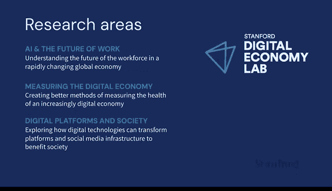

# 1：课程介绍 🧠

在本节课中，我们将学习这门课程的核心目标、结构以及它为何在当下至关重要。课程由斯坦福大学以人为中心人工智能研究所的教授、斯坦福数字经济实验室主任埃里克·布林约尔松主讲，旨在探讨生成式AI如何重塑我们的经济与社会。

---

我是埃里克·布林约尔松，斯坦福大学以人为中心人工智能研究所的教授，同时也是斯坦福数字经济实验室的主任。

当下是一个非凡的时代，人工智能正在改变我们的经济和社会。

因此，我非常兴奋能在这门课程中为大家介绍充满活力的生成式AI世界。

我于2020年来到斯坦福大学，创立了斯坦福数字经济实验室。

我们的使命是增进对数字经济的集体理解，以构建一个技术驱动、惠及所有人的社会。我们汇聚了全球一些最聪明、最勤奋的学生、教师和研究人员，专注于三个研究领域。

以下是我们的三个核心研究领域：
*   **第一是AI与工作的未来**，这也是本课程今天的主要焦点。
*   **第二是衡量数字经济**。
*   **第三是数字平台与社会**。

我将这门课程命名为“AI觉醒”，是为了反映自“人工智能”一词首次被提出近70年来的研究，如何在过去一年因生成式AI的突破而爆发式地进入公众视野。

---

人工智能正在重塑我们的世界。

其核心能力正在呈指数级提升，并且这个指数很大。

但我们的经济制度、组织架构和技能却难以跟上这些快速进步的步伐。

在这个日益扩大的差距中，我们不仅发现了商业和社会面临的一些最紧迫的挑战，也看到了许多最令人兴奋的机遇。

这就是我们创建这门课程的原因。我们希望你们探索并帮助你们理解，AI的进步如何能够并且将在未来几年改变我们的经济和社会，以便我们为驾驭这些变化做好充分准备。

---

上一节我们了解了课程设立的背景，本节中我们来看看这门课程的具体形式与特色。

这门课程最初是为我在斯坦福大学的研究生课程开发的。

我特意将其设计为经济学（Econ 295）和计算机科学（CS323）的联合课程。

它吸引了来自全校超过我们容纳能力的众多充满好奇的学生，包括来自商学院和工程学院的学生。

每一堂课都引发了有趣的讨论和新的见解，如果不将这些知识更广泛地传播开来将是一种浪费。

因此，我们非常高兴能为你们提供机会，深入学习这些启发了众多斯坦福学生的相同材料。

---

那么，这门课程究竟是关于什么的呢？这不会是你典型的在线课程，只有讲座和作业。

相反，每一节课都有一位在AI、经济学、政府或工业界前沿的杰出嘉宾演讲者。

我们将探讨从基础模型和大语言模型的技术基础，到工作与就业、模型偏见与可解释性、AI的地缘政治影响，乃至设想一个没有工作的世界等一系列主题。

你将有机会听到来自技术和经济学领域的研究人员及行业领袖的分享，例如前谷歌CEO埃里克·施密特、伯克利教授劳拉·泰森、Scale AI创始人亚历克斯·王、OpenAI的米拉·穆拉蒂以及Anthropic联合创始人杰克·克拉克等。他们每一位不仅带来了前沿知识，也提供了独特的视角。

我很感激他们如此坦诚地分享了他们的见解。在这门课程中，我们将遇到许多引人入胜的人物。我以研究者或作家的身份结识了其中许多人，他们中的许多人也成了我的朋友。我希望你们能像我一样享受聆听他们的分享。

---

本节课中，我们一起学习了《AI觉醒》这门课程的设立初衷、核心研究领域以及独特的教学形式。课程旨在弥合AI快速进步与社会适应之间的差距，通过业界顶尖嘉宾的分享，带领我们深入探索AI将如何塑造经济与社会的未来。在接下来的课程中，我们将与这些思想领袖一同展开这段探索之旅。