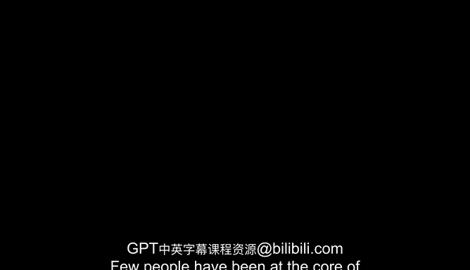

# 2：埃里克·施密特介绍 👨‍💼

在本节课中，我们将了解一位在硅谷核心圈层拥有深远影响力的人物——埃里克·施密特。我们将介绍他的背景、职业生涯以及他当前在人工智能领域的前沿工作。

很少有人能像埃里克·施密特一样，如此长久地处于硅谷的核心，并在塑造其影响力方面扮演如此重要的角色。

埃里克是一位技术专家、企业家和慈善家。

他从2001年谷歌早期开始，直至2011年，担任谷歌的首席执行官和董事长。

此后，他担任执行董事长，引领公司完成了从一家硅谷初创企业到全球科技领导者的转型。

2017年，他联合创立了“施密特未来”（Schmidt Futures），这是一个慈善倡议，旨在早期投资于那些致力于让世界变得更美好的杰出人才。

埃里克目前从事的最有趣的工作之一，是“施密特未来”旗下的“AI 2050”计划。

该计划探索如果我们真正把一切都做对了，世界将会是什么样子。

我们将与埃里克探讨人工智能带来的机遇与风险。

---

本节课中，我们一起学习了埃里克·施密特的职业历程及其在人工智能领域的深远影响。从领导谷歌成长为科技巨头，到通过“施密特未来”和“AI 2050”计划前瞻性地探索技术与社会发展的未来，他的工作为我们理解AI的潜力与挑战提供了重要视角。