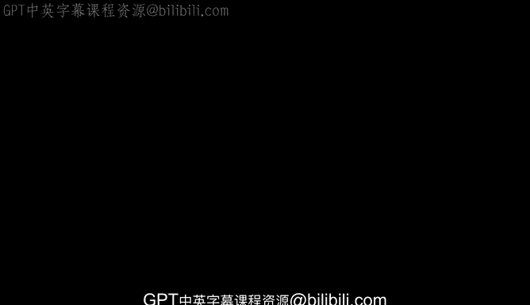

# 3：人工智能的创新速度 🚀


在本节课中，我们将探讨人工智能领域的创新速度，并分析其相较于过去技术浪潮的独特性和影响。通过回顾技术发展历史，我们将理解当前AI变革的规模与强度。

---

我记得我们初次见面是在斯坦福商学院。当时你是Novell公司的首席执行官，那还是一家小公司。在此之前，你在Sun公司工作。你在硅谷经历了很长时间，见证了许多技术革命。在你过去二三十年间目睹的众多技术浪潮中，你会如何评价当前的这一次？



我确实思考过这个问题。我在这个行业已经工作了55年。


这本身就是一个令人不安的事实。其特点是，每十年一切都会提升一个数量级。

网景公司上市时，我们无比兴奋。那大概是1994年，它以20亿美元的估值上市。这在当时是初创公司梦寐以求的估值，我们从未见过类似的事情。

我职业生涯始于IBM大型机，编写汇编代码。

如果你观察摩尔定律的改进速度，就能理解这一点。行业的规模也同样扩大了。在我像你们这个年纪时，还没有计算机科学这个专业，甚至无法获得计算机科学学位。我是一名电气工程师——当时并不出色，因为那是成为计算机科学家的唯一途径。

与2000年左右相比，当前这个时期，特别是最近这六个月左右，其激烈程度要高出一个数量级。

还记得千年虫问题吗？你们都听说过。那时我们感觉自己像神一样。我记得在达沃斯，我和安迪·麦卡菲等一群人曾认为我们是天选之子，因为当时聚集了盖茨、埃里森等一众风云人物。而当前正在发生的事，其规模和影响至少还要再大一个数量级。

这简直让我头疼。我认为好消息是，你们这一代人将从这个陡峭的斜坡起点出发，这对我来说很有趣。这一切的发生将比人们想象得快得多，我认为它会发展得非常迅速。

你说得对。当我说发展迅速时，我指的是好坏两方面。通常在我们这个行业，结果具有路径依赖性，与网络效应有关。基本上，现在正在进行一场竞赛，旨在尽早到达目的地，因为一旦你早期确立地位，往往就能保持领先。

这大致就是其内在逻辑，也是风险投资行业如此疯狂的原因。他们基于期权而非商业计划书来运作。他们本质上是在赌你会成为赢家。这种情况一再发生，但如今正在以更大的规模上演。

---

上一节我们回顾了技术发展的历史速度，本节中我们来看看当前AI浪潮的核心特征与驱动逻辑。

以下是当前AI创新速度的核心观察：

*   **指数级增长规律**：技术领域存在一个规律，即**每十年一切提升一个数量级**。从大型机到个人电脑，再到互联网，无不遵循此规律。
*   **历史参照点**：以1994年网景公司上市为例，其20亿美元估值在当时是前所未有的，标志着互联网浪潮的强度。
*   **当前强度空前**：与2000年的互联网泡沫（千年虫时期）相比，**当前AI变革的激烈程度和影响规模至少高出一个数量级**。
*   **路径依赖与网络效应**：在科技行业，成功往往具有路径依赖性，并与网络效应紧密相关。公式可以表示为：**市场优势 ≈ f(早期入场时间， 网络效应强度)**。
*   **风险投资的逻辑**：因此，风险投资行业倾向于投资“期权”而非具体的商业计划，其核心赌注是押中最终的赢家。代码逻辑可以类比为：
    ```python
    # 简化版风险投资决策逻辑
    if startup.is_early_in_race() and has_network_effect_potential():
        invest(amount="large", strategy="option-like")
    ```
*   **发展预测**：基于以上规律，**AI的普及与发展速度将远超常人预期**。

---

本节课中，我们一起学习了人工智能当前的创新速度及其历史背景。我们了解到，AI浪潮正以空前的规模和强度推进，其核心驱动力在于指数级增长规律、路径依赖和网络效应。这解释了为何行业竞争如此激烈，以及风险资本为何采取“押注期权”的策略。理解这一速度，有助于我们为即将到来的、更快速的技术与社会变革做好准备。