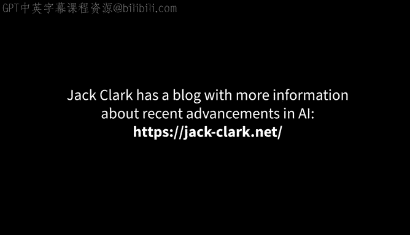

# 4：04_01_01_杰克·克拉克介绍 🧑‍💼

在本节课中，我们将认识杰克·克拉克，并了解他的背景与专长。他是人工智能领域的重要人物，其经历和观点将帮助我们理解本课程后续讨论的技术与社会议题。

在本节中，我们将聆听杰克·克拉克的分享。杰克是人工智能安全与研究公司Anthropic的联合创始人。

他此前曾担任OpenAI的政策总监，更早之前，他在彭博社担任全球唯一的神经网络领域记者。

杰克还运营着一份受欢迎的人工智能通讯《Import AI》，并且是斯坦福大学AI指数的联合主席，我们在该机构已合作多年。

我很期待与杰克探讨一些支撑本课程内容的人工智能领域最新突破。

本节课中，我们一起认识了杰克·克拉克，了解了他作为研究者、政策制定者和传播者在人工智能领域的多重角色。他的背景为我们理解AI技术发展及其社会影响提供了重要视角。