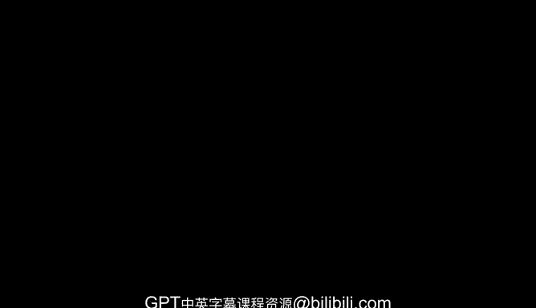
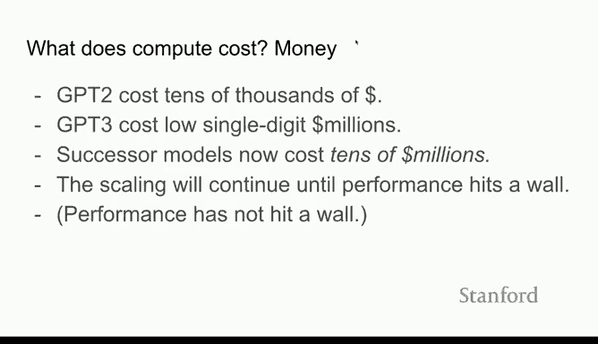

# 5：近期人工智能突破 🚀

在本节课中，我们将通过视觉示例和关键进展，了解近年来人工智能领域的突破性发展。我们将探讨从图像生成到强化学习的进步，并分析推动这些进步的核心因素——**缩放定律**。

---

## 视觉进展示例 🖼️

首先，我们通过几个图像生成的例子来直观感受AI的进步速度。以下是不同年份代表性系统的输出对比：

*   **2015年**：一篇论文展示了“通过注意力机制从文字描述生成图像”。生成的图像质量非常差，分辨率极低，类似于32x32像素的模糊色块。
*   **2020年**：Dfghan模型生成的图像“几个男孩在绿色足球场上踢足球”。人物形象抽象，风格类似印象派艺术或弗朗西斯·培根的作品。
*   **2022年**：OpenAI的DALL·E 2系统。当输入提示词“两只泰迪熊以蒸汽朋克风格在化学实验装置旁玩耍”时，它能生成高度逼真、细节丰富的图像，其精确程度令人惊叹。

需要记住的是，**2015年的技术在当时已是突破性的成果**。而如今，我们已经远远超越了那个水平。

---

## 强化学习的演进 🎮

上一节我们看到了生成式AI的视觉飞跃，本节中我们来看看另一个关键领域——强化学习的进展。强化学习现在正被用于提升像ChatGPT这类系统的性能。

以下是强化学习里程碑事件的时间线：
*   **2013年**：DeepMind震惊世界，展示了可以玩《太空入侵者》等雅达利游戏的AI系统。
*   **2016年**：AlphaGo击败世界顶级围棋选手李世石，再次引发全球关注。
*   **2019年**：OpenAI和DeepMind分别在策略游戏《Dota 2》和《星际争霸》中取得突破，开发出能在复杂的3D战斗空间中团队协作的智能游戏系统。
*   **2020年**：在模拟空战中，一名训练有素的美国空军飞行员输给了使用强化学习训练的AI（AlphaDogfight）。
*   **2022年**：英伟达（NVIDIA）应用强化学习方法，将即将发布的H100 GPU中的13000个算术单元尺寸缩小了25%，从而提升了芯片效率。

从**2013年的《太空入侵者》到2022年最先进的AI训练芯片**，这一发展轨迹清晰地展示了该领域的巨大进步。

---

## 突破背后的驱动力：缩放定律 📈

看到如此迅猛的进步，你可能会问：为什么会这样？几年前，我的一些同事（当时在OpenAI，现在在Anthropic）进行了一项关于**缩放定律**的研究。

缩放定律旨在回答一个问题：**我们能否提前预测，如果投入特定量的计算资源、数据或增加模型参数，AI系统的性能会提升多少？** 他们发现了一种奇特的幂律关系，性能随着计算量、数据量和参数规模的对数增长而平滑提升。

近年来，缩放定律的分析被应用到了各个领域：
*   推荐模型
*   视频生成模型
*   模型微调
*   围棋等特定任务
*   多智能体协作

**缩放定律的意义在于，它使得训练昂贵的大规模系统成为可能，因为它在一定程度上降低了训练过程的风险。** 相比于“给我500万美元，但结果未知”的请求，“给我500万美元，根据你将提供的数据集和算力，我预测损失函数将达到X值”这样的承诺更具说服力。这正是像Anthropic这样的初创公司得以成立，以及OpenAI等公司能够持续扩展GPT-4这类模型的原因。

---

## 计算需求的爆炸式增长 💰

这些缩放定律要求海量的计算资源。下图展示了从20世纪50年代到21世纪初，训练AI系统所用计算量的增长趋势。

在实践中，这意味着：
*   **2019年**：训练GPT-2的成本为数万美元。
*   **2020年**：据公开估计，训练GPT-3的成本为较低的数百万美元。
*   **2021-2022年**：训练某些系统的成本已达到数千万美元。
*   **未来**：预计明年将出现耗资数亿美元的训练项目。

**只要缩放定律持续有效，这种增长就会继续，直到性能触及天花板。** 我们可能还将经历一两年这样的高速发展期。这有助于我们理解当前AI发展的现实：投入的资金量巨大且逐年快速增长，而这正催生出能力惊人的系统。

---

## 总结 ✨

本节课中，我们一起学习了近期人工智能的突破性进展。我们通过图像生成的对比看到了质量的飞跃，回顾了强化学习从游戏到实际应用的演进路径。更重要的是，我们探讨了驱动这些进步的核心机制——**缩放定律**，它揭示了性能与计算资源之间的可预测关系，并导致了训练成本的指数级增长。理解这些趋势，是把握AI如何深刻影响经济与社会未来的关键一步。