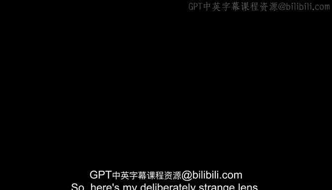
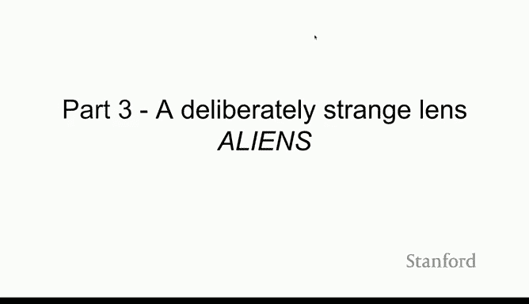

# 6：人工智能与外星智能 👽

在本节课中，我们将探讨一个独特的视角：将人工智能，特别是大型语言模型，视为一种“外星智能”。我们将分析其运作原理、与人类智能的根本差异，以及这种视角如何帮助我们更好地理解AI的非凡能力与奇特缺陷。

## 一个刻意的奇特视角：外星智能 👾

我想向各位介绍一个我刻意选择的奇特视角：外星智能。

我的意思是，尽管像ChatGPT、GPT-4和Claude这样的语言模型非常有趣，但它们本质上只是在做**下一个词预测**。它们使用与我们人类完全不同的“机器”或机制来尝试完成这件事。广义上，人类智能也在试图近似和预测某种复杂函数，即理解我们周围发生的一切。语言模型则试图在文本流或信息流的语境中做同样的事。

人类大脑以一种特定方式进行现实预测，我们依赖一套特定的先验知识和认知框架。

而当前的人工智能系统，如语言模型，也在某个相对有限的领域内进行现实预测，但它们使用的是**完全不同的先验知识**和**完全不同的技术**。

我认为，当人们看到语言模型以各种奇怪方式出错时（我将在演示中展示这一点），他们会觉得“这太奇怪了，人类不会犯这种错误”。当然，人类不会犯那种错误，因为它**不是人类**，它非常不同。因此，我认为我们应该使用这种“外星智能”的视角来看待它们。

人们倾向于将这些模型视为工具，但我认为更好的方式是将其视为一种我们尚未完全理解、无法完全解释或阐明其行为的新事物。

## 来自DeepMind的例证 🧪

这里有一个来自DeepMind的好例子。他们进行了一项实验，训练一个强化学习智能体来控制核聚变反应堆中的等离子体。这个智能体不仅能够比任何人更好地控制等离子体，还能够将等离子体分裂成两个环状体，然后让它们一起旋转。这是从未有人类想出如何做到的事情。

我们使用了相对简单的**强化学习算法**，但我想说，这就像是一个外星智能在进行某种奇特的优化，非常令人印象深刻。但在某种意义上，这种能力是在训练过程中“生长”出来的，而不是我们可以机械地描述和写下来的东西。

## 进入演示前的思考 💡

在进入演示之前，我想以此作为小结，因为这可能有所帮助。

理解新事物真的非常困难。我在演讲开头提到的那些论文，正是关于尝试用这些新事物来理解它们自身（例如治疗聊天机器人的例子），或者试图找出诊断这些新事物或理解其特性的新方法。

目前人工智能领域的每个人，以及本课程中你们将听到的，都面临着一个挑战：我们拥有这些惊人的技术，但它们具有**涌现性**和**不可预测性**。我们还没有一套完整的科学方法来解释它们所做的一切。我们正处在这样一个阶段：我们建造了这个东西，它做出了有趣的事情，而现在我们可以开始分析它。

## 总结 📝

本节课中，我们一起学习了如何以“外星智能”的视角来审视现代人工智能，特别是大型语言模型。我们认识到，尽管AI与人类都在进行某种形式的预测，但其底层机制和先验知识截然不同。通过DeepMind控制等离子体的例子，我们看到了AI能以人类未曾设想的方式进行优化和解决问题，这凸显了其能力的“涌现”特性。最后，我们讨论了当前AI研究面临的挑战——即理解和解释这些复杂、强大却又有些“陌生”的系统行为。这种“外星智能”的视角，或许能帮助我们以更开放、更审慎的态度来迎接和塑造AI的未来。