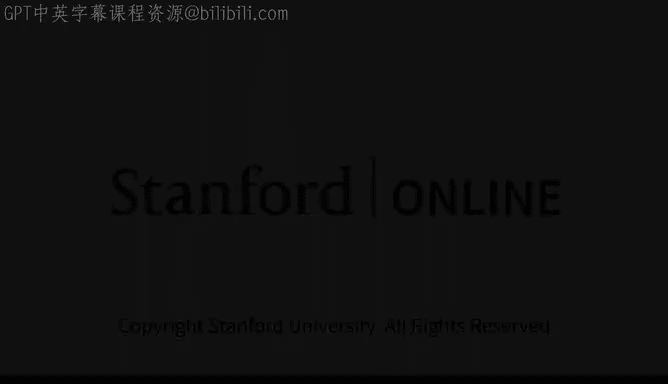

# 8：米拉·穆拉蒂介绍 🧠

在本节课中，我们将跟随OpenAI首席技术官米拉·穆拉蒂，了解生成式AI模型的基本概念及其工作原理。

---

米拉·穆拉蒂是OpenAI的首席技术官。OpenAI是一家专注于人工智能研究与部署的公司。

OpenAI的使命是确保通用人工智能惠及全人类。米拉于2018年加入OpenAI，随后成为其首席技术官，领导公司开发了诸如ChatGPT、DALL-E和Codex等知名应用。

米拉将帮助我们理解什么是生成式AI模型，以及它们是如何工作的。

---

上一节我们介绍了米拉·穆拉蒂的背景，本节中我们来看看生成式AI模型的核心概念。

生成式AI模型是一种能够创造新内容的人工智能系统。这些内容可以是文本、图像、代码或音频。其核心原理是学习大量现有数据的模式，然后根据这些模式生成新的、类似的数据。

以下是生成式AI模型工作的一个简化流程：

1.  **数据训练**：模型在庞大的数据集上进行训练，例如互联网上的所有文本或海量图像。
2.  **模式学习**：模型通过学习，理解数据中的基本元素（如单词、像素）之间的关系和模式。
3.  **内容生成**：当用户给出一个提示（例如一段文字描述）时，模型根据学到的模式，预测并生成最可能跟随的下一个元素序列。

这个过程可以用一个简化的公式来理解：`生成内容 = 模型(训练数据， 用户提示)`。模型就像一个极其复杂的函数，接收输入（提示），并基于其训练经验输出新的内容。

---

理解了基本概念后，我们来看看这类模型的一些关键特点。

以下是生成式AI模型的几个重要特性：

*   **创造性**：它们能够组合已知元素，创造出全新的、训练数据中不直接存在的内容。
*   **交互性**：用户可以通过不断调整提示词，与模型进行多轮对话或迭代，以引导生成更符合期望的结果。
*   **广泛适用性**：同一个基础模型架构（如Transformer），经过不同数据的训练，可以应用于文本、图像、代码等多种模态的任务。

---

本节课中我们一起学习了生成式AI模型的基础知识。我们了解到，以OpenAI开发的ChatGPT等应用为代表的生成式AI，其核心是通过学习海量数据中的模式来创造新内容。这类模型具有创造性、交互性和广泛适用性，正在深刻改变我们与信息和技术互动的方式。