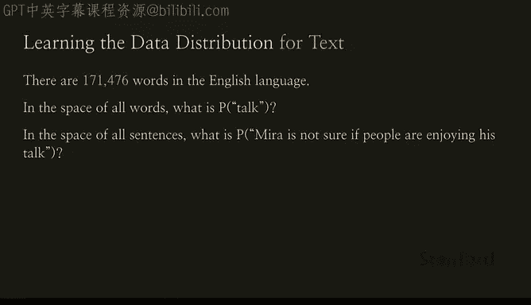
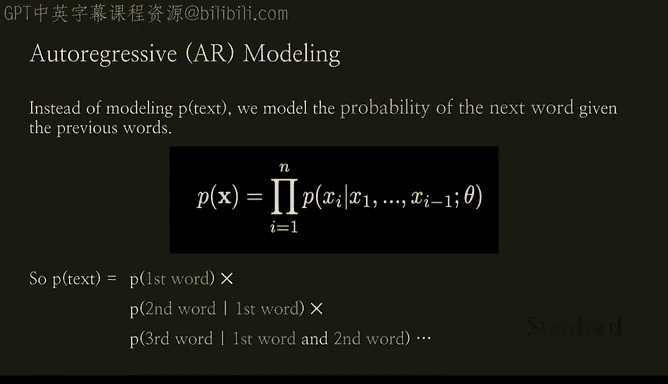
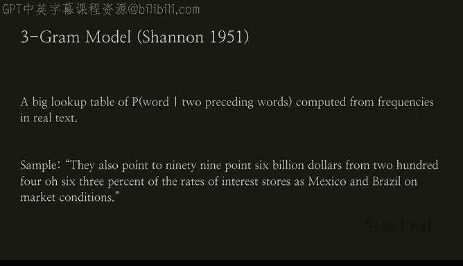
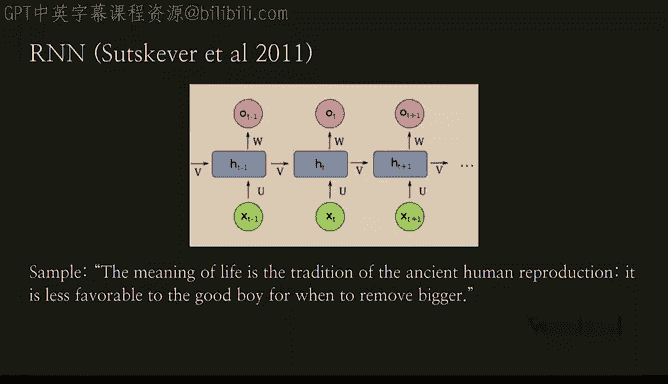
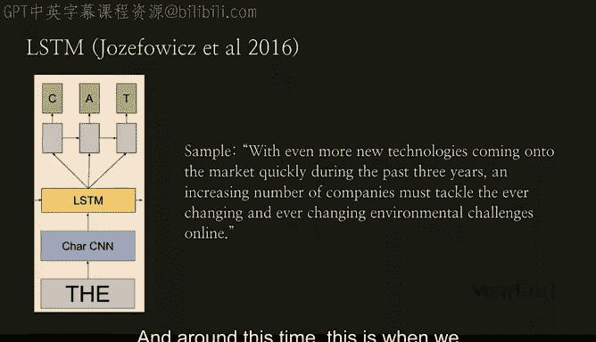
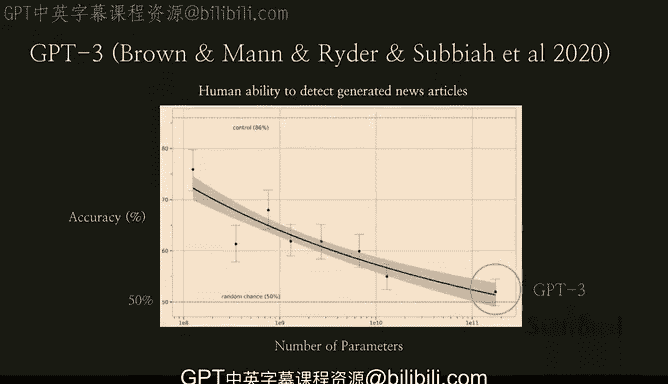
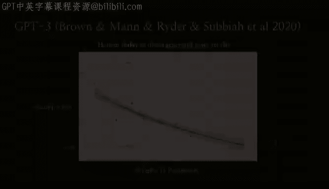

# 9：什么是生成式人工智能 🧠

在本节课中，我们将学习生成式人工智能的核心概念、工作原理及其发展历程。我们将从概率分布的基础讲起，逐步理解现代大型语言模型是如何生成文本的。

---

我相信大家在过去的几个月里都看到了由谷歌Bard等工具带来的成果，这些工具由AI核心驱动。我们通常称它们为生成式AI技术。生成式AI不仅涉及文本生成，也包括图像生成。实际上，在过去一年中，像DALL-E、Midjourney和Stability AI这样的系统已经极大地激发了人们和公司的想象力，并催生了大量基于它们的应用。虽然生成式AI被广泛讨论，但这些系统究竟是什么？我们又是如何发展到这一步的？

## 核心原理：从数据中学习概率分布 🎲

生成式AI的核心在于，我们给系统提供海量数据，并希望它生成的样本与训练数据**难以区分**。

那么这是如何工作的呢？其核心完全是关于**概率分布**。模型通过观察大量数据样本来学习这种分布。这里有一个非常简单的例子：假设我们创建了一个数据集，里面是一堆数字。如果你从中随机挑选一个数字，比如是16，然后你思考“数据集中还有什么其他数字？”如果你询问很多人，他们可能会说4、12或其他随机数字。

随着你看到的数据越来越多，概率分布的图景就会变得越来越清晰。这就是机器学习模型真正在做的事情：它处理大量数据，随着数据越来越多，它对概率分布的理解就越来越精炼。

随之而来的是一个关键概念：模型能够生成它在**训练中从未见过**的新数据。这就是生成式模型的功能。例如，即使我从未在数据集中见过数字4，基于学习到的分布，我也可能生成数字4。

## 文本生成的挑战与突破 📝

然而，对于文本而言，这个问题要困难得多。英语有超过17万个单词。在这个广阔的空间里，预测某个词、乃至某个句子的概率问题变得极其复杂。

真正的突破来自于**自回归模型**。这种模型不是一次性建模整个文本的概率，而是**基于之前所有单词的上下文，逐个预测下一个单词的概率**。

当我们说“自回归语言模型”时，我们指的正是**给定之前所有单词的条件下，下一个单词的概率**。

自回归语言模型已经取得了巨大进展，但这并非一个新想法。事实上，它可以追溯到1951年的克劳德·香农。最初的想法是使用一个大型查找表，根据前两个单词来查找下一个单词的概率。当然，如果只考虑前两个词，在预测后续句子时很可能会丢失大量上下文。因此，你可以看到1951年的这个生成样本并没有太多意义。

## 模型的演进：从神经网络到Transformer 🚀

时间推进到2011年，我们开始使用**神经网络**。神经网络能够从更早的上下文中获取更多信息。因此，2011年的生成样本虽然仍不准确，但已经比几十年前合理得多。

随着机器学习建模技术的进步，通过捕捉序列数据中的长期依赖关系，我们看到了越来越好的生成样本。大约在2016年左右，我们开始尝试扩大模型规模，样本质量也随之有所提升。

但真正的巨大差异出现在2018年，我们看到了**Transformer架构**的诞生。这一点意义重大，因为今天的一切（包括大型语言模型）都由它驱动。在这个例子中，你有一个提示词和续写内容，模型并非从零开始生成。你可以看到，生成的文本开始变得合理得多。

## 里程碑：GPT-2与GPT-3 ✨

2019年，我们构建了**GPT-2**。这是一个非常重要的模型，因为它是第一个生成的续写内容开始变得与人类输出**真正难以区分**的样本。这个提示词非常不寻常，不太容易在训练数据中找到：“在一个令人震惊的发现中，科学家们在安第斯山脉一个偏远、此前未探索的山谷中发现了一群独角兽。更让研究人员惊讶的是，这些独角兽能说一口流利的英语。”模型接着续写道：“科学家们以它们独特的角命名了这个种群……这种四角银白色独角兽此前不为科学界所知……”它编造了整个非常连贯的故事，与人类输出难以区分。

接下来展望**GPT-3**。这个模型的意义在于它比GPT-2**大得多**。我们认为，随着模型规模的增大，我们看到其能力有了显著提升。

以下图表显示了人类检测生成新闻文章的能力。如图所示，随着参数数量从GPT-2增加到GPT-3，人类预测和检测生成新闻文章的准确率显著下降。

---

**本节课总结**

在本节课中，我们一起学习了生成式人工智能的基础。我们从概率分布的核心概念出发，理解了模型如何通过海量数据学习并生成新样本。我们探讨了文本生成的特殊挑战，并回顾了从简单的查找表到现代自回归语言模型的关键突破。最后，我们见证了模型架构从神经网络演进到Transformer，以及模型规模从GPT-2扩大到GPT-3所带来的能力飞跃。生成式AI的核心在于，它不仅仅是记忆，更是基于所学概率分布进行创造。