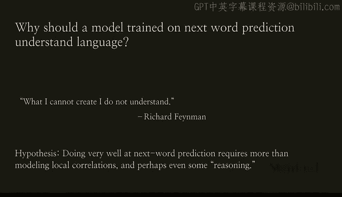
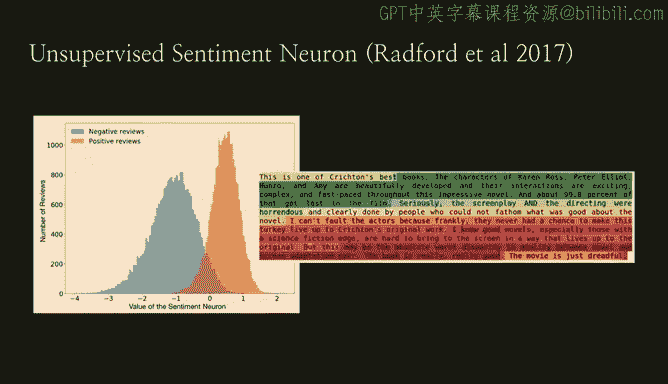
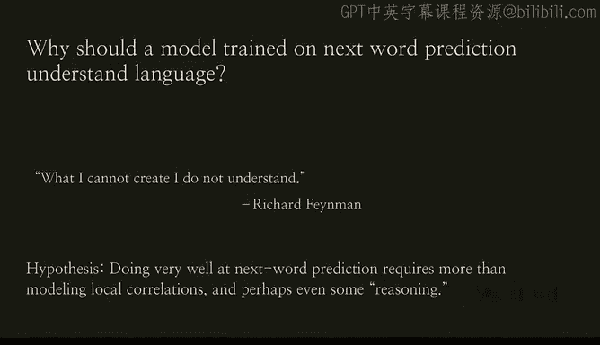
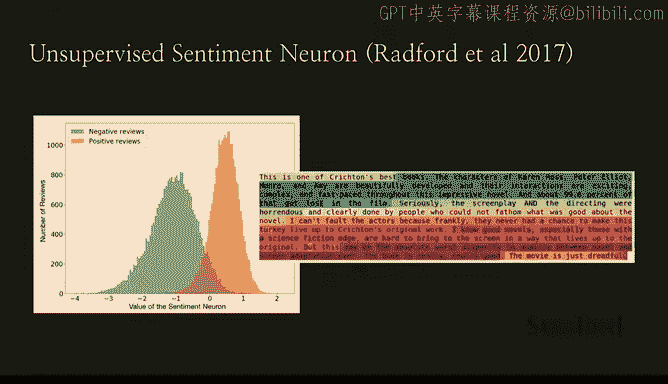
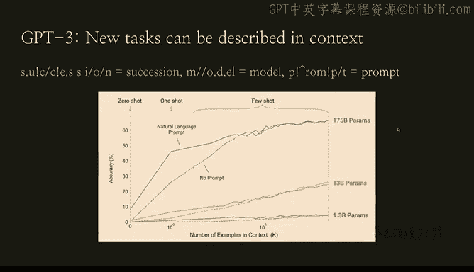
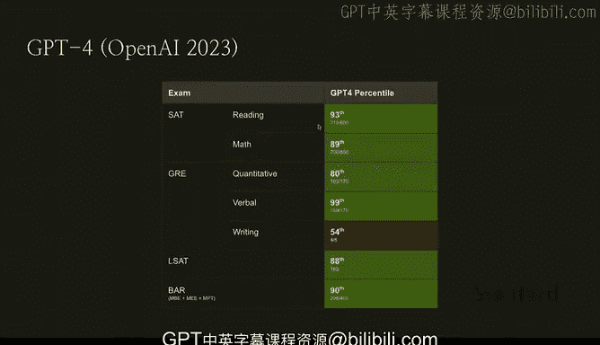

# 10：GPT的哲学 🧠

在本节课中，我们将探讨GPT系列模型背后的核心设计哲学。我们将了解为何选择“预测下一个词”作为基础任务，以及这个看似简单的目标如何催生出理解语言、推理乃至更广泛智能的能力。

---

## 为何押注“扩展”与“预测下一个词”？

我们最初选择押注模型扩展（scaling）并追求“预测下一个词”的哲学，其根本原因是什么？这个任务本身是否有用？

我们真正关心的并非仅仅是预测下一个词本身，而是**理解语言**以及在真正重要的任务上表现出色。GPT-2 是一项实验，旨在解决机器学习中最困难的问题之一：**无监督学习**。这就是我们的起点。通过研究下一个词的预测，我们假设可以获得比单纯预测更多的东西——我们或许能更深入地理解语言，甚至思考理解与推理，从而在训练越来越大的模型时，获得所有这些**涌现能力**。

---

## 监督学习与无监督学习

上一节我们提到了无监督学习，这里有一个非常有趣的区分点。并非所有人都清楚这个区别，我们可以在30秒内解释一下。

主要的区别在于：在**监督学习**中，你处理的是由人类标注过的数据集。这显然是一个非常手动的过程，操作上非常繁重，成本也很高。而GPT-3训练所用的所有互联网数据，你显然不需要为模型提供它正在看的东西的定义。从监督学习转向无监督学习，你便拥有了丰富且庞大的数据集——数字世界中的一切，我们所有的数字信息都可以被利用。

构建强大AI系统有三个关键要素：
*   **数据**
*   **神经网络架构**
*   **大规模超级计算机**

---

## 涌现能力的发现

谈到涌现能力，我们说过，我们最初研究语言或预测下一个词，是希望获得更多能力。我们假设这些模型可以更多地理解语言本身，甚至可能理解推理。OpenAI在2017年首次观察到这种现象。

我们当时拿了一堆亚马逊评论，目标仅仅是**预测下一个字符**，而不是对这些评论做任何其他事情。但我们发现，模型中出现了一个能理解评论情感（正面或负面）的神经元。这个涌现属性非常重要，因为我们并没有训练模型去理解情感，我们只是在尝试预测下一个字符。这促使我们思考：这种预测可以引导我们获得对语言更高层次的理解。

---

## 从提示中学习：上下文示例与思维链

几乎每个任务都可以用语言来描述，这就是我们在GPT-2中看到的情况。而在GPT-3中，我们发现你可以在提示中为模型提供更多示例，随着你给出的示例增多，模型的表现会好得多。

例如，样本准确率与你提供的上下文示例数量相关——提供的示例越多，模型表现越好。我们了解到，如果你给模型一些你希望它做的事情的例子，它就像一个变色龙，会进行模式匹配。例如，如果你给出一堆问答示例，然后问它一个后续问题，它会给出答案，因为你正在引导它这样做。或者，如果你给出一堆写诗的例子，然后要求它写一首诗，它会以类似的方式完成。

另一个有趣的发现是：

如果你向模型展示问题解决的**推理步骤**，它在完成你要求的任务时会表现得更好。如果你最初只给出问题，它可能会答错。但如果你引导模型逐步解决问题，它就会像人类一样跟随并开始理解如何操作。

---

## GPT-4：推理能力的飞跃

以上是我们在从GPT发展到GPT系列过程中学到的一系列东西。我们发布了GPT-4，它与GPT-3的主要区别在于**推理能力**变得更强健、更强大。

事实上，我们通过一系列通常用于测试人类智力的考试来检验它，发现GPT-4表现非常出色，在SAT、GRE、LSAT等考试中大约处于前90%的水平。我们还进行了一系列更定性的问题测试。

---

## 总结

本节课中，我们一起学习了GPT系列模型背后的核心哲学。我们从“预测下一个词”这个简单的无监督学习任务出发，看到了它如何催生出对语言的理解、上下文学习能力以及关键的推理能力。通过模型规模的扩展和数据的利用，GPT系列逐步进化，最终在GPT-4上实现了强大的通用推理能力，这标志着AI在理解复杂任务和模仿人类思维方面取得了重大进展。