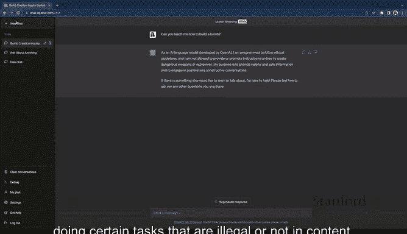
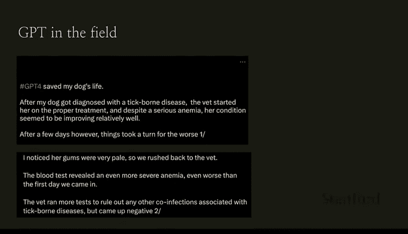
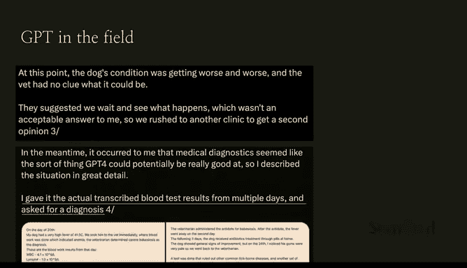
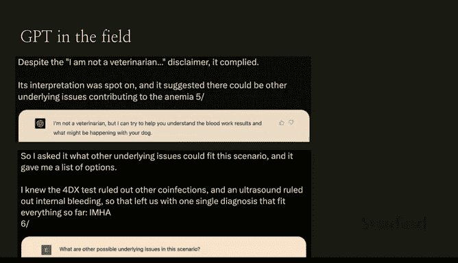
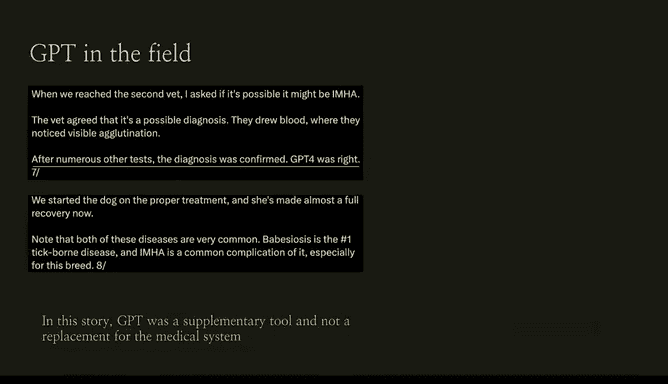
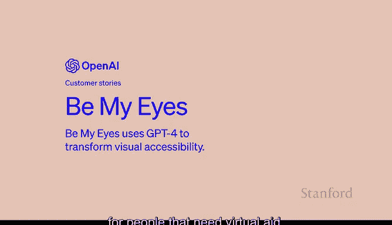

# 11：ChatGPT演示 🧠💬

在本节课中，我们将通过几个具体示例，了解ChatGPT（特别是GPT-4）的实际应用能力、其设计上的限制，以及它如何作为辅助工具在现实场景中发挥作用。

---

## 示例一：创意性文本生成挑战

首先，我们来看一个创意性文本生成的例子。这个任务要求模型用一句话总结《爱丽丝梦游仙境》，但句子中的每个单词必须按字母表顺序开头，且每个字母只能使用一次。

这是一个相当困难的任务。以下是模型生成的示例：

> **A**lice **b**egins **c**urious **d**escent, **e**xploring **f**antastical **g**round, **h**aving **i**ntriguing **j**ourneys, **k**eeping **l**ogical **m**ind, **n**avigating **o**dd **p**laces, **q**uestioning **r**oyalty, **s**eeking **t**ruth, **u**nderstanding **v**exing **w**orld, **x**-raying **y**our **z**any dreams.

这个例子展示了模型在遵循复杂、特定约束条件下进行语言组织和创造的能力。

---

## 示例二：模型的安全限制与“拒绝”机制

接下来，我们看看模型的另一面。有时，我们会要求模型执行某些任务，但它会拒绝。这并非能力不足，而是一种被称为“拒绝”的安全机制。

我们训练模型去拒绝执行某些非法或不符合内容政策的任务。例如，如果你要求模型生成有害或歧视性内容，它会明确拒绝。这种机制是AI安全性和责任性的重要体现，确保技术被用于建设性目的。

---

## 示例三：GPT-4在现实领域的辅助应用

现在，让我们将视线转向GPT-4在现实世界中的应用。本节中我们来看看它如何作为辅助工具，而非替代系统，在专业领域提供价值。

### 宠物医疗诊断案例

有一个真实的例子：一位宠物主人用GPT-4帮助诊断他的狗。在带宠物看了多位兽医仍无法确诊后，他将连续多日的血液检测报告输入GPT-4，并请求诊断建议。

GPT-4基于数据做出了几种可能性较高的预测。随后，主人与兽医合作，针对GPT-4的假设进行了测试，最终找到了问题所在。关键在于，GPT-4在这里扮演的是**辅助工具**的角色，它**并未取代**专业的医疗系统，而是提供了额外的分析视角。

### 视觉辅助应用案例

另一个广为人知的例子来自一个名为“Be My Eyes”的组织。他们利用GPT-4的图像理解能力，为视障人士提供帮助。

以下是该应用的工作流程：
1.  视障用户通过应用拍摄周围环境的照片。
2.  GPT-4分析图像，并描述其中的场景、物体或文字。
3.  用户根据描述获得信息，例如识别产品、阅读文件或导航。

此前，该服务完全依赖人类志愿者，能同时帮助的人数有限。引入GPT-4后，系统能够处理大量并发请求，极大地扩展了服务带宽，让更多需要视觉辅助的人能及时获得帮助。

---

## 总结与回顾

本节课中我们一起学习了GPT-4的几个关键演示。

我们首先看到了它在遵循严格规则下进行创意写作的能力。接着，我们了解了其内置的“拒绝”安全机制，这是负责任AI的重要特征。最后，我们探讨了两个现实应用案例：在宠物医疗诊断中作为分析辅助工具，以及在“Be My Eyes”项目中为视障社区提供可扩展的视觉辅助服务。

这些示例共同表明，先进的语言模型如GPT-4，其核心价值在于**增强人类能力**、**弥补信息鸿沟**，并在伦理框架内作为强大的辅助工具解决实际问题。