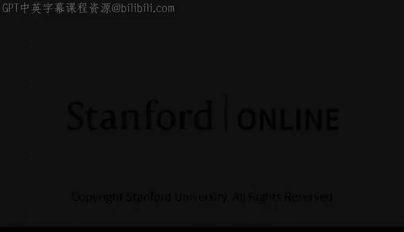

# 12：数据、人类反馈与AI公司构建 🧠

在本节课中，我们将学习AI模型开发中至关重要的数据基础，以及如何通过人类反馈来改进模型。我们还将探讨在AI领域构建公司的关键经验。

## 主讲人介绍 👨‍💼

亚历山大·王是Sc AI公司的首席执行官兼联合创始人。

Sc AI是一家为各类组织提供以数据为中心的基础设施的公司，旨在加速其AI开发进程。

## 课程核心内容 📚

上一节我们介绍了主讲人的背景，本节中我们来看看他将为我们带来的具体分享内容。

亚历山大将与我们探讨支撑AI模型的数据基础，以及一种通过人类协作来改进AI模型的技术。

这种技术被称为**RLHF**，即**基于人类反馈的强化学习**。

此外，亚历山大还将分享一些从构建Sc AI公司过程中获得的经验，以及要在AI领域成功创建公司所需的关键要素。

## 总结 🎯

本节课中我们一起学习了AI模型开发的两大支柱：数据基础设施和RLHF技术。我们也初步了解了在快速发展的AI领域创业所需的核心考量。这些知识为理解现代AI系统的构建与迭代提供了基础框架。