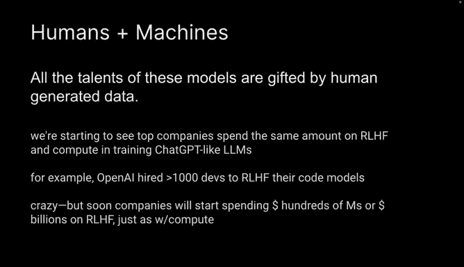
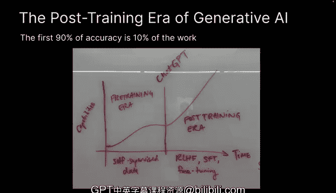

# 13：数据的角色 🧠

在本节课中，我们将要学习数据在生成式AI模型发展中的核心作用，特别是人类生成的数据如何赋予模型能力，以及当前AI发展如何从“预训练时代”进入“后训练时代”，其中人机协作变得至关重要。

## 人与机器：对话的铺垫

我添加了几张关于人与机器的幻灯片，以便为讨论做一些铺垫。

我认为有一点可能没有被很好地理解，或者说人们可能没有深入内化的一点是：这些模型的所有能力都是由人类生成的数据赋予的。模型本身并不知晓任何事情，也无法完成任何任务。

它们仅仅是通过观察海量数据，才被赋予了这些不可思议的能力。通过阅读互联网和世界上所有的书籍，模型能获得一组特定的能力，但这组能力是有限的，与我们希望这些模型未来能做到的所有事情相比，还有很大差距。

## 数据赋予模型能力

以下是理解数据角色的核心观点：**模型的所有才能都源于人类生成的数据**。模型本身不具备内在知识或能力。

它们通过处理海量数据，才获得了这些强大的能力。从互联网和书籍中学习，赋予模型一组基础能力，但这组能力相对于我们期望模型达到的全部目标而言，是有限的。

## 后训练时代的到来

接下来，我将讨论这一点。这里有一条我认为很有趣的推文，它触及了这个问题的核心。

我们基本上开始看到，许多顶级公司在**基于人类反馈的强化学习**上投入了与计算资源同数量级的资金。RLHF可能是通过人类参与（而非单纯增加计算量）来改进模型的主要方式，特别是在训练类似ChatGPT这样的高质量大语言模型时。

有一篇新闻报道提到，OpenAI雇佣了1000名开发者来对他们的代码模型进行RLHF。这听起来可能有些不可思议，你会认为这些模型需要的是与人类计算量相当的计算资源。

但我认为这并不奇怪。

因为 broadly speaking，我们正在进入我称之为生成式AI的**后训练时代**。

我们曾长期处于生成式AI的**预训练时代**。那个阶段主要是寻找方法利用所有无监督数据，比如互联网上的所有数据、书籍数据、Reddit数据等。我们从这些模型中获得了相当大的收益。

但正如所有事物一样，没有什么是永恒的。一旦我们从所有这些模型中达到了一定的性能水平，ChatGPT就开启了AI的**后训练时代**。这个时代的核心是：你如何与模型交互？

ChatGPT之所以如此出色，首要原因就是RLHF。我们能够利用人类反馈，让模型真正响应人类的指令和问题，基本上遵循人类的指示。

现在，我们正处于这样一个时代：这些模型的许多性能提升，将通过大量的人机协作来实现。这包括**RLHF**、**监督式微调**以及**专业化微调**。

显然，很难预测五年后我们会处于什么位置，但这确实是当前行业正在发生的情况：如今模型的大部分改进，都源于某种形式的人机协作，以实际推动模型的进步。

## 从90%到99%的漫长之路

关于这一点，我最后想说的是：AI领域最大的观察之一是，**达到前90%的准确率只完成了10%的工作**。

我认为这在生成式AI领域也将是成立的。我们显然已经获得了这些极其强大的模型，但在我会信任一个模型成为我的医生之前，还有很长的路要走。

我认为，从90%提升到99%这个前沿领域，将需要大量的工作，并且人类将在这个过程中深度、深度地参与其中。

---

**本节课总结**

在本节课中，我们一起学习了数据在AI模型能力塑造中的根本性角色。我们了解到，模型的能力完全由人类生成的数据赋予，其本身并无内在知识。当前，AI发展正从利用无监督数据的“预训练时代”，进入依赖人机紧密协作（如RLHF、监督式微调）的“后训练时代”。最后，我们认识到，实现模型从“可用”到“可靠”（例如从90%到99%的准确率）的飞跃，将是一个需要人类深度参与的漫长过程。