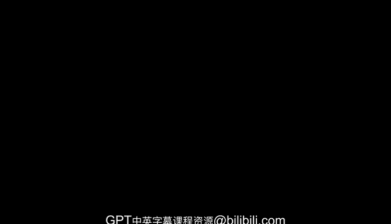

# 15：15_01_04 未知的未知 🎲

在本节课中，我们将探讨一个关于预测未来的核心概念——“押注未知的未知”。我们将分析为何未来难以预测，以及为何在技术前沿，突破常常超出最乐观的预期。

---

## 押注未知的未知

世界存在一种有趣的特质。

或许看待这个问题的一种方式是：在任何时间点，没有人能真正预测未来。如果你想准确预测未来，那么在你的预测中，就必须隐含一系列同样无法预测的突破。

以人工智能为例，近期的AI突破无疑远超大多数人的预期。我认为大多数人在预测未来时，会审视该领域的现状，他们会想：还有这么多问题，我们还没有能够推理的AI，等等。结果，你生活在这种基于现实的认知中，但你失去了理解那些即将发生的“未知的未知”的能力，而这些“未知的未知”实际上会推动该领域取得相当显著的进展。

我在AI领域实时见证了这一点。过去一年ChatGPT或过去六个月ChatGPT所发生的一切完全出人意料。我认为该领域没有人真正预料到世界会因此“燃起熊熊大火”，但这就是事实。

因此，我称这个概念为“押注未知的未知”。我的一个观察是，这种现象只发生在人类坚韧性和创造力的前沿地带。当这两者结合在一起时，就会出现人性不断超越你预期的情况。

---

## 认知的循环：从“愚蠢”到“天才”

我见过一些梗图，比如关于“蠢材”、“庸才”和“天才”的。我认为这些梗图很好地描绘了现实。

其中一个例子是关于AI的：AI会接管世界吗？还是我们会陷入该领域的所有局限中？我认为正在发生的情况很明显：**AI不会接管世界**。摩尔定律也是如此，在任何时候，总有人说摩尔定律结束了，计算能力不会再提高了。我的意思并非字面上的AI会接管世界，而是指AI作为一种技术将在世界变得无处不在。

这通常是发生的循环：你有一条代表过去历史的绿线，这是一系列最疯狂的、极度乐观的预测。我认为有很多很好的例子，比如埃隆·马斯克或萨姆·奥尔特曼等许多人，他们常常代表着那种极度乐观的路径。

然而，实际发生的情况是，在大多数时候，我们严重偏离了这种极度乐观的路径。但有时，像Transformer架构、ChatGPT、深度学习的原始出现或2010年代初深度学习的兴起这样的突破会发生。这些突破导致巨大的飞跃，使你几乎能赶上极度乐观的预测。

你可以选择现实一点，即追踪最底部的预期结果，这样听起来很聪明；或者你可以选择极度乐观，听起来很疯狂，但最终被证明是正确的。

---

## 总结

本节课中，我们一起学习了“押注未知的未知”这一概念。我们了解到，预测未来之所以困难，是因为其中必然包含无法预见的突破。在技术发展的前沿，人类的创造力和韧性相结合，常常能催生出超越最乐观预期的成果。技术发展的轨迹往往不是线性的，而是在长期偏离乐观预测后，因关键突破而实现跃升，最终验证了那些看似“疯狂”的愿景。理解这一点，有助于我们以更开放和动态的视角看待AI等前沿技术的发展。