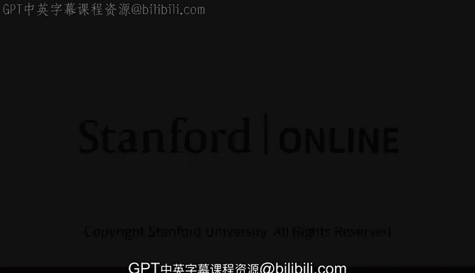
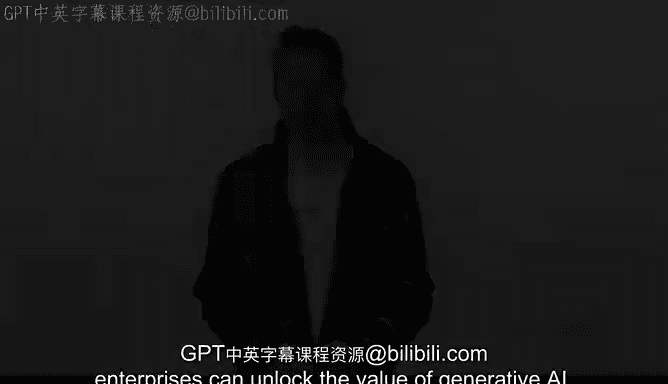

# 16：嘉宾宾杜·雷迪介绍 🧑‍💼

在本节课中，我们将认识一位在人工智能和企业应用领域具有丰富经验的专家——宾杜·雷迪。我们将了解她的职业背景，以及她将为我们带来的关于企业如何利用生成式AI创造价值的见解。

宾杜·雷迪是Abacus.ai的首席执行官兼联合创始人。Abacus.ai是一个端到端的人工智能平台，旨在为常见的企业用例提供大规模实时深度学习能力。

在创立Abacus.ai之前，宾杜·雷迪曾担任亚马逊网络服务（AWS）人工智能部门副总裁。她上一家公司被谷歌收购。在此之前，她曾在谷歌工作，担任谷歌应用套件（包括文档、电子表格、幻灯片、协作平台和博客）的产品负责人。

我们期待宾杜·雷迪分享企业如何解锁生成式AI的价值。

本节课中，我们一起认识了本课程的嘉宾宾杜·雷迪，了解了她在科技巨头和创业公司中积累的深厚AI产品与管理经验。她的分享将为我们揭示生成式AI在企业层面的实际应用与巨大潜力。