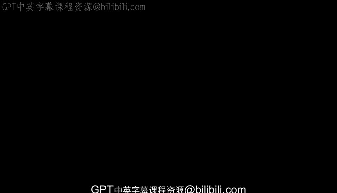
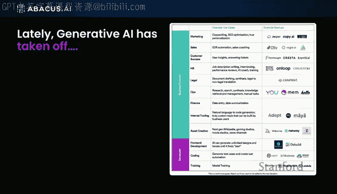

# 17：生成式人工智能初创企业格局 🚀

在本节课中，我们将探讨生成式人工智能（特别是大语言模型）在商业环境中的应用，并分析当前初创企业的生态格局。我们将了解大语言模型如何从研究概念演变为驱动商业应用的核心技术。

---

## 大语言模型的商业应用背景

除非你与世隔绝，否则你一定听说过ChatGPT。生成式人工智能正在迅速崛起。过去六个月里，在Twitter等平台上，我们能看到大量展示生成式AI初创公司的信息图。从销售、法律到内部工具，几乎所有领域都出现了自动化尝试，或者说人们正试图实现自动化。虽然网络上的炒作通常比现实超前大约两年，因此我们需要理性看待，但总体而言，大语言模型（LLMs）已成为当前的核心。

大语言模型，正如你可能知道的，能够生成出色的内容，在信息检索方面表现优异，而搜索是其最大的应用市场。

---

## 大语言模型在商业环境中的价值

那么，大语言模型在商业环境中将如何发挥作用呢？

Applied AI本质上是一家通过构建AI平台，为企业创建应用型AI系统的公司。我们创立公司时的愿景是：构建应用型AI系统的将是AI本身，而非人类。四年前这个愿景听起来很荒谬，人们嘲笑我们，认为我们需要高薪的数据科学家来构建这些系统。但随着时间的推移，大量创新涌现，我们也贡献了部分研究。现在，当我说“AI而非人类构建AI系统”时，大家都深表认同。这就是我们的愿景，我们认为自己正处在这场革命的前沿。

---

## 什么是应用型AI系统？

在大概一年前，应用型AI系统主要包括时间序列模型和个性化推荐系统。例如，YouTube的流量有85%依赖于其庞大的个性化推荐算法。每次你观看视频，下一个推荐视频都是为你量身定制的。这曾是应用型AI的基石。

同样，如果你与戴尔电脑或亚马逊交流，他们会告诉你，如果没有时间序列预测模型，亚马逊将不再是亚马逊。这些模型能够预测特定商品在未来三个月内的销售情况，例如蒙大拿州将售出多少USB连接器。

---

## 新一代应用型AI系统：大语言模型

现在，新的应用型AI系统是大语言模型，它们被应用于各类企业。这正是我们目前提供的服务方向。

接下来，让我们简要探讨一下大语言模型领域的发展现状。

---

## 大语言模型的进化树

以下内容或许你们都已见过，但它清晰地概述了大语言模型从2018年到2023年这短短五年间的戏剧性进化历程。我们见证了这些模型的大爆发，其中许多来自大型科技公司。这背后有三个关键因素：**强大的计算能力**（需要成千上万的GPU）、**海量的数据**以及**顶尖的人才**。将这三者结合，就能创造出卓越的大语言模型。

如今，我们拥有了GPT-4、Bard，当然还有Meta发布的Llama。所有这些大语言模型都始于由谷歌研究人员发明的**Transformer架构**。

其核心公式可表示为：
**输出 = Transformer架构(输入文本, 模型参数)**

---

## 总结

本节课中，我们一起学习了生成式人工智能初创企业的格局。我们回顾了大语言模型从基础研究到商业应用的演变路径，理解了其背后的关键驱动因素（计算、数据、人才），并认识了新一代以LLM为核心的应用型AI系统如何正在改变各行各业。从个性化推荐到精准预测，大语言模型正成为企业智能化转型的核心引擎。