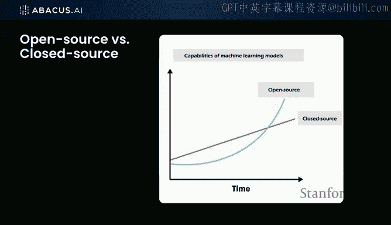
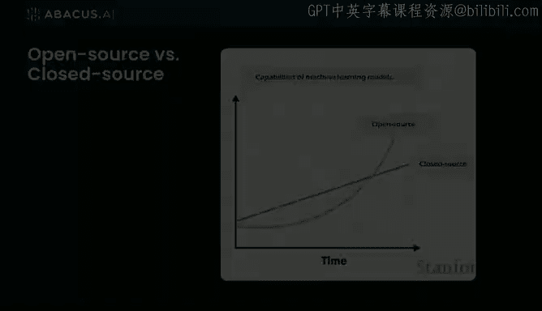
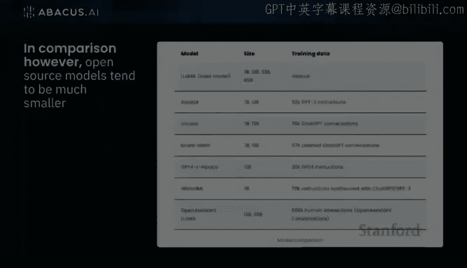
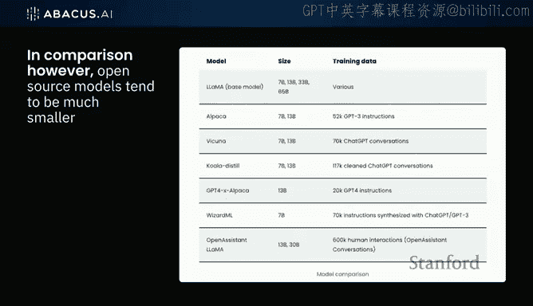
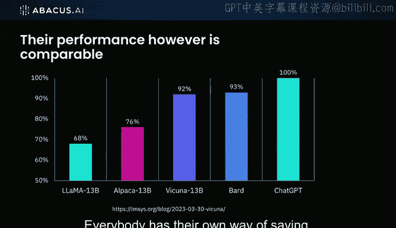
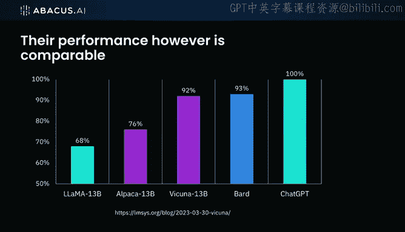
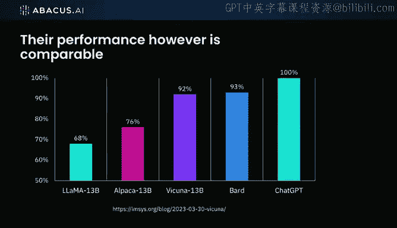

# 18：开源与闭源模型的发展趋势 📈

在本节课中，我们将探讨大型语言模型（LLM）领域开源与闭源模型的当前格局与未来演变。我们将分析模型规模的发展趋势、开源生态的崛起，以及这些模型在不同应用场景下的表现差异。

## 模型规模的演进与“NLP摩尔定律”

上一节我们讨论了LLM的基本概念，本节中我们来看看模型规模的发展规律。

我们观察到一种被称为“NLP摩尔定律”的现象，即模型规模大约每年增长10倍。下图展示了这一增长趋势：

虽然这张图有些过时，但趋势依然明显。例如，在2021至2022年间，我们已经看到了具有 **1.6万亿参数** 的模型。有传言称GPT-4的参数规模可能达到10万亿，尽管其论文显示可能在4-5万亿左右，但规模持续增长是确定的。

然而，我认为我们已经达到了LLM规模的峰值。未来我们可能不再需要训练如此庞大的模型。因为更小的模型也展现出了高效的性能。例如，一个 **200亿参数** 的模型，其性能可能已经能达到顶尖模型的60%-70%。

以下是研究人员正在探索的、用于提升小模型效率的主要方向：
*   **模型压缩技术**：将大模型中的知识压缩到更小的模型中。
*   **高效训练方法**：开发新的算法和技巧，以更低的计算成本训练出高性能模型。
*   **高质量数据获取**：核心挑战往往不是模型大小，而是获取更多样、更高质量的训练数据。

## 开源模型的崛起与策略

在对比了由资金雄厚的大公司开发的闭源模型后，我们现在来看看等式的另一边——开源模型。

开源生态的真正起飞，始于Meta发布了Llama基础模型。该系列提供了多个不同规模的模型，例如 **70亿参数** 的版本，只要拥有强大的GPU，开发者就可以开始实验。

随后，斯坦福的研究人员基于Llama进行微调，发布了Alpaca模型。其中，**650亿参数** 的版本表现非常出色。

Meta的这一发布本身可能包含战略考量。他们或许意识到了LLM的巨大潜力，并希望通过开源来减缓OpenAI等竞争对手的独占势头。这无疑是一个聪明的策略，因为它催生了包括我们在内的众多参与者，在一定程度上形成了竞争格局。

Llama发布后不久，开源社区便展示了惊人的创新速度。以下是两个关键案例：

*   **Alpaca的合成数据**：斯坦福团队在两周内，利用GPT-3生成合成训练数据，然后用这些数据来微调Llama，从而提升了其性能。这揭示了一个有趣的现象：**AI已经开始帮助构建更优的AI**。
*   **Vicuna与ShareGPT数据**：另一个新模型Vicuna，使用了来自ShareGPT网站的数据。该网站收集了人类与GPT-4的对话记录，这些数据被用于训练较小的模型，从而将GPT-4的“智能”迁移到了更小、更易获取的模型中。

## 开源模型的性能与应用前景

那么，当前开源模型的实际表现如何呢？

首先需要谨慎看待各类性能排行榜。目前最大的问题之一是缺乏统一、可靠的基准测试来评估LLMs。每个团队都可能宣称自己的模型更好，并使用不同的评测标准。

例如，下图来自Vicuna团队发布的评测结果，需要辩证看待：

该评测基于一系列问题，以ChatGPT的表现作为最佳基准进行比较。结果显示，开源模型的表现并不差。

根据我们的实验，在回答需要广泛知识的开放性问题时（例如“16世纪埃及的国王是谁？”），这些开源小模型可能还无法完全比肩ChatGPT或Bard。

但是，在**应用型AI和特定领域**的场景中，这些较小模型将大放异彩。

具体来说，当您使用接近企业自身的专有数据（即**语料库**）来训练这些模型时，它们会表现得更好。这意味着，通过针对特定业务领域进行微调，开源模型能够在具体任务上达到甚至超过大型通用模型的效果。

---

本节课中我们一起学习了LLM领域开源与闭源模型的动态发展。我们回顾了模型规模增长的趋势，看到了开源模型如何借助策略发布和社区创新迅速崛起，并分析了其在特定应用场景下的独特优势。未来，我们很可能会看到更多高性能的开源模型出现，使LLM技术逐渐成为一种更普及的“商品”。