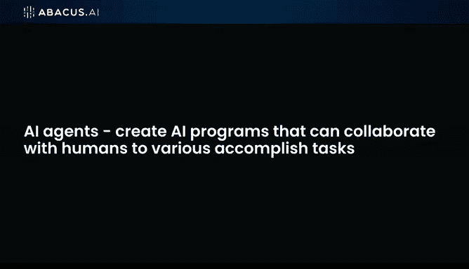
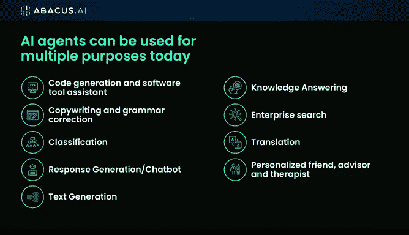

# 20：人工智能代理 🧠🤖

## 概述

在本节课中，我们将要学习“人工智能代理”这一概念。我们将探讨它是什么，它能做什么，以及它如何利用大型语言模型来协助人类完成复杂的任务。

---

## 什么是人工智能代理？

我比大型语言模型更感到兴奋的，是那些我们甚至不知道该如何命名的东西。目前人们称它们为“人工智能代理”，我们也暂且这样称呼。其核心理念是创建能够与人类协作、完成高级任务的AI程序。

想象一下，你手头有一堆数据和一系列查询需求。例如，假设你有10张数据库表，你的问题是：“三月份有多少用户注册，其中又有多少在六月份流失了？”今天，你需要自己提出这个问题，思考对应的SQL查询语句，编写SQL，将其提交到数据库，再取回结果。整个过程都需要人类参与。

---

## 人工智能代理如何改变工作流程？

然而，在未来——这个未来就是现在——你可以利用大型语言模型来帮助你完成所有这些步骤。你不再需要数据库管理员或专门的查询人员。

你可以编写一个AI代理，这个代理实际上可以与你协作，为你获取这些答案。以下是AI代理能够完成的一些任务类型：

*   **个性化角色**：它们可以成为你的个性化朋友、顾问或治疗师。
*   **内容生成**：例如协同创作、文案写作。
*   **信息处理**：例如文档分类、企业级搜索等。

其中一些任务，基础的LLM（如ChatGPT）也能完成。这并不是说每件事都需要一个专门的代理。但今天，如果我直接使用ChatGPT，它可能不擅长文档分类。想象一下，如果我有15份文档：一份是保险索赔，一份是产权文件，另一份是其他内容。如果我想让它“对这些文档进行分类”，今天我可能需要做大量工作，甚至编写一些程序才能实现。

但通过创建一个AI代理，你可以非常快速地完成这个任务。

---

## 应用AI的未来：代理即角色

我们认为，应用AI将真正在后台利用LLMs来完成大量这类工作。你可以将每个代理几乎视为一个**角色**。

无论是数据录入员、文案写手（负责文案撰写或语法校正），其基本思路是：让一个人类专家（例如厌倦了重复工作的文案）配备一个AI代理，来协助他或她完成文案工作。

---

## 总结

本节课中，我们一起学习了“人工智能代理”的概念。我们了解到，AI代理是能够与人类协作、执行复杂任务（如数据分析、文档分类、内容创作）的智能程序。它们通过后端的大型语言模型驱动，能够将人类从繁琐的流程中解放出来，让专家更专注于核心决策与创造。未来，AI代理有望成为各行各业中，辅助人类专家的高效“数字同事”。