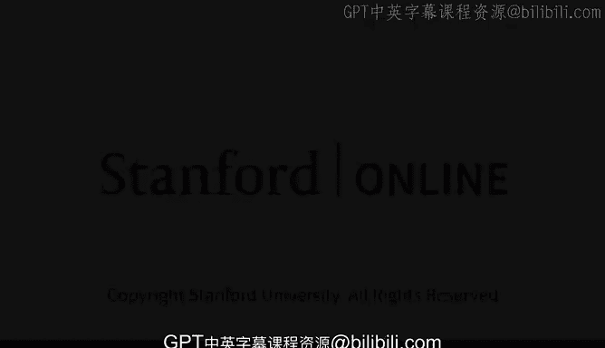

# 21：劳拉·泰森教授介绍 👩‍🏫

在本节课中，我们将认识并了解主讲嘉宾劳拉·泰森教授的背景与专长，她将为我们深入剖析人工智能与自动化对劳动经济的影响。

---

劳拉·泰森是加州大学伯克利分校哈斯商学院的杰出教授。

此前，她曾担任伦敦商学院院长以及伯克利哈斯商学院院长。

她曾在克林顿政府任职，担任经济顾问委员会主席，并曾领导国家经济委员会。

对我们而言最重要的是，劳拉是全球顶尖的**劳动经济学**以及**人工智能与自动化经济学**专家，而这正是她今天将要与我们探讨的主题。

---

---

本节课中，我们一起学习了本节课程的主讲人——劳拉·泰森教授的卓越背景。她拥有深厚的学术造诣与丰富的政策制定经验，尤其在劳动经济学与人工智能影响领域是权威专家。在接下来的课程中，她将基于这些专业知识，为我们解析AI觉醒对经济与社会带来的深刻变革。