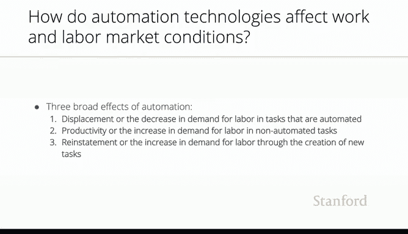

# 22：过往自动化的经验教训 📚

在本节课中，我们将回顾自动化的历史，并探讨其如何影响劳动力市场。通过理解过去，我们可以为未来AI技术带来的变化做好准备。核心问题并非AI是否会导致失业，而是它能否创造高质量的就业机会。

## 回顾自动化历史 🔍

上一节我们探讨了AI作为工具的本质。本节中，我们来看看自动化历史的经验教训。

自动化是工具集合中的一种。它的作用是执行以往由人类完成的任务，通常成本更低、速度更快、效果更好。理解自动化的历史及其对劳动力的影响，能为我们预测未来提供指引。

## 自动化的核心影响：就业与质量 ⚖️

我的问题，也是埃里克的问题，很可能也是国会讨论过的问题，并非“AI和AI赋能的智能工具是否会导致失业”，而是“它们能否创造高质量的就业机会”。

自动化历史表明，自动化与生产力提升是同步的。它也与充分就业并存。约翰·梅纳德·凯恩斯提出的“长期技术性失业”观点，并未得到证据支持。自动化会带来生产力增长，而生产力增长会促进就业增长，催生新的职业和工作。

然而，许多现有工作将被摧毁和改变，并伴随大量的转型成本。工作消失的地点与新工作出现的地点往往不同，时间也不同。旧工作可能迅速消失，而新工作的产生可能需要时间。

因此，关键不在于技术性失业，而在于**就业质量**。这应是我们政策制定者未来面临的挑战。

## 自动化的动态过程：替代与再创造 🔄

在探讨就业质量时，需要强调自动化确实会导致替代，即显著的岗位替代。以下是自动化影响劳动力需求的动态过程：

以下是自动化影响劳动力需求的三个关键环节：

1.  **替代**：自动化任务对劳动力的需求下降。
2.  **互补与生产力提升**：技术对未被自动化的任务形成互补，生产力提升导致对这些任务的需求增加，进而增加对相关劳动力的需求。
3.  **再创造**：通过创造全新的工作，实现需求的恢复或增长。

知名经济学家大卫·奥托（或达伦·阿西莫格鲁）的研究强调，关键在于**替代速度是否超过了再创造速度**。不幸的是，有证据表明过去几十年这种情况一直在发生：替代发生得更快，人们失去工作，陷入更差的岗位，而优质新工作的再创造过程则更为缓慢。这是一个重要的观察结论。

## 总结 📝

本节课中，我们一起学习了从自动化历史中汲取的经验。自动化在历史上推动了生产力增长和充分就业，但核心挑战在于就业质量以及转型过程中的阵痛。未来面对AI，我们应关注其创造高质量就业的潜力，并警惕“替代速度快于再创造速度”可能带来的社会问题。政策制定者的重点应放在如何管理转型、降低转型成本，并促进优质新岗位的创造上。