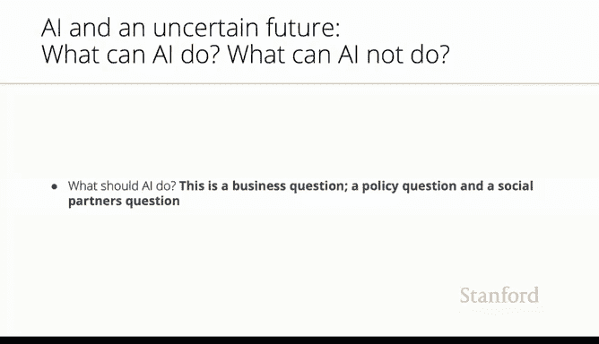

# 25：人工智能的经济影响与未来 📊

在本节课中，我们将探讨高盛集团一份关于生成式人工智能对就业市场潜在影响的报告，并分析其核心发现与深远意义。我们将重点关注“暴露”于AI的定义、其对不同技能层级工作的影响，以及由此引发的社会与政策思考。

---

高盛集团发布了一份非常有趣的报告，试图估算可能受最新模型——生成式人工智能——影响的职位比例。

他们的估计是，美国当前7%的就业岗位可能受到影响。

63%的岗位可能得到“增强”，即高技能工作者可以利用这项技术并与之协同工作。而30%的低技能基础服务岗位则不会受到太大影响。

我想指出报告中的几个要点。首先，他们对“暴露于AI”有非常严格的定义。

报告指出，大型语言模型必须能在保持质量的前提下，将完成某项任务或日常工作的所需时间减少至少50%。这是他们衡量“暴露”的标准，是一个非常严格且明确的标准。

根据这个标准，19%的劳动力可能有至少50%的工作任务暴露于AI的影响之下。

从雇主和雇员的角度来看，这意味着什么？如果员工有50%的任务被自动化，雇主是保留这名员工，还是将劳动力削减50%？任务将由机器完成一部分，由工人完成另一部分。雇主将如何决策？

“暴露”现象横跨所有工资水平。这一点与过去不同。

在过去的自动化浪潮中，我们并未看到高等教育背景和高收入工作面临自动化风险。而现在，这类工作正受到这种新自动化形式的更大影响，这是一个非常重要的观点。

另一个重要观点是，工作的准入门槛越高，其暴露于AI的风险也越大。设想一下：你花费大量时间与金钱获得了法律学位、商业学位或高级技术学位，结果却发现机器能比你做得更好。

这是全新的情况，绝对前所未有。这一点值得我们深入探讨，也非常重要。

基于以上分析，我将以一些反思来结束本次分享。

我认为我们必须问自己的问题，不仅仅是人工智能能做什么、不能做什么，还包括人工智能**应该**做什么。

“人工智能应该做什么”是一个社会问题，一个政策问题，也是一个商业问题。我们必须以这种方式提出问题，并且必须认识到，正如大卫·奥托所说，我们拥有“能动性”。

我们人类在如何使用这项技术方面拥有能动性。我们创造了它，我们也能决定它的用途。因此，“能动性”这个概念至关重要。

最后，我想提出一些良好的政策议程要点，我们可以就此进行讨论。其中一些观点借鉴自德国的经验，另一些则是我对应对这些挑战的政策议题的思考。但我将再次强调大卫所鼓励的“能动性”问题。

---

总而言之，本节课我们一起学习了高盛报告关于AI对就业市场影响的量化分析，理解了“暴露”于AI的严格定义及其对不同技能和收入层级工作的差异化影响。我们认识到，当前AI的影响范围与过去的自动化有本质不同，尤其对高技能岗位构成了新挑战。最重要的是，我们探讨了超越技术能力的根本性问题——人工智能**应该**扮演何种角色，并重申了人类在引导技术发展方面的“能动性”。最终，如何塑造未来，取决于我们的选择与行动。