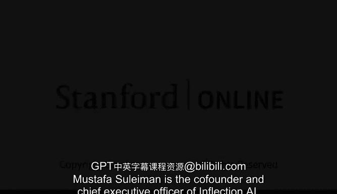

# 27：穆斯塔法·苏莱曼介绍 🧠

在本节课中，我们将了解穆斯塔法·苏莱曼的背景，并探讨由他主导的关于AI技术加速所带来的机遇与潜在风险的对话。

## 人物介绍 👨‍💼

穆斯塔法·苏莱曼是Inflection AI的联合创始人兼首席执行官。这是一家以人工智能为核心的公司，致力于重新定义人类与计算机之间的关系。

在此之前，他是DeepMind的联合创始人。DeepMind于2014年被谷歌收购。在DeepMind担任应用人工智能负责人期间，他在超过十年的时间里为团队在AI研究和应用方面取得的重大成功做出了贡献，其中包括**AlphaFold**和**AlphaGo**等项目。

## 对话主题预告 💬

上一节我们介绍了穆斯塔法·苏莱曼的职业生涯。本节中我们来看看本次对话的核心议题。

在我们的对话中，我们将探讨如何驾驭这场前所未有的技术加速所带来的繁荣潜力，甚至应对其可能引发的生存威胁。

## 总结 📝

本节课中我们一起学习了穆斯塔法·苏莱曼在人工智能领域的重要贡献及其当前角色，并预告了接下来将深入讨论的、关于AI技术迅猛发展所带来的双重影响这一关键话题。