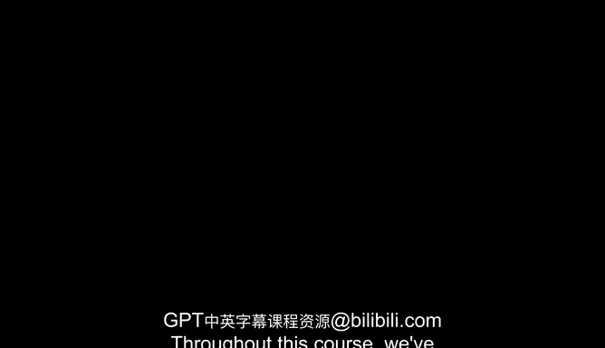

# 36：课程总结🎓

在本节课中，我们将一起回顾整个课程的核心内容，总结人工智能对经济与社会产生的深远影响，并鼓励大家将所学知识应用于未来的思考与实践中。

---

## 课程回顾与核心洞察

上一节我们探讨了AI可能带来的“无工作世界”，本节中我们来对整个课程进行总结。

Throughout this course， we've explored how advances in AI can and will transform our economy and society in the coming years。

我们探索了人工智能的进步将如何在未来几年内改变我们的经济与社会。

We hope you found these conversations valuable and that you now have a deeper appreciation for the profound implications of AI。

我们希望这些讨论对您有所裨益，并使您对人工智能的深远影响有了更深的理解。

---

## 关键学习领域回顾

以下是本课程涵盖的几个核心领域：

*   **基础模型与大语言模型**：我们探讨了如 **`GPT-4`** 这类模型的工作原理及其作为通用技术平台的潜力。
*   **工作与就业的细微差别**：分析了AI对不同行业和技能组合的自动化影响，其公式可概括为 **`工作任务自动化 ≠ 岗位完全消失`**。
*   **偏见与可解释性**：讨论了AI系统中存在的偏见问题，以及追求算法透明度和公平性的重要性。
*   **AI的地缘政治影响**：审视了全球主要国家在AI领域的竞争与合作格局。
*   **无工作世界的可能性**：思考了在高度自动化背景下，社会结构、经济分配与个人价值可能面临的变革。

---

## 鼓励反思与应用

As you finish this course， I encourage you to reflect on the insights you've gained throughout this journey from the exploration of foundation models and large language models to the nuances of work and employment， bias and explainability， AI's geopolitical implications， and the possibility of a world without work。

在课程结束之际，鼓励您反思在整个学习旅程中获得的见解——从探索基础模型和大语言模型，到工作与就业的细微差别、偏见与可解释性、AI的地缘政治影响，以及无工作世界的可能性。

Take some time to reflect on what you've learned and how it applies to your organization and society in general。

请花些时间思考您所学到的知识，以及它如何应用于您所在的组织和整个社会。

---

## 持续学习与展望

I hope you'll continue exploring this ever evolving landscape and carry the knowledge and perspectives you've gained in your future endeavors。

希望您能继续探索这个不断演变的领域，并在未来的事业中运用您所获得的知识和视角。

Thank you for being part of this course。

感谢您参与本课程。

---

## 总结

本节课中我们一起学习了人工智能变革经济与社会的多个维度。从技术基础到社会影响，从当前挑战到未来展望，我们认识到AI不仅是一项技术，更是一股重塑世界的力量。关键在于我们如何理解、引导并负责任地运用它，以创造更美好的未来。