# 1：课程介绍 🎓

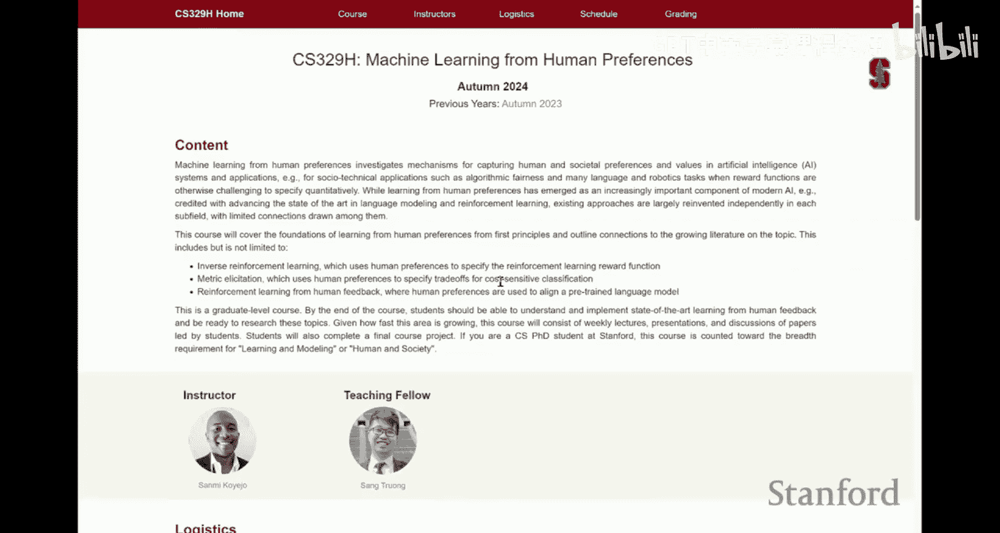

在本节课中，我们将对《基于人类偏好的机器学习》这门课程进行一个全面的概述。我们将了解课程的基本框架、核心目标、涵盖的主题以及课程的组织形式。本节课旨在为后续深入学习奠定基础。

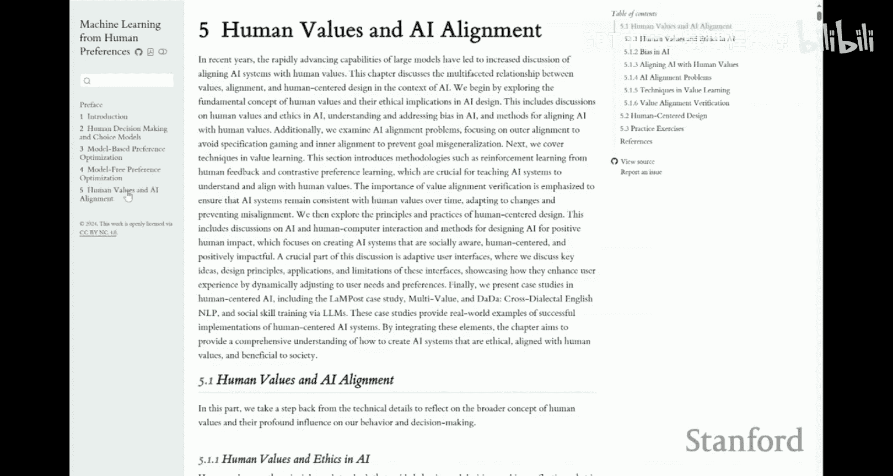

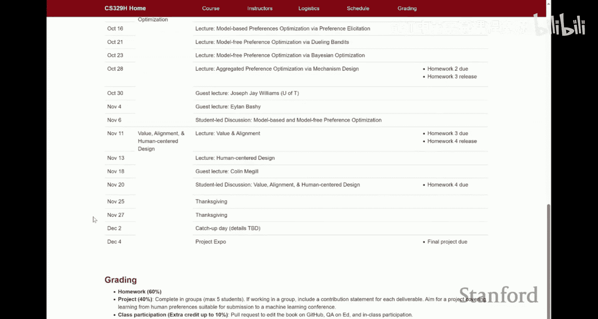

大家好，我是 Sam Coja，计算机科学系的教员。我的研究领域广泛涉及可信机器学习和人工智能。首先确认一下，这里是 CS329H《基于人类偏好的机器学习》课程。

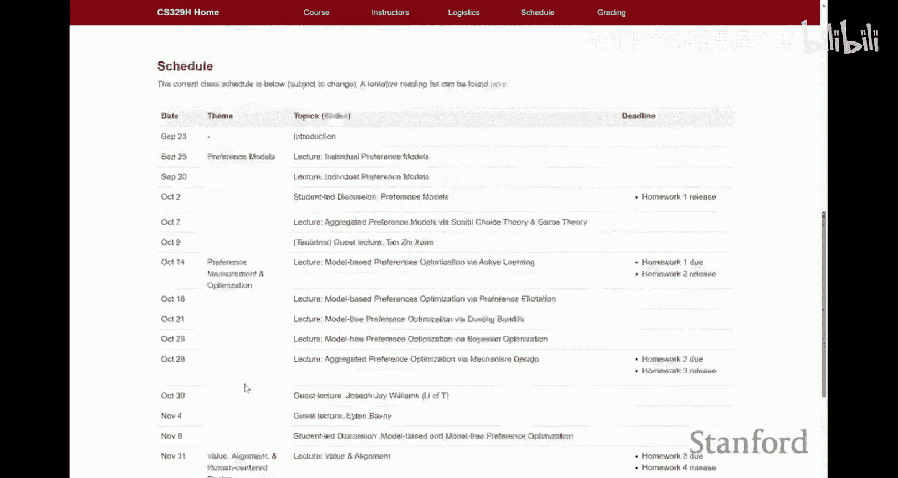

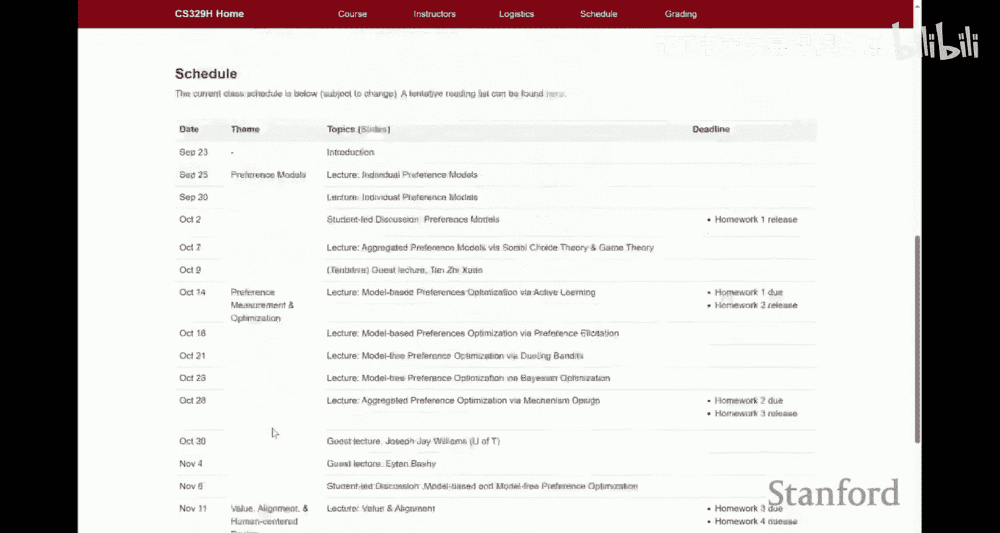

今天在场的除了我，还有助教 Sang。打个招呼吧，Sang。在接下来的一个学期里，你们将与教学团队有很多互动。

今天的计划，作为第一堂课，是一个总览。我们会介绍课程的基本框架。这门课是新课，这是我们第二次开设。第一次是在去年秋季，所以这是我们第二次提供这门课，我们仍在摸索这门课的确切定位。

好处是，我认为这次会比上次的实验性稍弱一些。你们将受益于我们一年前进行的一些实验。但我也认为课程仍有一些粗糙之处，所以我们需要你们对课程中进展顺利或不顺利的方面提供反馈，以便进一步改进。

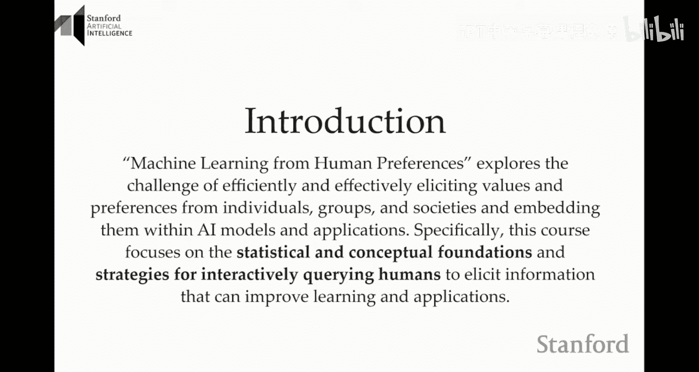

这门课程非常及时，对我们许多人来说，机器学习中那些明确使用人类反馈的方面令人兴奋。我们的目标是探讨这些问题，既包括应用层面，也希望更基础性地，从广义上，既涉及机器学习的方面，也会触及与经济学、心理学等领域相关的内容。

我们将尝试涉足各个领域，希望不会太糟糕。其中一些内容将由课程团队负责，一些将由特邀讲座负责。在进入幻灯片之前，我会在今天课程中介绍一些内容。我认为一个很好的好处是，这是我们第二次教授这门课，核心团队和其他成员已经主动编写了一本教科书。

据我所知，世界上还没有关于这个主题的教科书，或者即使有，也没有公开。所以我认为参与这门课程将获得一个独特的资源。幻灯片中会有一个链接，你们可以访问这本书和其他材料。我们将能看到所有这些内容。它目前是一个非常粗糙的版本。所以，请温和地批评，并在学习过程中给我们反馈。

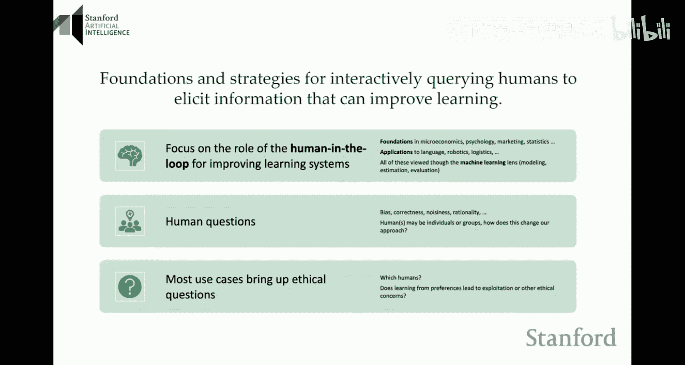

但今天主要是介绍。在本学期中，我们将涵盖人类选择建模的各个方面、一些基于模型的偏好学习技术、模型无关的优化，以及最后一个关于人类价值观和人工智能对齐的模块。这是课程的大致设置：介绍部分和这四个主要部分。此外，正如所说，除了教学时间，还会有一些特邀讲座。

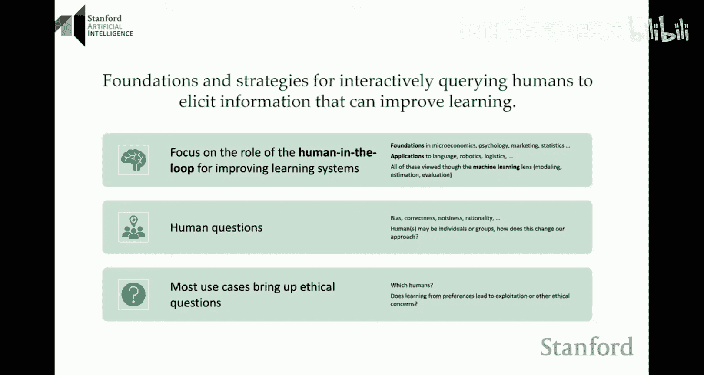

如果我们看一下教学大纲，在十月初，大约在我们第一个模块结束时，我们预计会有一场与刚学模块相关的特邀讲座。这门课的这次迭代是我们第一次布置作业。上次主要是讨论和讲座，这次我们设置为60%的作业。你们将在大约一周后收到第一份作业。

同样，与那些开设已久的课程不同，这些作业将是全新的迭代。我确信会有一些波折。这是一个中小型班级，所以我们希望有很多来回的讨论。这既可以适应你们的需求和学习内容，我们也可以从你们那里学到很多东西，以改进课程材料。

像这样的课程非常注重项目。计划是你们将组成最多五名学生的小组，每个小组将有一系列可交付成果，最终将是一个期末项目，至少会在课堂上展示，也可能向外部人员展示。这在许多有大型项目特色的课程中似乎效果很好，所以这也是我们这门课计划的一部分。

然后，如前所述，因为我们仍在摸索许多内容，课堂参与占很大比重。我们鼓励你们参与课堂，无论是在课堂上还是在其他环节，例如在GitHub上对教科书提供反馈，在Ed上参与问答，以及如前所述的课堂参与。

我认为对于这样一门关于较新主题的课程，通过讨论可以获得很多收获。我的建议是考虑来上课，希望参与课堂对话会带来一些价值。

另一个要提的是，如果你是CS博士生，这门课程可以计入你的学习与建模要求，或人类与社会要求。这可能会让你对我们计划涵盖的材料类型有所了解。归根结底，这是一门技术课程。我认为我们总是会回归机器学习的基础。然而，有意地，这门课的范围是思考这意味着什么。既然是关于向人类学习，将会有大量关于人类参与、社会考量以及其他更广泛问题的工作。因此，我们将尝试同时兼顾广度和深度，在材料上略微偏向广度。

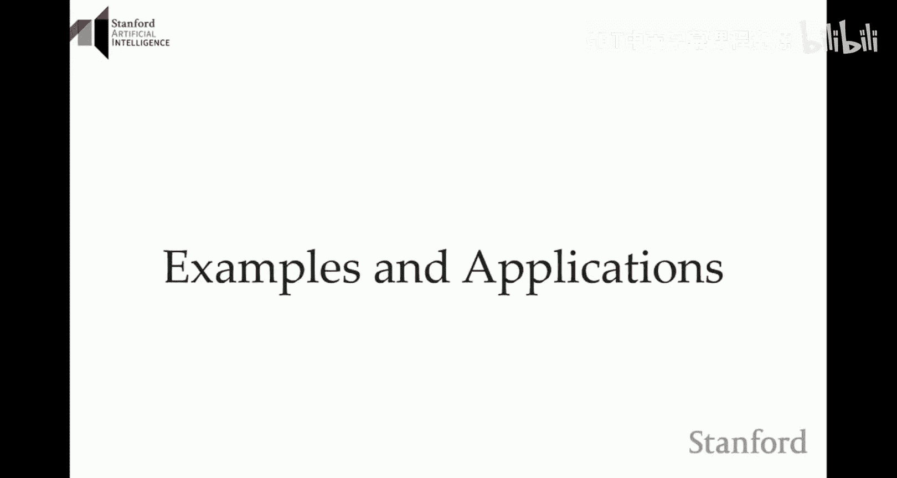

好的，还有其他问题吗？现在谈谈背景。好的，这是讲师的背景。我在斯坦福大学待了几年，之前是伊利诺伊大学的教授。与这门课相关的是，我长期以来一直在研究如何在经典的机器学习问题中融入人类偏好。例如，我们今天也会简要谈到的一个框架叫做“度量化”，我致力于研究这些问题。这与强化学习领域进行RLHF等工作密切相关。我认为，随着语言模型和RLHF再次成为热点，所有这些对许多人来说再次变得令人兴奋。我们将稍微涉及这一点，并将其置于某些背景中。我们确实做了一些与这类问题相关的工作。是的，关于这类工作的学术界和工业界问题，实际上也将成为我们讨论的一部分。我认为这很有趣。关于我的背景就这些，我很乐意深入探讨。其他教学人员也可以自由地介绍他们的背景，每个人都有相关的经验。

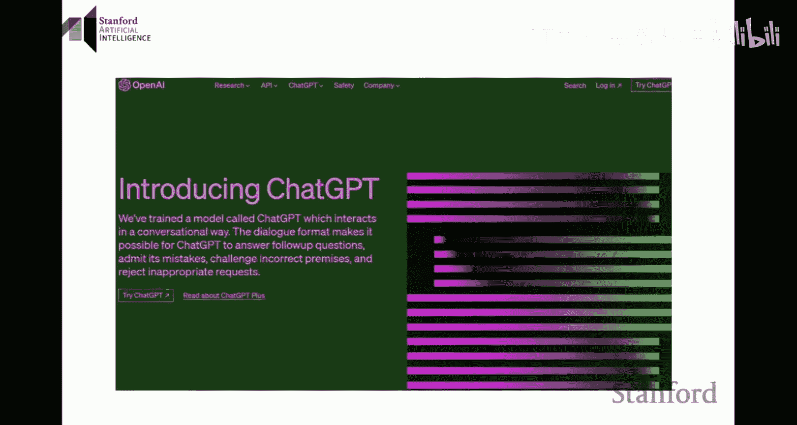

好的，我们将继续今天的材料。再次，有机会时请查看教科书。我们今天的目标是介绍。并介绍课程的一些框架，也许为我们在接下来几堂课中如何思考这些主题做一些铺垫。

这个广泛的领域仍在定义中，但我们尝试构建了一个定义，如果大家有兴趣，我们实际上可以稍作批评。这门课程旨在探索从个人、群体或社会中高效且有效地引出价值观和偏好，并将其嵌入AI模型和应用中的挑战。我们的具体重点将放在交互式查询人类以引出可以改进学习和应用的信息的一些技术和概念基础及策略上。

正如讨论和框架所示，我们将通过机器学习问题的视角来思考这门课中的许多问题。但我们希望有意义地参与这项工作在如何影响个人、社会等方面的更广泛影响。“高效”将涉及与人类互动并尝试以尽可能少的互动来完成这一任务的挑战。我们将更多地讨论“查询效率”这个术语。我将尝试询问诸如你需要多少样本、需要多少次互动才能获得与某些智能体互动的特定估计或特定函数等问题。“有效”则考虑引出过程的质量，但从人们那里获取这个信号。

关于设置、广泛框架的任何问题？对这个想法有什么强烈的批评或轻微的批评吗？为什么用“交互式”这个词？这是一个很好的问题。是的，问题是关于“交互式”以及我们为什么这样表述。我将在接下来的几张幻灯片中稍微讨论一下，但从某个角度来看，所有的机器学习都是从人类偏好中学习的。事实上，并非如此。它根本没有缩小领域范围。原因是很多工作，AI模型、机器学习模型被训练来做的事情，实际上是从人们那里学习信号。许多机器学习应用都涉及人类以某种方式创建内容，然后我们构建模型来模仿或近似该内容。从这个角度来看，所有的机器学习都是从人类偏好中学习的。

还有一个更集中的领域，即我们试图将AI构建为某种智能目标。我们稍后会讨论一点，这再次直接涉及向人类学习的理念。在这里，我们将重点放在那些我们更加明确和有意地关注人类信号的场景上。因此，我认为那些人类标注数据然后你从数据中学习的场景，在某种程度上是隐性的。偏好效应将基于数据标注的来源而显现。在这门课中，我们将重点关注这些问题的子集，其中学习过程的目标非常明确地是关于从偏好中学习，通常通过交互过程。正如你所说，我们将重点放在这个似乎最有趣的差距上。这再次是这门课的动机，试图思考这些问题。它不会涵盖所有内容，但这将是明确的重点。

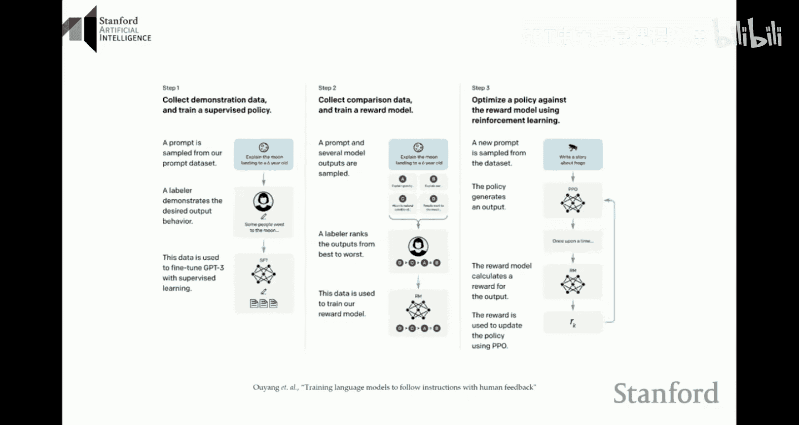

谢谢，好问题。我喜欢这个扩展，因为在许多现实世界的应用中，数据集是不可变的，而这并不是真实世界。样本不一致，就像我们经常忽略的一个事实：人类有25%的时间不同意自己。根据你是否吃过午饭，对完全相同的东西评分，你会得到不同的答案。因此，将模拟实际标注过程的分布纳入系统，我喜欢这种扩展。是的，这是一个非常有趣的观点。我们将稍微涉及这个问题，例如人类的不一致性，以及如何在许多场景中思考人类标签，以及现有文献中思考这意味着什么的一些方法。我认为这很好。我们将讨论一些模型，我们选择伯努利模型，我不知道这是否是真相，但至少我们会讨论一些思考这个问题的框架。是的，诸如噪音或至少来自人类信号不一致性的不确定性等问题。

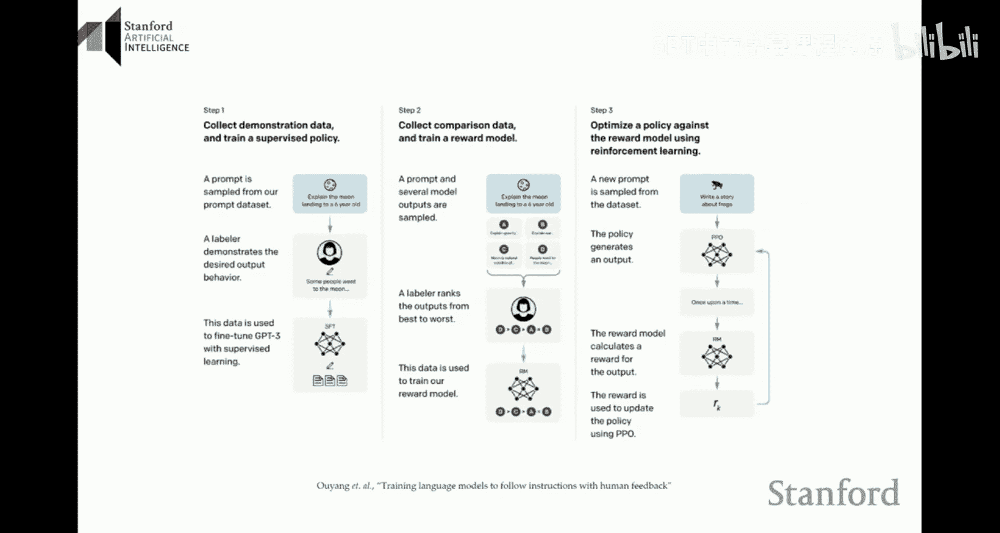

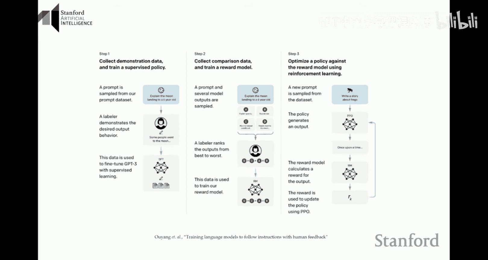

好的。正如上一张幻灯片提到的，我们的目标是参与基础和多种策略，以交互式地查询人类，获取可以改进某种学习目标或应用的信息。因此，我们将主要关注那些具有非常明确的人类在环组件的学习系统，并略微偏向交互式系统。我们将稍微参与一些基础，其中一些来自经济学、心理学、市场营销、统计学。我们将讨论应用。对我们许多人来说，最前沿的应用是语言应用。再次，从人们那里学习偏好或价值观。但也有在机器人等领域工作的悠久历史，我不记得我们之前提到的物流是什么意思。是的，明确的物流，我不认为我们会过多讨论物流应用，例如，你试图规划交付或路线等，你可能会考虑偏好，并思考如何明确引出偏好作为改进路线模型等方式。

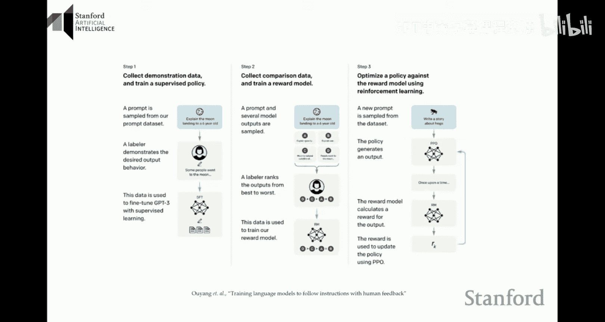

所有这些都将通过机器学习的视角来关注。这意味着我们将尝试建立问题，理解问题的一些角度，然后我们将专注于与每个问题设置中的建模、估计、评估相关的问题。我认为这意味着什么，我们将稍微讨论先决条件，那就是假设你对机器学习基础感到满意，足以编写一些简单的程序并构建简单的机器学习模型。因此，训练/测试/验证分割对你来说不应陌生。如果陌生，我们应该快速聊一下。逻辑回归对你来说不应陌生。如果你选了这门课却感到陌生，我们应该聊聊以确保合适。我们需要这些组件，因此我们将把这视为问题的重要组成部分。

下一个方面是思考这在人类偏好方面意味着什么。我们如何在这里思考人类？我认为这是一个有趣的事情，因为根据你在ML/AI世界中的位置，我认为我们对思考人类有些回避，尽管人类无处不在。你可以在你或你的同事如何参与这些问题中看到这一点。有人提出了一个论点，事实上，我上周参加了一个小组讨论，有人做了一个大胆的声明。他们说，我不知道这是否正确，但也许可以供小组思考。他们说，在一代人之内，我不知道一代人可能意味着什么，也许是5到10年，他们认为所有的AI都将是HCI，因此实际上将不再有独立的AI事物，因为所有最困难和最有趣的问题都将关于人机交互。我认为这个说法有合理的依据。我认为我们在纯算法方面取得了有意义的进展，许多似乎对实现我们想要的应用或影响很重要的问题，似乎被我们如何在部署系统中思考人类所瓶颈。我们将尝试思考这一点。同样，其中一些将基于文献，因此我们将有论文供你阅读，但其中一些也将在课堂上进行讨论，并思考这些问题。

因此，出现了许多子问题，涉及偏见的各个方面，我认为你提到了。或者关于在多大程度上应假设人类理性的问题，这是一个好的假设吗？它会在什么情况下失效？将人类错误视为噪音的问题，以及这在何时可能是好或坏的假设。人类与AI系统互动的各种正确性、专业性的概念。

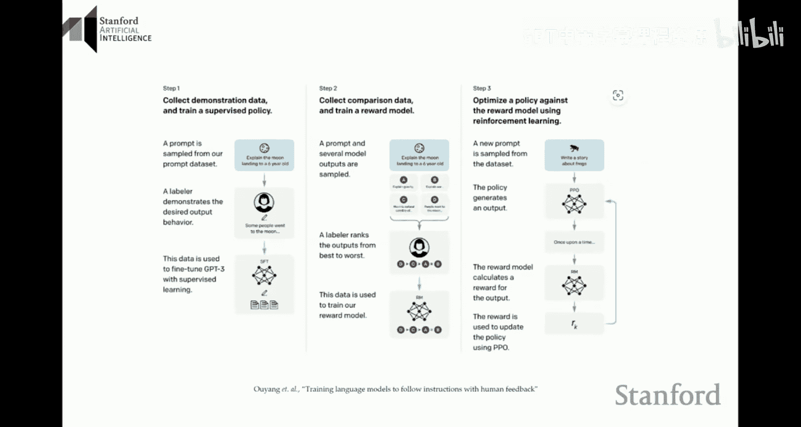

我们还将参与这些问题：问题通常会根据是人类、群体还是广泛的社会背景而改变。因此，我们将尝试参与所有这些问题。基于专业知识、文献和偏好会有一些平衡，但同样，我们愿意根据班级的反馈进行调整。例如，如果我对引出偏好感兴趣，问题是否会因为我想获取你作为个人的偏好与整个班级的偏好而改变？我如何处理我们不会在许多事情上达成一致的事实，例如项目小组的规模？思考偏好的综合和聚合，以及以可能触及更广泛价值观的方式思考这个问题，看起来是什么样子？或者，在战略智能体可能试图博弈某些协调系统的情况下，这看起来是什么样子？我们能否构建工具来参与这类问题？

最后一点，我认为非常重要，是这门课的性质意味着在许多情况下，我们必须思考。尽管几乎总是存在一个有意义的伦理角度，我们将尝试思考。这以多种不同的方式显现。我这里有几个例子。例如，关于人类的问题。如果你正在构建一个系统并要部署它，你选择谁将给你信号，以及你试图让模型与谁的偏好对齐。这个选择会产生下游影响。因此，你从哪些人类那里获取偏好会产生有意义的影响。其中一些可能是积极的，一些可能很棘手，看起来像是剥削。我们将尝试参与所有这些问题的各个方面，并不回避可能成为现代AI和参与学习的一部分的伦理问题。

我暂停一下，看看是否有问题或反应。我有一个关于最后一部分的问题。正如我们所说，我们经常进行数据抽样，以确保数据来自不同的场景和不同的部门，从而使模型能够处理各种边缘情况。我们是否也会在这门课中提出某种人类抽样，以确保我们考虑不同人群的偏好，从而使人类偏好实际上在某种意义上对所有群体都是合乎伦理的？这是一个很好的问题。如果我们以伦理和不同亚群体间的代表性来构建这个问题，我们是否会参与允许仔细思考这个问题的方法？我们会稍微涉及，所以至少有一堂课会探讨这个问题。我认为深度不够。我认为这实际上非常好。我不认为文献在这个问题上已经很完备。有一些工作，我会添加一些参考文献。考虑到兴趣，思考当你有不同群体时人类偏好学习的版本，并思考代表性抽样或其他思考平衡群体间偏好的方法。但我也要提到，我认为这是ML/AI子领域还相当早期的领域之一。有些人思考过这个问题，经济学中有一些工作，伦理学中有一些工作广泛思考这些问题。我认为如果你考虑项目，这是一个很好的项目方向，思考如何获取不同群体的偏好。

另一个问题。是的，关于个体。这是一个引人入胜的问题。问题是，你知道，有大量关于有限样本学习和各种有限数据的文献。我们将在多大程度上参与其中？我认为这很好，我实际上非常喜欢这个问题。我们将隐含地参与其中，因为在几乎所有情况下，我们建立的学习问题都会通过构造要求从有限样本中学习。再次，涉及我之前提到的关于查询人类可能很昂贵的问题，因此我们通常在样本大小上有预算限制。是的，实际上更明确地思考这部分框架会很好。它将在问题中隐含，我们计划不那么明确，但这是一个极好的问题，它会无处不在。在几乎所有情况下，我们都需要从有限数据中学习，并且我们将使用一些技巧，如预训练、基础模型等。是的，好问题，谢谢。

你提到这对于期末项目来说是一个很好的探索主题，这让我想知道大多数期末项目是像编码项目那样输出，还是更多关于理论问题的研究，或者是什么样的？是的，我们会有更多说明。项目看起来是什么样的？我们认为好的项目范围相当广泛。我们将尝试在整个过程中获得反馈。我们本周也会有文档，说明我们对什么构成一个好的期末项目的看法。但针对你的问题，理论研究是有意义的。对某个领域的批判性审查是有意义的。在某些情况下，文献综述可能是有意义的。文献综述比人们认为的要难，我提前说一下，人们认为这是一种简单的参与方式，但实际上一个好的文献综述相当困难。技术科学研究、代码或其他程序工件，所有这些都在范围内。好的，还有我们思考的应用。你知道，这是一个似乎涉及许多不同应用领域的领域，所以我认为你们大多数人最终至少从一个季度的有限经验来看，也会从时代精神来看，大多数人最终会涉及语言，但视觉是有意义的，强化学习是有意义的。有一个非常有趣的应用，我看看是否能请人来展示，但最近我了解到一些法律和政策方面的应用，很酷。是的，许多不同的领域你可以想象应用这些作为工具。所以请自由扩展、探索所有这些有趣的东西。去年的项目还在Medium上吗？哦，好的，是的，我们应该在某个地方添加那个链接。如果你想找去年的项目，你可以搜索。每个人都在搜索，这很好。

好的，还有什么要说的。你知道，这在某些方面是一个新兴主题。我认为这个主题的边缘尚不清楚。它也很广泛。我们不会试图做到详尽无遗。我们有一些广度偏向。因此，我们将尝试涵盖许多不同的主题，但我们不期望能涵盖与这个问题相关的所有内容。你知道，这方面还有一些其他内容，我在开头稍微谈到了，但从某些方面来说，所有的AI都可以被认为是从你的偏好中学习的。因此，在某种意义上，一个包罗万象的定义将避免问题的很多部分。此外，除了数据本身，这个房间里的人是实际构建机器学习和AI模型的人。有时被低估的是，个人决策和选择实际上对模型、对某些生产过程中产生的实际模型有有意义的影响。你知道，你正在选择你真正想要解决的问题以及什么是可行的，你将在哪里寻找数据，使用什么样的架构，什么样的损失函数，什么样的优化算法，所有这些都是对AI模型有有意义影响的个人决策。再次，如果你想包罗万象，这是一种从人类偏好中学习，因为作为设计者，你正在对算法、数据、损失函数做出偏好决策。这不是我们的意思，但我想说，我认为这也是思考这类问题的一种有意义的方式。

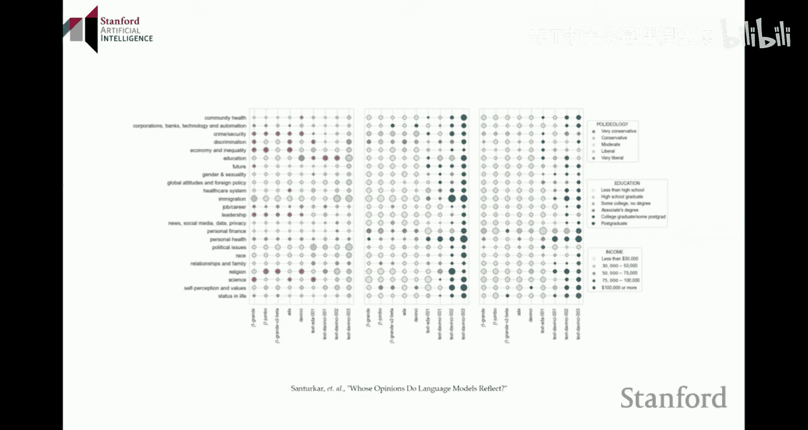

有很多关于模型架构等方面的工作。你知道，除了高层次的问题定义，甚至在构建模型时，最常见的是在图模型和因果推理中，你在模型中放入了很多归纳偏差，但更一般的框架也经常以各种方式使用专业知识。例如，有人提出卷积网络之所以有效，是因为人们注意到卷积是很好的归纳偏差，并且与人类视觉的某些方面匹配。因此，有许多方式可以思考专家知识和归纳偏差。再次，我们不讨论这个，但想提到这很重要。然后我们会稍微涉及，但不会深入探讨广义的HCI问题。我认为这非常重要。差距部分在于专业知识，部分在于范围。所以我们不会做非常深入的探讨。不过，如果你对这类主题感兴趣，HCI的经验或兴趣通常会对你很有帮助。你知道，关于界面、过程、研究设计以及如何获得IRB批准等问题。校园里的许多建筑实际上不知道如何做这些，因为我们不常做。但如果你要做这样的工作，特别是如果你要实际查询人类，那种经验会非常有帮助。因此，你们中的一些人可能会考虑涉及这类问题的项目，鼓励这样做。

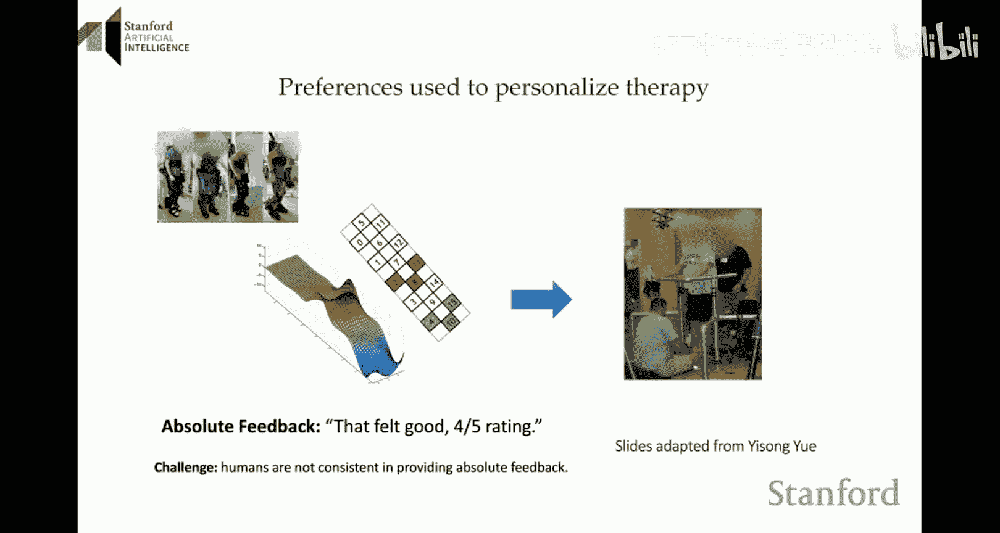

好的，所以这是广泛的思考。再次，人类反馈的广泛框架无处不在。我展示了一个图表，来自最近一篇论文的一个很好的图表，借用了同事的图表，讨论了人类反馈如何塑造许多明确的机器学习过程。如前所述，诸如数据选择、标注、模型选择、训练、评估、部署上下文等。有很多好的工作对人类偏好最终如何塑造我们构建的机器学习模型进行分类。再次，我不会深入讨论，但提到这一点是为了奠定我关于人类偏好在许多我们构建模型的工作中扮演重要角色的陈述。从我们如何构建数据集以及我们如何思考诸如合成数据等问题，通常其中包含明确的判断和决策，一直到如何指定各种约束或将奖励约束嵌入模型，以及调整模型的各种方式。

我提到这一点也是因为，再次，超出了这门课的范围，但也有大量工作思考捕捉人类偏好的方法，以参与本页上的所有内容。例如，关于约束指定的引出机制的工作。我们不会过多讨论，但我认为对于各种问题，例如物流和规划问题，这是一个非常重要的问题子集。

好的，示例和应用。我也希望从你们那里学到一些，因为我经常从中学到一些很酷的新东西。先把房间里的大象赶走，ChatGPT让很多人对这意味着什么感到兴奋。在许多方面，有人认为，取决于你的立场，这是一种修正主义的东西，我们是否预料到了，我不知道。但在许多使这项工作在人们与语言模型互动获得良好体验的意义上取得成功的创新中，有人认为，很多试图与人类偏好对齐的工作，比如RLHF，起了很大作用。所以我认为，这再次激发了对这个领域的兴趣。

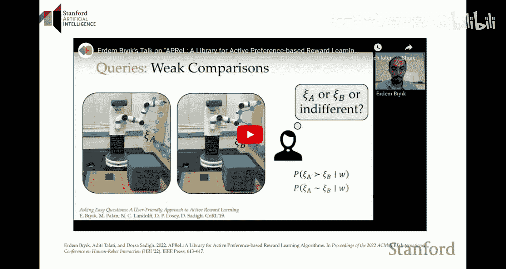

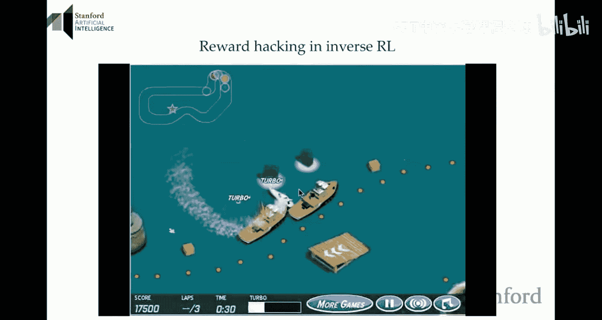

很多这项工作建立在悠久的工作历史之上。特别是对于语言模型，以及捕捉反馈和构建语言模型的各种机制。我认为对于之前的一个评论或问题，诸如文档级交互、来自人类或专家的标签一致性查询、词级交互等问题，你有一个语言模型，我能让人类告诉我哪些术语最有影响力，或者根据我们认为可能重要的内容，在语言系统中标记这些术语，并帮助思考添加或删除哪些特征。再次，这仍然是大多数大规模部署系统中的MLOps框架的重要组成部分。一些关于什么可能是重要特征的人类直觉，一直到人类试图帮助选择模型参数，思考测量以及模型表现良好或失败的反馈，并使用该信号来改进或探索模型范围。

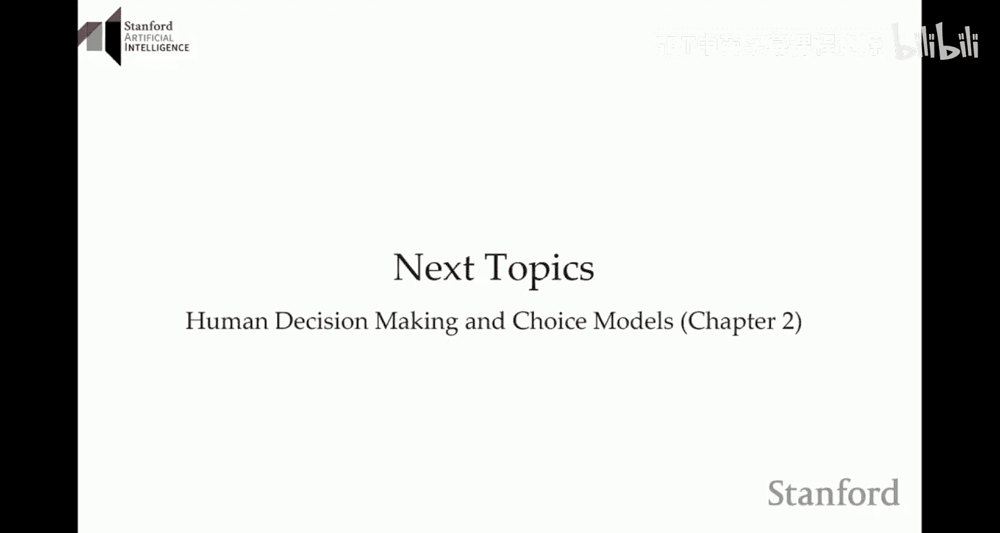

这方面的例子。再次，参考文献在幻灯片中，请随意查看。例如，尝试通过标记不同单词之间的连接来改进解析器。“Pat ate the cake on the table that I baked last night”，解析器可能会说“I