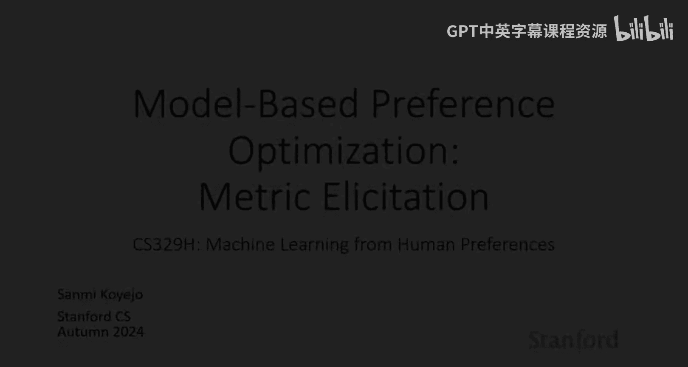
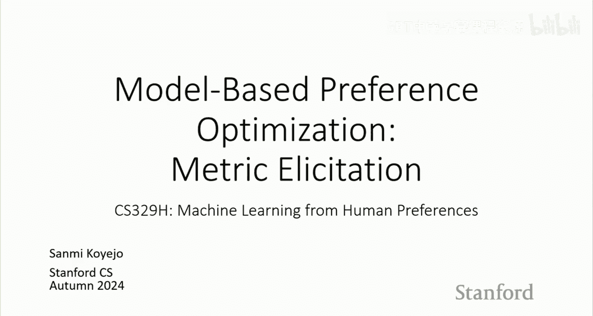
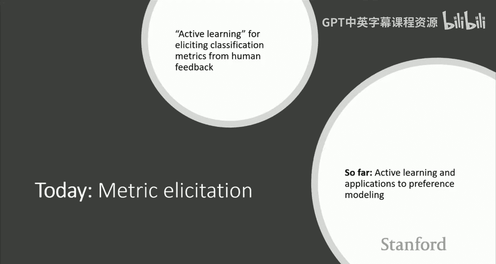
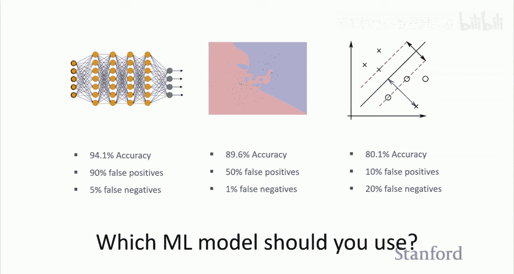
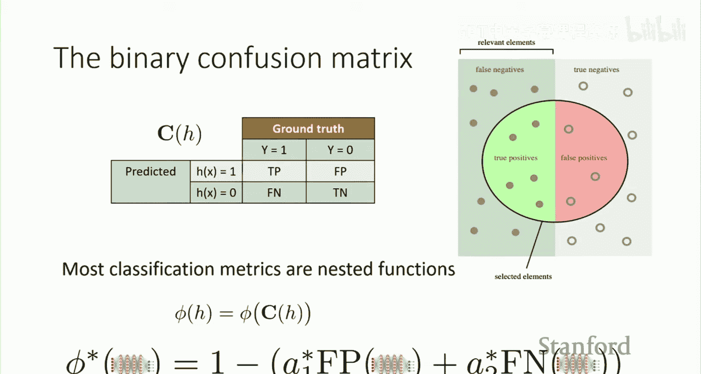
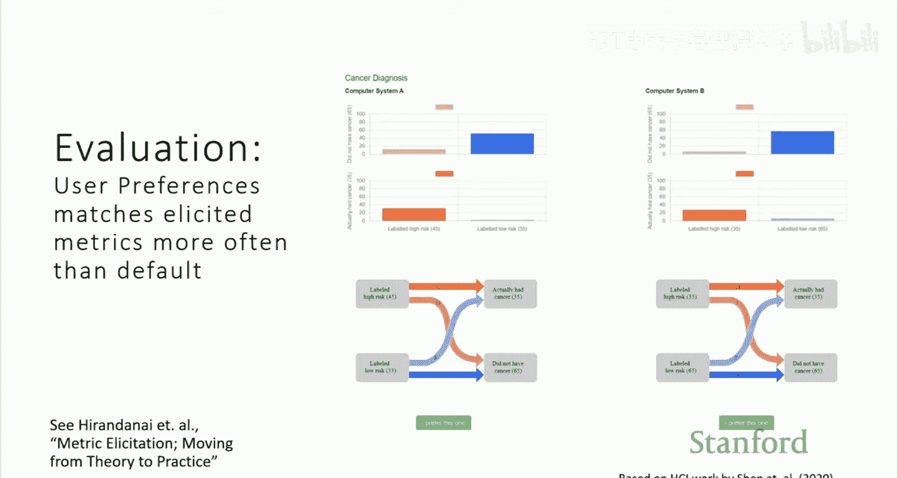
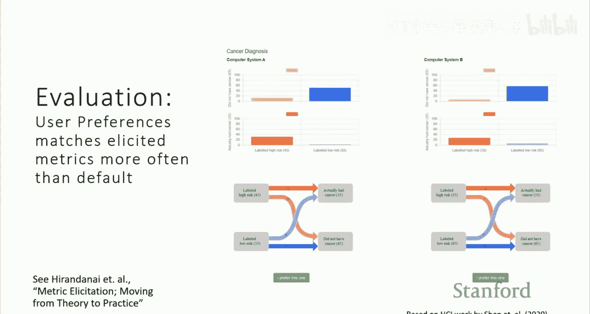

# 3：基于模型的偏好优化

在本节课中，我们将学习一个特定的偏好学习子领域：**度量优化**。我们将探讨如何将偏好学习与主动学习相结合，以高效地选择与人类利益相关者偏好一致的分类模型评估指标。我们将重点关注二元分类问题，并展示如何利用问题的几何结构来简化度量选择过程。

## 概述：度量选择的重要性

上一讲我们讨论了主动学习，并将其与偏好学习联系起来。本节课，我们将深入探讨一个具体的应用场景：为分类问题选择度量标准。

在许多机器学习应用中，不同类型的错误具有不同的现实成本。例如，在医疗诊断中，假阳性（误诊为患病）和假阴性（漏诊）的代价截然不同。因此，选择一个能反映这些不对称成本的评估指标至关重要。然而，指标的选择本身就是一个复杂的偏好学习问题。

## 分类问题中的度量选择

在二元分类问题中，模型的性能通常通过**混淆矩阵**来描述。混淆矩阵包含四个基本元素：
*   **真正例**：模型预测为正，实际也为正的样本比例。
*   **真反例**：模型预测为负，实际也为负的样本比例。
*   **假正例**：模型预测为正，实际为负的样本比例。
*   **假反例**：模型预测为负，实际为正的样本比例。

一个线性分类度量可以表示为这些元素的加权和。例如，一个加权错误度量可以写成：
`总成本 = a1 * 假正例率 + a2 * 假反例率`
其中，`a1` 和 `a2` 是权重，反映了不同类型错误的相对成本。我们的目标是找到与利益相关者偏好最匹配的权重 `(a1, a2)`。

## 利用几何结构简化问题

混淆矩阵的元素并非完全独立。在二元分类中，混淆矩阵实际上只有两个自由度。更重要的是，所有可行的混淆矩阵点构成了一个**凸集**，其边界可以通过对条件概率模型 `P(Y=1|X)` 设置不同的阈值来获得。

这意味着，寻找最优权重 `(a1, a2)` 的问题，可以转化为在一条一维的边界曲线上寻找最优操作点（即最优阈值 `δ`）的问题。这个几何特性极大地简化了搜索空间。

## 基于主动学习的度量优化算法

既然我们将度量选择问题转化为在一维边界上寻找最优点，我们就可以使用高效的搜索算法。在无噪声的理想情况下，一个直接的方法是**二分搜索**。

以下是算法步骤：
1.  首先，我们训练一个能输出条件概率 `P(Y=1|X)` 的模型。
2.  该模型定义了一条性能边界曲线（类似于ROC曲线）。
3.  我们在边界上选择两个点（对应两个分类器A和B），展示给人类利益相关者。
4.  询问利益相关者更偏好哪个分类器的性能表现。
5.  根据回答，我们可以确定最优偏好点位于边界的哪一侧，从而将搜索区间减半。
6.  重复步骤3-5，直到将最优点的位置定位到足够小的区间内。

这种方法的查询复杂度是 `O(log(1/ε))`，其中 `ε` 是期望的精度。在特定假设下，这可以被证明是最高效的方法。

## 处理噪声与扩展

上述二分搜索方法假设利益相关者的反馈是确定且一致的。在实际应用中，反馈可能存在噪声。对此，我们可以采用**概率化的二分搜索**变体。

该变体为可能的阈值维护一个概率分布（先验）。每次获得人类反馈后，根据反馈更新这个分布（后验）。当某个阈值区域的概率质量超过一定阈值（如0.5）时，算法终止。这种方法对反馈噪声更具鲁棒性。

此框架还可以扩展到多类别分类、公平性约束度量选择等更复杂的场景。

## 总结

本节课我们一起学习了**度量优化**，这是偏好学习在分类模型评估中的一个具体应用。核心要点包括：

1.  **度量选择至关重要**：即使在简单的二元分类中，选择反映错误不对称成本的度量也是一个重要的偏好学习问题。
2.  **利用几何结构**：通过分析混淆矩阵的凸性及其与阈值分类器的关系，我们可以将度量选择问题转化为一维边界搜索问题。
3.  **高效主动学习**：使用二分搜索或其概率变体，可以高效地向人类利益相关者进行查询，从而找到最符合其偏好的度量权重。
4.  **通用框架**：这种将模型训练（预训练）与基于偏好的阈值微调（偏好调优）相结合的思路，具有更广泛的启示意义。

通过本节课，我们看到了如何将偏好学习、主动学习和特定的问题结构相结合，构建出高效且可解释的算法，以解决现实世界中的模型评估与选择难题。

