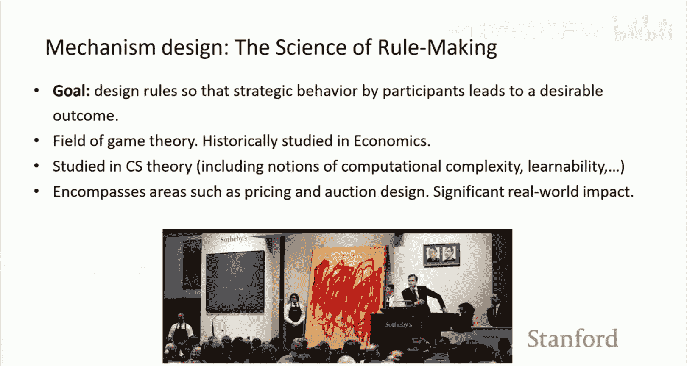
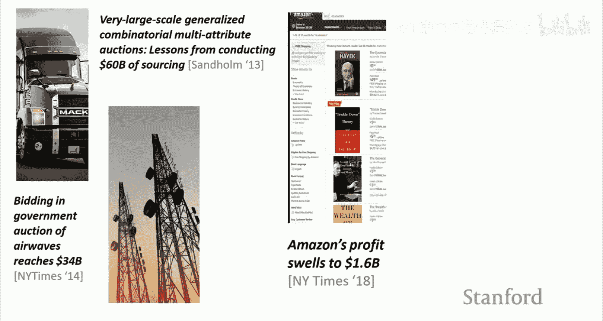
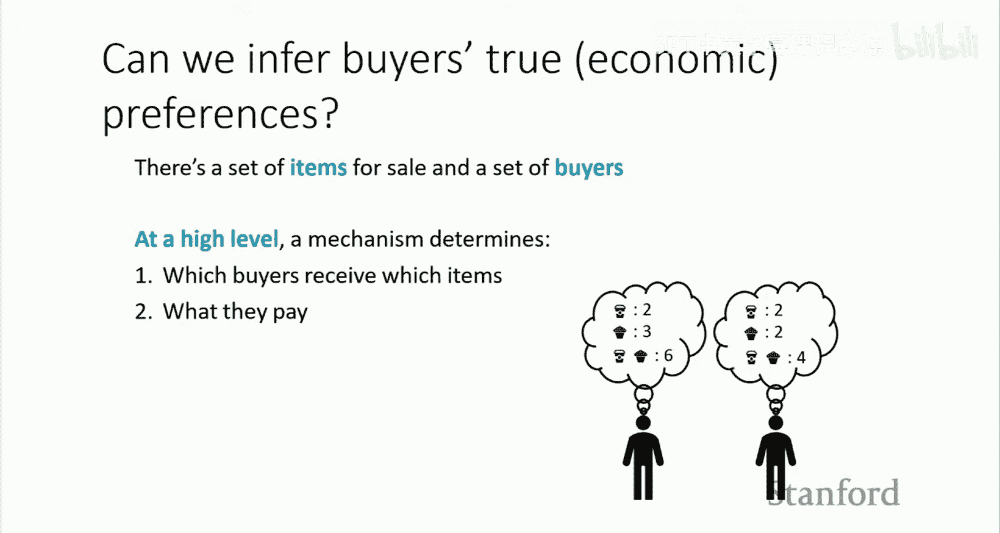
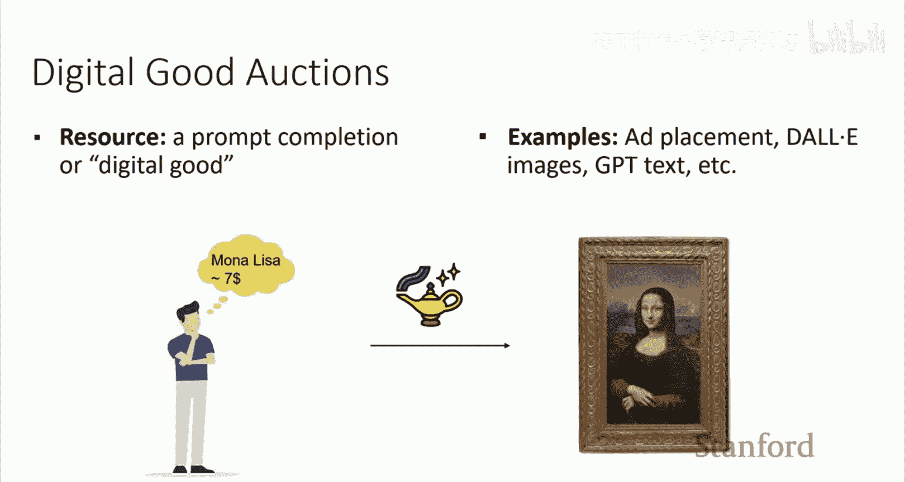
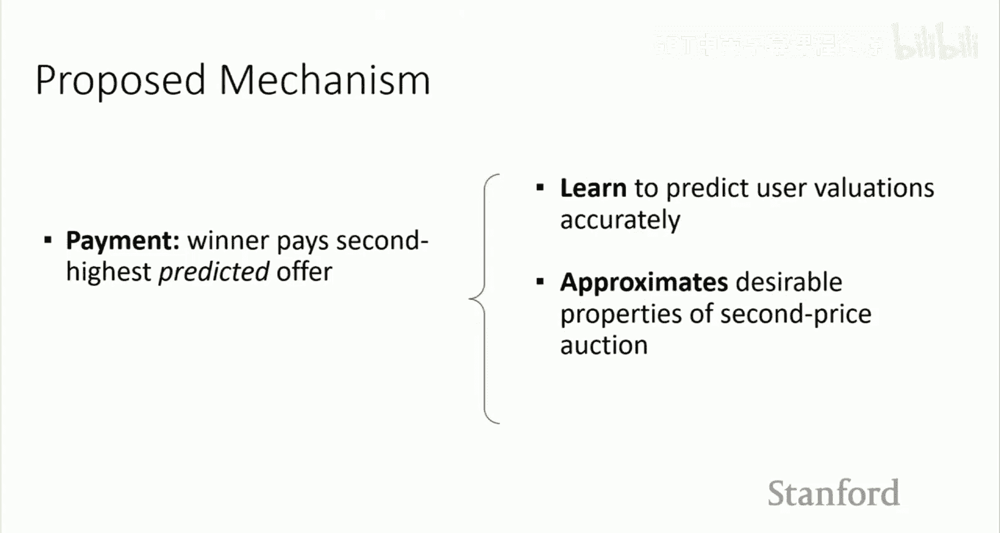

# 4：机制设计

在本节课中，我们将要学习机制设计。机制设计是一个有趣的工具，它结合了我们之前讨论过的一些思想，例如社会选择、投票理论，以及我们在投票讲座末尾提到过的博弈论思想。我们将阐明这些领域之间的联系。今天讨论的部分工作建立在之前内容的基础上。

之前我们主要关注偏好建模和偏好优化。本节中，我们将探讨类似的思想，但将其置于一个**战略或博弈论**的环境中，其中参与者可能具有对抗性或采取各种策略性行为。希望在本节课结束时，这些概念会变得更加清晰。

## 机制设计概述

对于不熟悉机制设计的同学，我们先进行一些背景介绍。该领域的一个定义是“规则制定的科学”。其核心思想是：如何设计一套规则，使得即使参与者选择采取策略性行为（例如，追求自身利益、根据自身偏好行事或以他们选择的任何方式参与），整个生态系统仍然能够正常运行，并导向一个理想的结果。这类似于社会选择中的设定，设计者的部分职责是决定什么是理想的结果，然后设计干预措施或“游戏规则”，以确保即使参与者采取策略性行为，也能达到该结果。

机制设计借鉴了多个研究领域，传统上主要在经济学中研究，并大量借用了博弈论的思想。近年来，随着大型互联网公司的兴起，它在现实计算任务中变得极其有用，因此在计算机科学文献中也得到了越来越多的研究。这包括计算复杂性等问题，以及当机器学习模型成为机制一部分时，如何在其学习过程中进行思考。

## 机制设计的成功应用

我将介绍一些机制设计思想（尤其是拍卖思想）产生影响的现有例子。例如，在无线电频谱的投标过程中，机制设计被用来建立一个投标流程，即使参与者显然是自利的（他们希望最大化利润），也能确保获得良好的结果。

这些想法在许多网络公司中被大量使用。例如，亚马逊在决定商品定价和排序时，大型网络搜索公司在广告购买过程中也使用了这些思想。谷歌的搜索广告背后就由这种技术驱动。2016年，谷歌790亿美元的广告收入占总收入896亿美元的绝大部分。Facebook的情况类似，其广告收入也占据了主导地位。这些广告流程背后的核心思想大多源自机制设计。

因此，机制设计是一个近年来对社会产生巨大影响的领域，因为它带来的工具已被广泛用于各种定价决策和集体决策。

## 机制设计中的核心问题

对我们而言，一个关键问题是：**我们能否推断出参与者真实的经济偏好？** 这里的经济偏好可以理解为不同利益相关者（例如买家）对特定物品的实际价值或愿意支付的价格。

在一个机制中，机制需要决定哪些买家获得哪些物品，以及他们为每件物品支付多少费用。其根本目标是，支付金额应与物品对个人的实际价值相称。一个经济上良好的结果可能是：对物品估值最高的人，如果按其真实价值出价，就能赢得该物品。

例如，在一个咖啡店场景中，物品可能是咖啡、纸杯蛋糕，或咖啡加纸杯蛋糕的组合。有两个潜在买家，他们对这些物品有不同的估值。机制的任务是设计一个交互系统，使得例如，对纸杯蛋糕估值最高的人能赢得投标。

需要指出的是，这里的买家有动机采取策略性行为：他们想要物品，但也想尽可能少付钱。因此存在一种张力：他们可能试图“博弈”系统以支付更少，同时对正在出售的物品组合有内在价值。

## 设计者的目标与社会结果

一个高层次的观点是，设计者需要决定什么是社会期望的结果。许多此类问题的框架将**收入最大化**作为期望的结果。设计者也可以选择设计一个机制来实现不同的目标，例如福利最大化。在实践中，我们今天讨论的大部分内容将围绕最大化收入作为社会利益来展开，同时处理参与者的策略行为，并确保我们不被策略行为所愚弄。

这种框架也适用于偏好，因为偏好可以被视为人们愿意为物品支付的价格。虽然我们讨论过许多不易经济量化的偏好，但对于许多应用，特别是当偏好可以经济化时，这种方法非常有用。

## 简单的定价与拍卖机制

在机制设计的背景下，我们如何决定向人们出售物品？一个明显但不那么有趣的方法是设定固定价格，就像大多数非拍卖场景一样。你为每件物品设定价格（例如咖啡1.5美元，纸杯蛋糕3.5美元），人们根据其价值决定是否购买。组合价格可能是单个价格之和。在这种设定下，如果某人以某个价格购买了物品，你至少知道他们的估值高于你的标价。

另一种方法是进行拍卖。每个人对一组物品出价，出价最高者赢得物品。你可能会希望人们出价与其对物品的实际估值相关，但他们可能不会。实际上，许多文献都在探讨买家在这种设定下可能采取的行为以及他们如何试图博弈系统。

例如，在一个标准拍卖中，如果你是最后一个出价者，你可能会尝试获取信息，然后只比当前最高价高出一点点来赢得拍卖。对于采取策略的个人来说，这似乎是合理的做法。但如果社会目标是最大化收入，这可能不是一个好结果；对于了解人们的真实效用或价值，也可能不理想。

## 第二价格拍卖

另一个流行的方法是**第二价格拍卖**。每个人出价，但获胜者支付的不是自己的出价，而是第二高的出价。为什么这可能有趣？它部分缓解了刚才讨论的策略问题。

然而，如果我知道我只需要支付第二高价，我是否可以出价一个极高的数字（如100万美元）来确保获胜？理论上可以，但其他参与者可能会采取对抗策略，将第二高价推高到远超你实际价值的水平，导致你支付过高。为了缓解这个问题，可以引入**保留价**。卖家设定一个最低售价，获胜者支付的价格是保留价和第二高价中的较高者。这避免了买家合谋出价过低或估值不匹配的问题。

## 形式化设定

更形式化地设定：假设有 M 件物品和 N 个买家。每个买家对物品集合中每个可能的物品组合（称为“捆绑包”）都有一个估值。这个估值列表有时被称为买家的“类型”。

在销售设定中，机制由两个主要函数定义：
*   **分配函数**：决定哪些买家获得哪些物品。
*   **支付函数**：决定每个买家参与机制后支付多少金额。

通常可以衡量**收入**，即所有参与买家支付金额的总和。根据机制的具体设计，买家可以出价任何他们想要的金额。由于策略性动机，他们可能不会出价其真实价值。

## 机制设计的理想属性

在设计机制时，通常希望具备一些核心属性：

1.  **激励相容性**：激励参与者如实报告其真实估值。从设计者角度看，这通常是目标，无论是从经济收入最大化角度，还是从**偏好获取**角度（真实估值反映了对物品的偏好）。

2.  **个体理性**：从买家角度看，参与机制不应比不参与更差。这降低了他们选择参与的门槛。

## 第二价格拍卖的激励相容性

一个重要的主张是：**第二价格拍卖是激励相容的**。这意味着每个投标人通过如实出价（即出价等于其真实估值）来最大化其自身效用，而无法通过策略性地高报或低报其估值来获得更好结果。

**效用**在这里定义为：`效用 = 估值 - 支付金额`（如果获胜），否则为0。

**为什么这是真的？**
*   **策略性高报**：如果某投标人原本就是最高估值者（即会获胜），高报不会改变结果（仍获胜）和支付金额（仍是第二高价），因此没有额外收益。如果原本会输，高报可能导致获胜，但支付金额（第二高价）可能超过其真实估值，导致效用为负。
*   **策略性低报**：如果原本会赢，低报可能导致输掉拍卖，效用为零。如果原本就会输，低报仍然会输，效用为零。

因此，对于理性的投标代理，最佳策略是如实出价。

第二价格拍卖也具有**个体理性**：当投标人如实出价时，他们参与拍卖不会比不参与更差（要么以低于其估值价格获胜获得正效用，要么不获胜但也没有损失）。

## 激励相容性的分析层次

分析IC属性时，根据投标人拥有的信息量不同，有不同的层次：
*   **事前IC**：假设所有投标人的估值来自某个已知分布，机制确保在期望意义上真实性是最优策略。
*   **事中IC**：投标人知道自己的估值和其他人估值的分布，真实性仍是占优策略。
*   **事后IC**：投标人知道所有人的实际估值（最强条件），真实性仍是最优策略。

## 其他机制与挑战

世界上存在许多其他机制，如**第一价格拍卖**（获胜者支付自己的出价，常用于展示广告），已知其不具有激励相容性。许多赞助搜索广告使用**广义第二价格拍卖**，虽然已知其不完全具备IC属性，但目前仍是最流行的部署算法。

其他更复杂的组合拍卖等，要么已知不具备IC，要么分析尚未完成。挑战包括计算估值成本高、规则解释困难、出价过程与机制参数可能存在信息泄露，以及参与者可能并非风险中性（这违反了机制的基本假设）。

还有关于**近似激励相容性**的研究，衡量对完全IC的偏离程度。

## 收入最大化：迈尔森拍卖

第二价格拍卖虽然具有IC，但并非收入最大化的。对于单物品拍卖，**迈尔森拍卖**在保持IC的同时实现了收入最大化。

其核心思想是引入**虚拟估值**。假设买家估值服从某个分布F（支持在[0,1]）。虚拟估值函数定义为：
`φ(v) = v - (1 - F(v))/f(v)`，其中f(v)是概率密度函数。

机制流程：
1.  收集所有买家的出价。
2.  计算每个出价对应的虚拟估值。
3.  如果所有虚拟估值都小于0，则不分配物品。
4.  否则，将物品分配给虚拟估值最高的买家。
5.  获胜者支付的价格是：使该买家虚拟估值恰好等于其他买家中最高虚拟估值（且≥0）的那个真实估值（通过φ的反函数计算）。

这可以看作是在第二价格拍卖基础上增加了基于分布的调整。在买家估值独立同分布的特殊情况下，迈尔森拍卖等价于一个带有特定保留价的第二价格拍卖。

对于多单位同质物品的拍卖，也有最优收入最大化的IC机制。但有趣的是，据我所知，即使是两个**异质**物品的最优收入最大化IC机制，目前仍然是一个开放问题，这是一个非常困难且有趣的理论挑战。

## 机制设计与机器学习

随着现代竞价基础设施中机器学习模型（用于预测价格、展示位置等）的普及，有许多工作试图将学习方法与机制设计结合起来。

相关研究问题包括：
*   **在线学习与收入/遗憾**：买家可能多次购买物品，卖家或买家通过在线学习调整策略，以最小化与 hindsight 最优策略的差距（遗憾）。
*   **买家学习出价**：买家在机制中随时间学习如何出价，基于与机制和其他参与者的互动更新其出价策略。目标是与 hindsight 最优固定出价策略竞争。
*   **样本复杂度与算法问题**：在机制背景下，学习偏好函数需要多少训练样本？如何高效地学习？

## 数字商品与信息不对称

数字商品（如AI生成的文本、图像）的定价带来了独特挑战，即**信息不对称**。在标准拍卖中，买家在出价前知道物品是什么。但对于数字商品，卖家在完成生成（如提示词补全）前不知道成品的具体价值，买家在购买前也无法评估成品质量。这造成了一个循环：卖家需要定价才能决定是否生成，但生成前又无法准确估值。

一种解决思路是使用**基于成对偏好的机制**。机制通过向买家展示选项（例如，“你更喜欢这个补全还是那个补全？”或“对于这个补全，你愿意支付2美元吗？[是/否]”）来学习预测买家对特定补全的估值。在初始学习阶段后，机制使用预测的估值进行**第二价格拍卖**：对于每个请求，预测每个潜在买家的估值，将补全分配给预测估值最高的买家，并让其支付第二高的预测估值。这种方法旨在信息不对称的情况下，仍能实现高收入和近似激励相容。

这个想法也可以反向应用于**有害内容标注的补偿**。将标注者可能遭受的心理伤害视为负效用（负估值）。目标是最大化社会福利（即最小化总伤害），并通过机制自适应地补偿标注者，补偿金额与其可能遭受的伤害相关。这可以看作是一种“反向拍卖”，其中“支付”是给标注者的补偿。通过成对偏好反馈（例如，“任务A比任务B更令你不适吗？”）来学习预测伤害程度，并应用第二价格逻辑来确定补偿金额，可以在使用较少信息的情况下，实现比统一补偿更好的福利分配和更低的遗憾。

## 总结

本节课我们一起学习了机制设计。机制设计是关于**设计规则**的科学，使得即使参与者采取策略性行为，系统仍能导向期望的社会结果。我们主要关注它如何与**获取利益相关者真实偏好**以及**优化**相结合。

核心评估指标包括：
*   **激励相容性**：参与者被激励如实报告偏好。
*   **个体理性**：参与机制对参与者没有坏处。
*   **收入或效用最大化**（或其他社会福利概念）。

我们探讨了第二价格拍卖的IC属性，介绍了收入最大化的迈尔森拍卖，并讨论了机制设计与机器学习交叉领域的前沿问题，特别是在信息不对称的数字商品场景和有害任务补偿中的应用。

下节课，我们将有一位特邀讲座嘉宾，讨论与在线学习、A/B测试和偏好优化相关的主题。

