# 5：以人为中心的设计 🧑‍💻

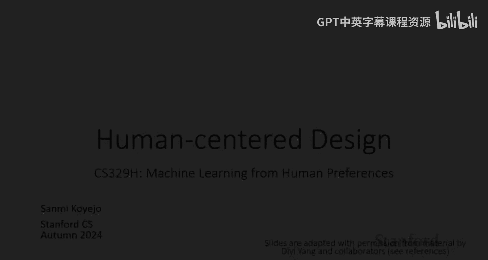

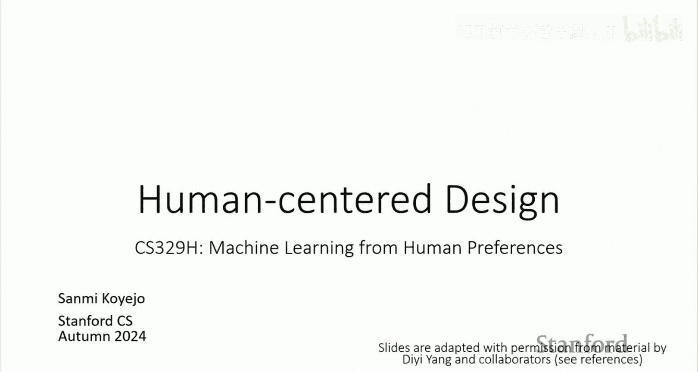

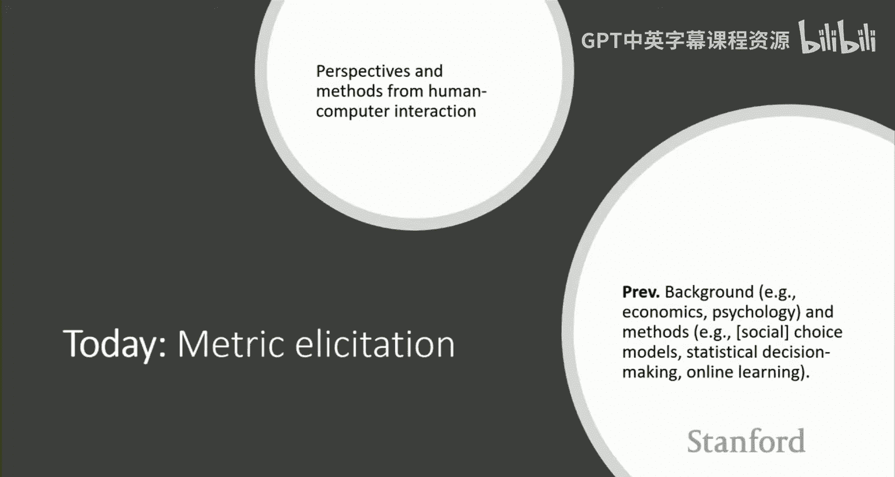

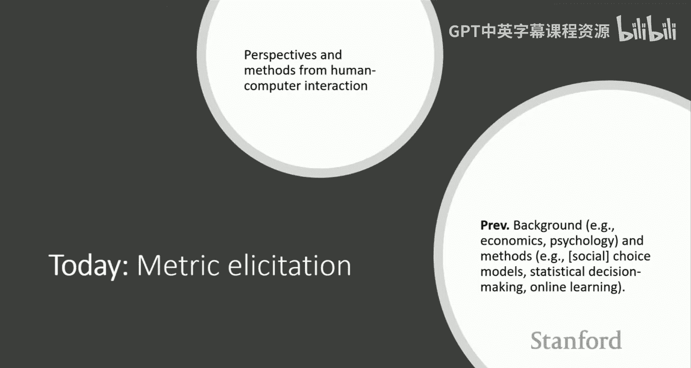

在本节课中，我们将要学习如何从以人为中心的设计视角来思考人工智能技术。我们将探讨人机交互领域的基本理念，了解如何将设计思维应用于构建更易用、更符合人类需求的AI系统，并讨论如何评估这些系统的有效性。

---

## 引言：从“诺曼门”到AI交互

今天的主要议题是以人为中心的设计。

本次课程内容参考了D Ynk等人的教程，这些材料对于构建本讲内容非常有帮助。虽然这不是我的核心研究领域，但我认为它对于本课程乃至更广泛的领域都非常重要。

我们将主要关注人机交互领域的观点和方法，以及它们如何帮助我们思考在人类与AI交互场景中的问题。这与之前我们主要关注技术方法的课程有所不同。我的目标是阐述本课程中的大部分技术性主题如何融入一个更广阔的、以人为中心的思考框架中。

如果说本课程之前的内容聚焦于一个相对“狭窄”的技术范畴，那么人机交互则为我们思考如何解决我们真正关心的问题提供了一个更广阔的视角。

---

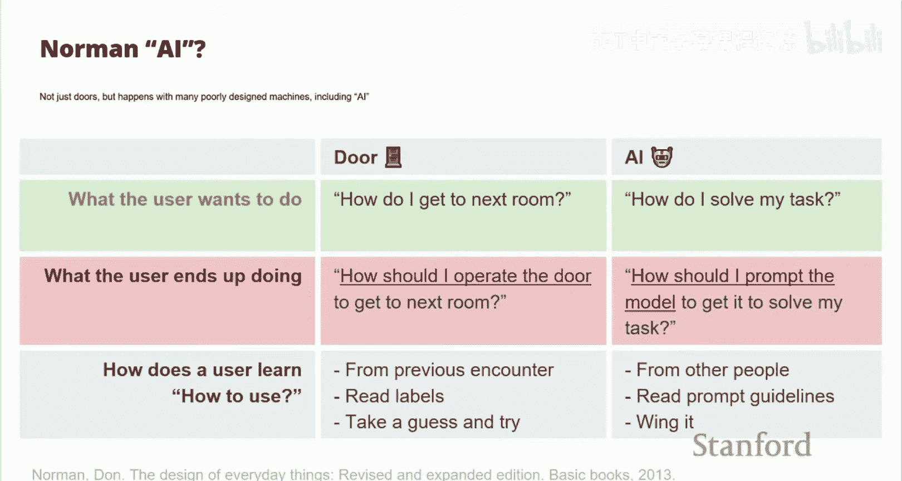

## 什么是人机交互？

如果你不熟悉，人机交互是一个广泛关注从人类视角设计技术的学科。它与大多数工程学和计算机科学领域形成对比，后者通常从一个工程问题出发并直接寻求解决方案。

当然，为了阐明观点，我会对许多领域的观点进行一定程度的简化。现实中，一切更像是一个连续谱，而非如此极端。

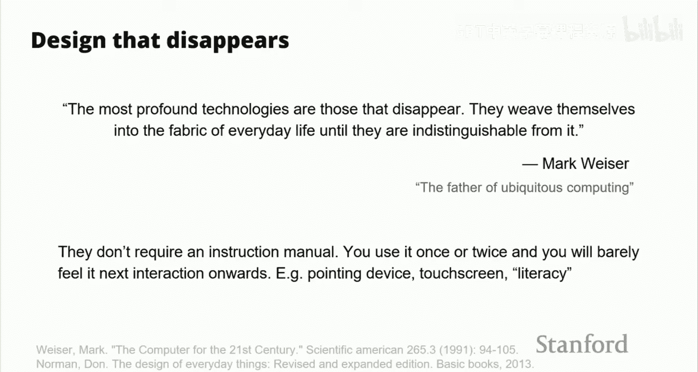

一种思考方式是，将科学方法应用于设计艺术。正如Nielsen所说，其目标是“消除人们实际行走的路径”。一个有趣的例子是“诺曼门”。你可能遇到过这样的门：试图打开它时却遇到了麻烦。问题可能在于不知道如何操作它。例如，是推还是拉？门上有个把手，但它的作用不明确；或者有多个可以操作的地方，但不知道哪个才是正确的。有时，它既不能推也不能拉，实际上是一扇滑动门。

对于这个问题，有很多思考方式。你可以说我们不够聪明，无法与技术互动。但我认为，本次讲座的核心论点是：这种想法是错误的。

正确的方式是认识到这是糟糕的设计。世界上存在一些基础设施（比如门，广义上也包括我们正在构建的人工智能工具），它们对人类不友好。论点在于，它们不友好是因为设计不当。因此，我们可以思考如何通过不同的设计来让它们更好地为人类服务。

我认为，本课程的核心内容（至少是我将采取的框架）是：**基于人类偏好的学习是构建更好AI技术工具箱中的一个强大工具**。

这是一个类比，但正如前面提到的，你可以将这种思考方式应用于AI，而不仅仅是门。例如，对于一扇门，用户关心的问题是“我如何进入房间？”（推、拉、滑等）。而对于AI技术，用户关心的问题通常是“我如何使用某个AI来解决特定任务？”

这就是用户与技术互动时想要做的事情。还有用户实际最终做的事情。对于门，这可能是问自己：“我如何操作这扇门才能进入另一个房间？”对于AI，特别是在2024年，我们与语言模型互动的主要方式是思考：“我需要什么样的神奇提示词，才能让这个语言模型做我想让它做的事？”

在某些方面，这就是世界的现状。但人们可能会认为，世界以这种方式存在真的很奇怪。我们构建了这个工具，本意是解决各种任务，但我们与之互动的方式却需要进行这种“我能创造出某个神奇提示词吗？”的心理体操。

最后，还有用户如何学习使用这个工具的问题。在建筑环境中，比如门，人们可能从之前的遭遇中学习。如果你撞到一扇门，下次可能就不会再撞了（至少在短期内）。或者你会阅读标签、猜测最可能有效的方式，然后尝试，希望最终成功。对于AI工具，学习可能意味着掌握创建好提示词的“秘诀”，与他人交流，或者遵循一些“提示词指南”。许多人只是不断尝试，直到找到有效的方法。

这里需要强调的是，这在AI技术使用中是一个真实存在的问题。这里的论点是，在一个设计良好的世界里，这不应该成为问题。这反映了我们工具设计的失败，使得互动过程变得混乱、不清晰，结果也不确定。

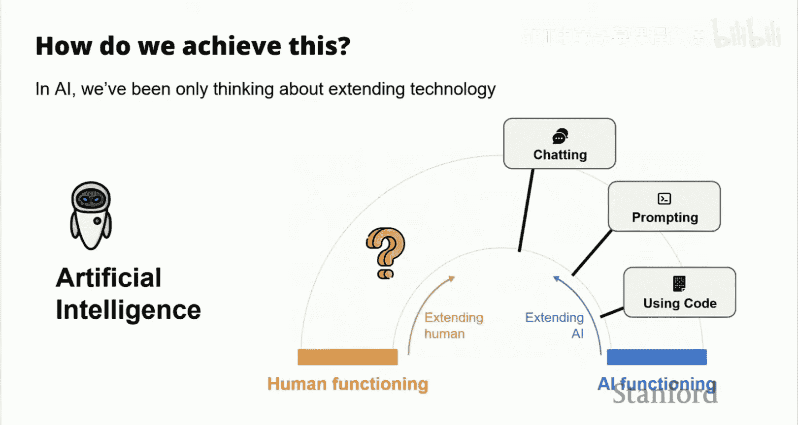

---

## 优秀设计的特征：技术应“消失”

有人可能会认为，设计良好的技术目标应该是：你甚至不会意识到背后投入了大量努力。技术越是完美，你就越不会注意到它。正如Mark Weiser所说：“最深刻的技术是那些消失的技术，它们将自己融入日常生活的结构，直到与之无法区分。”

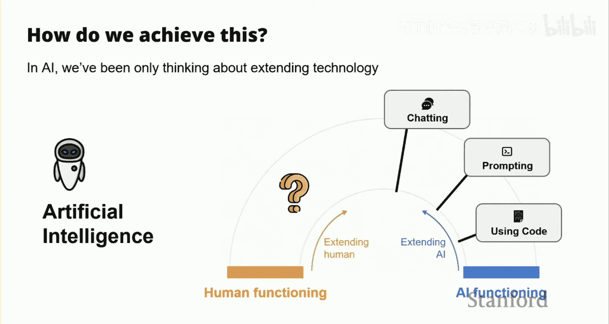

我认为，这部分也源于人类心理：一旦事物变得足够简单直接，它们就会退居幕后，成为自动化的过程，我们不再需要费力思考如何与技术互动。很多这种“消失”可以通过更好的设计来实现，使得技术直观易用，学习曲线平缓。

例如，好的技术不需要说明书，使用一两次后，你几乎感觉不到它的存在，或者至少不再需要思考如何操作。好的例子包括各种指点设备（尽管我的有时会出问题）、触摸屏等。这些技术直观易用。本次讨论的部分内容将涉及如何使AI技术本身变得更直观、更易于互动，并简要提及我们讨论过的一些偏好学习方法如何使这更有效。

---

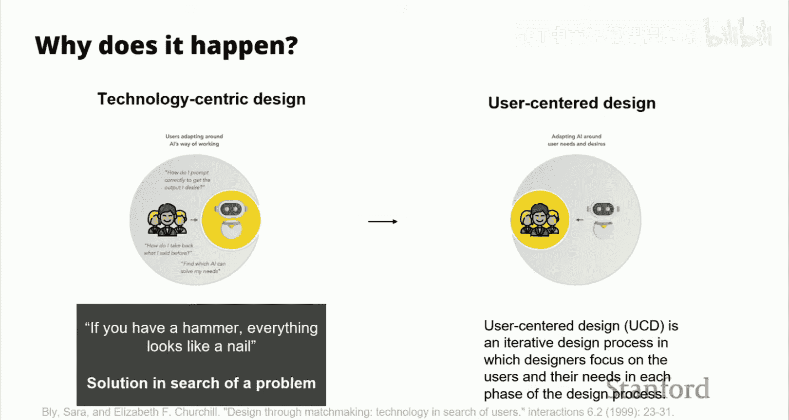

## 弥合人类与计算机之间的鸿沟

那么，思考这个问题的人是如何做的呢？一种方式是思考如何弥合人类能力（或人类功能）与计算机擅长或不擅长的事情之间的鸿沟。这两个轴都很重要，因为技术会随着时间推移而进化、变得更好。随着技术进步，我们通常更容易想象如何更好地弥合技术功能与人类功能之间的差距。

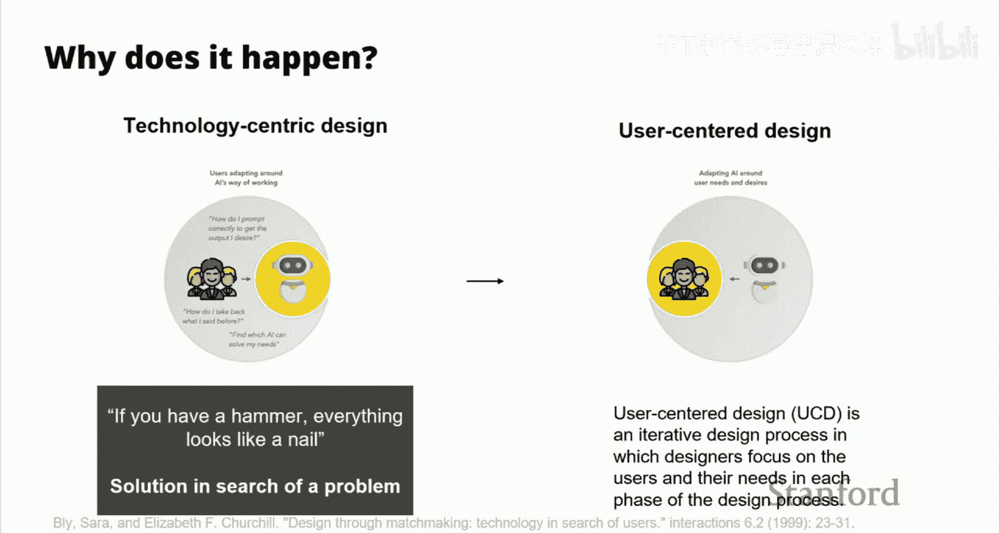

从扩展计算机功能的方向看，从早期的打孔卡（需要高度专业化操作），到命令行（仍然有用但需要高专业知识），再到图形用户界面（让人们通过指向看起来像他们想做的事物的图片来互动），以及指点设备、触摸屏等。可以说，特别是在个人计算领域，我们通过努力弥合了计算机最初擅长的事情与人类觉得容易做的事情之间的部分鸿沟，使得技术变得无处不在且易于使用。

在图形用户界面方面，一些思考包括使用隐喻或对象（图标看起来像你想做的事情），以及使操作变得直观。手机等设备在这方面做了大量工作，使其越来越直观易用。许多VR/AR领域的工作也可以被看作是试图找出这座桥梁，使与计算的互动更容易。

---

## 从技术中心设计到用户中心设计

我认为，我们许多人最擅长的是纯粹从技术角度推动技术发展：我们只是想得到一个好工具，我们可能没有充分考虑用户，或者我们对用户有一个抽象的概念，而不是真实的用户。我们通常追逐某个数字指标。这可以被称为**技术中心设计**。当技术成熟且存在既定的互动规范时，这种方式可能很有用。我认为很多AI工作大致处于这个空间。

另一方面是**用户中心设计**。你思考的是如何让用户最高效地解决他们的问题。在这里，你具体思考利益相关者的问题、需求和关注点，你的设计过程旨在让他们易于解决。

技术中心设计的一个潜在后果是，任何你构建的工具都可能被应用于各种场景，因为你并非为解决特定问题而设计，你只是有一个很酷的工具或技术，然后去寻找它的应用场景。

这里的重点不是说技术中心设计没有用或没有立足之地，而是说它解决的是一个与用户中心设计完全不同的问题，后者专注于让用户易于解决问题。

---

## 设计思维：从“为什么”开始

那么，人机交互领域的关键方法之一被称为**设计思维**。它挑战了工程师、计算机科学家处理问题的方式。粗略地说，最让我们兴奋的通常是关键的技术问题。我们找到一个（可能表述清晰的）问题，然后我们的工作就是找到这个问题的解决方案，也许再写几篇论文。我们思考问题的其他解决方案，我们的工作就是迭代不同的解决问题的方法。

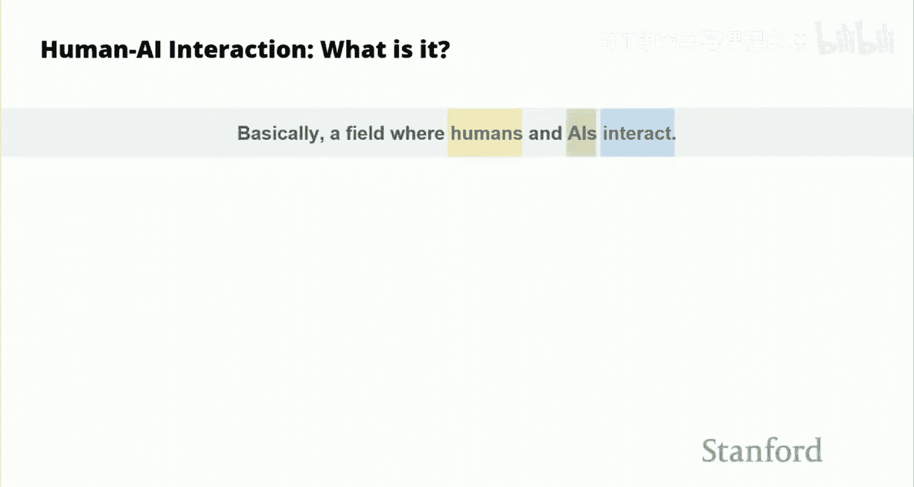

设计思维要求重新构建这个视角：不是从“这里有一个问题，有什么解决方案”开始，而是拿着问题，回过头去问“为什么”。例如，为什么这个问题需要解决？你尝试进行多次迭代（有时被称为“五个为什么”，“五”这个数字并不重要，关键是鼓励深入思考）。其核心是鼓励你仔细、深入地思考你真正想解决的问题是什么，识别问题的根本原因，而不是停留在表面。

这可以引向不同的方向。亨利·福特有一句名言：“如果我问人们想要什么，他们会说更快的马。”这是在汽车量产之前。你可以想象，人们需要从A点更快地到达B点，当时的解决方案是使用马，所以人们自然会想到让马更快。但设计思维鼓励你思考：“有没有其他工具可能解决这个实际问题？”（汽车就是一个不同的、可能更好的解决方案）。

在这种设计语境中，框架设定通常被视为一个关键的创造性步骤，能够产生原创性的解决方案。设计师报告称，当客户提出一个问题时，需要“找到问题背后的问题”，有时这也被称为创造新视角。

这种方法引导你的是：不是从问题直接跳到解决方案，而是问许多“为什么”问题，比如“为什么这是个问题？”“我能做什么？”“这个问题的根本原因是什么？”这可能会将你推向一个不同的方向。

---

## 双钻模型：发现、定义、构思、实现

为了将这种方法操作化，一个流行的方法是**双钻模型**。第一个“钻石”是关于问题的，在这里你提出所有“为什么”问题；第二个“钻石”是关于解决方案的。之所以称为“钻石”，是因为你首先有意地进行**发散**：提出范围广泛的问题，然后最终**收敛**到一小部分事物，即问题的根本原因。同样，你可以在解决方案侧做同样的事情：发散思考所有可能的互动方式，但你对根本原因以及用户背景和能力的理解越好，你就越能为该背景确定一个好的解决方案。

更详细地说，发现问题的发散部分有时被称为**发现**，包括研究等；然后你**定义**具体的根本原因，有时被称为**综合**，将事物组合在一起。在解决方案侧，你有一个**构思**步骤，开发多种思考潜在解决方案的方式；然后你**实现**或交付最终的解决方案，通常会得到一个可能的最佳解决方案。

对于第一步（发现），有很多工具可用，包括实地研究、访谈、调查，以了解环境因素、背景、不同需求（如教育水平）、市场研究、不同利益相关者等，从而更好地理解问题背后的“为什么”。一旦你有了广泛的理解，你就尝试缩小到特定问题的根本原因。有用的技术包括参与式设计（与利益相关者共同讨论以达成共识）、分析方法（了解不同任务或人员之间的关系）、亲和图（帮助进行逻辑分组）等。希望在这个步骤结束时，你能识别出一个或一小部分根本原因，它们比最初可能模糊的问题表述更深层次。

在解决方案侧，当你开发时，可以使用的工具包括故事叙述（设想用户处于特定情境，思考不同解决方案如何与该用户互动）、原型设计（快速构建粗略的解决方案，感受其在多大程度上满足用户需求），最终尝试得到一个**最小可行产品**，作为满足根本原因需求的最终解决方案。

需要说明的是，虽然这是一个有用的概念框架，但对于许多有趣的事物（无论是研究还是产品），实践过程通常不是一次性的，而是**迭代的**。你观察、产生想法、理解根本原因、构建原型、测试、部署、发现缺失之处、再次观察……可以将其概念化为一个不断扩展的循环，随着时间的推移，你希望更好地处理问题。

---

## 人-AI交互：一个新兴领域

对于我们这门课程来说，最相关的是当我们对人-AI交互感兴趣时，这类思考意味着什么。越来越多地，这正在被形式化为一个领域。在不同的抽象层次上，人们将其命名为人-AI交互、人-LLM交互、人-VLM交互等。这在一定程度上是技术专家的思维方式，因为他们锚定在特定的技术类型上，而不是仅仅解决问题。但这可能是组织一套技能和工具的有用方式，以思考如何用这些工具或技能解决有用的问题。

一种思考方式是将其视为一个领域或子领域，关注人类与AI的互动。这里的“人类”包括研究人员、模型开发者、专家，也包括最终用户。每一类都有不同的需求、目标和背景，需要思考如何为这些潜在最终用户构建解决方案。这里的“AI”则聚焦于语言模型、对话系统、音频系统、推荐系统、自动驾驶等各种技术领域。你可以思考如何结合不同的人类与不同的技术工具来解决现实世界的问题。

“交互”部分可能是关键的新事物，思考互动可能如何进行：可以是协作的、辅助的（AI协助甚至解决问题）、理解的（人类试图理解AI工具）等。因此，在高层次上，该领域试图将自己设定为思考不同的利益相关者、不同的AI工具或技术，以及不同的互动机制和弥合整体问题的方法。

---

## 如何解决人-AI交互问题？

那么，如何解决这个问题呢？第一步通常是弄清楚你试图与之互动的人类是谁。在研究中，你通常有一定自主权；在产品中，可能由产品定义。同时，AI语言模型或其他工具通常已经存在，但需要改进以弥合接口鸿沟。

关键步骤包括：
*   **设计**：他们为什么应该互动？需要做什么来实现？在什么情境下？
*   **实现互动**：我们如何实现这种互动？根据设置和背景，可以运用什么来使互动更容易？

我认为，中间这部分的大部分工作是关于**工具**的。我们在本课程中涵盖的大部分内容，在某种程度上都可以被视为可以用来使互动更容易的工具。因此，这个“实现互动”的问题包括：我能否通过个性化、通过从人们那里获取成对偏好（本课程主要涵盖成对偏好，但也会简要介绍其他获取偏好或选择的方式）来更好地理解或减轻互动的负担？所有这些都被视为实现人类与广义AI之间互动的技术工具。

*   **评估**：我们还没有深入讨论，但非常重要。我们将花一些时间讨论，特别是在我们将所涵盖内容置于简化人类与AI针对特定问题互动的更广泛背景下时，评估可能是什么样子，以及思考评估工具的不同方式。

---

## 案例研究：改进图像生成的交互

构建交互系统的好方法包含许多不同的组成部分。一些包括思考利益相关者是谁（考虑人类认知、感知）、信任和依赖（你希望用户能在适当的时候依赖工具）、公平性、问责制、透明度、伦理（我们会有单独的讲座更多讨论这些主题），以及个性化、适应性和轻松提供反馈等。

关于信任和依赖：信任是对可靠性、诚信、诚实等的评估，本质上是人类属性（尽管我们越来越多地将其类比应用于机器）。依赖是依赖于某人或某物执行特定功能或任务，无论信任是否存在。设计挑战包括设计整体系统，使其处于“适当依赖”的状态（既不过度依赖，也不依赖不足）。实现方式可能包括提供解释、显示不确定性、允许用户决定何时查看结果、显示处理过程以帮助用户建立心理模型等。

关于公平和问责：公平问题确保工具不会基于性别、社会经济因素等表现出巨大差异。问责制涉及衡量错误的后果并将其纳入系统评估和构建中。透明度（解释技术内部运作）和伦理（思考人类与AI互动的伦理含义，以及AI决策在多大程度上匹配人类伦理原则和价值观）也是重要方面。

此外，还需要思考互动如何开始。一端是**人类作为发起者**（人类作为创造者，使用计算机作为工具），目标是让人类易于发挥创造力。另一端是**计算机作为发起者**（计算机自动部署某些东西，人类是受众），目标是使计算结果具有创造性以满足需求。许多现实世界的事物介于两者之间，是**混合发起**的协作式人-AI互动。混合发起系统允许协作，用户和系统在执行任务和决策中扮演积极角色。要做好这一点，必须将自动化服务与鼓励创造性的直接操作结合起来。

---

## 如何评估人-AI交互？

现在，让我们转向评估人-AI交互。一些关键问题包括：如何评估、评估什么、谁来进行评估、何时评估。

关于“如何评估”，有几个方向：方法、类型和指标类型。
*   **方法**：包括**定量评估**（找到量化你期望结果的数字，如任务完成时间、正确回答的问题数量）和**定性评估**（通过调查、访谈等方式，了解用户喜欢什么、感到沮丧的原因）。在好的设计研究中，通常会进行某种定性评估。对于语言模型，基准测试的定量评估与人们的使用体验常常存在差距，这表明我们需要更好的、能捕捉人们喜好的定性或定量工具。
*   **评估类型**：包括**内在评估**（直接评估模型本身在与其性能直接相关的任务上的表现，可能不涉及用户，如对数似然、基准测试完成度）和**外在评估**（评估模型在真实世界下游任务中的帮助程度，在特定用例背景下进行评估）。内在评估通常更快，外在评估可能更慢但能弥补内在评估的差距。
*   **指标**：随着时间推移，人们尝试验证一系列不同的指标来量化各种工具，例如生产力（如添加的代码行数）、成本等。设计决策包括是依赖现有经过验证的指标，还是提出更能捕捉背景的新指标。

关于“评估什么”，可以是模型本身、人机交互界面，也可以是端到端的整个系统。通常，好的评估会分别进行这些评估，然后考虑端到端的整体效果。还可以考虑评估的不同目标，如效用、满意度等，并使用不同的指标（如代码是否通过测试、与参考代码的相似度、人类对代码结果的偏好等）。

关于“谁来进行评估”，可以是外行、领域专家，也可以是自动化评估（如使用LLM作为评判者越来越流行）。目标用户群体（专家、普通用户、教师、学生等）会对评估过程产生重大影响。

关于“何时评估”，有不同的时间尺度：互动时的即时评估、短期互动评估（观察几轮互动）、长期评估（部署工具数周、数月甚至数年进行纵向研究）。这些都是构建人-AI交互设计问题评估工具时需要做的重要设计决策。

---

## 总结

本节课我们一起学习了人-AI交互，以及与之相关的设计决策。我们讨论了人机交互领域处理这些问题的动机、基础工作和影响，以及如何实施这些想法的一些思路。

如果做得好，目标是可以利用各种AI技术，以真正解决人们问题并尊重其需求、目标和现实世界背景的方式。

我们探讨了几种不同的视角：
1.  **实现人-AI交互**：例如，帮助AI工具持续从互动中学习（如偏好学习）、使工具更个性化（或考虑社会选择作为高度个性化的替代方案），以及分析这些对不同利益相关者决策的影响。
2.  **评估**：思考用例、用户与各种评估机制之间的映射关系，包括评估过程的不同时长、定性与定量评估等问题。评估本身也成为一个设计问题，需要选择最适合你所构建内容及其背景的评估设计方案。

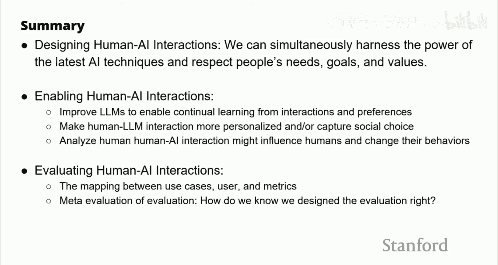

通过以人为中心的设计思维，我们可以致力于构建那些“消失”在背景中、直观易用、并能真正赋能人类解决复杂问题的AI技术。