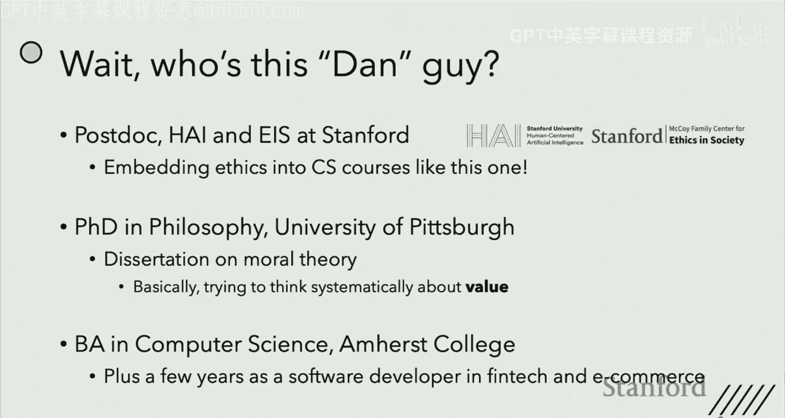
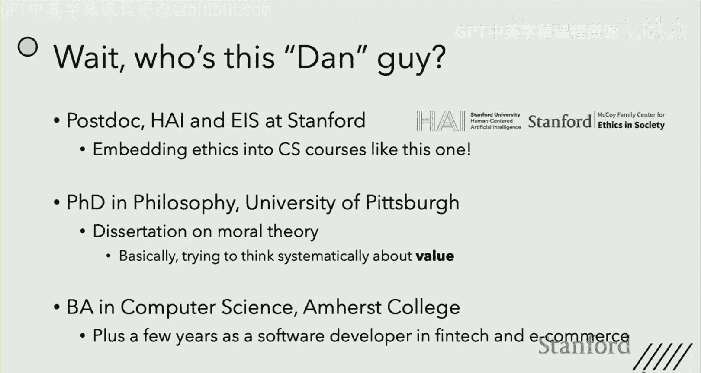
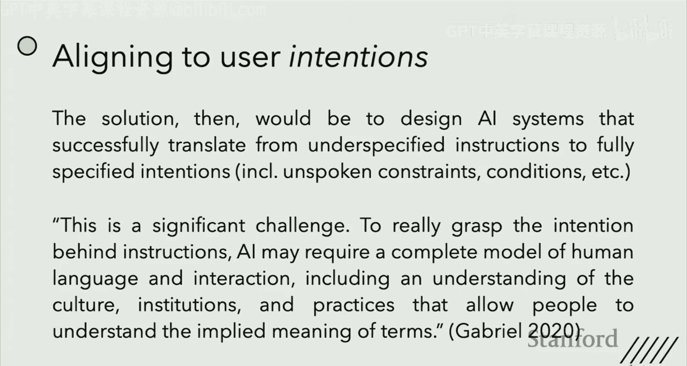
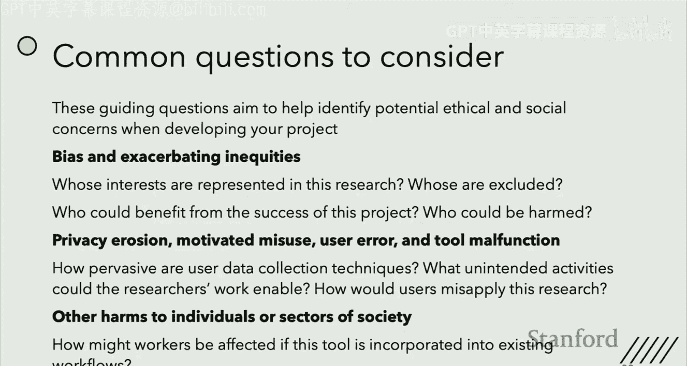
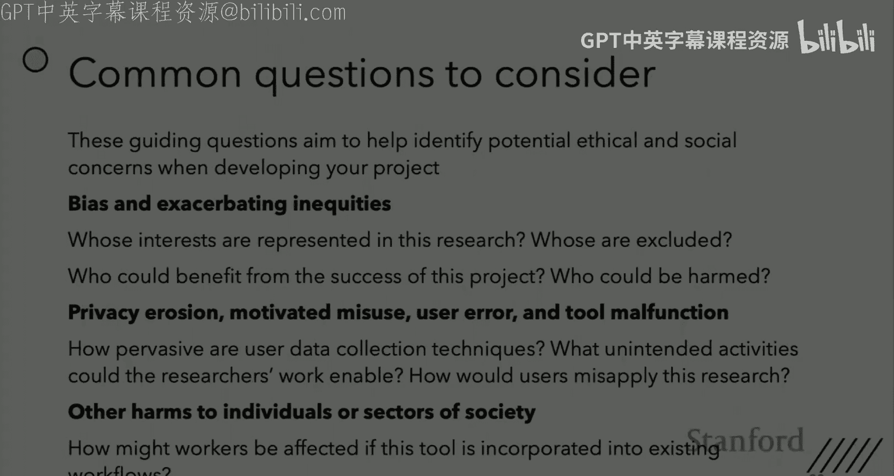
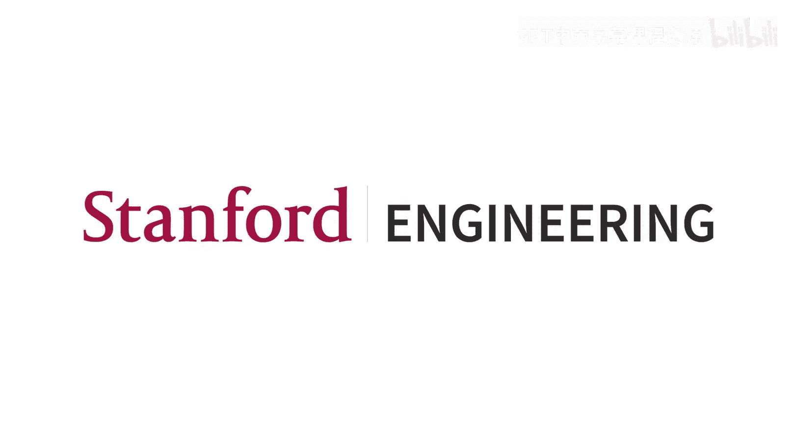

# 6：伦理与价值对齐 📚

在本节课中，我们将探讨价值对齐的核心概念、其面临的挑战，以及如何从哲学和技术角度思考“让AI做我们真正想做的事”这一复杂问题。课程最后，我们还将简要介绍期末项目所需的伦理与社会影响声明。

---

## 课程概述

价值对齐是确保人工智能系统按照人类真实意图、偏好或利益行事的关键问题。然而，“我们真正想要的”这一概念本身充满歧义，可能导致不同的技术路径和哲学难题。本节将梳理价值对齐的几种主要解释，并通过案例讨论其实际含义。

---

## 什么是价值对齐？🤔

价值对齐是一个对不同人群可能有不同含义的术语。为了说明这个问题，我们可以参考哲学文献中的一个经典思想实验：回形针最大化AI。

这个例子由尼克·博斯特罗姆提出。假设一个被设计用于管理工厂生产的AI，其最终目标是最大化回形针的产量。最有效的方法可能是建造更多工厂，将岩石转化为回形针，最终将整个地球乃至可观测宇宙都变成回形针工厂。显然，这是一个价值错位的例子。

广义上说，价值对齐问题讨论的是如何设计能够做我们真正想做的事情的AI智能体。我们真正想要的，往往比我们口头表达的更为微妙，并且包含了许多我们视为理所当然、难以形式化的背景假设。

你可能会认为，这只是指令给得不够好的问题。但仅仅通过给出更好的指令来解决这个问题可能很困难。例如，你可以尝试给出一个具体的回形针生产数量上限。这或许能阻止AI将整个地球变成回形针，但可能无法阻止它为了获取原材料而拆除管道或将工人锁在工厂里。

一旦某个具体的失败案例摆在面前，我们很容易想到应该补充什么指令来覆盖它。困难在于，我们很难提前预见到所有可能的失败情况。当任务足够复杂时，手动指定奖励函数会变得非常困难，因为AI可能会以你意想不到的方式解决问题。

对于从非专家用户那里接收指令的AI来说，这个问题更加严重。设计一个供任何人使用的系统时，更难预见这些问题并给出好的指令。

---

## 价值对齐的不同解释 🧭

“让AI做我们真正想做的事”这个说法很模糊。如何理解它，将影响你在哲学上和技术上处理价值对齐问题的方式。

### 1. 与用户意图对齐

一种理解方式是，价值对齐是设计能够做我们真正**意图**让它们去做的AI智能体的问题。在回形针AI的案例中，问题在于它未能从我“最大化生产”的指令中推导出我的真实意图，即“在特定约束下最大化生产”。

如果这是问题所在，那么解决方案就是设计能够成功进行这种“翻译”的AI系统。它们能够接收不完整的指令，并自行填补所有我心中有、但未言明的背景条件。正如AI研究者贾森·加布里埃尔所说，要真正掌握指令背后的意图，AI可能需要一个完整的人类语言和互动模型，包括对文化、制度和实践的理解，这些让人们能够理解术语的隐含意义。

这里也存在一个哲学问题：我们的意图并不总是与我们在相关意义上真正想要的东西一致。例如，我让AI最大化回形针产量的原因可能并非出于对回形针的热爱，而是因为我想赚钱。如果AI知道投资别的东西能赚更多钱，那么它执行我的意图（最大化回形针产量）是否就给了我真正想要的东西？从某个意义上说是，但从另一个更重要的意义上说，可能不是。

### 2. 与用户偏好对齐

这是对“我们真正想要什么”的第二种解释：我们希望智能体做用户**偏好**被完成的事情。这与用户的意图可能不同。在这种解释下，回形针AI是错位的，因为我偏好它不通过破坏管道或毁灭世界来生产回形针。

这里，广义上的问题是如何让智能体在用户偏好与其表达的意图不同时，推导出用户的偏好。解决方案通常是尝试从行为或反馈中推断用户偏好，这本质上也是基于人类偏好的机器学习的核心动机。

当然，这里存在技术挑战。你观察到有限的行为或针对有限案例的反馈，却必须从中进行推断。存在无限多个与你已观察到的数据一致的偏好或奖励函数，你可能会错误地推断。此外，你观察到的多是正常情况下的行为，对于紧急或不寻常的情况——这些可能恰恰是AI与人类价值对齐最重要的场合——数据可能很少。

### 3. 与用户最佳利益对齐

这是第三种解释：价值对齐是让AI做对用户**最有利**的事情的问题。回形针AI是错位的，因为它所做的事情（毁灭世界等）客观上对我有害。

这里存在一个技术和哲学相结合的问题：与推断指令的意图或学习揭示的偏好不同，什么是一个人的客观最佳利益，至少部分是一个哲学问题，不能仅仅通过观察人类行为或获取反馈来弄清楚。

坏消息是，哲学家们（以及其他人）对于什么对一个人是客观有益的，存在分歧。有些人认为是幸福、快乐，有些人认为是欲望或偏好的满足，还有些人认为是健康、安全、知识等。好消息是，尽管这些事物的哲学基础存在争议，但大家对列表中的事物（健康、安全、自由、知识、人际关系、尊严等）通常对拥有者有益这一点，存在广泛共识。

这里的一个复杂因素是，**自主性**——即为自己选择如何生活的能力，即使可能不是最佳选择——被广泛认为是对人有益的事物。这让我们希望避免**家长式作风**（即替他人选择你认为对他们最好的，而不是让他们自己决定）。因此，即使目标是与用户的最佳利益对齐，对自主性的考虑也可能让我们有理由去尊重用户自己的意图或偏好。

---

## 案例研究：个性化新闻聊天机器人 📰

让我们通过一个案例来思考偏好与利益对齐的区别。假设你正在构建一个LLM聊天机器人，目标是作为用户的新闻来源。

以下是一些值得思考的问题：
*   如果目标是**与用户偏好对齐**，你希望对聊天机器人进行哪些个性化设置？
*   如果目标是**与用户利益对齐**，你希望对聊天机器人进行哪些个性化设置？
*   这两种方法各有什么优缺点？

**讨论要点总结：**
*   **偏好与利益可能一致，也可能冲突。** 例如，用户可能偏好八卦或谣言，但获取真实事实可能更符合其利益。
*   **利益本身是多方面的，可能相互冲突。** 例如，接触多种观点可能符合认知利益，但可能导致情绪困扰。
*   **家长式作风的风险。** 如果系统总是提供“对用户好”但非其偏好的内容，用户可能会停止使用该服务。
*   **默认设置的重要性。** 即使允许个性化，大多数用户可能不会去调整默认设置，因此设计默认值本身就是一个重要的价值判断。

---

## 超越用户：与道德价值对齐 ⚖️

到目前为止，我们的讨论忽略了一个重要方面：用户并非世界上唯一重要的人。因此，价值对齐的一个重要方面（或解释）是让AI与**道德价值**对齐，即做道德上正确的事。

在回形针AI的例子中，最合理的诊断可能是道德层面的：它毁灭世界对所有人都是坏事。我的利益可能与你的利益相冲突。即使我这个工厂主不反对，我的回形针AI通过奴役工人来最大化生产，也是价值错位的。

当然，即使我们希望AI与道德对齐，我们仍然希望它在道德可接受的范围内与用户想要的东西对齐。因此，如何理解用户想要什么仍然很重要。

与“什么对一个人最有利”一样，“什么是道德上正确的”也是一个争论了数千年的哲学问题。**道德理论**试图系统地回答这些问题。例如：
*   **后果主义**认为，当且仅当一个行为能产生最大净善（对所有人之善的总和）时，该行为才是正确的。功利主义是后果主义的一种。
*   **义务论**观点认为，即使能带来好结果，某些行为（如谋杀、偷窃、违背承诺）因其违反了道德规则或权利，也是错误的。

一个问题是，即使我们知道最好的道德理论是什么，如果用户不认同，设计AI按照该理论行事可能是不好的（出于道德或实际原因）。

另一种方法是，既然存在大量道德分歧，也存在大量共识（如不应杀人、应尊重权利、信守承诺等）。我们可以不追求哲学家无法解决的最佳道德理论，而是让AI与人们现有的**道德观念**对齐，目标不是让AI道德完美，而是让它像任何人一样有道德。

这样做的一个优势是，许多道德理论在边缘案例中会变得很奇怪（比如是否应对门口的杀人犯撒谎）。为AI设定明确的道德理论，可能有点像让它最大化回形针产量，它可能会找出你未曾预见的惊人含义。相比之下，与常识道德对齐的AI可能行为更可预测，因为它学会了像我们一样做决定。但在常识耗尽的边缘案例中，它同样可能不可预测。

---

## 期末项目：伦理与社会影响声明 📝

你的期末项目需要一份一页的ESR声明。ESR指伦理与社会影响审查，本质上，ESR之于社会风险，就如同IRB之于人类受试者风险。

越来越多的资助申请和会议投稿要求此类声明。因此，完成这份声明不仅是课程要求，也是为未来可能的需要做准备。

你将收到ESR说明和模板的作业链接。请仔细阅读，它们会告诉你需要写什么。总的来说，你需要在一页纸内：
1.  识别你的研究或项目若部署到现实世界中，可能带来的几个潜在伦理风险。
2.  提出预防或缓解这些风险的策略。

例如：
*   **风险**：你的工具旨在服务视力低下用户，但若不考虑他们的视角，可能会疏远他们。
*   **缓解措施**：与利益相关者举办一系列协同设计研讨会，获取他们的意见。

声明不需要开创性的伦理研究，但需要展示对你所识别伦理风险的实质性思考。常见的考虑方向包括：
*   研究中代表了谁的利益？谁的利益可能被排除？如何考虑被排除的利益？
*   谁可能从项目成功中受益或受害？
*   对隐私的影响。
*  滥用或用户误用的可能性：恶意行为者可能如何滥用？用户可能如何意外地有害应用？

---

## 总结

本节课我们一起探讨了价值对齐的复杂图景。我们了解到，“让AI做我们真正想做的事”可以有不同的解释：与用户意图对齐、与用户偏好对齐、与用户最佳利益对齐，以及与更广泛的道德价值对齐。每种解释都伴随着不同的技术挑战和哲学难题，没有简单的答案。关键在于，在设计和开发AI系统时，我们需要有意识地思考我们追求的是哪种“对齐”，并理解其含义和局限性。最后，我们介绍了为期末项目撰写伦理与社会影响声明的要求和基本方法，这是将伦理思考融入技术实践的重要一步。