# 7：投票机制与Polis平台实践 🗳️

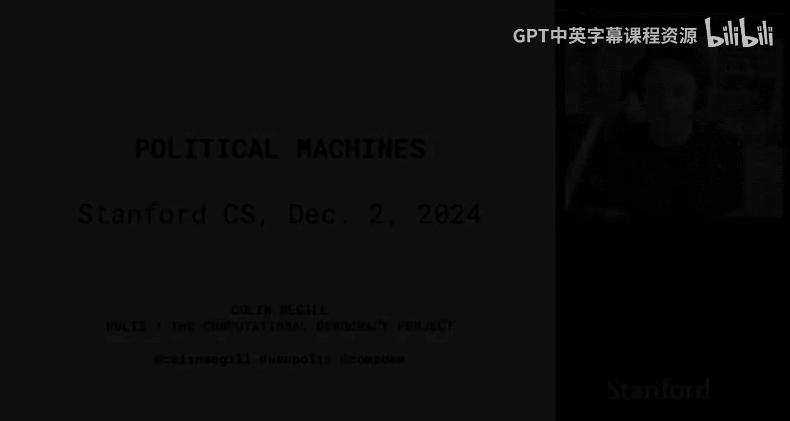

在本节课中，我们将学习Colin Mc Gill关于Polis平台的分享。Polis是一个开源平台，旨在通过收集和聚合大量用户的偏好陈述，来理解群体观点并促进共识的形成。我们将探讨其核心方法、技术实现、潜在风险以及与大型语言模型结合的应用前景。

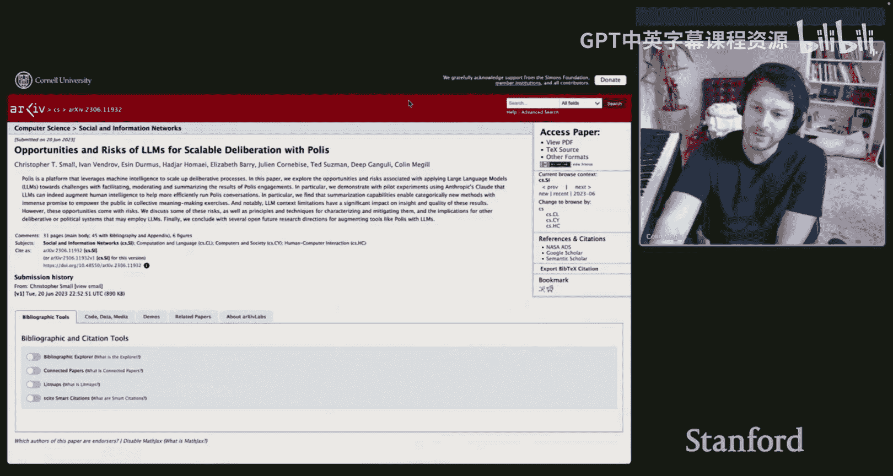

---

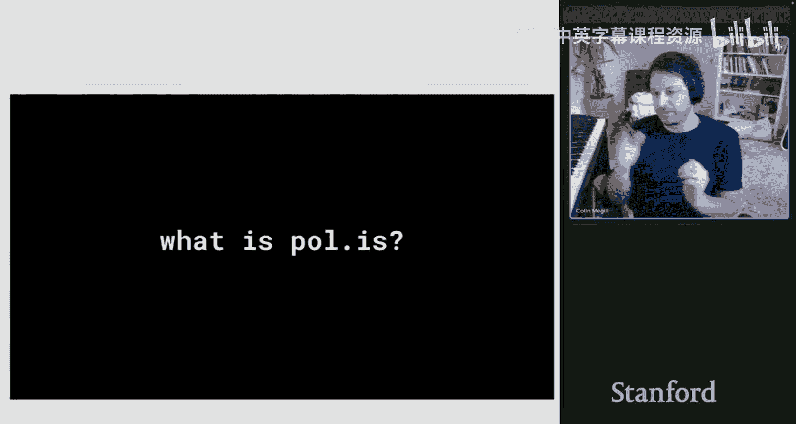

## 项目背景与介绍 👨‍💼

大家好，我是Colin Mc Gill。我从事一个名为Polis的开源平台项目已有约13年。我将简要介绍我的背景和这个项目，然后探讨其发生的原因。例如，OpenAI的资助项目以及基于Polis的Twitter社区笔记功能，这些都是其底层方法论令人兴奋的应用和潜在联系。

我的本科背景是国际关系和政治学。之后我决定投身初创企业。Polis在2012年至2016年间是作为一个营利性的、具有社会使命的初创公司开发的。我们在2016年将其开源，随后在2019年，这个营利性实体逐渐关闭，并转型为一个非营利组织。从那时起，我的角色也从营利性公司的CEO转变为非营利组织的总裁。如果有人对非营利性技术感兴趣，我也很乐意就此进行讨论和回答问题，因为这是一个非常有趣的模式，类似于可汗学院或近期的Signal，它们都是开源的非营利技术。

该项目在全球范围内拥有用户和部署者。该平台已被英国、芬兰、新加坡、台湾以及荷兰阿姆斯特丹等国家政府以及许多爱好者部署使用。

---

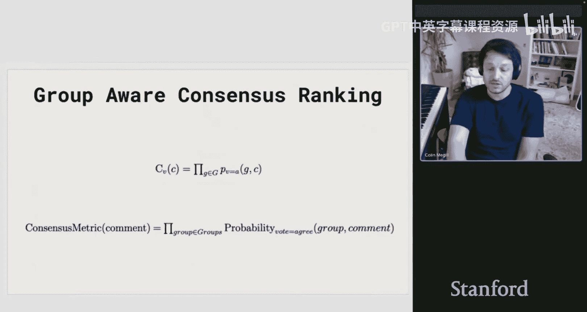

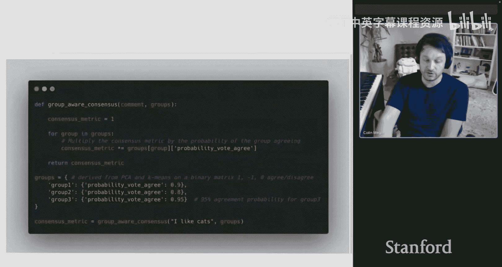

## 什么是Polis？🤔

在本次讨论中，我将主要聚焦于我们去年与Anthropic合写的一篇论文，该论文探讨了在Polis这类情境中使用大型语言模型的机遇与风险。我将花大部分时间讨论我们正在构建的内容及其方法论。

首先，明确一下术语。在本次演讲中，“Polis”可能指代几个方面：可以登录免费使用的网站 `pol.is`；指代技术本身的代码仓库；指代支撑其的指标和方法的论文；也指社区和用户群体。通常，“Polis”泛指这一整个领域，这对开源技术来说有时会有点令人困惑。

---

## Polis的核心机制 ⚙️

Polis最具体的表现形式是一个系统：用户可以提交陈述，这些陈述会随机地、一次一条地展示给其他用户，其他用户可以对它们表示同意、不同意或跳过。这个过程创建了一个稀疏矩阵，我们稍后会回来讨论如何处理它。

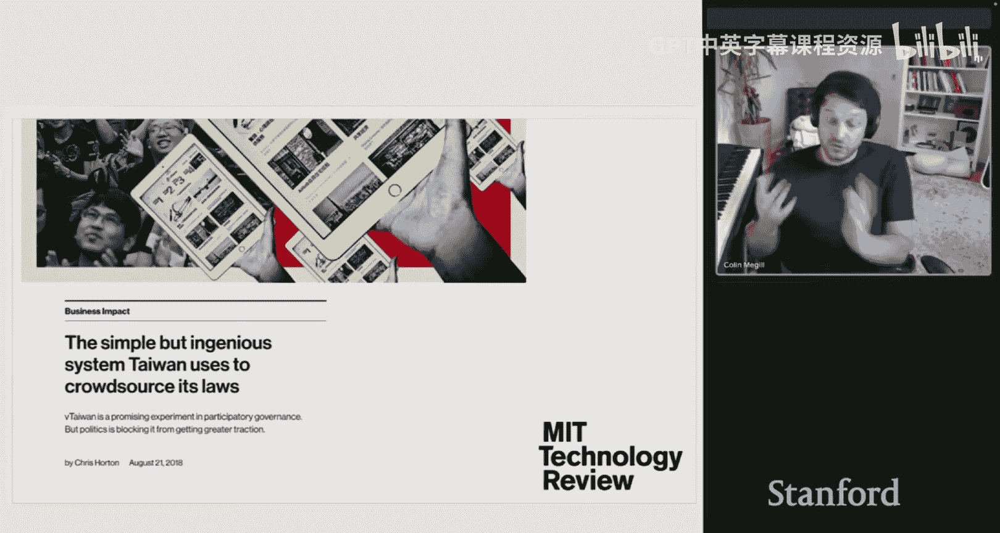

基本上，它不围绕回复展开。人们提交的所有内容都是一个原子性的陈述，进入一个池中。然后，当人们对他人提交的陈述进行投票时，系统会记录这些投票。其直观理解是，这像一个“涌现式调查”——由参与调查的人创建的调查，更接近于公民大会，但形式上更正式一些。

其理念是在大规模上理解观点。灵感来源于“占领华尔街”运动和“阿拉伯之春”期间社交媒体激励人们参与政治活动。但像Twitter这样的平台，虽然在动员方面有用，但在促成连贯对话、让人们共同撰写集体文件或精确找到彼此方面存在特定限制。

在“占领”运动中，一个常见现象是，运动中的每个个体都倾向于声称“这就是运动的意义”，并断言自己代表所有人发言。他们可能说对了一部分，但并非全部。这导致了分裂，难以形成共识。因此，能够随着更多人互动而变得更连贯的系统概念非常有趣。

2012年的核心概念是：我们想要收集什么？我们会应用什么算法？长话短说，它涉及对稀疏矩阵进行主成分分析（PCA）和聚类（如K-means），然后我们查看不同群体的共同点。这相当简单，类似于推荐引擎的“通行证”，但也涉及节点学习。这是一个我们可以部署后就不太需要操心的系统，现场协调员可以放心使用，无需担心PCA或K-means会做出什么疯狂的事情。

**技术细节澄清**：如果我们把每个人提交的每条陈述看作一列，每个参与者看作一行，那么原始数据看起来就像一个矩阵：如果参与者没看到某条陈述，则为空值；如果同意则为1，不同意则为-1，跳过则为0。这种数据结构适合进行PCA，然后进行聚类以识别模式。

这里的聚类对象是**人**。你可以找到区分这些人群的陈述，而这些陈述集合就形成了一种不同于其他群体的“世界观”。

其启发式方法是：在存在不同思考方式的群体的情况下，找出哪些陈述在不同群体间是共同的。这个指标是我们发表的论文中提出的，并在2013年就已在代码库中实现。这成为了后来与Twitter讨论如何为其“社区笔记”功能实施该概念的基础。其理念是：如果你拥有多元化的观点，能否利用它来恢复关于共识的信号？在存在分歧的背景下，共识是什么？看到这个公式在信息中找到更多依据，真的令人兴奋。

---

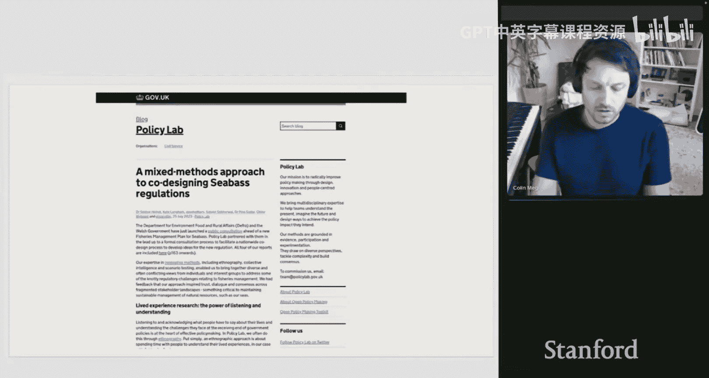

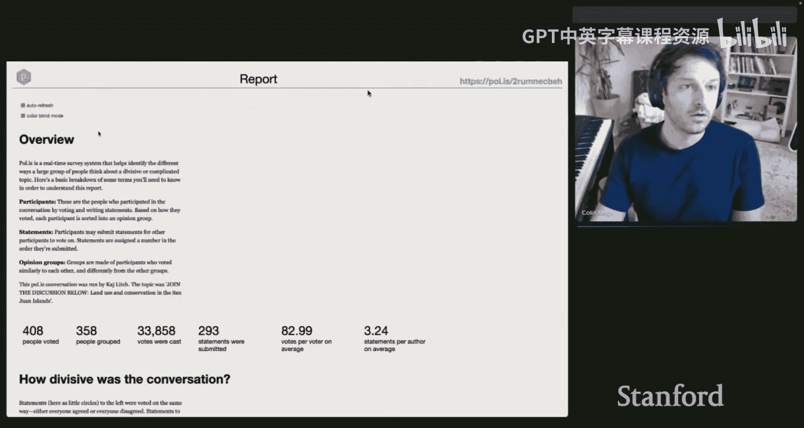

## 方法的稳健性与对抗性风险 🛡️

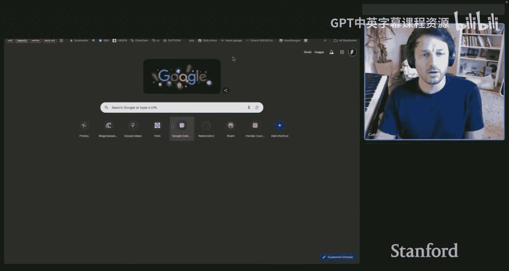

从其他对话背景中了解到，您提到了PCA和K-means具有足够的可解释性和可信度，因此在平台中没有风险。您打算更深入地探讨这一点吗？如果不，我想就此问题与您进一步交流。

我理解您将其表述为一个关于稳健性的主张。那么，对于投票矩阵，K-means在表示学习方面有多好？K-means加聚类作为获取共识或相似人群群体的可信方式有多好？反过来说，这是对抗者试图通过攻击底层基础设施来破坏此投票机制的风险之一。我提出这一点是因为，在本课程中，我们已经详细讨论了投票及其稳健性，因此我们了解投票可能不稳健的一些方式。

我猜我也没听到您对稳健性有强烈的乐观态度。我想您知道这一点，因为我们之前讨论过，但我想您能否多说一点？我将您关于对K-means和PCA的信心评论，主要解读为它们属于经典的、相对易于理解的算法，即使非技术人员如果了解技术也可能认为它们是已知的“黑匣子”。信心来源于此，而不是专门研究过通过那些机制攻击共识的稳健性。这样理解准确吗？

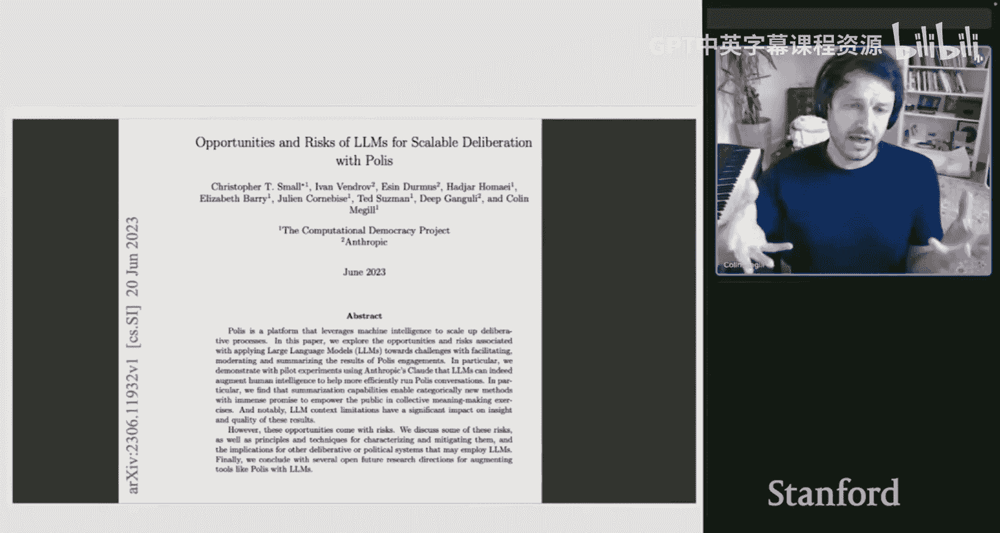

我很乐意讨论这个。Polis已经在国家规模的对抗性环境中使用过。我可以指出的一个具体例子是在台湾的使用情况。这篇文章涵盖了Uber试图通过让所有司机参与对话来获取利益的对抗性尝试案例。问题是Uber是否应该合法化以及如何合法化，当时在接触司机方面存在挑战。

台湾政府当时采取的措施之一是向全国开放系统，因为这是一个国家级的系统。如果期望人们来互动，他们可以互动的表面区域非常小——他们可以提交陈述，但如果审核员不让他们通过，那就无效。所以，首先，审核员控制着这一点。那么，基本上，对抗性行为者可以互动的表面区域就是：对陈述表示同意、不同意或跳过。这就是他们可以进行博弈的表面区域。

PCA和K-means是您试图从投票中获取的东西。我们反复看到的情况是，天真的做法是派您想要的人来投票，但这实际上可能只是让一个群体变得更大，可能会扭曲样本，但本质上是一个群体变得更大，不一定能操纵共识。所以，它对第一种攻击方式（即灌票）具有天然的免疫力，因为它只是让一个群体变大。

当然，现在用机器人来做这件事更容易了。现在，从产品角度来说，可以轻松地构建机器人，让它们点击，并指示“我希望你像这样投票”，即使看到新的陈述，也尝试保持一致。您可以创建三个根本不存在的不同集群，以最小化现有集群的影响。我认为这基本上是一场军备竞赛，最终归结到身份验证问题。然后问题就变成了：样本是什么？我们如何知道？这是我们有意回避的问题，因为Polis是一个工具，可以与任何样本一起使用，我们故意对此持不可知论态度。

我认为最终问题确实归结于此。我认为最有希望的方向可能在零知识证明、匿名、已验证身份空间。我一直期待有人能在那个领域做出真正实质性的东西。似乎有一些实验，比如“远程护照”，还有一些像“自由工具”这样的实验。我看到一些广告称他们正在使用零知识护照验证进行匿名投票，例如在一个国家内。他们声称已经在俄罗斯用这项技术进行了公投案例研究。我认为类似这样的技术可能会成为另一层保障。它可能不会成为Polis的一部分，但最终我们可能会与之集成。但我认为目前还没有明确的赢家让我们去这样做。

这是我的答案的第一部分。这是一个好的开始吗？

是的，很有帮助。我将其解读为：目前，风险尚未导致灾难性故障；未来的路径将是其他技术，这些技术将使个体抽样验证更加丰富和准确。您不一定需要处理投票机制本身的稳健性问题，因为您至少能确定投票者是真实的人。至于这些人是否在合谋污染数据，则是另一个问题。

如果他们确实合谋，那么问题就变成了：他们有多不同？我认为一个开放的研究领域是：如果我们认为我们有一些好的对话，并且对群体内的方差有了一定的感知，比如，如果我们打算对某些东西进行聚类或称之为一个群体，那么该群体内部有多少方差？我们目前没有任何检查、指标或方法来判定一个群体看起来是合成的，因为他们都以完全相同的方式投票。当然，如果100个人有完全相同的投票记录，我们可以简单地说出来。如果我们打算让它更混乱，并假设是LLM，或者LLM的投票方式与人类不同（它们投票更一致），那将是一种完全不同的处理方法。

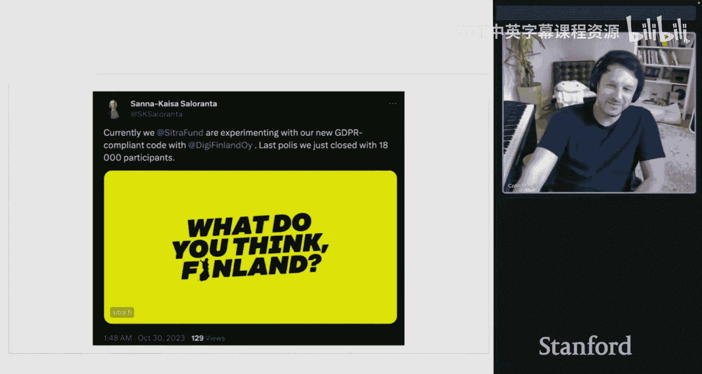

我认为这个领域我们还没有做，但可以去做，并且我认为这是一个开放领域，即如何处理这个问题。

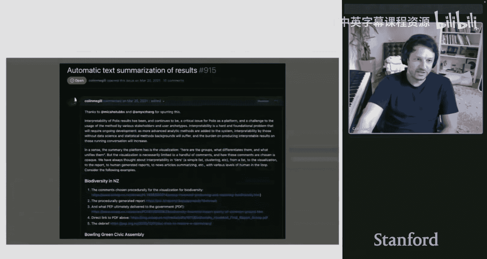

---

## 对抗性目标的具体示例 🎯

实际上，是的，接着刚才那个角度再问一个问题。您提到，如果拥有自主代理，可以设想一个世界，或者对抗性地尝试创建，比如按您所说的，三个不存在的不同集群。这显然有一些模糊的坏处，因为它扰乱了实际的意见收集机制。但是，您是否对具体的对抗性目标可能是什么样子有一些概念？如果我试图创建这三个集群，我想优化什么？或者说我的目标是什么？

很好的问题。我们用一个具体例子来说明。假设英国有一个名为“政策实验室”的政策创新部门，他们设立了一个集体智慧单位。这些政策创新部门的目标通常是说：我们将使用一些新方法进行创新，比如使用Polis从人群中收集意见数据，并将其用于政策制定。

然后他们会说：好吧，政府中哪位部长最进步、现在有意愿尝试新事物？然后他们会去做一些事情，比如在这个案例中，是与生态相关的事情。通常，这会是涉及多个利益相关者的事情，比如渔民、旅游业人士、工业或交通业人士、当地公民等等。

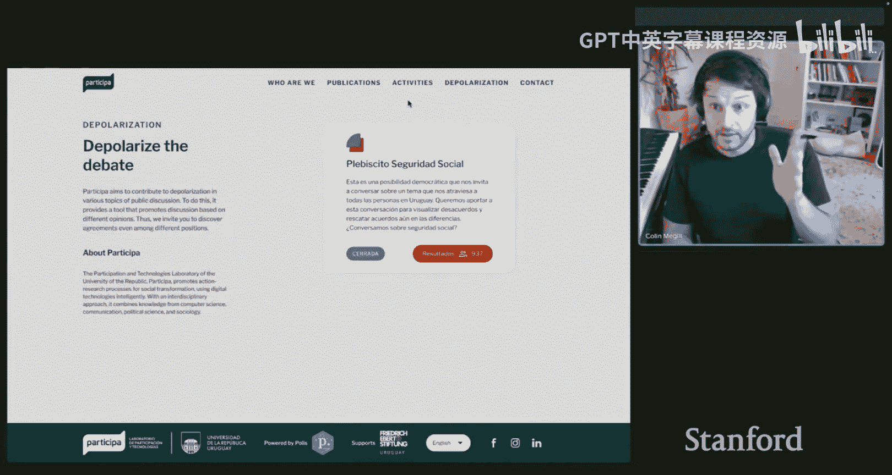

在这个案例中，这是英国关于海鲈鱼监管的案例。他们通过民族志方法与几十人交谈，然后扩大到数千人。如果这是一个国家规模的样本，并且也是开放的，那么如果有一个有动机的行业参与者（比如渔业公司），他们可能有经济利益去扭曲国家政策方向。

他们可以添加三个非常独特的世界观和个性的合成公民，这些公民并不存在，但对任何影响其生计的监管都表现得非常担忧。他们可能更加教条化。基本上，您可以添加合成的极端主义群体，来推动有经济利益方的叙事。

以Uber为例，可能存在两个有经济利益的群体：Uber司机和出租车司机。公民则混杂其中。在这种情况下，我们可以想象实际上还有另外两个正在出现的集群群体，或者可能有一群学术专家或经济学家在谈论其他国家的成果，但也可能存在错误信息。要理清哪些用户、意见或专家是真实的，哪些群体是基于该国实际情况的，哪些只是合成的，将会非常混乱。

我认为，合成专家可能是最危险的事情，因为您可以说：实际上，这个群体中有200位经济学家都担心任何监管对某事物的影响，并且他们说交通系统将在三个月内崩溃。如果真有200位学者这么说，那很重要；如果没有，可能很难理清。我认为这就是LLM可能带来的问题：它们可以产生听起来非常学术化的内容，可以借鉴理论、预测或大量文档，甚至可以有效地构建一个基于法律案例层面的、有依据的反对意见，但完全偏向于某个金融行为体。这对于只是想了解基本情况、为政策制定奠定基础的公务员来说，是一件相当令人困惑的事情。

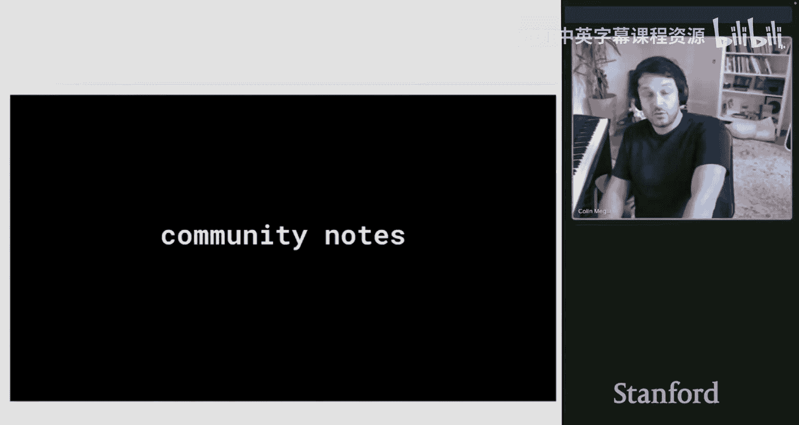

如果这个游戏获得越来越多的权力，我们可以预见到越来越复杂的对抗。

---

## Polis平台的实际运作示例 📊

我有点困惑，希望您能回到主要演示中。因为粗略地说，您暗示了一些我们尚未完全看到的情况：人们提出问题的过程。他们可以提出一大堆问题来确立自己的专业知识，然后通过提出50个只有专家才能回答的问题来过滤掉非专家。我不太理解问题是如何在平台上自然产生的。我很好奇想看看更详细的存在示例描述。

很好的问题。我来展示一个报告。这是一个在圣胡安群岛进行的对话，这是华盛顿州一个有四个岛屿、约13000人的县。问题是关于土地银行的。

对话围绕土地银行是否应该继续购买更多土地进行，因为这是一个购买房地产以保持其乡村和农业用途的公共机构。对话从一个提示开始，基本上就是：“我们将讨论土地银行。您对此有什么想法或感受？它应该走向何方？存在什么问题？它过去怎么样？”

然后人们会提交陈述。如果我们查看提交的陈述，可以看到高层统计数据：有几百人参与，约占该县人口的个位数百分比。他们提交了陈述，并进行了投票。

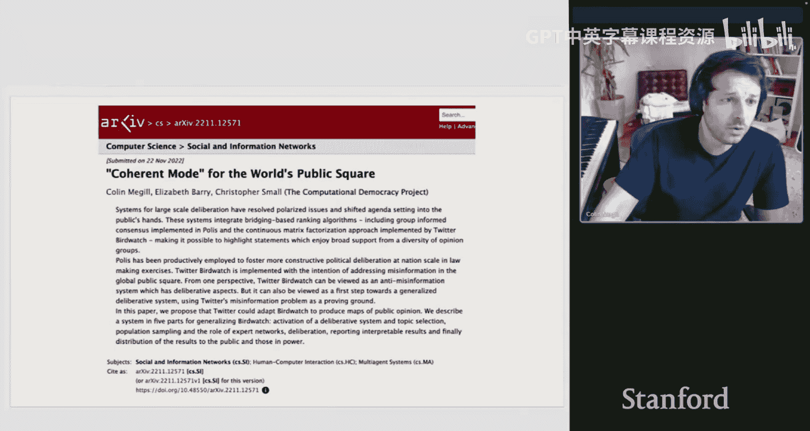

如果我们按“跨群体同意度”这个指标排序，可以看到人们普遍非常强烈地同意：由公共机构保护的土地，公众能够访问与保护自然栖息地是兼容的，我们不需要禁止人们访问。这不是讨论中的问题。

对话中也存在真正有争议的陈述。我可以使用这些表格，那些在主成分分析中载荷较高或偏右的陈述，例如“是否应该继续购买土地”是有争议的。还有“它是否减少了岛上可用于开发和居民居住的土地”也是有争议的。我们还可以查看由特定人群提交的陈述。

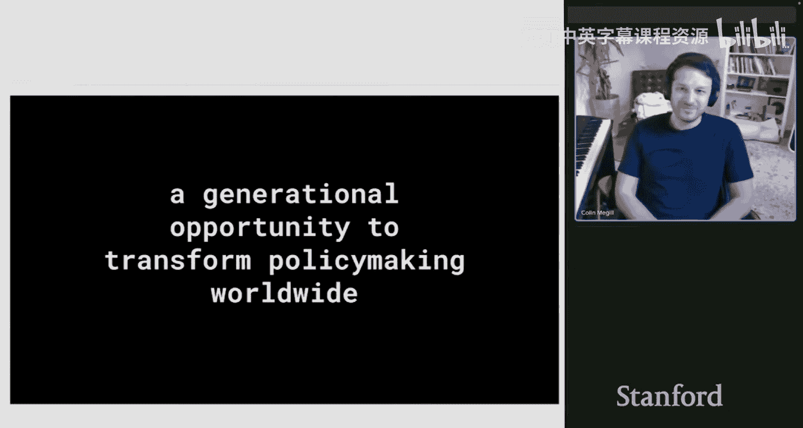

这是一种让人们表达对某个问题的看法，并让其他人对每个人的说法发表意见的方式。不是每个人都会提交陈述，但每个人都有机会投票。这至少有助于理解结构：一个通用提示，然后返回的不是问题，而是一堆对提示的回应。

是的，我认为是这样。所以人们可以提交一个陈述，然后其他人表示是否同意，对吗？正确。系统的工作方式是：人们提交一个像那样的陈述，然后它会半随机地展示给其他人，其他人会同意、不同意或跳过它。然后，最好的陈述会成为其他人投票记录的一部分。

由此产生的结果是每个参与者的一**系列投票记录**（行），其中每一列代表一个陈述特征。这就是数据集的样子。然后，通过寻找聚类来计算指标。

---

## 大型语言模型在Polis中的应用与风险 🤖

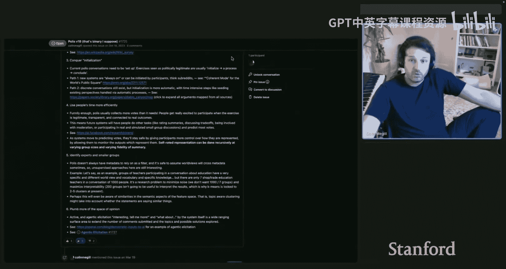

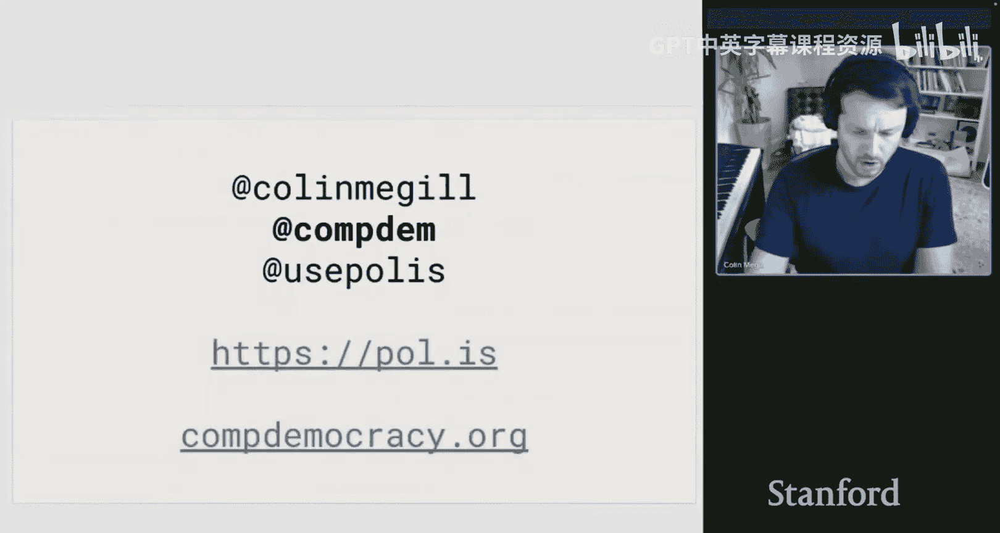

我们去年与Anthropic合写了一篇论文，涵盖了今天讨论的一些内容。在一个Polis对话中，LLM可以执行哪些类型的任务？执行得如何？我们研究了几件事：审核、总结和投票预测。

最早最有希望的结果之一是总结，即我们能否基于陈述生成一个总结。我们现在越来越接近发布这个功能了。我很乐意谈谈我们如何实现的一些细节。我们目前正在研究从句级别的依据，所以它不能在没有依据的情况下超越几个词。

我们还研究了投票预测，即如果LLM看到参与者越来越多的陈述和投票，它能否预测下一个投票。它在预测人们的投票方面相当不错。我认为这是一个特定的风险领域，因为显然，如果它非常擅长预测投票，那么就有相当大的空间让行为者构建良好的合成投票者，但也可能让人们误以为系统可以代表人们，从而懒惰地用LLM替代社会研究中的人，进一步使公众与机构疏离。这也是论文中讨论的一个风险。

您能多说一点吗？关于方法，是提示工程吗？您给它示例和上下文，然后要求它预测下一个？这是实际的实现方式，还是有更复杂的方法？

是的，基本上就是给它越来越多的投票记录，逐步增加，然后绘制图表：给定这个投票记录，它在预测下一个投票方面的准确度如何？随着您给它的参与者投票历史越多，它在预测下一个投票方面就越好。

我能更多地理解一下风险吗？从某种意义上说，如果您有一个预测人们偏好的好模型，这似乎是正确捕捉人们偏好的一个胜利。但我猜也存在风险，比如遗漏某些东西，或者在特定问题上预测与真相有显著差异，因为人比模型更复杂。您能说说您担心什么吗？

我认为人比模型更复杂是一方面。我认为这个案例更像是一个周末黑客项目，比如一个系统提示：“假装你是罗马尼亚公民，总理正在与你交谈，请回应。”这可能会立即产生非常刻板、糟糕、不严谨的东西。但如果人们相信它足够好，并最终进入公共机构，比如确保秩序，那就会有问题。

我认为，在没有严格验证的情况下，LLM可能产生看似学术但实则偏颇的反对意见，这对于试图了解基本情况、为政策制定奠定基础的公务员来说，是相当令人困惑的。如果这个系统获得越来越多的权力，我们可以预见到越来越复杂的对抗。

---

## 总结与展望 🌟

本节课中，我们一起学习了Polis平台的核心机制、技术实现及其在收集和聚合人类偏好方面的应用。我们探讨了其基于PCA和K-means的聚类方法如何帮助识别群体共识和差异，并深入讨论了该平台在面对对抗性攻击时的稳健性考量，特别是与大型语言模型结合后带来的新机遇与风险。

我们还通过实际案例，如台湾的Uber政策讨论和圣胡安群岛的土地银行对话，了解了Polis在现实世界中的运作方式。最后，我们展望了未来可能的研究方向，包括改进聚类算法、利用LLM进行更好的总结和投票预测，以及整合匿名身份验证技术以增强系统的可信度。

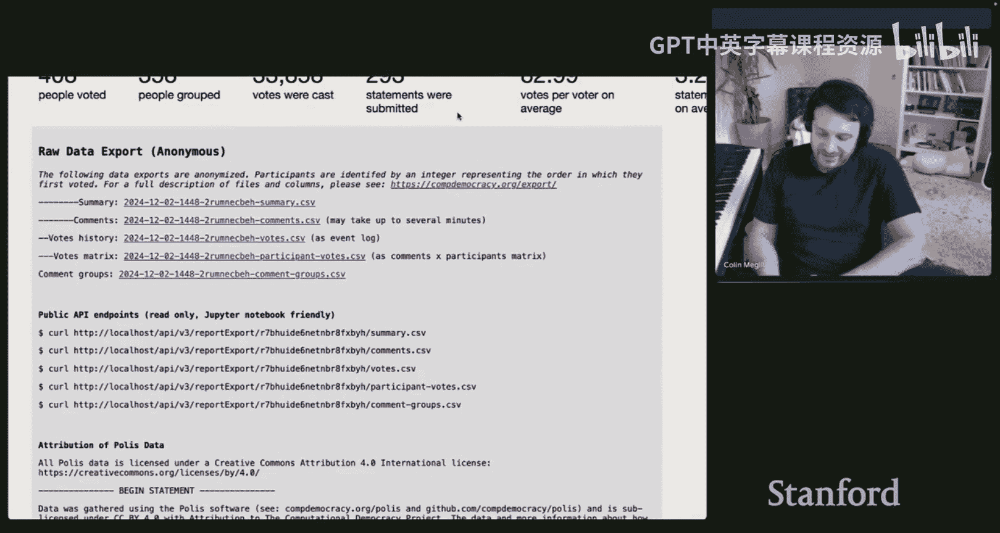

Polis作为一个连接技术、政策与公众参与的工具，展示了在复杂社会中规模化理解人类偏好的潜力，同时也提醒我们需谨慎应对技术滥用和伦理挑战。