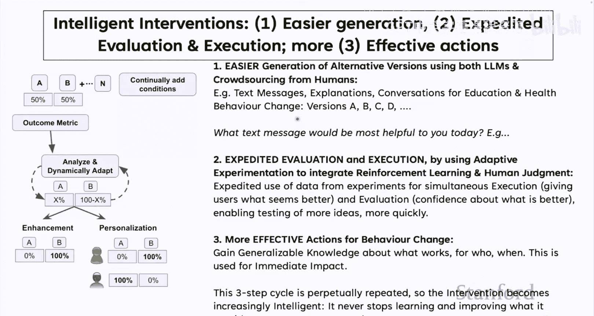
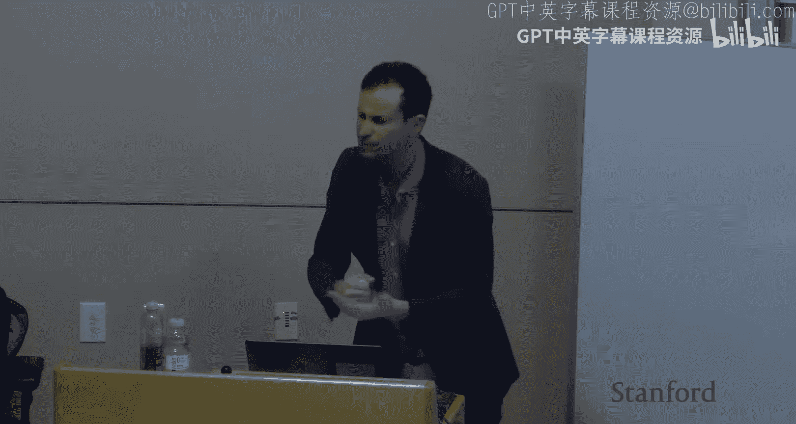
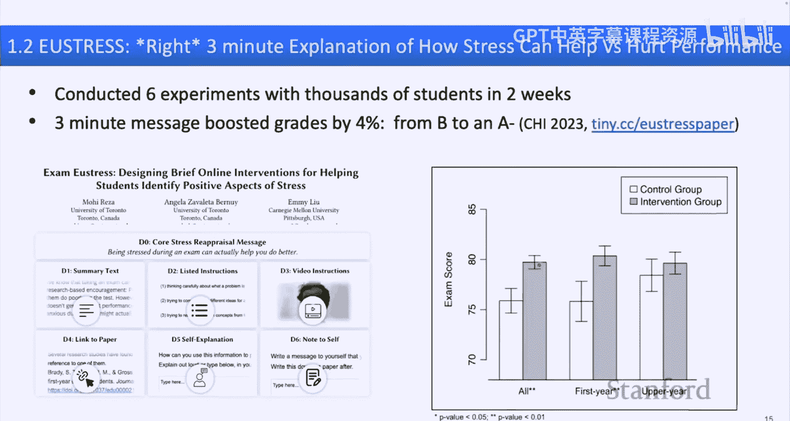
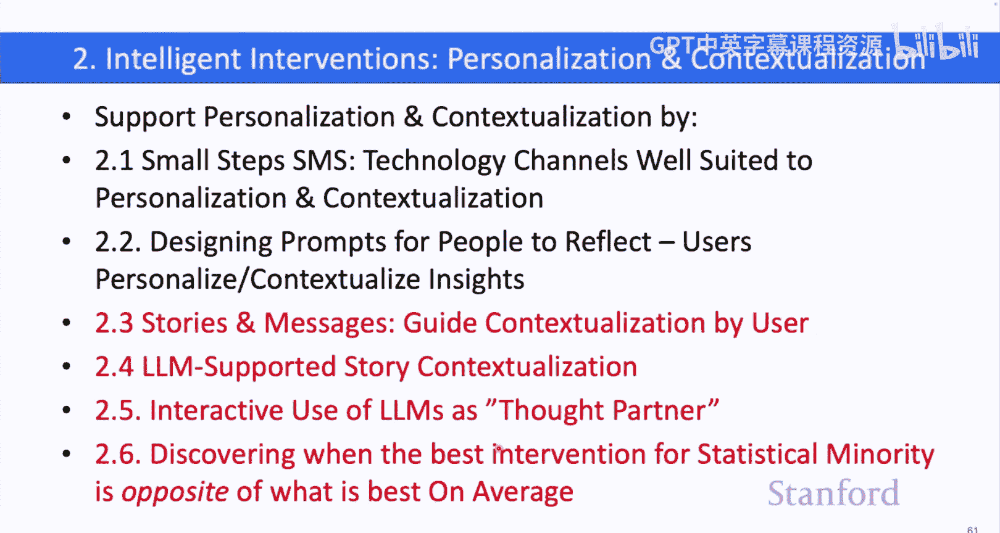
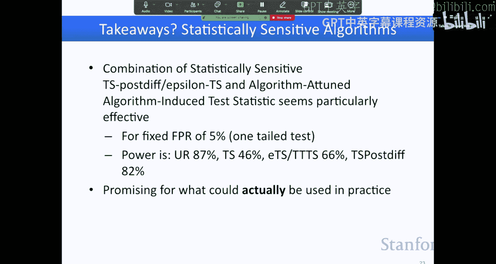
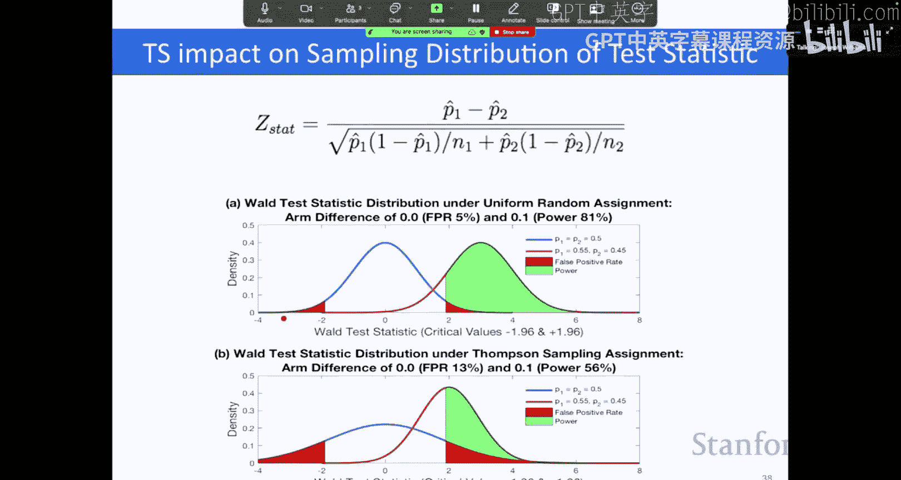
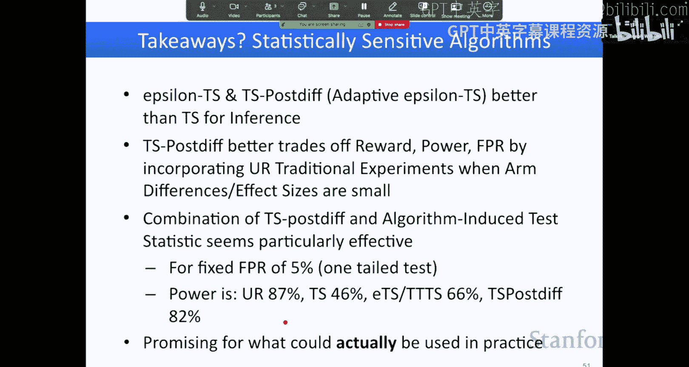
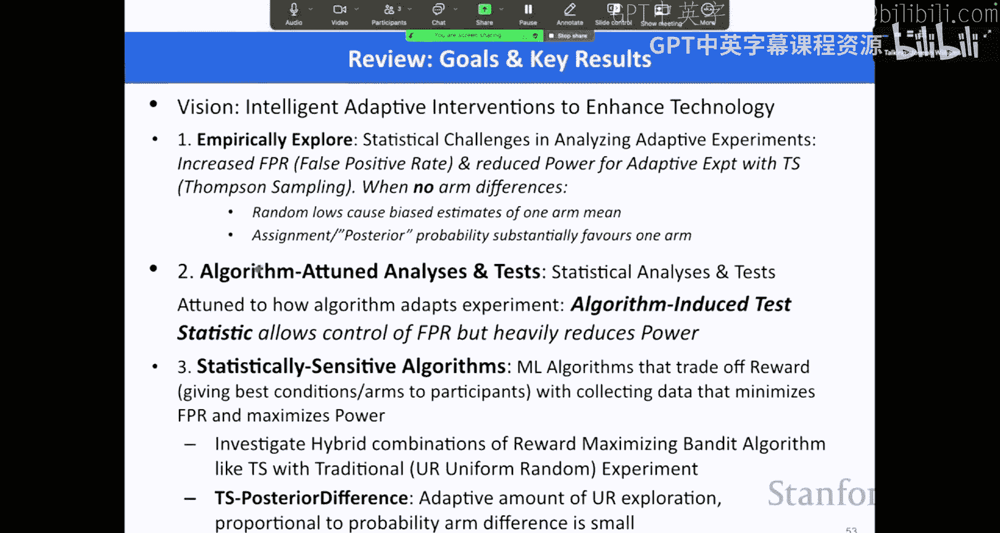

# 8：嘉宾讲座 - Joseph Jay Williams

## 概述
在本节课中，我们将学习如何将日常技术接触点转化为智能干预措施，以指导行为改变。我们将探讨自适应实验工具、个性化干预以及如何将严谨的科学方法与实践相结合，从而更有效地帮助人们学习、管理压力、锻炼和健康饮食。

---

## 行为改变的科学与愿景

上一节我们介绍了课程的整体目标，本节中我们来看看行为改变科学如何帮助解决众多人类问题。

想象一下，如果你能找到“神奇的话语”来改变任何行为。你希望自己开始或停止哪些行为？是更主动地与人交流、坚持锻炼、更好地沟通、减少压力，还是减少不必要的零食和社交媒体使用？同样，我们也希望他人能改变某些行为。这触及了我们生活的方方面面，从学习、决策到运动、饮食、压力和幸福感。

我们的愿景是：到2034年，如何实现按需提供的智能教练，能够切实帮助人们思考问题并永久性地改变行为？为实现这一目标，我们开发了 **Outcome-Components (OutComp)** 框架。该框架帮助我们设计智能干预措施。

一个智能干预措施，无论是一条短信、应用内消息还是一个概念解释，都是旨在改变行为的干预。它的“智能”体现在两方面：一是试图找出在特定时间点给予你的最佳内容；二是涉及持续的学习和测试，以了解什么对你有帮助。真正的智能系统必须包含持续学习。

为了构建智能干预措施，我们必须整合多个学科。

---

## 将日常体验转化为智能干预

我们的方法是：**将日常体验的组成部分转化为智能干预的“组件”**。

OutComp框架将一个初始用户界面（如短信或网站）转化为一个用于智能干预的微实验平台，你可以持续测试和改进想法。

以下是几个例子：

*   **短信**：例如“每日激励短信”。我们可以通过众包、大语言模型或人工输入生成大量不同的短信创意，然后持续测试，找出在何时、对何人、何种信息最有效。
*   **电子邮件**：例如，教授发送邮件鼓励学生尽早开始作业。我们可以生成邮件主题和内容的多个版本，测试它们在不同情境下的效果。这样，看似普通的电子邮件就变成了一个智能教练。
*   **网站与解释**：当用户访问一个网站（例如解释某个概念的页面）时，网站可以随机展示不同版本的解释，并收集反馈，从而找出平均效果更好或更适合当前用户的版本。我们曾在可汗学院进行过此类实验，测试不同概念解释和激励信息的效果。
*   **大语言模型交互**：当前的大语言模型可以轻松生成多种回复，但它们通常不进行A/B测试。当ChatGPT给你一个答案时，它本可以测试10个版本来找出真正对你有帮助的那个。虽然已有一些初步功能，但还有巨大的改进空间。

这一切的核心思想是：**你每天接触的任何事物都可以成为一个OutComp，一个可以测试不同版本并随时间改进的智能干预措施。**

---

## 自适应实验与概率性思维

上一节我们看到了智能干预的潜力，本节中我们来看看实现它的核心方法：自适应实验。

传统上，当我们做决定时（比如写一封邮件），我们通常只选择一个版本并100%确定地发送出去。或者，在进行正式的A/B测试时，我们以50/50的概率随机分配两个版本。这对应着两种极端：要么完全确定，要么完全不确定。

**自适应A/B实验**提出了一种中间路径：**根据我们认为某个版本是最佳选择的概率，进行加权随机分配**。

例如，如果有两个邮件版本A和B。如果你认为B更好的概率是70%，那么就将B发送给70%的人，将A发送给30%的人。然后，你可以根据收集到的数据（可以是定量的点击率，也可以是定性的反馈）来更新这个概率信念。

这种方法使我们不再局限于“100%或0%”或“50/50”的二元选择，而是开始以与我们信念相符的概率来分配行动。这引出了如何设定和更新这些概率的问题。

设定概率的方法可以多种多样：
1.  **统计模型**：例如使用贝叶斯方法，根据历史数据计算概率。
2.  **人类专家判断**：汇集领域专家的意见，并加权组合。
3.  **定性比较**：即使没有大量数据，也可以通过工具生成不同选项，并依靠思考、推理或小范围反馈来形成概率判断。我们称此为 **“定性A/B比较”** 或 **“思维实验”**。

关键在于培养这种习惯：即使不实际发送，在构思邮件时也尝试生成不同版本并思考其效果，这本身就是一种进步。

---

## 具体工具与案例：ABscribe

以下是一个具体工具的例子，它体现了上述思想。

**ABscribe** 是一个基于OutComp框架的工具。假设你正在写一封邮件，想告诉学生“压力实际上可能有助于你在考试中表现得更好”。

1.  **定义组件**：你可以选择邮件中的特定部分（如核心信息、论证方式、补充材料）并将其标记为可实验的“组件”。
2.  **生成选项**：你可以使用大语言模型，根据不同的受众（如科学型思维者、瑜伽爱好者）生成这些组件的多个变体。
3.  **思维实验**：然后，你可以并排查看这些不同版本的组合，在脑海中“切换”并思考哪种组合可能更有效。这就是一种“思维A/B测试”。

**实际案例：UStress实验**
在一项具体研究中，我们向编程课学生展示了一条时长约3分钟的消息，核心是“压力可以助你表现得更好”。我们将其分解为多个组件（如纯文本、视频解释、链接到科学论文、邀请学生写下感想等），并测试了不同组合。

*   **控制组**（仅核心信息）：平均成绩为76%。
*   **最佳干预组**（经过测试的特定组合）：平均成绩提升至80%。这意味着一条简短的消息带来了约4%的成绩提升，相当于从B-提高到B+。

这个例子展示了通过运行大量快速实验（传统研究可能需要数年，而我们只需几个月），我们可以发现哪些微小的干预能产生显著效果。

---

## 从定量到定性：整合人类判断

当我们获得实验的定量数据后，是否应该盲目地将效果最好的干预推广给所有人？答案是否定的，因为没有任何事情是100%确定的。

我们可以：
1.  **使用统计模型**：基于过去的数据，计算该干预在新群体中有效的概率（例如80%）。
2.  **整合人类判断**：将实验数据和背景信息给一位教师看，他/她可能会结合自己的经验判断：“在我的班级里，我认为它有76%的概率是最好的消息。”
3.  **结合两者**：我们可以将统计模型计算出的概率与人类专家的判断结合起来，形成更全面的概率估计。

这体现了将严谨的数学方法与人类洞察和行为相结合的理念。目标是让决策过程更加形式化和理性，即使只是稍微改进我们日常依赖的直觉判断。

---

## 基础算法：汤普森采样与贝叶斯更新

为了具体实现自适应的概率分配，我们常使用一种称为 **汤普森采样** 的算法。它是最基本的强化学习形式之一，也称为**随机概率匹配**。

我们以一个最简单的两臂老虎机为例来说明：
*   **两个选项**：解释A和解释B。
*   **奖励**：用户表示喜欢（1）或不喜欢（0）。
*   **目标**：学习并分配概率，使整体奖励最大化。

我们使用 **Beta分布** 来建模每个选项获得“喜欢”的概率。
*   **先验**：假设我们对两个选项一无所知，使用Beta(1,1)，这是一个均匀分布，意味着“喜欢”的概率在0到1之间任意值的可能性相同。
*   **更新**：如果给选项A看了5次，3人喜欢，2人不喜欢。那么选项A的后验分布更新为Beta(1+3, 1+2) = Beta(4, 3)。这个分布的中心更偏向于较高的概率值，但我们仍有一定不确定性。
*   **采样与选择**：在每次需要做选择时，汤普森采样会分别从选项A和B的当前Beta分布中随机抽取一个样本值（例如，从Beta(4,3)中抽到0.62，从Beta(6,1)中抽到0.85）。然后，它选择抽取值更高的那个选项（此处为B）展示给当前用户。
*   **计算概率**：通过重复采样多次（如10000次），我们可以估算出算法认为B优于A的概率（例如70%）。

这个模型简单、直观且易于解释。然而，尽管它很基础，但在实际应用中仍存在许多未解决的问题和潜在错误。

---

## 高级议题：统计敏感性与算法改进

上一节我们介绍了基础的汤普森采样，本节中我们来看看它的局限性以及如何改进。

**汤普森采样的挑战：**
1.  **探索不足**：如果算法早期错误地认为某个选项很差，它就会停止探索该选项，可能导致错过真正的好选项，也无法发现其对某些子群体的有效性。
2.  **偏差与统计推断**：传统统计检验（如Z检验）假设数据是均匀随机收集的。但汤普森采样收集数据的方式是有偏的，如果直接使用传统检验，会导致**第一类错误率（假阳性）** 严重膨胀（例如从5%升至30%），而**统计功效**下降。

**解决方案：**
1.  **ε-贪心汤普森采样**：以一个小概率ε（如10%）完全随机选择（均匀探索），以概率(1-ε)使用汤普森采样。这保证了持续的探索。
2.  **算法调优检验**：在进行统计检验时，考虑数据收集所使用的具体算法。通过模拟在零假设下该算法会生成的数据分布，重新计算检验统计量的临界值。这样可以控制假阳性率在预定水平（如5%）。
3.  **更优的自适应算法**：我们开发了 **TS-PositiveIf** 算法。它不是固定ε值，而是让用户定义一个“微小差异”的阈值（如0.1）。算法动态计算当前认为两选项差异小于该阈值的后验概率，并将此概率作为ε值。这样，当算法不确定时（认为差异可能很小），会增加随机探索；当确信存在较大差异时，则更多利用当前最佳选项。这种自适应方法在奖励、功效和错误率之间取得了更好的权衡。

**关键启示**：如果你正在运行自适应实验，建议使用 **TS-PositiveIf** 等更优算法，并配合使用 **算法调优检验** 来进行统计推断。

---

## 个性化、情境化干预与未来展望

除了实验工具和算法，另一个重要主题是**个性化和情境化的干预**。

我们的研究包括：
*   **Small Steps SMS**：一个每日发送短信帮助你管理压力、提升幸福感的系统。
*   **设计提示进行自我反思**：通过一系列问题引导你为自己特定的压力情境定制建议。
*   **故事与信息适配**：提供他人如何处理压力或申请实习的故事，并帮助你将其抽象应用到自己的情境中。
*   **LLM作为思维伙伴**：开发交互界面，让你可以输入自己正在拖延的事情，大语言模型根据你的偏好（如语气严厉或温和）生成定制化的自我对话消息，并允许你编辑和生成更多选项。

这些工作展示了如何通过精心设计的界面和提示，将大语言模型转化为真正有用的行为改变伙伴，而不仅仅是聊天工具。

---

## 总结

本节课我们一起学习了如何利用自适应实验和智能干预来推动行为改变。

我们探讨了以下核心内容：
1.  **愿景与框架**：通过OutComp框架，将日常技术接触点转化为可持续学习和改进的智能干预。
2.  **概率性思维**：摒弃非0即1的决策，转向根据信念概率进行加权随机分配。
3.  **实用工具**：如ABscribe，帮助生成选项并进行思维实验。
4.  **基础算法**：贝叶斯更新与汤普森采样的原理。
5.  **高级挑战与改进**：汤普森采样的局限性，以及通过ε-贪心策略、算法调优检验和TS-PositiveIf等方法来提升统计敏感性和推断可靠性。
6.  **个性化干预**：利用故事、反思提示和大语言模型接口，提供情境化的行为指导。

最终目标是构建一个未来，在这个未来中，智能教练能广泛、有效地帮助每个人在生活各个方面做出积极的改变。这需要持续的研究，以开发更强大的实验工具、更敏感的算法，并将严谨的科学与人性化的实践紧密结合。