# 1：什么是多任务学习？🤖

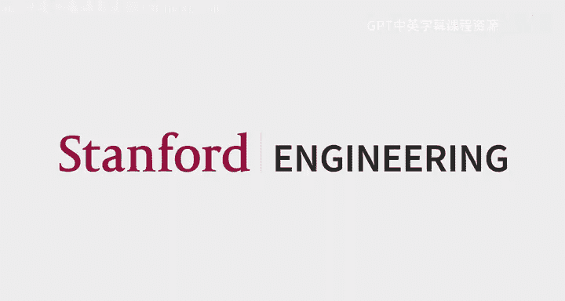

## 概述
在本节课中，我们将学习课程的目标与安排，并初步探讨多任务学习与元学习的基本概念及其重要性。

## 课程介绍与安排

我的名字是Chelsea，是这门课程的主讲教师。我们还有七位非常出色的助教。欢迎大家来到这门课程。

课程网站是获取信息的第一站，上面有大量信息，请仔细阅读。如有疑问，请先在网站上查找，然后可以在Ed讨论区提问。Ed与Canvas关联，你也可以联系助教邮箱。我们鼓励在Ed上公开提问，这样其他有相同问题的同学也能看到。如果你不希望问题被公开，可以在Ed上私密发帖或直接邮件联系助教，例如提交OAE信件。

答疑时间已公布在课程网站上，Zoom链接在Canvas上。答疑将于周三开始。

### 你将学到什么？
本课程主要有三个学习目标：
1.  学习现代深度学习方法在多任务学习和跨任务学习方面的基础知识。
2.  获得实际经验，在PyTorch中实现和应用这些方法，理解它们在实践中的运作方式。
3.  了解构建这类方法背后的科学和工程过程，鼓励大家挑战现有知识，并学习开发此类算法的过程。

### 课程内容概览
我们将涵盖广泛的主题：
*   从多任务学习和迁移学习的基础开始。
*   深入三类元学习算法：黑盒方法、基于优化的方法和度量学习。
*   探讨更高级的元学习主题，如元学习中的过拟合、无监督元学习和贝叶斯元学习方法。
*   学习其他少样本学习和适应方法，包括无监督预训练、领域适应和领域泛化。

课程将强调深度学习技术，并研究多个真实应用案例，例如YouTube推荐系统中的多任务学习、用于土地覆盖分类和教育的元学习，以及大语言模型中的少样本学习。

与之前开课相比，本课程新增了上述内容，并移除了所有强化学习相关的讲座和作业。这是因为我们将在春季学期开设一门新的深度强化学习课程。移除强化学习内容也使没有相关背景的同学更容易入门。如果你对将课程思想应用于强化学习感兴趣，仍然可以在最终项目中探索，并得到助教的支持。

### 课程形式与要求
*   **讲座**：所有讲座均为线下进行，同时直播和录制，录像可在Canvas上观看。季度末将有两场嘉宾讲座。鼓励大家在讲座中提问，可以通过举手或在Zoom聊天区输入问题，会有助教监控聊天并确保问题得到解答。
*   **答疑**：混合线下和远程形式，主要为线下，但会为SCPD学生提供两个远程选项。
*   **先修要求**：主要要求是具备足够的机器学习背景（如CS229或同等课程）。所有作业都需要使用PyTorch训练神经网络。如果你确实不喜欢PyTorch，可以使用其他框架，但所有起始代码和主要支持都基于PyTorch。我们将在本周四下午4:30在本教室举行PyTorch复习课，也会直播和录制。
*   **作业**：
    *   作业0是热身，确保你熟悉PyTorch和多任务学习基础。
    *   作业1将涉及黑盒元学习，以及如何设置数据以使少样本学习更有效。
    *   作业2将涵盖基于梯度的元学习和度量学习，涉及少样本字符识别问题。
    *   作业3将专注于自然语言处理和语言模型的预训练模型微调。
    *   作业4是可选的，涵盖课程中更多概念性内容。前四个作业基于实现，最后一个作业更像一篇小论文。
*   **评分**：课程评分50%基于作业，50%基于项目。作业0占5%，其余三个作业各占15%。作业4可以用来替换之前一个作业的部分分数或项目部分分数，系统会自动选择对你最有利的方式计分。
*   **灵活性政策**：为提供灵活性，我们提供总共6个“迟交日”，每项作业最多可使用2个，无需说明理由。如有特殊情况，可联系我们寻求额外安排。
*   **合作政策**：请阅读课程网站和荣誉准则。作业允许讨论，但需注明合作者，并应独立完成解答，不得参考其他同学的解答或网络上的答案。
*   **期末项目**：项目是自选的研究级项目，可以1-3人组队。鼓励将校内研究用作项目主题（只要与课程内容相关）。也可以与其他课程共享项目，但期望会稍高。迟交日政策与作业相同，但海报展示环节不接受迟交，因为这是现场活动。海报展示将于12月7日（课程最后一天）举行，代替当天的讲座。

### 项目与初步步骤
项目主题非常开放，只要与课程内容相关即可。我们正在向更广泛的斯坦福AI社区征集想法，下周一会发布项目想法列表。你也可以参考往年课程的项目标题和公开链接获取灵感。

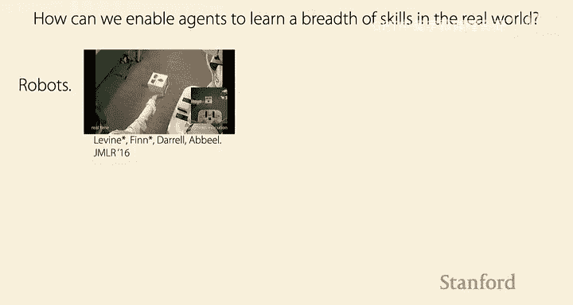

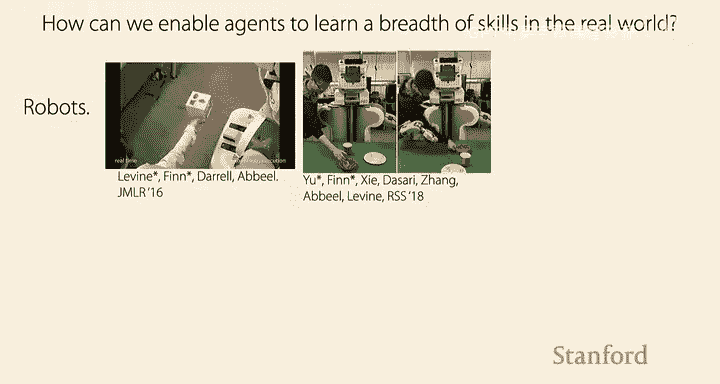

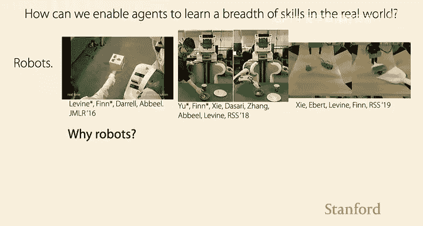

作业0已发布，一周后截止。所有作业截止时间为太平洋时间晚上11:59。鼓励开始组建项目小组，可以在Ed上发帖寻找队友，我们也乐意帮助大家建立联系。

关于是否组队，各有利弊。好处是可以做更多事情，互补专业知识，合作更有趣。缺点是某种程度上需要依赖队友，需要确保彼此兼容可靠。一般推荐组队，但不是必须的，也欢迎单独完成。

## 为什么研究多任务学习与元学习？🤔

### 个人视角：从机器人到通用智能
我实验室的很多研究都在思考如何让智能体在现实世界中学习多种技能。这里的“智能体”指的是真实的机器人，让它们学习诸如将积木放入形状分类盒、观看人类演示后模仿完成任务、甚至使用工具等技能。

机器人之所以有趣，是因为它们能教我们关于智能的知识。它们需要面对现实世界的复杂性，必须在各种任务、物体和环境中进行泛化，还需要某种常识理解。此外，监督信号也不总是明确的。

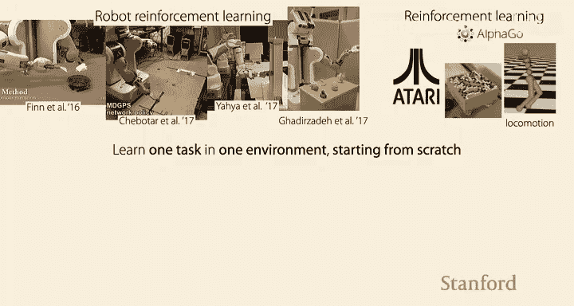

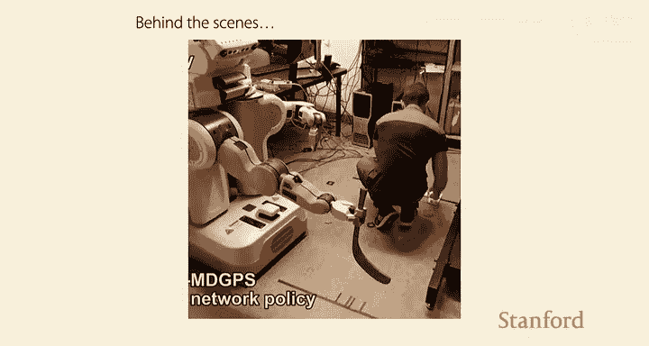

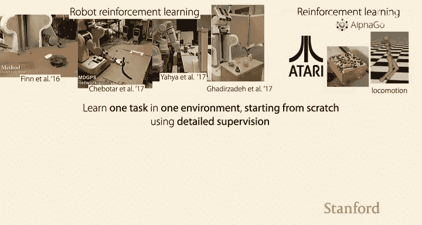

除了帮助我们理解智能，如果能建造出真正有用的机器人，它们可以在社会许多方面提供帮助，例如从事危险、繁琐或人们不愿做的工作。

在我博士初期，我研究了一个机器人通过试错学习将玩具飞机轮子插入对应孔洞的项目。虽然有趣，但机器人当时是“闭着眼睛”的，没有使用视觉。后续项目中，我们让机器人“睁开眼睛”，学习一个从摄像头图像直接映射到关节扭矩的神经网络策略。它不仅能将积木插入红色孔洞，还能应对立方体在不同位置的情况。这很酷，但关键在于，我们拥有的是一个能让机器人学习多种任务的强化学习算法。只需改变奖励函数，它就能学会其他任务，比如用玩具锤撬起钉子、拧上瓶盖，甚至用锅铲将物体舀入碗中。

大约在2016-2017年，深度强化学习在Atari游戏、围棋、模拟行走等领域取得了令人兴奋的进展。然而，这里存在一个普遍问题：我们训练机器人完成某项特定任务（例如用特定锅铲舀起特定物体放入特定碗中）后，如果换一个锅铲或环境，机器人就无法成功。这是一个巨大的问题，因为这意味着如果我们想把机器人投入现实世界，它并没有学到通用的东西。

你可能会说，也许我们可以给机器人更多锅铲，用更多数据训练它。但问题是，训练这些系统通常需要反复尝试任务，每次尝试后都需要人工将环境重置回初始状态。这看起来效率低下，且难以扩展。以这种方式收集大量数据是不切实际的。

这就引出了为什么多任务学习和元学习很重要：我们正在训练系统做一件非常狭隘的事情，这需要详细的监督和大量人力。如果我们想做另一件事，又需要从头开始投入大量人力。这不仅是强化学习和机器人学的问题，在语音识别或物体检测等领域，系统虽然训练数据更多样，但仍然是针对单一任务从头开始学习，需要大量监督和工程。

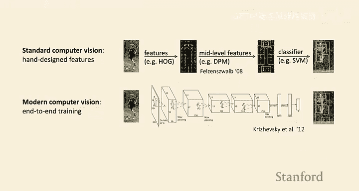

我将所有这些系统称为“专家”系统——我们训练机器学习系统做一件事。而在许多情况下，更有用的是那些不是在单一任务上训练，而是在许多不同任务上训练的系统。例如，人类不是从第一天起就被训练使用锅铲舀东西，而是更广泛地学习世界知识。从这个意义上说，人类是“通才”。我对如何构建更通用的机器学习系统这个问题很感兴趣。

再比如AlphaGo，它是围棋冠军，但这也是一个“专家”系统的例子。这有点像从第一天起就训练一个婴儿下围棋，而不教他世界上的其他事情。事实上，即使是训练机器人捡起围棋棋子并摆好，也超出了当前AI系统的能力。

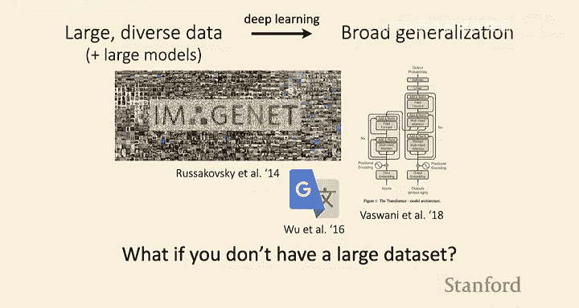

### 超越机器人：深度学习的动机
如果你上过机器学习课程，可能不需要太多动机来解释为什么关注深度学习。历史上，计算机视觉等方法需要手动设计特征，然后在这些特征上训练分类器。而现代方法则是训练一个端到端的单一神经网络。前者有其好处（如可解释性），但后者通常效果更好，并且允许我们处理非结构化输入（如图像像素、语言、传感器读数），无需大量领域知识来设计特征。

在ImageNet基准测试中，自AlexNet（第一个端到端方法）出现后，性能有了显著提升。在自然语言处理领域，谷歌神经机器翻译系统相比之前的短语系统，在翻译任务上取得了60%到87%的改进。现在谷歌翻译等系统就使用这类模型。

### 为什么关注深度多任务与元学习？
在深度学习中，我们看到，如果拥有**大型多样化的数据集**和**大型模型**，就能在之前提到的任务上实现良好的泛化（如图像识别、机器翻译）。然而，在很多场景下，你一开始并没有大型多样化的数据集：
*   **医疗影像**：存在隐私问题。
*   **机器人学**：没有现成的“机器人维基百科”。
*   **个性化教育**或**稀有语言翻译**：没有现成的大型数据集，收集成本高昂。

在这些场景下，上述“秘诀”开始失效，为每种新情况（每种罕见疾病、每个机器人、每个人、每种语言）从头学习是不切实际的。

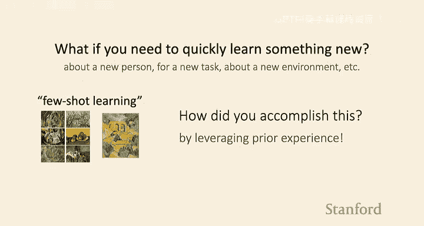

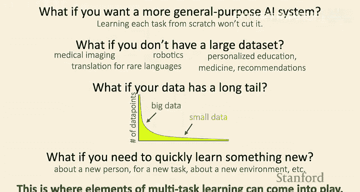

此外，还有场景是虽然你有一个大数据集，但数据分布非常**偏斜**，存在长尾分布。这些“边缘情况”对现代机器学习系统构成了主要挑战（例如，我认为这就是为什么我们今天还没有完全自动驾驶汽车的原因）。多任务学习和元学习本身不能解决这个问题，但有迹象表明，如果能利用大数据中的先验知识并将其迁移到尾部情况，或许能更好地处理这类分布。

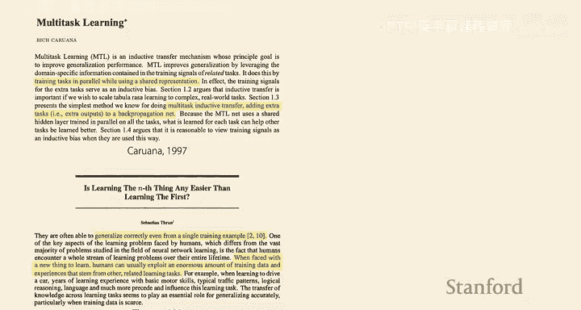

再者，如果你希望系统**快速学习新事物**（例如，关于一个新用户或新环境），这也是一个数据稀少的场景。多任务学习和元学习的思想可能很有用。

### 少样本学习测试
我给大家做个小测试：学习区分两位画家（Brock和Czanne）的画作。训练集是左边的六幅画（三幅Brock，三幅Czanne）。现在请判断测试图片（一幅画）属于哪位画家。

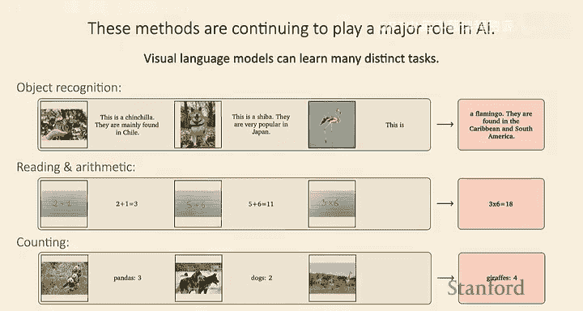

大多数人答对了，这是Brock的画。这是一个**少样本学习**的例子：你只用了一个非常小的训练集（六个数据点）就泛化到了新数据点。你是怎么做到的？如果从头开始训练一个卷积神经网络，它可能无法得出正确答案。但你能做到，可能是因为你以前学过如何看图像、识别模式，你所有的先前经验使你能够用少量数据学习新任务，而不是从零开始。

少样本学习是指训练数据集只有很少数据点的情况。如果你能利用先验经验而不是从头开始，就应该能实现少样本学习。

### 为什么现在研究？
这些想法并不新鲜。早在20世纪90年代甚至更早，就有论文讨论并行训练任务、少样本学习、元学习规则等。然而，尽管存在已久，它们仍在AI系统中扮演重要角色。

**元学习在拥有大数据集时也有助于泛化吗？**
一般来说，这些方法在数据量少时效果最显著，因为那里利用先前经验最有用。如果你有一个非常大的数据集，仅从头训练可能就表现很好。但如果存在分布偏移，先验知识可能仍有帮助。总的来说，对于标准的独立同分布问题且数据量大时，先验经验的作用会小得多。

### 现代应用案例
*   **DeepMind的Flamingo模型**：训练单一模型执行多种视觉和语言任务（如物体识别、算术、计数），并能以少样本方式快速适应新任务。
*   **教育应用（元学习）**：在一门入门CS课程中，利用元学习对大量学生编程作业提供反馈。通过利用以往课程的数据进行元学习，系统能够适应新课程的新问题，为成千上万份作业提供反馈，并实际部署。
*   **机器翻译**：同时翻译102种语言的多任务学习系统，超越了仅针对语言对训练的强基线。
*   **YouTube推荐系统**：多任务学习用于多目标优化。
*   **通用智能体**：训练单一模型执行从对话、玩Atari游戏到控制模拟和真实机器人的广泛任务。
*   **机器人学**：让机器人利用先前任务的经验，对新物体执行任务（如将物体放入新容器）。

### 挑战与开放性问题
尽管有这些成功案例，仍存在许多开放性问题与挑战，例如：如何量化一个数据集对另一个数据集的有用性？这也使得该领域的研究同样令人兴奋。

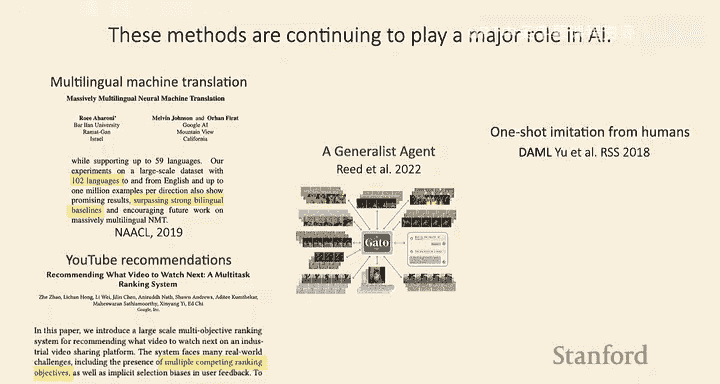

### 让深度学习更普及
深度学习在拥有大数据集时效果很好（如ImageNet有120万图像，英法翻译数据集有4000万配对句子）。但许多我们关心的问题没有这么多数据（如糖尿病视网膜病变检测只有3.5万图像，癫痫治疗数据不足1小时，早期机器人任务数据不足15分钟）。如果我们能从其他更大的数据集中提取先验信息，或许就能开始更好地解决数据量少的任务，从而使这项技术对没有大量数据或资金收集数据的人们更加普及。

**如何量化一个任务的数据对学习新任务的有用性？**
这是一个开放性问题，尚未解决。有一些工作试图关联两个任务之间的相似性（更准确说是方向性相似性），以及数据估值的一般性研究。

**如果有很多小数据集呢？**
绝对可以。例如，作业中将使用的Omniglot数据集，每个字符大约20个例子，但有超过1200个字符。这类系统在这种情况下可以表现得很好。

**能否使用生成模型创建合成数据集？**
有一些相关研究，但通常存在“没有免费午餐”的问题：如果你从数据中学习生成数据，并没有创造超出原始数据的新信息。但如果能将领域知识注入生成模型，可能会有所帮助。这是一个有趣但棘手的问题。

## 任务与多任务学习的定义 📚

### 什么是任务？
非正式地，我们可以将一个**机器学习任务**视为：接收一个**数据集**和一个**损失函数**作为输入，并试图产生一个**模型**。不同的任务可以在许多方面有所不同，直观地说，可以是不同的物体、不同的人、不同的目标函数、不同的光照条件、不同的词语、不同的语言等。

因此，多任务学习涵盖的“任务”可能非常多样，它们可能沿着许多不同的轴线变化。多任务学习不仅仅指英语单词“task”意义上的不同任务，也可能意味着处理不同的物体。如果你想构建一个能处理许多不同物体的系统，并跨物体进行训练，这仍然符合机器学习任务的更技术性定义。

### 关键假设：共享结构
这些系统有一个关键假设：你训练的任务之间需要存在**一些共享的结构**。如果它们彼此完全独立，那么一起训练或利用共享结构就不会带来任何好处。如果没有共享结构，你最好使用单任务学习。

好消息是，许多任务确实存在共享结构。例如，拧开罐子、瓶盖甚至使用胡椒研磨器，这些任务都涉及相似的动作。即使任务看似无关，物理定律是所有真实数据的基础，因此已经存在大量共同结构。人们都是有意图的生物，英语语法规则是所有英语语言数据的基础，语言都是为了相似的目的而发展，因此即使跨语言也存在许多共享结构。实际上，很少有情况下的任务是统计意义上完全独立的。因此，模型可以利用这些共享结构来做得更好。

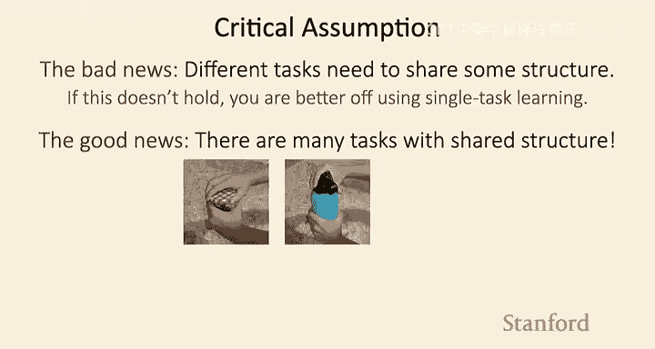

### 问题定义
本课程将涵盖的问题定义主要有两类：

1.  **多任务学习问题**：学习一组任务，并试图比独立学习这些任务更快或更熟练。在这里，训练和测试时看到的是同一组任务，不涉及处理新任务。
2.  **迁移学习/元学习问题**：给定先前任务的数据，目标是更快或更熟练地学习一个新任务。元学习算法也旨在解决这个问题。

本课程将关注任何试图解决这两个问题陈述之一或全部的方法。

### 多任务学习可以简化为单任务学习吗？
有人可能会问：多任务学习可以简化为单任务学习吗？对于每个任务 i，你有一个数据集 D_i 和一个损失函数 L_i。你可以将损失函数求和，合并数据集，从而创建一个单一的数据集和损失函数，然后你就有了一个单任务学习问题。从某种意义上说，这可以简化为单任务学习，跨任务聚合数据并训练单一模型是多任务学习的一种可行方法。

然而，本课程将更侧重于迁移学习问题（学习新任务），因为它更具挑战性，不能简单地简化为单任务学习。不过，我们也会在周三有一节关于多任务学习的讲座，讨论诸如如何告诉模型我们想做哪个任务，或者如果简单聚合数据训练无效该怎么办等问题。

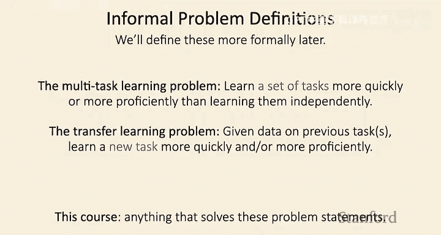

## 总结 🎯
本节课我们一起学习了课程的目标、安排和评分政策，探讨了研究多任务学习与元学习的动机——从构建通用机器人智能体，到处理数据稀缺、长尾分布和快速适应新任务的现实挑战。我们通过实例看到了这些方法在视觉语言模型、教育、翻译等领域的成功应用，也认识到其中存在的开放性问题。最后，我们初步定义了“任务”的概念，并区分了多任务学习与迁移学习/元学习两类核心问题。下节课我们将更正式地深入这些主题。

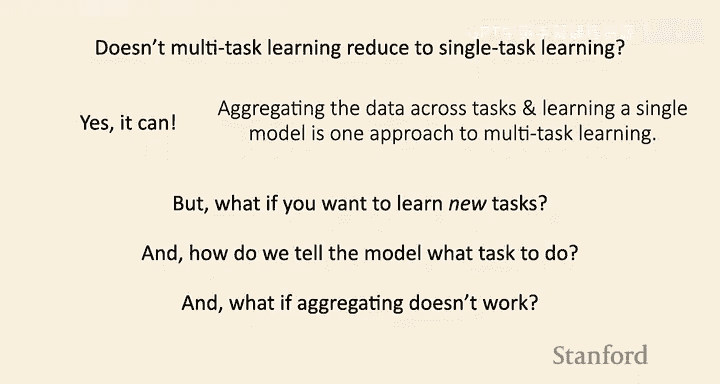

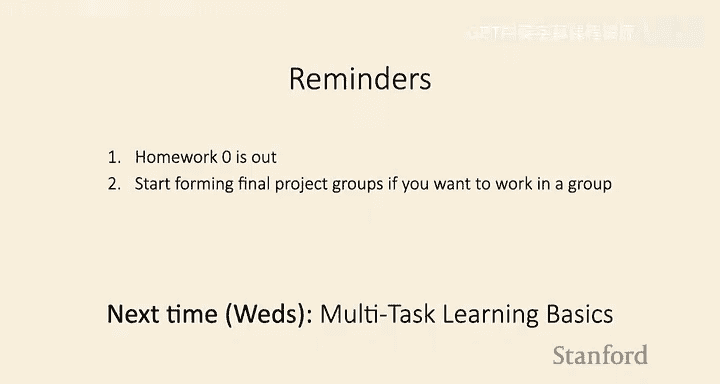

**提醒**：作业0已发布，下周一截止。如果你想为期末项目组队，请开始组建小组。