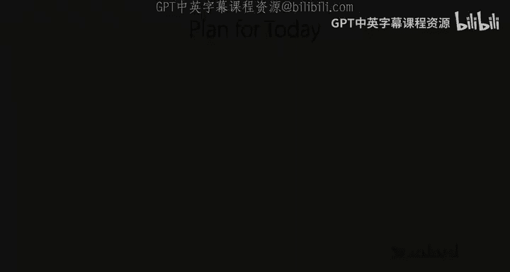
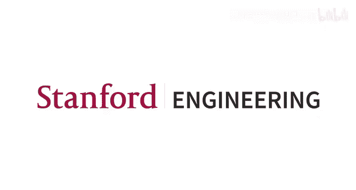

# 2：多任务学习基础 I 🧠




在本节课中，我们将要学习多任务学习的基础知识。我们将从定义“任务”开始，探讨如何构建一个能够同时处理多个任务的神经网络模型，并讨论其中的关键设计选择，例如如何让模型知道当前是哪个任务、如何权衡不同任务的重要性，以及如何优化模型。最后，我们会通过一个来自谷歌的真实案例研究，看看这些理论是如何在实践中应用的。

## 任务的定义与多任务学习问题

上一讲我们介绍了课程概览，本节中我们来看看如何形式化地定义一个“任务”。

在深度学习的背景下，一个**任务** 通常由三部分组成：
1.  输入 `x` 的分布 `P(x)`。
2.  给定输入 `x` 时输出 `y` 的条件分布 `P(y|x)`。
3.  一个衡量模型在该任务上表现的**损失函数** `L`。

因此，一个任务 `T_i` 可以表示为：
`T_i = { P_i(x), P_i(y|x), L_i }`

我们通常无法直接访问这些真实的数据分布，只能获得从这些分布中采样得到的数据集 `D_i`（例如训练集和测试集）。

**从单任务学习到多任务学习**
在单任务监督学习中，我们有一个数据集 `D = {(x, y)}`，目标是找到模型参数 `θ` 以最小化损失函数 `L(θ)`。在多任务学习中，我们的目标变为同时解决一组任务 `{T_1, T_2, ..., T_T}`。

以下是多任务学习问题的几个例子：

*   **多任务分类**：任务共享相同的损失函数（如交叉熵损失），但输入和输出的分布不同。例如，识别不同语言的笔迹，每个语言是一个独立的任务。
*   **多标签学习**：输入分布 `P(x)` 相同，但输出分布 `P(y|x)` 不同。例如，在同一张图像上预测深度、关键点和表面法线。
*   **混合任务**：任务间损失函数也可能不同。例如，一些任务的标签是连续的（使用均方误差损失），另一些是离散的（使用交叉熵损失）。

## 多任务学习模型架构

既然我们要让一个模型处理多个任务，首先需要告诉模型当前正在执行哪个任务。这是通过**任务描述符** `z_i` 来实现的。

### 任务描述符

任务描述符 `z_i` 是标识任务 `i` 的信息，会被输入到网络中。模型因此变为预测 `P(y | x, z_i)`。`z_i` 可以有多种形式：
*   **独热编码**：最简单的形式，例如 `[1, 0, 0]` 表示任务1。
*   **自然语言描述**：例如，“给我摘要”、“告诉我论文长度”。
*   **任务元数据**：例如，在个性化任务中，可以是用户属性。

### 模型条件化与参数共享

如何将 `z_i` 整合到网络中，直接决定了参数在任务间是**共享**还是**独享**。这是多任务学习的核心设计选择。

**两种极端情况：**
1.  **完全不共享（任务独享）**：为每个任务训练完全独立的网络，通过 `z_i` 像开关一样选择使用哪个网络。这等价于没有共享参数。
    ```python
    # 伪代码示意
    if z_i == [1,0,0]:
        output = network_1(x)
    elif z_i == [0,1,0]:
        output = network_2(x)
    ```
2.  **完全共享**：使用单一网络，简单地将 `z_i` 与某一层的激活值拼接（Concatenation）或相加（Addition）。此时几乎所有参数都被所有任务共享。

**更常见的架构选择：**
在实践中，我们通常介于两者之间。以下是两种主流方法：

*   **多头部架构**：网络底层是共享的，用于提取通用特征；顶层则分为多个独立的“头部”，每个头部专门负责一个任务。这是一种硬性参数划分。
*   **乘性条件化**：比加性条件化更强大。它通过将 `z_i` 的表示与网络激活值进行**逐元素相乘**来实现条件化。这种方式可以学习一种“门控”机制，动态地决定哪些特征或网络路径对当前任务更重要，从而能更灵活地模拟从完全共享到完全独立的各种情况。

**加性与乘性条件化的关系**：
值得注意的是，**拼接（Concatenation）和加性（Addition）条件化在本质上是等价的**。考虑一个全连接层，将拼接后的向量 `[x, z]` 乘以权重矩阵 `W`：
`W * [x; z] = W_x * x + W_z * z`
其中 `W_x` 和 `W_z` 是权重矩阵 `W` 的分块。这正是加性条件化的形式。因此，这两种方式具有相同的表达能力。

## 目标函数与优化

上一节我们介绍了模型如何接收任务信息，本节中我们来看看如何定义和优化多任务学习的目标。

### 基础目标函数

最直接的多任务目标函数是各个任务损失函数的**求和**：
`L(θ) = Σ_{i=1}^{T} w_i * L_i(θ)`
其中 `L_i` 是任务 `i` 的损失，`w_i` 是任务 `i` 的权重。

### 任务权重的选择

如何设置权重 `w_i` 是一个重要的设计选择，它影响了模型对不同任务的关注度。以下是一些常见策略：

*   **均匀权重**：`w_i = 1`。这是最简单的基线。
*   **手动调整**：根据任务的重要性、数据量多少或损失函数的量级来手动设置。
*   **动态调整**：权重在训练过程中可以变化，以应对优化挑战（例如某个任务收敛过慢）。
*   **极小化极大（Minimax）优化**：一种自动平衡任务的策略。在每一步，选择当前损失**最大**的任务进行优化。这确保了所有任务最终都能达到相对均衡的性能，在公平性要求高的场景中特别有用（例如，不同用户群体的体验）。其目标可形式化为：
    `min_θ max_i L_i(θ)`

### 优化过程

多任务学习的优化通常采用小批量随机梯度下降的变体：

1.  **采样一批任务**：从所有任务中均匀采样一个子集（例如，如果任务不多，可以每次都用所有任务）。
2.  **为每个采样任务采样数据**：对每个被选中的任务，从其数据集中采样一个小批量数据。
3.  **计算损失与梯度**：计算这批任务和数据的总体损失，然后反向传播计算梯度。
4.  **更新参数**：使用优化器（如SGD、Adam）更新模型参数。

这个过程确保了即使不同任务的数据量差异很大，每个任务在优化过程中被采样的频率也是均匀的。

## 实践挑战与设计指南

在构建多任务学习系统时，我们会遇到几个关键挑战，它们直接指导我们的设计选择。

### 1. 负迁移
**负迁移** 是指多任务学习的性能反而比单独训练每个任务更差。这通常是由于任务间存在干扰，或者模型容量不足导致的。
*   **应对策略**：如果观察到负迁移，应尝试**减少参数共享**。例如，采用多头部架构，或增加任务特定参数的比例。

### 2. 过拟合与正则化不足
相反，如果模型在单个任务上过拟合，而多任务学习作为一种正则化手段可能效果不佳。
*   **应对策略**：尝试**增加参数共享**，让任务间通过共享表示相互约束，提升泛化能力。

### 3. 任务相似性与分组
如何预先知道哪些任务一起训练会有正面效果（正迁移）？这是一个难题，因为它依赖于数据、模型和优化器。
*   **现状**：没有通用的先验度量。一种实践方法是进行单次多任务训练，通过分析梯度相似性等指标，事后评估任务间的兼容性，并据此调整任务分组。

### 软参数共享
除了“共享”与“不共享”的硬性选择，还存在**软参数共享**。即为每个任务维护独立的参数，但同时添加一个约束项（如L2正则化）来鼓励这些参数彼此相似。这提供了更大的灵活性，但引入了额外的超参数和内存开销。**预训练+微调** 也可以看作是一种时序上的软共享。

## 案例研究：YouTube视频推荐系统

现在，让我们通过一个来自谷歌的真实案例，看看多任务学习如何解决工业级问题。该系统的目标是为用户推荐YouTube侧边栏的视频。

**问题建模**：
*   **输入**：查询视频特征、候选视频特征、用户特征、上下文特征。
*   **输出/任务**：预测用户对候选视频的多种**参与度**和**满意度**指标。
    *   **参与度**：点击率、观看时长等。
    *   **满意度**：点赞率、调查评分等。
*   **挑战**：不同指标的数据稀疏性和量级不同，且需要平衡短期参与和长期满意度。

**模型演进**：
1.  **基线 - 多头部模型**：共享底层网络，不同预测头对应不同指标。但发现当任务相关性低时，性能会受损。
2.  **改进 - 多门控混合专家模型**：
    *   在共享层之上，引入多个“专家”网络（小型子网络）。
    *   为每个任务学习一个“门控网络”，该网络根据输入计算权重，**软选择**要组合哪些专家。
    *   公式化表示，对于任务 `k` 和输入 `x`，输出为：
        `y_k(x) = Σ_{e=1}^{E} g_k(x)_e * f_e(x)`
        其中 `f_e` 是第 `e` 个专家，`g_k(x)` 是任务 `k` 的门控网络输出的权重向量（通过softmax获得）。
    *   **优势**：模型可以自动学习让不同专家专注于不同任务（专业化），同时允许有用的专家被多个任务复用（共享），实现了灵活的软共享。

**结果**：相比共享底层的基线模型，MMoE模型在满意度指标上提升了3%，在参与度指标上提升了0.45%，效果显著，并成功部署于生产系统。

## 总结 🎯

本节课中我们一起学习了多任务学习的基础。我们首先形式化地定义了**任务**，并介绍了如何通过**任务描述符** `z_i` 让模型感知当前任务。我们深入探讨了**模型架构**的核心选择——参数共享，比较了加性/乘性条件化以及多头部等设计。接着，我们研究了**目标函数**，讨论了如何通过设置任务权重或采用极小化极大策略来平衡不同任务。最后，我们分析了实践中面临的**负迁移、过拟合**等挑战，并给出了相应的设计指南，最终通过**YouTube推荐系统**的案例看到了这些理论的成功应用。



记住关键点：**观察到的迁移性质（正/负）是指导你调整参数共享程度（更多还是更少）的重要信号**。下一讲，我们将开始学习迁移学习，并逐步深入到元学习的主题。